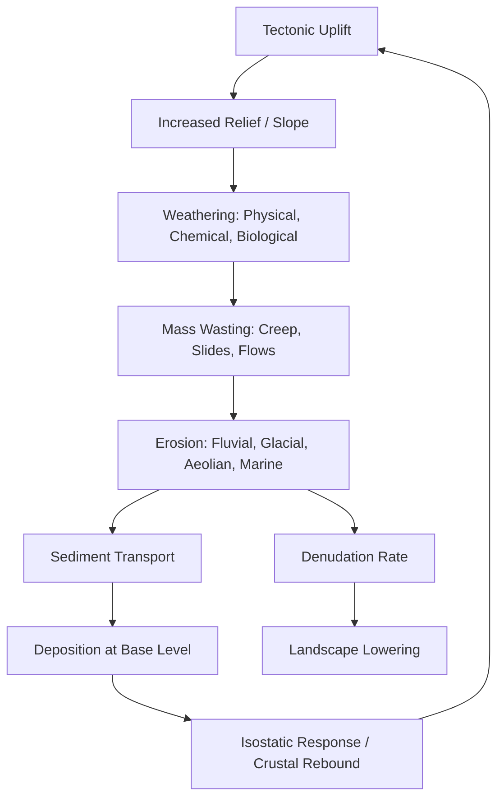

## Landscape Evolution and Denudation

### Overview

Landscape evolution describes how the Earth's surface changes shape over geologic time through the combined action of tectonic uplift, weathering, erosion, transport, and deposition. Denudation is the umbrella term for all processes that wear down and lower the land surface — weathering, mass wasting, and erosion by water, wind, ice, and waves — ultimately transporting material toward base level (commonly sea level or a local depositional basin).

### Fundamental Concepts

#### Base Level

Base level is the lowest elevation to which a landscape can be eroded by flowing water.

- **Ultimate base level**: sea level
- **Local/temporary base level**: a lake, resistant rock layer, or reservoir that temporarily halts downcutting
- Lowering of base level (e.g., sea-level fall, tectonic uplift) triggers renewed incision and knickpoint migration upstream

#### Denudation vs. Erosion vs. Weathering

| Term | Definition |
| --- | --- |
| Weathering | In-place breakdown of rock (physical/chemical/biological), no transport |
| Erosion | Detachment and transport of weathered material by an agent (water, wind, ice, gravity) |
| Denudation | The cumulative, large-scale lowering of the land surface — weathering + erosion + mass wasting combined |
| Degradation | Localized lowering of a channel or surface, often used interchangeably with erosion at smaller scales |

**Key Points**

- Denudation is a systems-level, integrative concept operating over $10^3$–$10^7$ year timescales.
- Denudation rate is typically expressed in mm/kyr or t/km²/yr (mass flux).

#### Denudation Rate Estimation

Denudation rates are commonly quantified using:

- **Cosmogenic nuclide analysis** (e.g., $^{10}Be$, $^{26}Al$) in river sediment or bedrock outcrops
- **Sediment yield** measurements from river gauging stations
- **Thermochronology** (fission-track, (U-Th)/He dating) to infer long-term exhumation rates
- **Geomorphic markers** — offset terraces, dated volcanic ash layers, cave deposits

A simplified mass-balance expression for denudation rate ($D$) from cosmogenic nuclides:

$$D = \frac{P}{N \lambda_{eff}}$$

Where $P$ is the nuclide production rate, $N$ is measured nuclide concentration, and $\lambda_{eff}$ accounts for decay and attenuation — used as a first-order approximation; actual production-rate scaling and shielding corrections are more complex. [Unverified: exact formulation varies by nuclide and study — treat as illustrative, not a citation-ready equation]

### Classical Models of Landscape Evolution

#### 1. Davisian Cycle of Erosion (William Morris Davis, 1899)

Proposes a landscape evolves through sequential stages after tectonic uplift, analogous to a biological life cycle.

- **Youth**: Steep V-shaped valleys, rapid downcutting, waterfalls/rapids common, poorly integrated drainage
- **Maturity**: Valleys widen, floodplains develop, maximum relief, well-integrated drainage network
- **Old age**: Landscape reduced to a low-relief **peneplain** with broad valleys, meandering rivers, and isolated resistant hills called **monadnocks**

**Key Points**

- Assumes a single uplift event followed by uninterrupted erosion ("punctuated equilibrium" is absent from the original model).
- Largely qualitative and descriptive; now considered historically important but not a working predictive model.
- Criticized for oversimplifying tectonics as episodic rather than continuous.

#### 2. Penck's Model (Walther Penck, 1924)

Argues landform development reflects the *ratio* of uplift rate to denudation rate, not a fixed sequence of stages.

- **Waxing development**: Uplift rate accelerating faster than denudation → convex slopes
- **Steady-state development**: Uplift and denudation rates roughly balanced → straight slopes
- **Waning development**: Uplift decelerating relative to denudation → concave slopes

Penck emphasized slope form as a diagnostic of the tectonic-denudation relationship, contrasting with Davis's temporal-stage approach.

#### 3. King's Pediplanation Model (Lester King, 1953)

Developed primarily from African and semi-arid landscapes; proposes **parallel slope retreat** rather than slope decline.

- Scarps retreat backward while maintaining a constant angle, rather than progressively flattening
- Produces a **pediment** (gently sloping erosion surface at the foot of a retreating scarp) that expands over time
- End-stage landscape is a **pediplain**, studded with residual hills called **inselbergs**

| Model | Mechanism | End Landform | Best-fit Climate |
| --- | --- | --- | --- |
| Davis | Slope decline over time | Peneplain + monadnocks | Humid temperate |
| Penck | Slope form reflects uplift:denudation ratio | Variable slope geometry | General/tectonic emphasis |
| King | Parallel slope retreat | Pediplain + inselbergs | Semi-arid/arid |

#### 4. Dynamic Equilibrium Theory (Hack, 1960)

Rejects the idea of an end-state landscape entirely. Proposes landforms are in a continuous state of adjustment where erosion rate balances resistance and process, producing a landscape that appears steady over short-to-moderate timescales even as material continuously moves through it.

- Slopes and channels adjust their form to accommodate the sediment/water flux delivered to them
- No "old age" is ever reached; the system self-adjusts as tectonic and climatic boundary conditions change
- Forms the conceptual bridge to modern **steady-state landscape** thinking in tectonic geomorphology

### Controls on Landscape Evolution

#### Tectonic Controls

- **Uplift rate** sets the potential energy available for erosion; higher uplift → higher relief and steeper channel gradients (all else equal)
- **Rock uplift vs. surface uplift**: rock uplift is the absolute vertical motion of rock relative to a geoid; surface uplift is what's left after denudation is subtracted
- Active fault systems create local base-level changes, drainage offsets, and knickpoints

#### Climatic Controls

- Precipitation regime governs the dominant erosional agent (fluvial vs. glacial vs. aeolian)
- Temperature cycling controls frost weathering intensity
- Vegetation cover (climate-dependent) modulates erosion resistance — dense cover generally suppresses surface erosion, sparse cover accelerates it

#### Lithological Controls

- Rock strength, jointing, and bedding orientation control weathering susceptibility and slope form
- Differential erosion of alternating hard/soft strata produces **structural landforms** (cuestas, hogbacks, mesas)

#### Climatic-Tectonic Coupling

- [Inference] Some researchers argue climate can modulate the locus and rate of tectonic deformation through erosional unloading feedbacks, though the strength of this coupling is actively debated in the literature.

### The Geomorphic (Denudation) System

### Denudation Agents and Processes

#### Weathering (Preconditioning Stage)

- **Physical**: frost wedging, thermal expansion/contraction, salt crystallization, exfoliation
- **Chemical**: hydrolysis, oxidation, carbonation, dissolution (especially in carbonate terrains → karst)
- **Biological**: root wedging, bioturbation, lichen/microbial weathering

#### Mass Wasting

Gravity-driven downslope movement of weathered material — the critical link between weathering and channel-based erosion.

- Types range from slow (creep, solifluction) to rapid (rockfall, debris flow, landslide)
- Rate depends on slope angle, material cohesion, pore-water pressure, and triggering events (earthquakes, heavy rainfall)

#### Fluvial Erosion

- Dominant denudation agent in most humid and temperate landscapes
- Stream power law commonly used to model bedrock channel incision:

$$E = K A^{m} S^{n}$$

Where $E$ is erosion rate, $K$ is erodibility coefficient, $A$ is drainage area (proxy for discharge), $S$ is channel slope, and $m, n$ are empirically calibrated exponents. [Unverified: exponent values and $K$ are highly site- and lithology-dependent and require field calibration]

#### Glacial Erosion

- Plucking and abrasion by ice produce U-shaped valleys, cirques, arêtes, and horns
- Generally higher erosion rates per unit time than fluvial systems in actively glaciated terrain, though this varies with ice velocity, basal thermal regime, and sediment supply

#### Aeolian and Marine Denudation

- Wind-driven deflation and abrasion dominate in arid, low-vegetation settings
- Wave action and longshore processes drive coastal denudation, forming cliffs, wave-cut platforms, and stacks

### Landscape Evolution Diagram (Slope Retreat vs. Slope Decline)

<svg xmlns="http://www.w3.org/2000/svg" viewBox="0 0 720 300" font-family="sans-serif">
<text x="360" y="20" text-anchor="middle" font-size="14" font-weight="bold">Slope Decline (Davis) vs. Parallel Retreat (King) (svg_diagram)</text>

<text x="170" y="45" text-anchor="middle" font-size="12" font-weight="bold">Slope Decline</text>

<line x1="30" y1="240" x2="310" y2="240" stroke="black" stroke-width="2" />

<polyline points="40,240 90,60 100,240" fill="none" stroke="#555" stroke-width="2" />

<polyline points="55,240 95,100 115,240" fill="none" stroke="#888" stroke-width="2" stroke-dasharray="4,3" />

<polyline points="75,240 100,150 140,240" fill="none" stroke="#aaa" stroke-width="2" stroke-dasharray="2,2" />

<text x="170" y="260" text-anchor="middle" font-size="11">Slope angle decreases through time</text>

<text x="550" y="45" text-anchor="middle" font-size="12" font-weight="bold">Parallel Retreat</text>

<line x1="410" y1="240" x2="690" y2="240" stroke="black" stroke-width="2" />

<polyline points="420,240 460,60 500,240" fill="none" stroke="#555" stroke-width="2" />

<polyline points="470,240 505,60 545,240" fill="none" stroke="#888" stroke-width="2" stroke-dasharray="4,3" />

<polyline points="530,240 560,60 600,240" fill="none" stroke="#aaa" stroke-width="2" stroke-dasharray="2,2" />

<text x="550" y="260" text-anchor="middle" font-size="11">Slope angle constant; scarp migrates laterally</text>

</svg>

### Landform Products of Denudation

| Landform | Dominant Process | Typical Setting |
| --- | --- | --- |
| Peneplain | Long-term fluvial denudation | Humid, tectonically quiescent |
| Pediplain | Parallel scarp retreat | Semi-arid/arid |
| Inselberg | Differential weathering resistance | Arid, crystalline bedrock |
| Etchplain | Deep chemical weathering + stripping | Tropical/subtropical |
| Cuesta/hogback | Differential erosion of dipping strata | Sedimentary basins |
| Karst topography | Dissolutional denudation | Carbonate terrains |

### Etchplanation (Tropical Weathering Model)

An alternative to Davis/King for humid tropical regions:

1. Deep chemical weathering produces a thick **saprolite** (weathered regolith) mantle under stable, vegetated conditions
2. A subsequent change in climate or base level triggers stripping of the saprolite by erosion
3. The exhumed weathering front (the **basal surface of weathering**) becomes the new land surface — an **etchplain**

**Key Points**

- Etchplanation decouples the weathering front from the erosional surface in time, unlike Davis's model where weathering and erosion are treated as roughly synchronous.
- Common explanation for extensive low-relief tropical/subtropical erosion surfaces.

### Steady-State and Transient Landscapes

- A landscape is in **topographic steady state** when erosion rate equals rock uplift rate averaged over a sufficiently long timescale, producing constant mean elevation despite continuous material flux through the system.
- A **transient landscape** is actively adjusting to a change in boundary conditions (base-level fall, climate shift, uplift-rate change), often marked by knickpoints separating adjusted (downstream) and unadjusted (upstream) channel segments.
- Knickpoint migration rate depends on channel erodibility, discharge, and rock resistance — [Inference] transient signals may take $10^5$–$10^6$ years to propagate through large drainage basins, though this is strongly basin-specific.

### Isostasy and Denudation Feedback

Removal of mass by denudation reduces the load on the lithosphere, triggering isostatic (Airy-type) rebound.

$$\Delta h_{rebound} \approx \Delta h_{eroded} \times \frac{\rho_c}{\rho_m}$$

Where $\rho_c$ is crustal density and $\rho_m$ is mantle density — this is a simplified first-order isostatic relation; actual rebound is modulated by flexural rigidity and is not instantaneous. [Unverified: real-world rebound response times and magnitudes vary with lithospheric strength and regional loading history]

**Key Points**

- Roughly 80% (order-of-magnitude, not exact) of eroded rock column thickness can be isostatically replaced by uplift under simple Airy assumptions, meaning long-term denudation does not simply "flatten" mountains — it partially regenerates relief.
- This feedback partly explains why high mountain belts can persist despite sustained high erosion rates.

### Worked Example

**Example**

A drainage basin experiences a base-level drop of 50 m due to tectonic uplift downstream. Using the stream power law with $m = 0.5$, $n = 1$, and a drainage area of $10^7 \, m^2$:

1. The channel gradient increases locally near the outlet, forming a knickpoint.
2. Erosion rate $E = K A^{0.5} S$ increases sharply at the knickpoint due to steepened $S$.
3. The knickpoint migrates upstream over time, progressively transmitting the base-level signal through the drainage network.
4. Areas upstream of the knickpoint remain at the pre-uplift (relict) gradient until the wave passes.

This illustrates why river long-profiles are widely used as recorders of tectonic and base-level history. [Inference] the specific migration rate would require calibrated $K$ values from field or laboratory studies of the basin's lithology.

### Common Misconceptions

- Denudation does not mean the same thing as erosion alone — it includes weathering and mass wasting as integral components, not just transport.
- Peneplains, pediplains, and etchplains are not synonyms; they arise from mechanistically distinct processes and climatic contexts.
- Landscapes are rarely at true equilibrium at all timescales — apparent "steady state" is usually a time-averaged condition, not an unchanging static form.

**Related Topics**

- Fluvial geomorphology and stream power law calibration
- Tectonic geomorphology and knickpoint analysis
- Cosmogenic nuclide dating methods
- Karst landscape development
- Slope stability and mass movement classification
- Isostasy and flexural response of the lithosphere
- Thermochronology in exhumation studies
- Glacial landscape evolution and erosion mechanics
- Weathering-limited vs. transport-limited erosion regimes
- Drainage basin morphometry and network evolution