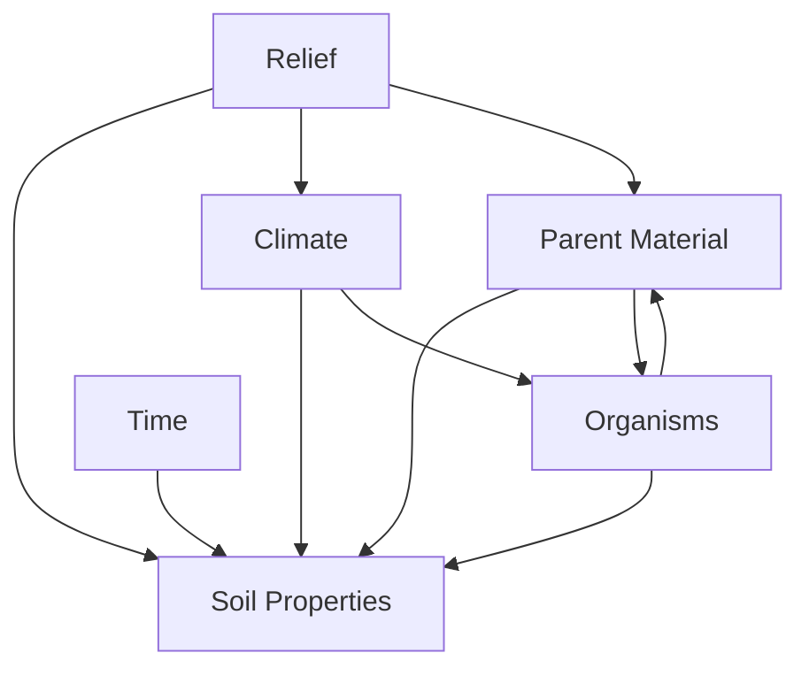

## Factors of Soil Formation

### Overview

Soil formation, or pedogenesis, is the process by which unconsolidated mineral and organic material is transformed into a structured, layered soil body capable of supporting life. The character of any soil at a given location is the product of five classical, interacting factors first systematized by Hans Jenny (1941) in his clorpt equation:

$$S = f(cl, o, r, p, t)$$

where $S$ is soil, $cl$ is climate, $o$ is organisms, $r$ is relief (topography), $p$ is parent material, and $t$ is time. These factors do not act independently; they interact continuously, and the resulting soil represents the integrated outcome of all five operating together over a given landscape.

### The Five Factors

#### 1. Parent Material

Parent material is the initial mineral or organic substrate from which soil develops. It supplies the raw mineralogical and chemical starting point for pedogenesis.

**Key Points**

- Sources include weathered bedrock (residual parent material) and transported sediments (alluvium, glacial till, loess, colluvium, volcanic ash)
- Mineral composition of the parent material controls initial texture, nutrient content, and susceptibility to weathering
- Felsic rocks (granite, rhyolite) weather slowly and yield sandy, quartz-rich, nutrient-poor soils
- Mafic rocks (basalt, gabbro) weather more readily and yield clay-rich soils enriched in iron, magnesium, and calcium
- Limestone parent material produces calcium-rich, often alkaline soils; residual limestone weathering can produce terra rossa soils in Mediterranean climates
- Permeability and mineral solubility of the parent material influence drainage and horizon development rates

**Example**

Soils developed on basalt in Hawaii weather rapidly under humid tropical conditions into iron- and aluminum-oxide-rich Oxisols, while soils on quartz-dominated sandstone in arid regions remain sandy, thin, and mineral-poor even after long exposure, because quartz is highly resistant to chemical weathering.

#### 2. Climate

Climate is generally considered the dominant factor governing the rate and type of pedogenic processes at a global scale, primarily through temperature and precipitation.

**Key Points**

- Precipitation drives leaching, chemical weathering, and translocation of clays and soluble minerals
- Temperature controls reaction rates of chemical weathering (approximately doubling per $10°C$ rise, following Van't Hoff-type kinetics) and biological activity
- High rainfall + high temperature (humid tropics) → intense leaching, deep weathering profiles, oxide-rich soils (Oxisols)
- Low rainfall (arid/semi-arid) → limited leaching, accumulation of salts and carbonates near the surface (Aridisols)
- Freeze-thaw cycles in cold climates drive physical weathering and slow organic matter decomposition, favoring organic-rich surface horizons (Gelisols, Spodosols)
- Climate also indirectly governs vegetation type, which feeds back into the organism factor

**Example**

Along a climatic gradient from a tropical rainforest to a desert, soils shift from deeply weathered, clay-rich, acidic Oxisols to shallow, alkaline, carbonate-accumulating Aridisols, despite similar parent material, illustrating climate's dominant control on weathering intensity.

#### 3. Organisms (Biotic Factor)

Organisms include vegetation, soil fauna, and microorganisms, all of which physically and chemically modify the developing soil.

**Key Points**

- Vegetation contributes organic matter, influences nutrient cycling, and affects moisture retention through root systems and canopy cover
- Grassland vegetation with extensive fibrous root systems tends to build deep, organic-rich A horizons (as in Mollisols)
- Forest vegetation, particularly coniferous, contributes acidic litter that promotes leaching and formation of a distinct organic layer over a leached E horizon
- Soil fauna (earthworms, termites, ants, burrowing mammals) physically mix horizons (bioturbation), improve aeration and porosity
- Microorganisms (bacteria, fungi, actinomycetes) drive decomposition, nutrient mineralization, and humus formation
- Mycorrhizal fungi facilitate nutrient exchange between plants and soil
- Human activity is increasingly recognized as a distinct anthropogenic factor, through plowing, irrigation, drainage, and contamination, sometimes formally classified separately as "anthropogenic" influence in applied soil science

**Example**

Prairie soils under tallgrass vegetation in the North American Midwest develop thick, dark, humus-rich A horizons (Mollisols) due to the continuous input and turnover of fine grass roots, contrasted with the thinner organic layers typical of temperate forest soils under the same climate.

#### 4. Relief (Topography)

Relief refers to the shape, slope, and position of the land surface, which controls the distribution of water, sediment, and energy across the landscape.

**Key Points**

- Slope gradient affects runoff versus infiltration; steep slopes favor erosion and shallow soils, while gentle slopes favor deeper soil accumulation
- Slope position (summit, shoulder, backslope, footslope, toeslope) creates a catena, a sequence of related soils differing primarily due to topographic position rather than parent material or climate
- Aspect (slope orientation) influences microclimate; in the Northern Hemisphere, south-facing slopes receive more solar radiation, are warmer and drier, and typically have thinner, less-developed soils than north-facing slopes
- Depressions and low-lying areas accumulate water and sediment, often producing poorly drained, organic-rich, or hydric soils
- Elevation affects temperature and precipitation, indirectly linking relief to the climate factor

**Example**

Along a single hillslope catena, well-drained, moderately developed soils occur at the summit and backslope, while the footslope and toeslope accumulate colluvial material and exhibit poor drainage, gleying, and higher organic matter due to water convergence.

#### 5. Time

Time represents the duration over which the other four factors have acted on a given parent material; soil properties develop progressively and non-linearly with age.

**Key Points**

- Young soils (Entisols) show minimal horizon differentiation
- Soil development proceeds through recognizable stages: initial weathering, horizon differentiation, and eventual maturity or equilibrium with the environment
- Rate of development is not constant; early pedogenic changes (organic matter accumulation, initial structure formation) occur relatively quickly, while deep weathering and clay illuviation (Bt horizon formation) require much longer timescales, often thousands to tens of thousands of years
- A chronosequence is a set of soils formed on similar parent material and climate but differing in age, used to study developmental trends
- Very old, stable land surfaces in humid tropical settings can develop soils over hundreds of thousands to millions of years, producing deeply weathered profiles such as laterites

**Example**

On a series of glacial moraines of known age in a chronosequence study, the youngest moraine (post-glacial, <100 years) shows only weak soil structure and no clay accumulation, while a moraine of several thousand years exhibits a well-developed Bt horizon with clear clay illuviation, demonstrating time-dependent horizon evolution. [Inference: exact developmental timescales vary considerably by specific climate and mineralogy and are drawn from generalized chronosequence literature rather than a single universal rate]

### Factor Interactions

The five factors rarely act in isolation. A conceptual interaction diagram:

Climate influences which organisms can establish; relief modifies local climate and drainage; parent material controls what nutrients are available to organisms; and all interactions compound over time to produce the final soil profile.

### Soil-Forming Processes Driven by the Factors

The five factors operate through four broad categories of pedogenic process:

- **Additions**: input of organic matter, dust, and precipitation-derived materials
- **Losses**: leaching of soluble constituents, erosion, and gaseous losses (e.g., denitrification)
- **Translocations**: movement of material within the profile, such as clay illuviation (eluviation from upper horizons to illuviation in lower horizons) and cation movement
- **Transformations**: in-situ chemical and biological alteration, such as mineral weathering, humification, and oxidation-reduction reactions

### Diagram: The Clorpt Interaction Model (svg_diagram)

<svg xmlns="http://www.w3.org/2000/svg" viewBox="0 0 640 460" font-family="Arial, sans-serif">
<text x="320" y="30" font-size="18" font-weight="bold" text-anchor="middle">Factors of Soil Formation (svg_diagram)</text>
<circle cx="320" cy="240" r="70" fill="#8B5A2B" opacity="0.85" />
<text x="320" y="235" font-size="15" fill="white" text-anchor="middle" font-weight="bold">SOIL</text>
<text x="320" y="253" font-size="12" fill="white" text-anchor="middle">S = f(cl,o,r,p,t)</text>
<circle cx="320" cy="80" r="55" fill="#4A90D9" />
<text x="320" y="76" font-size="13" fill="white" text-anchor="middle" font-weight="bold">Climate</text>
<text x="320" y="92" font-size="10" fill="white" text-anchor="middle">temp, precip</text>
<circle cx="480" cy="150" r="55" fill="#5CB85C" />
<text x="480" y="146" font-size="13" fill="white" text-anchor="middle" font-weight="bold">Organisms</text>
<text x="480" y="162" font-size="10" fill="white" text-anchor="middle">flora, fauna, microbes</text>
<circle cx="480" cy="330" r="55" fill="#D9822B" />
<text x="480" y="326" font-size="13" fill="white" text-anchor="middle" font-weight="bold">Relief</text>
<text x="480" y="342" font-size="10" fill="white" text-anchor="middle">slope, aspect</text>
<circle cx="160" cy="330" r="55" fill="#9B59B6" />
<text x="160" y="326" font-size="13" fill="white" text-anchor="middle" font-weight="bold">Parent</text>
<text x="160" y="342" font-size="10" fill="white" text-anchor="middle">Material</text>
<circle cx="160" cy="150" r="55" fill="#C0392B" />
<text x="160" y="146" font-size="13" fill="white" text-anchor="middle" font-weight="bold">Time</text>
<text x="160" y="162" font-size="10" fill="white" text-anchor="middle">duration</text>
<line x1="320" y1="135" x2="320" y2="170" stroke="#555" stroke-width="2" />
<line x1="440" y1="180" x2="370" y2="215" stroke="#555" stroke-width="2" />
<line x1="440" y1="300" x2="370" y2="265" stroke="#555" stroke-width="2" />
<line x1="200" y1="300" x2="270" y2="265" stroke="#555" stroke-width="2" />
<line x1="200" y1="180" x2="270" y2="215" stroke="#555" stroke-width="2" />
<line x1="365" y1="105" x2="435" y2="130" stroke="#999" stroke-width="1.5" stroke-dasharray="4,3" />
<line x1="435" y1="175" x2="435" y2="305" stroke="#999" stroke-width="1.5" stroke-dasharray="4,3" />
<line x1="205" y1="175" x2="205" y2="305" stroke="#999" stroke-width="1.5" stroke-dasharray="4,3" />
<line x1="205" y1="130" x2="275" y2="105" stroke="#999" stroke-width="1.5" stroke-dasharray="4,3" />

<text x="320" y="440" font-size="11" text-anchor="middle" fill="#555">Solid lines: direct input to soil. Dashed lines: inter-factor interaction.</text>

</svg>

### Regional Soil Order Examples by Dominant Factor

| Dominant Factor | Example Region | Resulting Soil Order | Key Characteristic |
| --- | --- | --- | --- |
| Climate (humid tropical) | Amazon Basin | Oxisols | Deep weathering, oxide accumulation |
| Climate (arid) | Sahara margins | Aridisols | Salt/carbonate accumulation, weak horizons |
| Organisms (grassland) | North American Prairie | Mollisols | Thick, dark, humus-rich A horizon |
| Relief (poor drainage) | River floodplains | Gleysols/Aquic soils | Redoximorphic features, gleying |
| Time (young) | Recent volcanic ash, glacial forefields | Entisols/Andisols | Minimal horizon development |
| Time (very old, stable) | Ancient tropical shields | Deeply weathered laterites | Extensive clay and oxide profiles |

### Practical Application: Reading a Landscape

A soil scientist assessing a new site typically evaluates the five factors sequentially:

1. Identify parent material via geologic maps or field observation of rock/sediment type
2. Characterize local climate (mean annual precipitation and temperature, seasonality)
3. Document vegetation cover and evidence of faunal activity
4. Survey relief: slope angle, aspect, and landscape position
5. Estimate relative age of the land surface (e.g., glacial deposits, floodplain terraces, volcanic deposits) using stratigraphic or geomorphic context

This sequential assessment allows prediction of likely soil properties even before detailed profile description or laboratory analysis, and is standard practice in soil survey and land-use planning.

**Related Topics**

- Soil Horizons and Profile Development (O, A, E, B, C, R horizons)
- Soil Classification Systems (USDA Soil Taxonomy, WRB)
- Weathering Processes (physical, chemical, biological)
- Soil Catena and Toposequences
- Chronosequences and Soil Chronofunctions
- Pedogenic Processes: Podzolization, Laterization, Calcification, Gleization
- Soil Texture and Structure
- Nutrient Cycling and the Soil Biogeochemical System
- Anthropogenic Soils and Human-Modified Pedogenesis