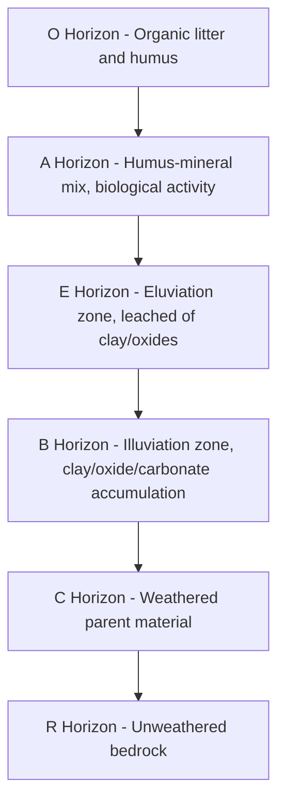

## Soil Horizons and Profile Development

### Overview

A soil profile is a vertical cross-section from the ground surface down to unweathered parent material, exposing a sequence of distinct layers called horizons. Each horizon forms through the differential action of pedogenic processes (additions, losses, translocations, transformations) operating over time, producing layers that differ from one another and from the original parent material in color, texture, structure, and chemistry. The systematic description and classification of these horizons is the primary tool used to interpret soil genesis, classify soils, and assess land use suitability.

### Master Horizon Designations

Soil scientists use a standardized letter-based nomenclature (following USDA and closely related international systems) to designate horizons.

**Key Points**

- **O horizon**: Organic layer dominated by partially or fully decomposed plant and animal residue; typically found at the surface in forested or wetland soils; largely absent or thin in grasslands and cultivated soils
- **A horizon**: Mineral horizon at or near the surface, characterized by accumulation of humified organic matter mixed with mineral material; darker in color than underlying horizons; the primary zone of biological activity and root concentration
- **E horizon**: Eluvial (leached) horizon, typically light-colored, from which clay, iron, and aluminum oxides have been removed by downward-percolating water and translocated to lower horizons; most prominent in forested, humid climates
- **B horizon**: Illuvial (accumulation) horizon where materials leached from above (clay, iron oxides, aluminum oxides, carbonates, salts) accumulate; often shows the greatest degree of structural development and color change; commonly the horizon of maximum weathering
- **C horizon**: Weathered parent material with minimal pedogenic alteration; retains recognizable characteristics of the original geologic or sedimentary material
- **R horizon**: Consolidated bedrock underlying the soil, showing little to no evidence of weathering

**Example**

A typical forest soil profile in a humid temperate climate might display, from top to bottom: a thin O horizon of leaf litter, a dark A horizon of humus-mixed mineral soil, a pale E horizon stripped of clay and iron, a reddish-brown B horizon enriched in illuviated clay, a C horizon of weathered saprolite, and finally unweathered R horizon bedrock.

### Horizon Suffixes (Subordinate Distinctions)

Lowercase letter suffixes are appended to master horizon symbols to indicate specific characteristics or processes.

| Suffix | Meaning |
| --- | --- |
| p | Plowed or otherwise disturbed by cultivation (e.g., Ap) |
| g | Strong gleying (mottling/gray colors from reducing, waterlogged conditions) |
| t | Accumulation of illuvial clay (e.g., Bt) |
| k | Accumulation of secondary carbonates (e.g., Bk) |
| s | Illuvial accumulation of sesquioxides (Fe/Al) with organic matter (e.g., Bs, common in Spodosols) |
| h | Illuvial accumulation of organic matter (e.g., Bh) |
| m | Strong cementation or induration (e.g., Bm, hardpan) |
| ss | Presence of slickensides (from shrink-swell clay activity) |
| w | Development of color or structure without clear illuviation (e.g., Bw, a weakly developed B horizon) |
| r | Weathered or soft bedrock |
| b | Buried genetic horizon |

**Example**

A Bt horizon indicates a subsurface horizon that has accumulated translocated clay (argillic horizon), commonly diagnostic of more developed soils such as Alfisols and Ultisols, while a Bw horizon indicates only weak, incipient structural or color development without measurable clay accumulation, typical of younger soils like Inceptisols.

### Transitional and Combination Horizons

Horizons rarely have sharp boundaries; transitional zones and mixed horizons are common.

**Key Points**

- Transitional horizons (e.g., AB, BC, EB) show properties intermediate between two master horizons, dominated by the first-listed letter
- Combination horizons (e.g., A/B or A&B, using a slash or ampersand) indicate intermixed pockets of two distinct horizon materials rather than a smooth gradation
- Boundary characteristics are described using terms for distinctness (abrupt, clear, gradual, diffuse) and topography (smooth, wavy, irregular, broken)

### The Soil Profile as a System: Diagram

### Profile Development Diagram (svg_diagram)

<svg xmlns="http://www.w3.org/2000/svg" viewBox="0 0 500 480" font-family="Arial, sans-serif">
<text x="250" y="28" font-size="17" font-weight="bold" text-anchor="middle">Generalized Soil Profile (svg_diagram)</text>
<rect x="100" y="45" width="220" height="30" fill="#4E342E" />
<text x="330" y="65" font-size="13">O — organic litter/humus</text>
<rect x="100" y="75" width="220" height="55" fill="#5D4037" />
<text x="330" y="107" font-size="13">A — humus-mineral mix</text>
<rect x="100" y="130" width="220" height="40" fill="#D7CCC8" />
<text x="330" y="154" font-size="13">E — eluviated, leached</text>
<rect x="100" y="170" width="220" height="90" fill="#A1887F" />
<text x="330" y="200" font-size="13">B — illuviated clay/oxides</text>
<text x="330" y="220" font-size="13">(Bt, Bs, Bk, Bw variants)</text>
<rect x="100" y="260" width="220" height="80" fill="#BCAAA4" />
<text x="330" y="295" font-size="13">C — weathered parent material</text>
<rect x="100" y="340" width="220" height="100" fill="#616161" />
<text x="330" y="385" font-size="13">R — unweathered bedrock</text>
<line x1="100" y1="45" x2="100" y2="440" stroke="black" stroke-width="1.5" />
<line x1="320" y1="45" x2="320" y2="440" stroke="black" stroke-width="1.5" />

<text x="60" y="460" font-size="11" fill="#555">Depth increases downward; boundaries are often gradual, not sharp.</text>

</svg>

### Processes Governing Profile Development

**Key Points**

- **Eluviation**: physical/chemical removal of material (clay, oxides, soluble salts) from an upper horizon by percolating water
- **Illuviation**: deposition of that removed material in a lower horizon, forming zones of accumulation
- **Humification**: microbial transformation of raw organic matter into stable humus, primarily building the A horizon
- **Leaching**: downward movement and loss of soluble ions and bases (Ca²⁺, Mg²⁺, K⁺, Na⁺) out of the profile, often lowering pH over time
- **Bioturbation**: physical mixing of horizons by roots, burrowing animals, and soil fauna, which can blur or homogenize otherwise distinct horizon boundaries
- **Gleying**: reduction of iron compounds under saturated, oxygen-poor conditions, producing gray, blue, or greenish colors and mottling, indicative of poor drainage
- **Cementation and hardpan formation**: precipitation of silica, iron oxides, or calcium carbonate into a dense, root-restricting layer (e.g., duripan, petrocalcic horizon)

### Diagnostic Surface and Subsurface Horizons (Soil Taxonomy Concept)

In formal classification systems such as USDA Soil Taxonomy, specific horizon properties are elevated to "diagnostic" status used to define soil orders and subgroups.

**Key Points**

- **Epipedons** (diagnostic surface horizons) include:
  - *Mollic epipedon*: thick, dark, base-rich surface horizon typical of Mollisols
  - *Umbric epipedon*: similar to mollic but with low base saturation
  - *Ochric epipedon*: pale or thin surface horizon lacking sufficient organic matter or thickness to qualify as mollic/umbric
- **Diagnostic subsurface horizons** include:
  - *Argillic horizon*: subsurface horizon with significant clay accumulation (correlates with Bt)
  - *Spodic horizon*: subsurface accumulation of illuviated organic matter with aluminum and iron oxides (correlates with Bs/Bh, diagnostic of Spodosols)
  - *Oxic horizon*: highly weathered subsurface horizon dominated by iron/aluminum oxides and low-activity clays (diagnostic of Oxisols)
  - *Calcic horizon*: subsurface accumulation of secondary calcium carbonate

[Inference: Precise quantitative thresholds for each diagnostic horizon (minimum thickness, clay percentage increase, base saturation cutoffs) are defined in detail within official USDA Soil Taxonomy keys and are typically consulted directly from that reference for applied classification work rather than memorized as fixed universal figures.]

### Field Description Parameters

When describing a horizon in the field, soil scientists systematically record:

1. **Depth and thickness** (upper and lower boundary depths in cm)
2. **Color**, typically using a Munsell Soil Color Chart notation (hue, value, chroma)
3. **Texture** (relative proportions of sand, silt, clay — e.g., "clay loam")
4. **Structure** (aggregate shape: granular, blocky, prismatic, platy, massive; and grade: weak, moderate, strong)
5. **Consistence** (resistance to deformation when dry, moist, or wet)
6. **Boundary** (distinctness and topography of the transition to the next horizon)
7. **Presence of roots, pores, mottles, concretions, or coatings (clay skins/cutans)**

**Example**

A field description entry might read: "Bt horizon, 25–58 cm, 5YR 4/6 (Munsell), clay loam, moderate subangular blocky structure, firm consistence when moist, clear smooth boundary, common fine roots, distinct clay film coatings on ped faces" — this single line encodes enough information to infer active clay illuviation and a moderately well-developed, likely older soil.

### Profile Development Through Time (Cross-Reference)

Horizon differentiation intensifies progressively with time, consistent with the time factor discussed under soil-forming factors:

| Development Stage | Typical Horizons Present | Approximate Soil Order Analogy |
| --- | --- | --- |
| Minimal (young) | A–C or A–Cr | Entisols |
| Weak | A–Bw–C | Inceptisols |
| Moderate | A–E–Bt–C | Alfisols |
| Strong | A–E–Bt–C (with base depletion) | Ultisols |
| Very strong / deep weathering | A–Bo–C (oxic) | Oxisols |

### Common Misinterpretations

**Key Points**

- Horizon letters describe *genetic origin*, not simply depth; a Bt horizon is defined by the process (clay illuviation) that formed it, not merely its position in the profile
- Not all soils contain all master horizons; absence of an E horizon, for instance, is normal in many grassland or arid soils
- A thick, dark surface layer is not automatically an A horizon in the diagnostic sense; it must meet specific structural and compositional criteria to qualify as a mollic or umbric epipedon
- Disturbance (plowing, erosion, deposition) can truncate, bury, or homogenize horizons, complicating profile interpretation; this is denoted with suffixes such as p (plowed) or b (buried)

**Related Topics**

- Factors of Soil Formation (parent material, climate, organisms, relief, time)
- Soil Classification Systems (USDA Soil Taxonomy, WRB Reference Base)
- Munsell Soil Color System and Field Description Methods
- Pedogenic Processes: Podzolization, Laterization, Calcification, Gleization, Salinization
- Soil Structure and Aggregate Formation
- Clay Mineralogy and Cation Exchange Capacity
- Soil Survey Methodology and Pedon Sampling
- Diagnostic Horizons in Soil Taxonomy (Mollic, Argillic, Spodic, Oxic, Calcic)