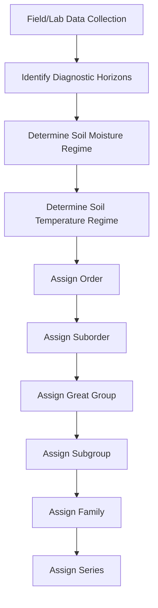

## Soil Classification Systems

### Overview

Soil classification systems provide standardized frameworks for grouping soils based on measurable, observable properties, allowing scientists, land managers, and planners to communicate about soils consistently across regions and disciplines. The two most widely used systems globally are **USDA Soil Taxonomy**, developed primarily for use in the United States but applied worldwide, and the **World Reference Base for Soil Resources (WRB)**, maintained by the IUSS (International Union of Soil Sciences) for international use. Both systems are hierarchical and property-based, relying on quantitatively defined diagnostic horizons, materials, and features rather than genetic (process-based) reasoning alone, though genetic understanding informs how those diagnostics were selected.

### USDA Soil Taxonomy: Structure

USDA Soil Taxonomy organizes soils into six hierarchical categories, from broadest to most specific.

**Key Points**

- **Order** (12 total): broadest category, based on dominant soil-forming processes and presence/absence of major diagnostic horizons
- **Suborder**: subdivides orders based on factors such as moisture regime, temperature regime, or dominant parent material
- **Great Group**: further subdivision based on the presence, absence, or arrangement of diagnostic horizons and features
- **Subgroup**: identifies the great group's central concept ("Typic") or intergrades toward other great groups/orders
- **Family**: groups soils with similar physical and chemical properties relevant to plant growth (texture class, mineralogy class, temperature regime)
- **Series**: most specific category, essentially a local, mappable soil type with a defined range of horizon characteristics, often named after a geographic location (e.g., "Miami series," "Norfolk series")

### The 12 Soil Orders

| Order | Defining Characteristic | Typical Environment |
| --- | --- | --- |
| Entisols | Little to no horizon development | Recently deposited material, floodplains, dunes |
| Inceptisols | Weak horizon development (Bw present) | Young soils in varied climates |
| Andisols | Dominated by volcanic ash/glass-derived minerals | Volcanic regions |
| Gelisols | Presence of permafrost within specified depth | Arctic/subarctic, alpine tundra |
| Histosols | Dominantly organic material (>20–30% organic matter) | Bogs, wetlands, peatlands |
| Aridisols | Dry soil moisture regime, weak organic accumulation | Deserts, arid regions |
| Vertisols | High shrink-swell clay content, self-mixing | Seasonally wet/dry clay-rich regions |
| Mollisols | Thick, dark, base-rich surface horizon (mollic epipedon) | Grasslands, prairies |
| Alfisols | Moderate weathering, clay-enriched Bt horizon, high base saturation | Temperate forests |
| Ultisols | Strongly weathered, Bt horizon, low base saturation | Humid subtropical/tropical forests |
| Spodosols | Illuvial accumulation of organic matter and Fe/Al oxides (spodic horizon) | Coniferous forests, sandy parent material |
| Oxisols | Extremely weathered, dominated by Fe/Al oxides (oxic horizon) | Humid tropics, old stable land surfaces |

**Example**

A soil in the American Midwest formed under native tallgrass prairie with a thick, dark, organic-rich surface horizon and high base saturation would classify as a Mollisol, while a soil in the humid Amazon basin, deeply weathered over a long stable surface and dominated by iron/aluminum oxides with very low natural fertility, would classify as an Oxisol.

### Soil Moisture and Temperature Regimes

USDA Soil Taxonomy incorporates standardized moisture and temperature regimes to define suborders and subgroups.

**Key Points**

- **Aquic**: soil is saturated with water and lacks oxygen for significant periods, producing gleyed or mottled colors
- **Udic**: soil is moist in all parts most of the year, typical of humid climates
- **Ustic**: intermediate moisture, limited but sufficient for plant growth during the growing season
- **Aridic (Torric)**: soil is dry most of the year, insufficient moisture for sustained plant growth
- **Xeric**: Mediterranean-type regime, moist winters and dry summers
- Temperature regimes (e.g., pergelic, cryic, mesic, thermic, hyperthermic) classify soils by mean annual and seasonal soil temperature, correlating with latitude and elevation

### World Reference Base (WRB) System

The WRB is the internationally endorsed system coordinated through FAO and IUSS, structured differently from USDA Taxonomy but built on comparable diagnostic principles.

**Key Points**

- Organized around **Reference Soil Groups (RSGs)**, 32 in the most recent editions, functioning similarly to USDA orders but not identical in definition or scope
- Uses **prefix and suffix qualifiers** attached to the RSG name to describe specific properties (e.g., "Haplic," "Chromic," "Gleyic," "Vertic")
- Diagnostic horizons, properties, and materials underpin RSG assignment, similar in principle to USDA diagnostic horizons but with some differing thresholds and terminology
- Examples of RSGs include Chernozems (dark, humus-rich, base-saturated soils of steppe regions, broadly analogous to Mollisols), Ferralsols (deeply weathered, oxide-dominated tropical soils, broadly analogous to Oxisols), and Podzols (broadly analogous to Spodosols)
- WRB is favored in international mapping, FAO soil resource assessments, and non-U.S. national soil surveys

[Inference: exact correspondence between USDA orders and WRB Reference Soil Groups is approximate rather than one-to-one, since the two systems use different diagnostic criteria and thresholds; cross-referencing tables exist but require care when used for precise scientific comparison.]

### Comparison: USDA Soil Taxonomy vs. WRB

| Aspect | USDA Soil Taxonomy | WRB |
| --- | --- | --- |
| Top-level unit | Order (12) | Reference Soil Group (32) |
| Hierarchy depth | 6 levels (Order → Series) | 2 main levels (RSG + qualifiers) |
| Primary user base | United States, widely adopted globally | International, FAO-endorsed |
| Naming convention | Formative elements combined into single words (e.g., "Hapludalf") | RSG name + qualifier list (e.g., "Haplic Luvisol") |
| Emphasis | Detailed hierarchical taxonomy for mapping and land use | Standardized international communication and correlation |

### Classification Workflow Diagram

### Naming Convention Logic (USDA Taxonomy)

USDA Soil Taxonomy names are constructed from Latin and Greek formative elements, allowing the name itself to encode diagnostic information.

**Key Points**

- Order names end in a distinctive suffix (e.g., *-sol* variants: "-isol," "-osol," combined with a connecting vowel and formative element)
- Example: "Hapludalf" breaks down as *Hapl-* (simple, from Greek *haplous*) + *-ud-* (udic moisture regime) + *-alf* (Alfisol order)
- This built-in logic allows a trained reader to infer moisture regime and order directly from the taxonomic name without consulting a separate key

**Example**

The name "Cryaquept" decodes as *cry-* (cold, cryic temperature regime) + *aqu-* (aquic moisture regime, saturated/poorly drained) + *-ept* (Inceptisol order), indicating a cold-climate, poorly drained, weakly developed soil — consistent with conditions found in subarctic wetlands.

### Diagnostic Horizon Cross-Reference (svg_diagram)

<svg xmlns="http://www.w3.org/2000/svg" viewBox="0 0 560 380" font-family="Arial, sans-serif">
<text x="280" y="26" font-size="16" font-weight="bold" text-anchor="middle">Diagnostic Horizon to Order Linkage (svg_diagram)</text>
<rect x="30" y="50" width="180" height="34" fill="#6D4C41" />
<text x="120" y="72" font-size="12" fill="white" text-anchor="middle">Mollic Epipedon</text>
<line x1="210" y1="67" x2="330" y2="67" stroke="#333" stroke-width="1.5" />
<rect x="330" y="50" width="180" height="34" fill="#8D6E63" />
<text x="420" y="72" font-size="12" fill="white" text-anchor="middle">Mollisols</text>
<rect x="30" y="100" width="180" height="34" fill="#5D4037" />
<text x="120" y="122" font-size="12" fill="white" text-anchor="middle">Argillic Horizon (Bt)</text>
<line x1="210" y1="117" x2="330" y2="117" stroke="#333" stroke-width="1.5" />
<rect x="330" y="100" width="180" height="34" fill="#795548" />
<text x="420" y="122" font-size="12" fill="white" text-anchor="middle">Alfisols / Ultisols</text>
<rect x="30" y="150" width="180" height="34" fill="#4E342E" />
<text x="120" y="172" font-size="12" fill="white" text-anchor="middle">Spodic Horizon</text>
<line x1="210" y1="167" x2="330" y2="167" stroke="#333" stroke-width="1.5" />
<rect x="330" y="150" width="180" height="34" fill="#6D4C41" />
<text x="420" y="172" font-size="12" fill="white" text-anchor="middle">Spodosols</text>
<rect x="30" y="200" width="180" height="34" fill="#3E2723" />
<text x="120" y="222" font-size="12" fill="white" text-anchor="middle">Oxic Horizon</text>
<line x1="210" y1="217" x2="330" y2="217" stroke="#333" stroke-width="1.5" />
<rect x="330" y="200" width="180" height="34" fill="#5D4037" />
<text x="420" y="222" font-size="12" fill="white" text-anchor="middle">Oxisols</text>
<rect x="30" y="250" width="180" height="34" fill="#37474F" />
<text x="120" y="272" font-size="12" fill="white" text-anchor="middle">Permafrost present</text>
<line x1="210" y1="267" x2="330" y2="267" stroke="#333" stroke-width="1.5" />
<rect x="330" y="250" width="180" height="34" fill="#455A64" />
<text x="420" y="272" font-size="12" fill="white" text-anchor="middle">Gelisols</text>

<text x="280" y="330" font-size="11" fill="#555" text-anchor="middle">Diagnostic horizon presence is the primary determinant of order-level classification.</text>

</svg>

### Other Notable Classification Approaches

**Key Points**

- **FAO/UNESCO Soil Map of the World Legend**: predecessor to WRB, historically significant but largely superseded
- **National systems**: many countries maintain their own classification frameworks distinct from USDA and WRB (e.g., the Chinese Soil Taxonomy, the Australian Soil Classification, the Canadian System of Soil Classification), often better adapted to regional pedogenic conditions
- **Engineering classification systems** (e.g., the Unified Soil Classification System, USCS): unrelated to pedogenic taxonomy; classifies soils by particle size and plasticity for geotechnical/construction purposes rather than genetic or agronomic properties — an important distinction, since "soil classification" in an engineering context means something fundamentally different from pedological classification

### Practical Applications of Classification

- Guides land capability assessments and agricultural suitability determinations
- Supports soil survey mapping used in urban planning, infrastructure siting, and environmental regulation
- Enables comparison of soil-related research findings across different geographic regions
- Informs global soil carbon and nutrient modeling by providing standardized soil categories for large-scale datasets

**Related Topics**

- Soil Horizons and Profile Development
- Factors of Soil Formation
- Diagnostic Horizons and Epipedons (Mollic, Argillic, Spodic, Oxic, Calcic)
- Soil Survey Methodology and Mapping
- Soil Moisture and Temperature Regimes
- Global Soil Distribution and Biome Correlation
- Engineering Soil Classification (Unified Soil Classification System) as a contrasting non-pedological system