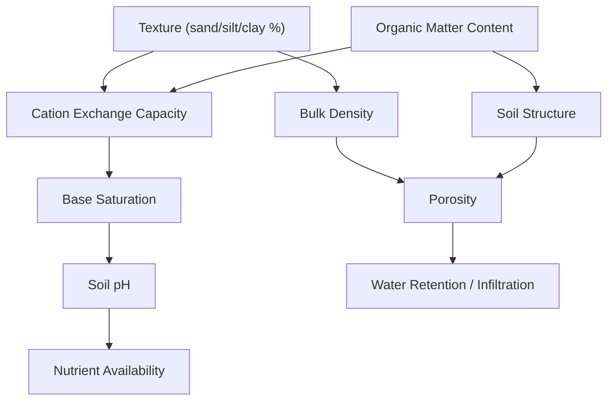

## Soil Physical and Chemical Properties

### Overview

Soil physical and chemical properties determine how soil behaves as a medium for plant growth, water movement, and nutrient cycling. Physical properties describe the arrangement, size, and behavior of solid particles, pore space, and water within the soil matrix. Chemical properties describe the reactive surfaces, ion exchange behavior, and reaction chemistry that control nutrient availability and soil fertility. These two property classes are deeply interconnected: for example, clay content (a physical property) directly controls cation exchange capacity (a chemical property).

## Physical Properties

### Soil Texture

Texture refers to the relative proportions of sand, silt, and clay particles in a soil, based on standardized particle size classes.

**Key Points**

- Sand: $0.05\text{–}2.0\ \text{mm}$, gritty, large pores, high permeability, low water/nutrient retention
- Silt: $0.002\text{–}0.05\ \text{mm}$, smooth/floury feel, intermediate properties
- Clay: $<0.002\ \text{mm}$, sticky when wet, high surface area, high water/nutrient retention, low permeability
- The relative percentages of sand, silt, and clay are plotted on the USDA soil textural triangle to assign a texture class (e.g., loam, sandy clay loam, silty clay)
- Texture is considered a relatively stable, inherent property, largely inherited from parent material and weathering history, and changes very slowly over time compared to structure or organic matter content

**Example**

A soil with 40% sand, 40% silt, and 20% clay plots as a "loam" on the textural triangle, representing a balanced texture often considered agriculturally favorable because it combines reasonable water retention with adequate drainage and aeration.

### Soil Structure

Structure describes how individual sand, silt, and clay particles aggregate into larger units called peds, distinct from texture, which describes only particle size distribution.

**Key Points**

- Common structural types: granular, blocky (angular/subangular), prismatic, columnar, platy, and massive (structureless) or single-grained (structureless, loose)
- Structure grade is described as weak, moderate, or strong, based on aggregate durability and distinctness
- Good structure improves aeration, water infiltration, and root penetration; degraded structure (e.g., compaction, massive structure) restricts these functions
- Organic matter, biological activity (roots, earthworms, fungal hyphae), and management practices (tillage, compaction) strongly influence structural development

### Bulk Density and Porosity

**Key Points**

- **Bulk density** ($\rho_b$) is the mass of dry soil per unit volume, including pore space: $\rho_b = \dfrac{M_{solids}}{V_{total}}$, typically expressed in $\text{g/cm}^3$
- Mineral soils typically range from about $1.1$ to $1.6\ \text{g/cm}^3$; compacted soils can exceed $1.7\ \text{g/cm}^3$; organic soils are much lower
- **Particle density** ($\rho_p$) refers only to the solid mineral material, typically averaging around $2.65\ \text{g/cm}^3$ for most mineral soils
- **Total porosity** is calculated as:

  $$\text{Porosity} = \left(1 - \frac{\rho_b}{\rho_p}\right) \times 100$$
- High bulk density generally indicates lower porosity, restricted root growth, and reduced water infiltration; this relationship is standard but exact critical thresholds for root-restriction vary by texture class [Inference: specific bulk density thresholds considered "root-restrictive" differ across cited agronomic sources depending on soil texture and crop, and are typically looked up in texture-specific reference tables rather than treated as one universal number]

**Example**

A soil sample with a bulk density of $1.33\ \text{g/cm}^3$ and an assumed particle density of $2.65\ \text{g/cm}^3$ has a total porosity of approximately $50\%$, calculated as $(1 - 1.33/2.65) \times 100 \approx 49.8\%$.

### Soil Water Properties

**Key Points**

- **Saturation**: all pore space filled with water, no air present
- **Field capacity**: water remaining after gravitational drainage has largely ceased (typically measured at $-33\ \text{kPa}$ or $\text{pF }2.5$ suction, though the exact tension used varies slightly by convention and soil type)
- **Permanent wilting point**: soil water tension (typically $-1500\ \text{kPa}$) at which plants can no longer extract sufficient water and wilt irreversibly
- **Plant-available water (PAW)**: the difference between field capacity and permanent wilting point, representing the water reservoir usable by plants
- Clay soils hold more total water but a larger fraction is held too tightly (below wilting point) for plant use; sandy soils hold less total water but release a higher proportion of it readily
- **Hydraulic conductivity** describes the rate at which water moves through saturated or unsaturated soil, strongly influenced by texture, structure, and pore continuity

### Soil Color

**Key Points**

- Described using the **Munsell Soil Color Chart** (hue, value, chroma)
- Dark colors typically indicate higher organic matter content
- Red/yellow colors indicate oxidized iron compounds (hematite, goethite) under well-drained, aerated conditions
- Gray, blue, or greenish colors (gleying) indicate reduced iron under saturated, anaerobic conditions, and are used as field indicators of poor drainage or seasonal water saturation
- Mottling (patches of contrasting color) indicates fluctuating water table conditions

## Chemical Properties

### Soil pH

**Key Points**

- Measures the concentration of hydrogen ions ($\text{H}^+$) in the soil solution: $\text{pH} = -\log_{10}[\text{H}^+]$
- Ranges: strongly acidic ($<5.0$), moderately acidic ($5.0\text{–}6.5$), neutral ($6.6\text{–}7.3$), moderately alkaline ($7.4\text{–}8.5$), strongly alkaline ($>8.5$)
- Most agricultural crops perform best in the slightly acidic to neutral range (roughly $6.0\text{–}7.0$), as this range maximizes availability of most essential nutrients
- Low pH increases solubility and potential toxicity of aluminum and manganese while decreasing phosphorus availability
- High pH decreases availability of micronutrients such as iron, zinc, and manganese, and can favor calcium carbonate accumulation
- pH is influenced by parent material, precipitation/leaching intensity, organic matter decomposition, and fertilizer or amendment history

### Cation Exchange Capacity (CEC)

CEC is the total capacity of a soil to hold and exchange positively charged ions (cations), expressed in $\text{cmol}_c/\text{kg}$ (or the older equivalent unit meq/100g).

**Key Points**

- Negative charge sites arise primarily from clay mineral surfaces (particularly 2:1 clays like smectite and vermiculite) and organic matter (humus)
- Higher clay content and higher organic matter content both increase CEC
- Common exchangeable cations include $\text{Ca}^{2+}$, $\text{Mg}^{2+}$, $\text{K}^+$, $\text{Na}^+$ (base cations) and $\text{Al}^{3+}$, $\text{H}^+$ (acid cations)
- **Base saturation** is the percentage of CEC occupied by base cations: 

  $$\text{Base Saturation (\%)} = \frac{\text{Sum of exchangeable base cations}}{\text{CEC}} \times 100$$
- Higher base saturation generally correlates with higher pH and greater nutrient availability
- CEC buffers the soil against rapid pH change and nutrient leaching, since exchangeable cations act as a reservoir that resists depletion of the soil solution

**Example**

A sandy soil low in both clay and organic matter might have a CEC of only $3\text{–}5\ \text{cmol}_c/\text{kg}$, meaning it holds few nutrient cations and is prone to leaching losses, while a clay-rich soil high in smectitic clay and organic matter might have a CEC exceeding $25\ \text{cmol}_c/\text{kg}$, giving it substantially greater nutrient-holding capacity.

### Anion Exchange Capacity (AEC)

**Key Points**

- Less commonly discussed than CEC, but relevant in highly weathered, oxide-rich soils (notably Oxisols and Ultisols) where iron and aluminum oxide surfaces can develop positive charge, particularly at low pH
- AEC allows retention of anions such as phosphate ($\text{PO}_4^{3-}$) and sulfate ($\text{SO}_4^{2-}$), which are otherwise highly mobile and leachable in most temperate soils

### Soil Organic Matter (SOM)

**Key Points**

- Composed of living organisms, fresh residues, and humus (stable, decomposed organic material)
- Improves structure/aggregation, water-holding capacity, CEC, and provides slow-release nutrients (particularly nitrogen, phosphorus, and sulfur) as it mineralizes
- Typically ranges from less than $1\%$ in arid or heavily cultivated soils to over $20\%$ in organic soils (Histosols)
- Decomposition rate depends on climate (temperature, moisture), aeration, and the chemical composition of residues (carbon-to-nitrogen ratio)

### Nutrient Availability and Redox Chemistry

**Key Points**

- Macronutrients (N, P, K, Ca, Mg, S) and micronutrients (Fe, Mn, Zn, Cu, B, Mo, Cl) each have pH- and redox-dependent solubility behavior
- **Redox potential (Eh)** describes the tendency of a soil environment to oxidize or reduce compounds; low Eh (reducing conditions, as in waterlogged soils) transforms iron and manganese into more soluble, potentially toxic forms and can trigger loss of nitrogen through denitrification
- Nutrient availability is often summarized in a generalized pH-availability relationship, where most nutrients reach peak availability near neutral pH, though the specific optimal range differs somewhat by individual nutrient [Inference: precise availability curves are drawn from generalized soil fertility reference charts rather than a single universal function, since exact solubility behavior depends on specific mineral forms present]

### Physical-Chemical Interaction Diagram

### Soil Property Relationships Diagram (svg_diagram)

<svg xmlns="http://www.w3.org/2000/svg" viewBox="0 0 600 380" font-family="Arial, sans-serif">
<text x="300" y="26" font-size="16" font-weight="bold" text-anchor="middle">Texture, Water, and CEC Relationships (svg_diagram)</text>

<text x="60" y="60" font-size="12" font-weight="bold">Texture</text>

<rect x="30" y="70" width="120" height="40" fill="`#C8A165`" />

<text x="90" y="93" font-size="11" fill="white" text-anchor="middle">Sand-dominant</text>

<rect x="30" y="130" width="120" height="40" fill="`#8B5E34`" />

<text x="90" y="153" font-size="11" fill="white" text-anchor="middle">Clay-dominant</text>

<line x1="150" y1="90" x2="260" y2="90" stroke="#333" stroke-width="1.5" />
<line x1="150" y1="150" x2="260" y2="150" stroke="#333" stroke-width="1.5" />
<rect x="260" y="65" width="140" height="50" fill="#4A90D9" />
<text x="330" y="86" font-size="11" fill="white" text-anchor="middle">Low water retention</text>
<text x="330" y="102" font-size="11" fill="white" text-anchor="middle">High infiltration</text>
<rect x="260" y="125" width="140" height="50" fill="#2E5C8A" />
<text x="330" y="146" font-size="11" fill="white" text-anchor="middle">High water retention</text>
<text x="330" y="162" font-size="11" fill="white" text-anchor="middle">Low infiltration</text>
<line x1="90" y1="170" x2="90" y2="220" stroke="#333" stroke-width="1.5" />
<rect x="30" y="220" width="120" height="40" fill="#5D8A5A" />
<text x="90" y="243" font-size="11" fill="white" text-anchor="middle">Low CEC</text>
<line x1="330" y1="175" x2="330" y2="220" stroke="#333" stroke-width="1.5" />
<rect x="270" y="220" width="120" height="40" fill="#3B6B38" />
<text x="330" y="243" font-size="11" fill="white" text-anchor="middle">High CEC</text>
<line x1="90" y1="260" x2="90" y2="300" stroke="#333" stroke-width="1.5" />
<line x1="330" y1="260" x2="330" y2="300" stroke="#333" stroke-width="1.5" />
<rect x="150" y="300" width="300" height="45" fill="#7A5230" />
<text x="300" y="327" font-size="12" fill="white" text-anchor="middle">Nutrient retention capacity and buffering</text>
<line x1="90" y1="300" x2="150" y2="322" stroke="#333" stroke-width="1.5" />
<line x1="330" y1="300" x2="330" y2="300" stroke="#333" stroke-width="1.5" />
</svg>

### Summary Table: Key Properties and Their Primary Influence

| Property | Category | Primary Controlling Factor | Main Effect |
| --- | --- | --- | --- |
| Texture | Physical | Parent material, weathering | Water/nutrient holding, drainage |
| Structure | Physical | Organic matter, biological activity, management | Aeration, root growth, infiltration |
| Bulk density | Physical | Compaction, texture, organic matter | Root penetration, porosity |
| Water retention | Physical | Texture, structure, organic matter | Plant-available water |
| pH | Chemical | Parent material, leaching, climate | Nutrient solubility/availability |
| CEC | Chemical | Clay content/type, organic matter | Nutrient retention, buffering |
| Base saturation | Chemical | CEC, leaching intensity | Fertility status, pH |
| Organic matter | Both | Climate, vegetation, management | Structure, CEC, nutrient supply |

**Related Topics**

- Factors of Soil Formation
- Soil Horizons and Profile Development
- Soil Classification Systems
- Soil Water Dynamics and Irrigation Management
- Nutrient Cycling and Soil Fertility Management
- Clay Mineralogy (1:1 vs 2:1 clay structures)
- Soil Organic Matter Dynamics and Carbon Sequestration
- Soil Degradation: Compaction, Salinization, and Acidification