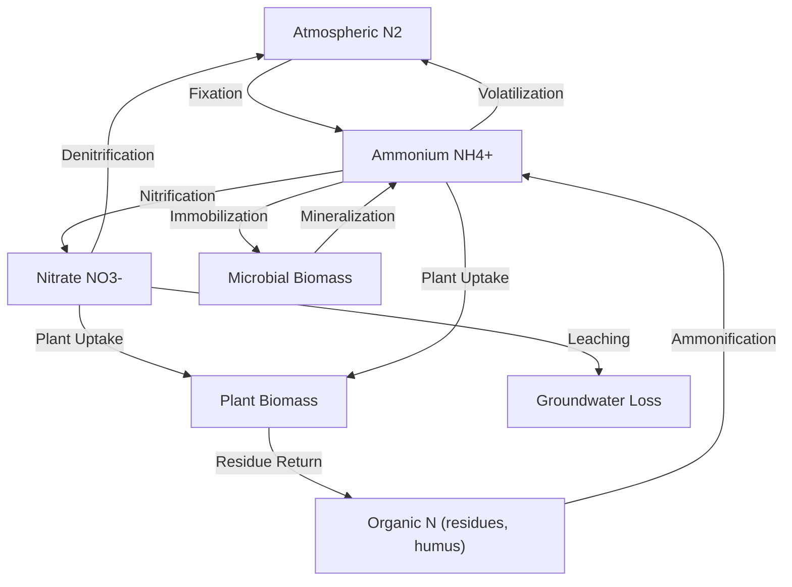

## Nutrient Cycling and Soil Fertility

### Overview

Nutrient cycling describes the continuous movement of essential elements through the soil-plant-atmosphere-water system via biological, chemical, and physical processes. Soil fertility is the capacity of a soil to supply these nutrients in adequate amounts, proper balance, and available forms to sustain plant growth. Fertility depends not only on total nutrient content but on the dynamic processes governing how nutrients are added, transformed, retained, and removed from the soil system.

### Essential Plant Nutrients

**Key Points**

- **Structural/non-mineral nutrients**: carbon (C), hydrogen (H), oxygen (O) — obtained from air and water, not soil
- **Primary macronutrients**: nitrogen (N), phosphorus (P), potassium (K) — required in the largest quantities, most commonly limiting in managed systems
- **Secondary macronutrients**: calcium (Ca), magnesium (Mg), sulfur (S)
- **Micronutrients**: iron (Fe), manganese (Mn), zinc (Zn), copper (Cu), boron (B), molybdenum (Mo), chlorine (Cl), and nickel (Ni) — required in small quantities but essential to specific enzymatic and metabolic functions
- Deficiency of any essential nutrient can limit plant growth regardless of the sufficiency of other nutrients, a principle formalized as **Liebig's Law of the Minimum**: growth is constrained by the scarcest resource relative to plant need, not by the total supply of all resources combined

### The Nitrogen Cycle

Nitrogen is the nutrient most frequently limiting to plant growth and involves the most complex soil-atmosphere cycling of any major nutrient.

**Key Points**

- **Nitrogen fixation**: conversion of atmospheric $\text{N}_2$ gas into biologically usable forms (ammonium, $\text{NH}_4^+$), performed by symbiotic bacteria (e.g., *Rhizobium* in legume root nodules), free-living soil bacteria (e.g., *Azotobacter*), and industrially via the Haber-Bosch process for synthetic fertilizer
- **Ammonification (mineralization)**: microbial decomposition of organic nitrogen (in residues, humus) into ammonium ($\text{NH}_4^+$)
- **Nitrification**: microbial oxidation of ammonium to nitrite ($\text{NO}_2^-$) and then nitrate ($\text{NO}_3^-$), carried out sequentially by *Nitrosomonas* and *Nitrobacter*-type bacteria; requires aerobic conditions
- **Immobilization**: microbial uptake of inorganic nitrogen into microbial biomass, temporarily removing it from plant-available pools (often triggered by high carbon-to-nitrogen ratio residues, such as straw)
- **Denitrification**: microbial reduction of nitrate back to gaseous forms ($\text{N}_2\text{O}$, $\text{N}_2$) under anaerobic (waterlogged) conditions, representing a loss pathway from the soil system
- **Leaching**: nitrate, being negatively charged and poorly retained by the predominantly negatively charged soil exchange complex, moves readily with percolating water and is a major pathway of nitrogen loss and groundwater contamination
- **Volatilization**: loss of ammonia gas ($\text{NH}_3$) to the atmosphere, particularly from surface-applied urea or manure under warm, high-pH conditions

### Nitrogen Cycle Diagram

### The Phosphorus Cycle

**Key Points**

- Phosphorus occurs in soil as organic P (in residues, humus, microbial biomass) and inorganic P (mineral forms and soil-solution phosphate ions)
- Plant-available forms are primarily orthophosphate ions ($\text{H}_2\text{PO}_4^-$ and $\text{HPO}_4^{2-}$), with relative proportions depending on pH
- Phosphorus is highly immobile in soil compared to nitrogen, since it readily forms insoluble compounds: with iron and aluminum oxides under acidic conditions, and with calcium under alkaline conditions
- Maximum phosphorus availability generally occurs near neutral pH (roughly 6.0–7.0), where fixation by both Fe/Al oxides and calcium carbonate is minimized
- Mycorrhizal fungal associations substantially extend the effective root absorption zone for phosphorus, which is important given its low mobility in the soil solution
- Because of its strong fixation tendency, phosphorus does not leach readily in most soils but can be lost through surface runoff and erosion, contributing to aquatic eutrophication

### The Potassium Cycle

**Key Points**

- Unlike nitrogen and phosphorus, potassium does not have significant gaseous or biologically transformed forms; cycling is primarily physical/chemical rather than microbially mediated
- Exists in soil in four general pools: soil solution (immediately available), exchangeable (held on CEC sites, readily available), fixed/non-exchangeable (held within certain clay mineral interlayers, slowly available), and structural (within primary minerals, essentially unavailable on short timescales)
- Potassium is a monovalent cation ($\text{K}^+$) and is retained on cation exchange sites, so soils with higher CEC generally retain potassium more effectively against leaching
- Some 2:1 clay minerals (illite, vermiculite) can fix potassium between clay layers, reducing short-term availability but providing a longer-term reserve

### Sulfur Cycle

**Key Points**

- Plant-available form is primarily sulfate ($\text{SO}_4^{2-}$)
- Organic sulfur mineralizes similarly to organic nitrogen, releasing sulfate through microbial decomposition
- Sulfate behaves similarly to nitrate in terms of mobility (negatively charged, subject to leaching in most soils, though retained by AEC in highly weathered oxide-rich soils)
- Atmospheric deposition (both natural and industrial) has historically been a significant sulfur input, though this has declined in many regions with reduced industrial sulfur emissions [Inference: the described declining trend reflects widely documented reductions in industrial SO2 emissions in many developed regions since the late 20th century, though the magnitude and current status vary by specific country and are best confirmed against recent regional monitoring data]

### Soil Organic Matter and Nutrient Supply

**Key Points**

- Soil organic matter acts as a slow-release reservoir for nitrogen, phosphorus, and sulfur, releasing these nutrients as microbial decomposition proceeds (mineralization)
- The **carbon-to-nitrogen (C:N) ratio** of added organic material determines whether net mineralization or net immobilization occurs:
  - C:N ratio below approximately 20–25:1 generally favors net mineralization (nitrogen release)
  - C:N ratio above approximately 25–30:1 generally favors net immobilization (temporary nitrogen tie-up) as microbes scavenge available nitrogen to decompose carbon-rich residue
- Humus, the stabilized end-product of organic matter decomposition, has a relatively narrow, stable C:N ratio (commonly cited around 10:1 to 12:1) and releases nutrients slowly over long timescales

**Example**

Incorporating fresh wheat straw (high C:N ratio, often 80:1 or higher) into soil typically causes a temporary period of nitrogen immobilization, during which growing plants may show nitrogen deficiency symptoms, until microbial decomposition proceeds far enough that net mineralization resumes; incorporating well-decomposed compost (lower C:N ratio) does not typically produce this effect.

### Soil Fertility Assessment

**Key Points**

- **Soil testing** measures extractable nutrient concentrations (using standardized chemical extraction methods specific to each nutrient and region), pH, organic matter content, and CEC to guide fertilization decisions
- **Nutrient availability indices** differ by nutrient: nitrogen availability is typically inferred indirectly (since inorganic N pools fluctuate rapidly) while phosphorus and potassium are commonly measured using region-specific extraction methods (e.g., Olsen, Bray, Mehlich extractions for phosphorus, chosen based on soil pH and regional calibration)
- **Base saturation and CEC** together indicate the soil's capacity to supply and retain base cations (Ca, Mg, K)
- **Fertilizer recommendations** are typically calibrated against crop-specific nutrient removal rates and regional field trial response data rather than derived from soil chemistry alone

### Nutrient Cycling and Fertility Interaction Diagram (svg_diagram)

<svg xmlns="http://www.w3.org/2000/svg" viewBox="0 0 600 400" font-family="Arial, sans-serif">
<text x="300" y="26" font-size="16" font-weight="bold" text-anchor="middle">Nutrient Pools and Fertility Cycle (svg_diagram)</text>
<ellipse cx="150" cy="100" rx="100" ry="45" fill="#4E7A3D" />
<text x="150" y="96" font-size="12" fill="white" text-anchor="middle" font-weight="bold">Plant Biomass</text>
<text x="150" y="112" font-size="10" fill="white" text-anchor="middle">uptake / removal</text>
<ellipse cx="450" cy="100" rx="100" ry="45" fill="#6D4C41" />
<text x="450" y="96" font-size="12" fill="white" text-anchor="middle" font-weight="bold">Soil Organic Matter</text>
<text x="450" y="112" font-size="10" fill="white" text-anchor="middle">residues, humus</text>
<ellipse cx="150" cy="260" rx="100" ry="45" fill="#4A90D9" />
<text x="150" y="256" font-size="12" fill="white" text-anchor="middle" font-weight="bold">Soil Solution</text>
<text x="150" y="272" font-size="10" fill="white" text-anchor="middle">immediately available</text>
<ellipse cx="450" cy="260" rx="100" ry="45" fill="#8D6E63" />
<text x="450" y="256" font-size="12" fill="white" text-anchor="middle" font-weight="bold">Exchange Complex</text>
<text x="450" y="272" font-size="10" fill="white" text-anchor="middle">CEC-held reserve</text>
<line x1="150" y1="145" x2="150" y2="215" stroke="#333" stroke-width="1.5" marker-end="url(#arrow)" />
<line x1="220" y1="115" x2="380" y2="115" stroke="#333" stroke-width="1.5" />
<line x1="220" y1="245" x2="380" y2="245" stroke="#333" stroke-width="1.5" />
<line x1="450" y1="145" x2="450" y2="215" stroke="#333" stroke-width="1.5" />
<line x1="240" y1="130" x2="360" y2="230" stroke="#999" stroke-width="1" stroke-dasharray="4,3" />
<line x1="240" y1="230" x2="360" y2="130" stroke="#999" stroke-width="1" stroke-dasharray="4,3" />

<text x="300" y="350" font-size="11" fill="#555" text-anchor="middle">Mineralization, immobilization, and exchange reactions link all four pools continuously.</text>

</svg>

### Management Practices Affecting Nutrient Cycling and Fertility

**Key Points**

- **Crop rotation with legumes**: exploits biological nitrogen fixation to reduce reliance on synthetic nitrogen inputs
- **Cover cropping**: reduces nutrient leaching between growing seasons and adds organic matter upon incorporation
- **Organic amendments** (compost, manure): supply slow-release nutrients and improve CEC and structure simultaneously
- **Synthetic fertilization**: supplies readily available nutrients directly but does not inherently build long-term soil organic matter or structure
- **Liming**: raises pH in acidic soils, improving availability of most nutrients (except micronutrients, which generally become less available at higher pH) and reducing aluminum/manganese toxicity
- **Tillage practices**: conventional tillage accelerates organic matter decomposition and mineralization but increases erosion risk; reduced/no-till slows mineralization but builds surface organic matter and improves structure over time

### Nutrient Loss Pathways Summary

| Nutrient | Primary Loss Pathway(s) | Mobility in Soil |
| --- | --- | --- |
| Nitrogen (nitrate) | Leaching, denitrification | High |
| Nitrogen (ammonium) | Volatilization, fixation on clay | Moderate to low |
| Phosphorus | Erosion, runoff (particle-bound) | Very low |
| Potassium | Leaching (moderate), erosion | Moderate |
| Sulfur | Leaching (as sulfate) | Moderate to high |
| Calcium/Magnesium | Leaching | Moderate |

**Related Topics**

- Soil Physical and Chemical Properties
- Soil Classification Systems
- Soil Horizons and Profile Development
- Soil Organic Matter Dynamics and Carbon Sequestration
- Sustainable Soil Management and Conservation Practices
- Eutrophication and Agricultural Runoff Impacts
- Microbial Ecology of Soil Systems