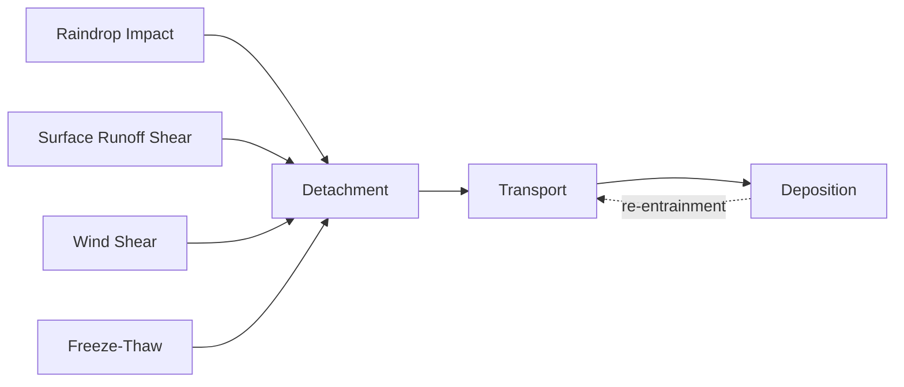
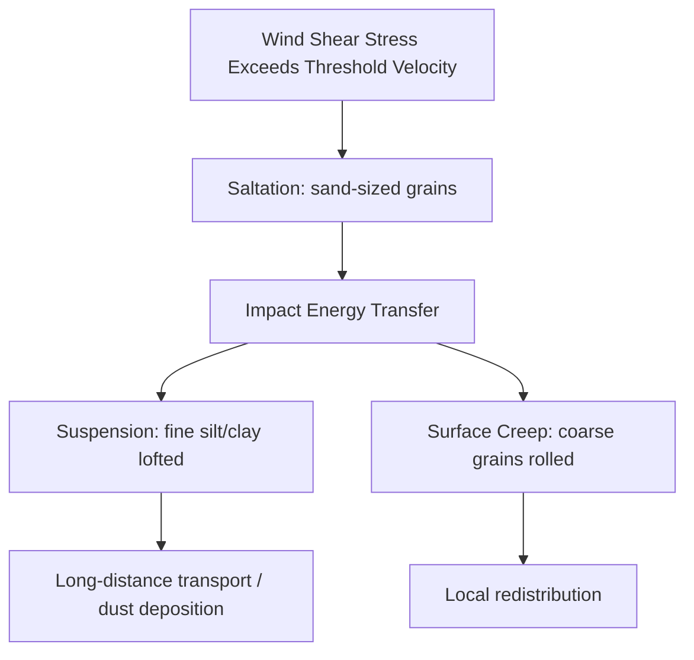

## Soil Erosion Processes

### Overview

Soil erosion is the detachment, transport, and redeposition of soil particles by erosive agents — primarily water, wind, ice, and gravity — often accelerated beyond natural (geologic) rates by land-use change, deforestation, and unsustainable agricultural practices. It is distinguished from **geologic erosion** (the slow, natural denudation that shapes landscapes over geologic time) by its typically much higher rate and direct link to human disturbance of vegetative cover and soil structure.

### Fundamental Concepts

#### Erosion vs. Geologic Denudation

| Term | Rate | Driver | Timescale |
| --- | --- | --- | --- |
| Geologic (natural) erosion | Slow, roughly balanced by soil formation | Climate, tectonics, natural vegetation | $10^3$–$10^6$ years |
| Accelerated (human-induced) erosion | Rapid, often exceeds soil formation rate | Tillage, deforestation, overgrazing, construction | Years to decades |

**Key Points**

- Soil formation rates are typically on the order of 0.1–1 mm/yr (order-of-magnitude), while accelerated erosion can remove soil orders of magnitude faster under poor management.
- Erosion becomes a net *degradation* process once removal outpaces pedogenesis (soil formation).

#### The Erosion Process Sequence

Soil erosion proceeds through three sequential stages:

1. **Detachment**: Soil aggregates are broken apart by raindrop impact, flowing water shear stress, wind shear, or freeze-thaw action
2. **Transport**: Detached particles are entrained and moved by the erosive agent (splash, sheet flow, saltation, suspension)
3. **Deposition**: Particles settle out when the transporting energy of the agent falls below the threshold needed to keep them in motion

### Water Erosion Processes

Water erosion is the dominant form of soil loss globally, occurring in a progression of increasing severity and connectivity.

#### 1. Splash (Raindrop) Erosion

- Initial detachment mechanism; raindrop impact breaks soil aggregates and displaces particles, sometimes over 1 m laterally on bare soil
- Occurs even on flat surfaces; net downslope transport increases with slope angle
- Considered the "pre-erosion" stage that preconditions particles for transport by flowing water

#### 2. Sheet Erosion

- Relatively uniform removal of a thin layer of surface soil by unconcentrated overland flow
- Difficult to detect visually in early stages; often identified by exposed plant roots, color changes, or accumulated sediment at field edges
- Considered the most insidious form of erosion due to its low visibility despite significant cumulative soil loss

#### 3. Rill Erosion

- Occurs when sheet flow concentrates into small, well-defined channels (typically a few centimeters deep)
- Rills are erasable by normal tillage, distinguishing them from gullies
- Represents a transition stage where flow becomes channelized and erosive power increases substantially

#### 4. Gully Erosion

- Advanced-stage erosion where channels become too large to be removed by conventional tillage (typically >0.3 m deep, though thresholds vary by source and region)
- Gullies can extend headward (headcut retreat) and deepen rapidly during intense storm events
- Represents severe, often irreversible land degradation

#### 5. Ephemeral Gully and Classic Gully Erosion

- **Ephemeral gullies**: form along natural drainage lines, are shallow, and can be re-tilled seasonally but reform each year in the same location
- **Classic (permanent) gullies**: too large for tillage, form permanent topographic features requiring structural remediation

#### Comparative Table — Water Erosion Stages

| Stage | Flow Type | Depth/Scale | Tillage-Erasable? |
| --- | --- | --- | --- |
| Splash | Raindrop impact | Particle-scale | N/A |
| Sheet | Unconcentrated overland flow | Uniform, thin | Yes |
| Rill | Concentrated flow | Centimeters | Yes |
| Ephemeral gully | Concentrated, seasonal | Tens of cm | Yes (reforms) |
| Classic gully | Concentrated, permanent | >0.3 m (variable) | No |

#### Streambank and Channel Erosion

- Lateral erosion of channel banks by fluvial undercutting, often combined with mass failure of the bank material
- Contributes substantially to sediment loads in agricultural and urbanized watersheds

### Wind (Aeolian) Erosion Processes

Dominant in arid, semi-arid, and drought-prone regions with sparse vegetation cover and fine-textured, dry soils.

#### Transport Mechanisms

1. **Suspension**: Very fine particles (<0.1 mm, generally silt/clay-sized) lifted high into the air column and transported long distances (can cross continents)
2. **Saltation**: Sand-sized particles (~0.1–0.5 mm) bounce along the surface in a series of short hops; accounts for the majority (roughly 50–70%, order-of-magnitude) of total wind-eroded material by mass
3. **Surface creep**: Larger particles (~0.5–1.0 mm) rolled or pushed along the surface by the impact of saltating grains, too heavy to be lifted

#### Threshold Wind Velocity

Erosion begins once wind shear velocity exceeds a threshold determined by particle size, moisture, and surface roughness:

$$u_{*t} \propto \sqrt{\frac{(\rho_p - \rho_a) g d}{\rho_a}}$$

Where $u_{*t}$ is threshold shear velocity, $\rho_p$ is particle density, $\rho_a$ is air density, $g$ is gravitational acceleration, and $d$ is particle diameter. [Unverified: exact proportionality constants depend on empirical calibration (e.g., Bagnold's original formulation) and surface conditions]

**Key Points**

- Fine, dry, loose, and unvegetated soils in flat, open terrain (e.g., the Dust Bowl-era U.S. Great Plains) are most susceptible.
- Wind erosion is highly episodic, concentrated in short high-wind events rather than continuous background loss.

### Erosion by Ice and Gravity

- **Freeze-thaw (frost) processes**: repeated ice lensing and thawing loosens soil structure, increasing susceptibility to subsequent water or wind erosion
- **Mass wasting**: gravity-driven downslope movement (soil creep, slumping, landslides) can be considered a form of soil erosion at steep slope angles, especially when saturated

### Factors Controlling Erosion Rate

#### The Universal Soil Loss Equation (USLE) Framework

A widely used empirical model for estimating average annual sheet-and-rill erosion from agricultural land:

$$A = R \times K \times LS \times C \times P$$

| Factor | Meaning |
| --- | --- |
| $A$ | Computed soil loss (mass/area/time) |
| $R$ | Rainfall-runoff erosivity index |
| $K$ | Soil erodibility factor |
| $LS$ | Slope length and steepness factor |
| $C$ | Cover-management factor |
| $P$ | Support practice factor (contouring, terracing, etc.) |

**Key Points**

- USLE and its revised versions (RUSLE, RUSLE2) are empirical, calibrated primarily on U.S. cropland data; applicability outside these conditions requires regional calibration. [Unverified: transferability of default coefficient values to other climates/soils without recalibration]
- USLE estimates long-term average erosion; it is not designed to predict erosion from individual storm events or gully/channel processes.

#### Soil Erodibility ($K$ factor) Controls

- **Texture**: silt-dominated soils are generally most erodible; well-aggregated clays and coarse sands tend to resist erosion (clays due to cohesion, sands due to high infiltration)
- **Organic matter content**: higher organic matter improves aggregate stability, reducing erodibility
- **Structure and permeability**: well-structured, permeable soils reduce runoff volume, lowering erosive transport capacity

#### Vegetative Cover

- Canopy cover intercepts raindrop energy before impact, reducing splash detachment
- Root systems and surface litter increase infiltration and reduce runoff velocity
- Bare-fallow periods in agricultural cycles are typically the highest-risk windows for both water and wind erosion

#### Slope Factors

- Erosion rate increases with both slope steepness (increases flow velocity/shear stress) and slope length (increases accumulated runoff volume and flow depth)
- Longer, steeper slopes without interruption (terracing, contour barriers) show disproportionately higher erosion under the $LS$ factor

### Erosion Diagram — Hillslope Process Zonation

<svg xmlns="http://www.w3.org/2000/svg" viewBox="0 0 700 320" font-family="sans-serif">
<text x="350" y="20" text-anchor="middle" font-size="14" font-weight="bold">Hillslope Erosion Process Zonation (svg_diagram)</text>
<polyline points="30,280 200,120 400,90 650,60" fill="none" stroke="black" stroke-width="2" />
<circle cx="70" cy="255" r="4" fill="#3b82f6" />
<text x="80" y="250" font-size="11">Splash (interrill)</text>
<circle cx="180" cy="160" r="4" fill="#22c55e" />
<text x="190" y="155" font-size="11">Sheet flow</text>
<circle cx="320" cy="105" r="4" fill="#f59e0b" />
<text x="330" y="100" font-size="11">Rill formation</text>
<circle cx="480" cy="78" r="4" fill="#ef4444" />
<text x="490" y="73" font-size="11">Gully / headcut</text>
<line x1="30" y1="290" x2="650" y2="290" stroke="black" stroke-width="1" />
<text x="340" y="310" text-anchor="middle" font-size="11">Downslope distance / accumulated flow →</text>
</svg>

### On-Site and Off-Site Impacts

#### On-Site (at the eroding location)

- Loss of topsoil, organic matter, and nutrients → declining fertility and crop yield
- Reduced water-holding capacity due to loss of fine particles and structure
- Exposure of subsoil with poorer physical/chemical properties

#### Off-Site (downstream/downwind)

- Sediment deposition in waterways, reservoirs, and drainage infrastructure (siltation)
- Nutrient and agrochemical transport contributing to eutrophication of water bodies
- Air quality degradation from dust events (particulate matter, visibility reduction)
- Increased flood risk from reduced channel capacity due to sedimentation

### Erosion Control and Conservation Practices

#### Agronomic Measures

- Contour farming and strip cropping to disrupt flow paths and reduce effective slope length
- Cover cropping and crop residue retention to maintain year-round soil cover
- Conservation tillage / no-till systems to preserve soil structure and surface residue

#### Structural Measures

- Terracing to shorten effective slope length and reduce runoff velocity
- Grassed waterways to safely convey concentrated flow without channel erosion
- Check dams and gully plugs to stabilize actively eroding gullies

#### Wind Erosion Control

- Shelterbelts/windbreaks to reduce wind velocity at the soil surface
- Stubble mulching and reduced tillage to maintain surface roughness and residue cover
- Strip cropping oriented perpendicular to prevailing wind direction

**Key Points**

- Effective erosion control generally combines vegetative, structural, and management practices rather than relying on a single method.
- Practice selection depends on local climate, soil erodibility, slope, and land-use context; behavior of specific interventions may vary with site conditions and should be verified against local agronomic guidance.

### Worked Example

**Example**

A cultivated field has: $R = 200$ (rainfall erosivity units), $K = 0.3$ (erodibility), $LS = 1.5$, $C = 0.4$ (partial residue cover), $P = 1.0$ (no support practice).

$$A = 200 \times 0.3 \times 1.5 \times 0.4 \times 1.0 = 36 \text{ (mass/area/year, in the units consistent with } R \text{ and } K\text{)}$$

If cover-management is improved through no-till and residue retention, reducing $C$ to 0.15:

$$A = 200 \times 0.3 \times 1.5 \times 0.15 \times 1.0 = 13.5$$

This illustrates how improving the cover-management factor alone can reduce estimated soil loss by roughly 60% in this scenario, without changing slope, soil type, or rainfall conditions — demonstrating why residue management is often the most cost-effective intervention. [Inference] actual field response would depend on site-specific calibration of all USLE factors, not just $C$.

### Common Misconceptions

- Sheet erosion is often assumed negligible because it lacks visible channels; in cumulative terms it frequently removes more soil over time than visible rill or gully erosion.
- Erosion and soil degradation are not identical — erosion is one *cause* of degradation, alongside compaction, salinization, and nutrient depletion.
- Wind erosion is not restricted to deserts; it is a major concern in seasonally dry agricultural regions with fine-textured soils and low residue cover.

**Related Topics**

- Universal Soil Loss Equation (USLE/RUSLE) and modern erosion modeling (WEPP, EPIC)
- Soil conservation practices and sustainable land management
- Sediment transport and fluvial geomorphology
- Desertification and land degradation processes
- Soil formation (pedogenesis) rates and controls
- Dust Bowl case study and historical land-use lessons
- Nutrient cycling and eutrophication linkages
- Watershed sediment budgets and reservoir siltation