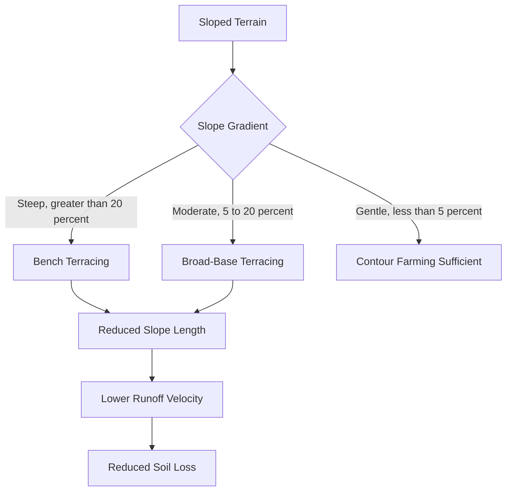
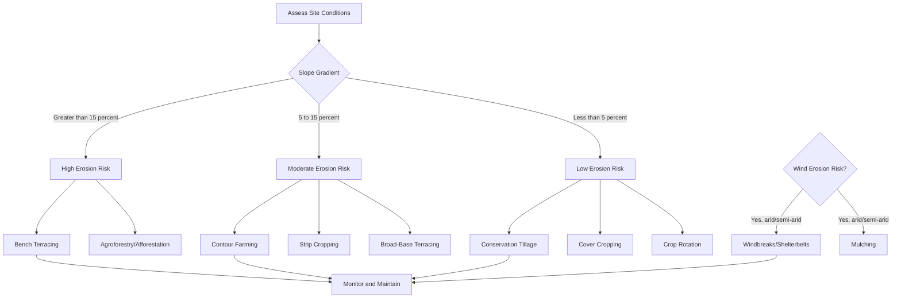

## Soil Conservation Practices

### Definition and Scope

Soil conservation encompasses the set of management strategies designed to prevent or minimize soil erosion, maintain soil fertility, and preserve soil structure against degradation caused by water, wind, chemical depletion, and unsustainable land use. It integrates principles from pedology, hydrology, agronomy, and land-use planning to sustain the soil's capacity for biological production and ecosystem function.

### Causes of Soil Degradation

**Key Points**

- Water erosion: sheet, rill, and gully erosion driven by surface runoff energy exceeding soil cohesion
- Wind erosion: dominant in arid/semi-arid regions with low vegetative cover and fine-textured soils
- Chemical degradation: nutrient depletion, salinization, acidification, and contamination
- Physical degradation: compaction, crusting, and loss of structural aggregation
- Anthropogenic drivers: deforestation, overgrazing, monocropping, and improper tillage

The Universal Soil Loss Equation (USLE) remains the standard empirical model for estimating water-induced soil loss:

$$A = R \times K \times LS \times C \times P$$

Where $A$ is the computed soil loss per unit area, $R$ is the rainfall-runoff erosivity factor, $K$ is the soil erodibility factor, $LS$ is the slope length-steepness factor, $C$ is the cover-management factor, and $P$ is the support practice factor. The Revised Universal Soil Loss Equation (RUSLE) refines the sub-factor computations but retains this same multiplicative structure. [Unverified: regional calibration coefficients for $R$ and $K$ vary by dataset and should be validated against local soil survey data before field application.]

### Mechanical/Structural Conservation Practices

#### Terracing

Terracing converts sloped land into a series of level or gently sloped platforms, reducing effective slope length and runoff velocity. Common types include bench terraces (for steep slopes, common in rice cultivation), broad-base terraces (for gentler agricultural slopes allowing machinery passage), and contour bunds.

#### Contour Farming and Contour Bunding

Planting and tillage operations follow the natural contour lines of the land (lines of equal elevation) rather than up-and-down slope. Each furrow acts as a small barrier that slows runoff and traps sediment. Effectiveness diminishes on slopes steeper than approximately 10%, where it is typically combined with terracing or strip cropping.

#### Check Dams and Gully Plugs

Small barriers (constructed from stone, brushwood, gabion, or earth) placed across gully channels to reduce flow velocity, trap sediment, and promote gradual gully stabilization. Gabion check dams (wire-mesh cages filled with rock) are favored for semi-permanent installations due to permeability, which reduces hydrostatic pressure buildup.

#### Windbreaks and Shelterbelts

Rows of trees or shrubs planted perpendicular to prevailing wind direction to reduce wind velocity at the soil surface, thereby reducing wind erosion (saltation and suspension of particles). Effective protection typically extends 10–20 times the windbreak height on the leeward side. [Inference: exact protection distance is influenced by windbreak porosity, density, and local wind climatology, so figures vary across studies.]

### Vegetative/Biological Conservation Practices

#### Cover Cropping

Non-cash crops (e.g., legumes, cereal rye, clover) planted during fallow periods to maintain continuous root and canopy cover. Functions include:

- Intercepting raindrop impact energy, reducing splash erosion
- Root systems binding soil aggregates and improving infiltration
- Nitrogen fixation (leguminous cover crops) improving fertility
- Suppressing weed germination through competition and allelopathy

#### Strip Cropping

Alternating strips of erosion-susceptible crops (e.g., row crops like maize) with erosion-resistant crops (e.g., dense-canopy forages) along the contour. Runoff generated in the row-crop strip is intercepted and filtered by the adjacent close-growing strip.

#### Agroforestry Systems

Integration of trees/shrubs with crops and/or livestock on the same land unit. Common configurations include alley cropping, silvopasture, and multistrata systems. Tree root systems access deeper soil moisture and nutrients, reduce surface runoff through canopy interception, and contribute organic matter via litterfall.

#### Afforestation and Reforestation

Establishment of forest cover on degraded or previously unforested land. Root network development stabilizes soil mass, particularly effective for controlling landslide-prone slopes and riverbank erosion.

### Agronomic/Tillage Practices

#### Conservation Tillage and No-Till Farming

Reduces or eliminates mechanical soil disturbance, leaving crop residue on the surface. Classifications (per residue cover standards):

- **Conventional tillage**: less than 15% residue cover after planting
- **Reduced tillage**: 15–30% residue cover
- **Conservation tillage**: greater than 30% residue cover
- **No-till**: seed placed directly into undisturbed soil through residue

Benefits include reduced fuel/labor costs, increased soil organic carbon retention, improved water infiltration, and reduced erosion. Trade-offs can include initial yield variability during transition and increased reliance on herbicides for weed control in some systems. [Unverified: yield outcomes are highly context-dependent on soil type, climate, and crop rotation design.]

#### Crop Rotation

Sequential planting of different crop species on the same field across seasons to break pest/disease cycles, balance nutrient extraction and replenishment, and vary root architecture to improve soil structure at different depths.

#### Mulching

Application of organic (straw, crop residue, wood chips) or inorganic (plastic film, gravel) material to the soil surface. Reduces evaporation, moderates soil temperature, suppresses weeds, and — for organic mulch — adds organic matter as it decomposes.

### Water Management Practices

#### Grassed Waterways

Natural or constructed channels shaped and vegetated (typically with sod-forming grasses) to safely convey concentrated runoff without gullying.

#### Drainage Management

Controlled subsurface or surface drainage prevents waterlogging (which causes structural collapse and anaerobic degradation) while avoiding excessive drainage that accelerates erosion and nutrient leaching.

#### Rainwater Harvesting Structures

Percolation ponds, farm ponds, and check dams that capture surface runoff, allowing groundwater recharge and reducing peak runoff volume and erosive energy downstream.

### Soil Erosion Control Diagram (svg_diagram)

<svg xmlns="http://www.w3.org/2000/svg" viewBox="0 0 780 460">
<text x="390" y="30" font-size="18" font-weight="bold" text-anchor="middle" fill="#1a1a1a">Comparative Soil Conservation Practices (svg_diagram)</text>
<line x1="40" y1="400" x2="740" y2="400" stroke="#333" stroke-width="2" />
<text x="40" y="420" font-size="12" fill="#333">Base Level</text>

<polygon points="60,400 60,340 180,220 180,400" fill="#d9c9a3" stroke="#7a5c2e" stroke-width="2" />
<text x="80" y="215" font-size="12" fill="#7a5c2e">Untreated Slope</text>
<path d="M170,230 Q160,280 150,330" stroke="#c0392b" stroke-width="3" fill="none" marker-end="url(#arrow)" />
<text x="130" y="260" font-size="11" fill="#c0392b">Runoff + Erosion</text>

<g>
<polygon points="240,400 240,370 290,370 290,340 340,340 340,310 390,310 390,280 440,280 440,400" fill="#a8c69f" stroke="#3d6b35" stroke-width="2" />
<text x="260" y="270" font-size="12" fill="#3d6b35">Bench Terracing</text>
<path d="M300,365 L300,375" stroke="#2e6b3d" stroke-width="2" marker-end="url(#arrow-small)" />
<path d="M400,305 L400,315" stroke="#2e6b3d" stroke-width="2" marker-end="url(#arrow-small)" />
</g>

<g>
<polygon points="500,400 500,340 620,220 620,400" fill="#c9dbb0" stroke="#4d7a3f" stroke-width="2" />
<path d="M510,390 Q560,370 610,350" stroke="#2e6b3d" stroke-width="2" fill="none" />
<path d="M515,360 Q565,340 605,320" stroke="#2e6b3d" stroke-width="2" fill="none" />
<path d="M525,330 Q570,315 595,295" stroke="#2e6b3d" stroke-width="2" fill="none" />
<text x="500" y="215" font-size="12" fill="#3d6b35">Contour Farming + Cover Crop</text>
</g>

<g>
<line x1="670" y1="400" x2="670" y2="260" stroke="#2e6b3d" stroke-width="6" />
<polygon points="670,260 650,300 690,300" fill="#3d8b4a" />
<polygon points="670,230 655,265 685,265" fill="#3d8b4a" />
<text x="600" y="215" font-size="11" fill="#3d6b35">Windbreak</text>
<path d="M760,270 L700,270" stroke="#7a7a7a" stroke-width="2" marker-end="url(#arrow-small)" />
<text x="700" y="255" font-size="10" fill="#7a7a7a">Prevailing Wind</text>
</g>
<rect x="40" y="440" width="12" height="12" fill="#d9c9a3" stroke="#7a5c2e" />
<text x="58" y="450" font-size="11" fill="#333">Bare/eroding soil</text>
<rect x="220" y="440" width="12" height="12" fill="#a8c69f" stroke="#3d6b35" />
<text x="238" y="450" font-size="11" fill="#333">Structural intervention</text>
<rect x="440" y="440" width="12" height="12" fill="#c9dbb0" stroke="#4d7a3f" />
<text x="458" y="450" font-size="11" fill="#333">Vegetative cover</text>
</svg>

### Decision Framework for Practice Selection

Selection depends on slope gradient, climate (erosivity), soil texture, land use intent, and available labor/capital.

### Soil Loss Tolerance and Monitoring

Soil loss tolerance ($T$-value) represents the maximum annual soil loss rate that permits sustained productivity, typically expressed in tons per hectare per year. Conservation planning targets keeping $A \leq T$ using the USLE/RUSLE framework above. Monitoring methods include:

- Erosion pins and bridges for measuring surface lowering
- Sediment traps and runoff plots for quantifying transported material
- Remote sensing (NDVI trends, digital elevation model change detection) for landscape-scale assessment

### Institutional and Policy Dimensions

Effective soil conservation typically requires integration of technical practices with:

- Land tenure security (incentivizing long-term investment in conservation structures)
- Extension services for farmer training and technology transfer
- Subsidy or payment-for-ecosystem-services schemes to offset upfront implementation costs
- Watershed-level coordination, since erosion and sedimentation are cross-boundary processes

[Inference: policy effectiveness is highly context-dependent on local governance capacity and socioeconomic conditions, and cannot be generalized without site-specific evaluation.]

### Common Misconceptions

- **Misconception**: No-till farming eliminates the need for other conservation practices. **Clarification**: No-till reduces disturbance-driven erosion but does not by itself address concentrated flow (gully) erosion, requiring complementary structural practices.
- **Misconception**: Terracing is universally beneficial regardless of soil type. **Clarification**: Poorly designed terraces on soils with low structural stability or high seepage can fail catastrophically, causing slope failure; engineering design must match local geotechnical conditions.

### Related Topics

- Soil erosion mechanics and the RUSLE/MUSLE models
- Watershed management and integrated catchment planning
- Soil organic carbon sequestration
- Agroforestry system design
- Land capability classification systems
- Desertification and land degradation neutrality frameworks
- Precision agriculture for erosion risk mapping