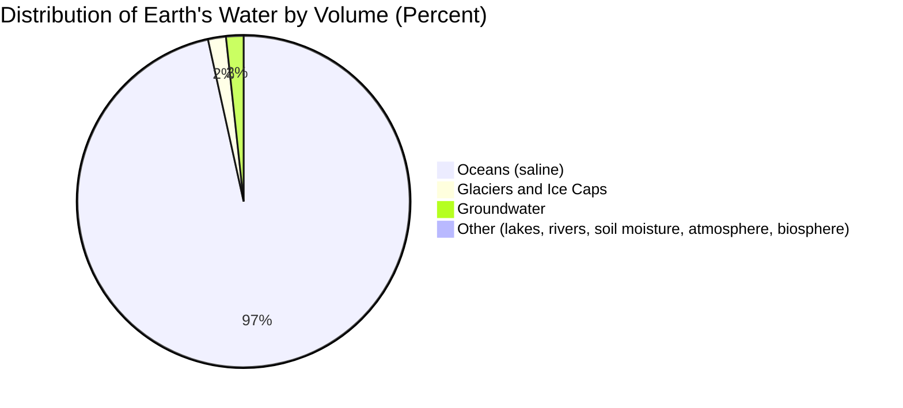

## The Global Water Cycle

### Definition and Systemic Role

The global water cycle (hydrologic cycle) is the continuous, energy-driven circulation of water across the atmosphere, hydrosphere, cryosphere, lithosphere, and biosphere. It functions as a closed mass-balance system at planetary scale, with solar radiation providing the primary energy input and gravity driving the return flow of water to lower elevations and ultimately the oceans.

### Fundamental Processes

#### Evaporation and Sublimation

Evaporation converts liquid water to vapor, occurring predominantly over oceans (roughly 86% of global evaporative flux). Sublimation, the direct phase change of ice to vapor, contributes from snowpack, glaciers, and polar ice sheets, particularly significant in cold, dry, high-wind environments where the vapor pressure gradient favors direct ice-to-vapor transition over melting.

#### Evapotranspiration (ET)

The combined flux of evaporation (soil, canopy-intercepted water, open water) and transpiration (plant stomatal water loss). Reference ET is commonly modeled using the FAO Penman-Monteith standardized equation, which accounts for net radiation, vapor pressure deficit, aerodynamic resistance, and canopy resistance. ET represents the dominant terrestrial water flux back to the atmosphere, comprising roughly two-thirds of precipitation over continents. [Unverified: this global terrestrial ET fraction varies by biome and is subject to measurement/model uncertainty.]

#### Atmospheric Water Transport

Once vaporized, water is transported horizontally by atmospheric circulation, sometimes over thousands of kilometers via mechanisms such as **atmospheric rivers** — narrow corridors of concentrated water vapor transport responsible for a substantial fraction of poleward moisture flux and major precipitation events in regions like the U.S. West Coast.

#### Condensation and Cloud Microphysics

Condensation occurs when air cools below its dew point, typically through adiabatic expansion during ascent. Droplet growth proceeds via:

- **Nucleation**: vapor condensing onto cloud condensation nuclei (CCN)
- **Coalescence**: droplet-droplet collision and merging (dominant in warm clouds)
- **Bergeron-Findeisen process**: ice crystal growth at the expense of supercooled liquid droplets in mixed-phase clouds, due to lower saturation vapor pressure over ice

#### Precipitation

Water returns to the surface once hydrometeors reach a mass sufficient to overcome updraft support. Global mean precipitation is approximately 990 mm/year over land and higher over oceans, though this masks enormous spatial heterogeneity (from under 50 mm/year in hyperarid deserts to over 10,000 mm/year in tropical orographic settings).

#### Infiltration, Percolation, and Subsurface Flow

Water entering the soil profile moves via unsaturated (vadose zone) flow governed by matric potential gradients, described by the Richards equation:

$$\frac{\partial \theta}{\partial t} = \frac{\partial}{\partial z}\left[K(\theta)\left(\frac{\partial \psi}{\partial z} + 1\right)\right]$$

Where $\theta$ is volumetric water content, $t$ is time, $z$ is depth, $K(\theta)$ is unsaturated hydraulic conductivity (a function of moisture content), and $\psi$ is matric potential. Water percolating below the root zone eventually reaches the water table, entering saturated groundwater flow.

#### Runoff Generation

- **Hortonian (infiltration-excess) overland flow**: rainfall intensity exceeds soil infiltration capacity
- **Saturation-excess overland flow**: soil profile reaches full saturation, common in humid, low-relief, or riparian settings
- **Interflow**: lateral unsaturated or perched-water-table flow above a restrictive soil layer
- **Baseflow**: groundwater discharge sustaining streamflow between precipitation events

### Global Water Distribution

Note: Of the ~2.5% of Earth's water that is fresh, roughly 68.7% is locked in glaciers and ice caps, and roughly 30.1% is groundwater, leaving only a small fraction as readily accessible surface freshwater (lakes, rivers, soil moisture).

### Residence Time Hierarchy

Residence time ($\tau$) is calculated as reservoir volume divided by flux rate:

$$\tau = \frac{V}{Q}$$

Reservoirs range across many orders of magnitude in turnover time:

| Reservoir | Approximate Residence Time |
| --- | --- |
| Atmosphere | ~9–10 days |
| Rivers | ~2–6 months |
| Soil moisture (root zone) | ~1–2 months |
| Lakes | ~years to decades |
| Shallow groundwater | ~years to centuries |
| Deep groundwater | ~centuries to >10,000 years |
| Glaciers/ice sheets | ~decades to >100,000 years (deep polar ice) |
| Oceans | ~3,000–3,200 years |

Short residence times (atmosphere, rivers) imply high sensitivity to short-term climatic variability; long residence times (deep groundwater, ice sheets) imply slow response and long-term "memory" of past climatic and recharge conditions.

### Coupling to the Global Energy Budget

Water phase changes transport latent heat: approximately 2,260 kJ/kg is absorbed during evaporation and released during condensation (at standard atmospheric pressure). This latent heat flux is a major component of the global energy budget, redistributing energy from the ocean surface into the troposphere and contributing significantly to poleward heat transport alongside sensible heat and ocean currents.

### Process Interaction Diagram (svg_diagram)

<svg xmlns="http://www.w3.org/2000/svg" viewBox="0 0 780 420">
<text x="390" y="28" font-size="17" font-weight="bold" text-anchor="middle" fill="#1a1a1a">Water Cycle Flux Interactions (svg_diagram)</text>
<circle cx="150" cy="200" r="70" fill="#cfe8fb" stroke="#2f7bbf" stroke-width="2" />
<text x="150" y="195" font-size="13" text-anchor="middle" fill="#1a4a70" font-weight="bold">Ocean</text>
<text x="150" y="212" font-size="10" text-anchor="middle" fill="#1a4a70">96.5% of volume</text>
<circle cx="400" cy="90" r="65" fill="#eaf6ff" stroke="#5a9bd4" stroke-width="2" />
<text x="400" y="85" font-size="13" text-anchor="middle" fill="#1a4a70" font-weight="bold">Atmosphere</text>
<text x="400" y="102" font-size="10" text-anchor="middle" fill="#1a4a70">~9-10 day residence</text>
<circle cx="650" cy="200" r="70" fill="#d9c9a3" stroke="#7a5c2e" stroke-width="2" />
<text x="650" y="195" font-size="13" text-anchor="middle" fill="#4a3a1e" font-weight="bold">Land Surface</text>
<text x="650" y="212" font-size="10" text-anchor="middle" fill="#4a3a1e">Soil / Vegetation</text>
<circle cx="400" cy="330" r="65" fill="#c9dbe8" stroke="#3a6a8a" stroke-width="2" />
<text x="400" y="325" font-size="13" text-anchor="middle" fill="#1a3a4a" font-weight="bold">Groundwater</text>
<text x="400" y="342" font-size="10" text-anchor="middle" fill="#1a3a4a">Years to millennia</text>
<path d="M195,165 Q290,110 340,100" stroke="#2f7bbf" stroke-width="2.5" fill="none" marker-end="url(#arrH)" />
<text x="230" y="120" font-size="10" fill="#2f7bbf">Evaporation</text>
<path d="M460,100 Q560,140 600,155" stroke="#3d8b4a" stroke-width="2.5" fill="none" marker-end="url(#arrH)" />
<text x="490" y="130" font-size="10" fill="#3d8b4a">Precipitation</text>
<path d="M600,245 Q500,290 450,310" stroke="#5a3d1e" stroke-width="2.5" fill="none" marker-end="url(#arrH)" />
<text x="500" y="290" font-size="10" fill="#5a3d1e">Infiltration</text>
<path d="M350,320 Q250,290 200,250" stroke="#1a5a8a" stroke-width="2.5" fill="none" marker-end="url(#arrH)" />
<text x="240" y="300" font-size="10" fill="#1a5a8a">Baseflow/Discharge</text>
<path d="M195,235 Q290,290 340,320" stroke="#2f7bbf" stroke-width="2" fill="none" stroke-dasharray="4,3" marker-end="url(#arrH)" />
<text x="220" y="290" font-size="9" fill="#2f7bbf">Seepage</text>
</svg>

### Regional Variability and Circulation Controls

The cycle's spatial distribution is governed by atmospheric general circulation:

- **Hadley cell subsidence** (roughly 20-30° latitude) suppresses precipitation, producing subtropical deserts
- **Intertropical Convergence Zone (ITCZ)** convection drives intense tropical precipitation
- **Orographic lifting** on windward mountain slopes enhances precipitation, with corresponding rain-shadow aridity on leeward slopes
- **Monsoon systems** produce strongly seasonal precipitation driven by land-ocean thermal contrast

### Anthropogenic Modification

- **Land-use change**: deforestation reduces transpiration and increases runoff/erosion; urbanization increases impervious surface area, sharply raising runoff coefficients and reducing infiltration
- **Reservoir regulation**: dams alter downstream flow timing, magnitude, and sediment transport
- **Groundwater overdraft**: extraction exceeding natural recharge causes water table decline and, in unconsolidated aquifers, land subsidence
- **Climate change forcing**: per the Clausius-Clapeyron relationship, atmospheric water-holding capacity increases roughly 7% per 1°C warming, associated with intensified precipitation extremes and altered evaporation rates. [Inference: specific regional precipitation pattern shifts depend on additional dynamical factors beyond this thermodynamic scaling and remain an active area of climate model research.]

### Observation and Modeling Systems

- **GRACE/GRACE-FO satellites**: measure terrestrial water storage anomalies via gravimetric field changes
- **GPM (Global Precipitation Measurement) constellation**: multi-satellite precipitation estimation
- **ARGO float network**: ocean temperature/salinity profiling relevant to evaporation and freshwater flux
- **Land surface models (e.g., Noah-MP, CLM)**: numerical simulation of coupled energy-water fluxes at the land-atmosphere interface, typically embedded within Earth system models for climate projection

### Common Misconceptions

- **Misconception**: All precipitation that falls on land eventually reaches the ocean via visible rivers. **Clarification**: A substantial fraction returns to the atmosphere via evapotranspiration before reaching the ocean, and additional water moves via slow, often invisible groundwater flow paths.
- **Misconception**: The water cycle operates at a constant, unchanging global rate. **Clarification**: Cycle intensity (total flux magnitude) responds to temperature via the Clausius-Clapeyron relationship, meaning warming climates are generally associated with an intensified hydrologic cycle.

### Related Topics

- Atmospheric general circulation and moisture transport
- Watershed and drainage basin hydrology
- Aquifer classification and groundwater flow systems
- Land surface–atmosphere feedback processes
- Paleoclimate proxies and ice core hydrology
- Water scarcity, stress indices, and resource management
- Coupled land-atmosphere Earth system modeling