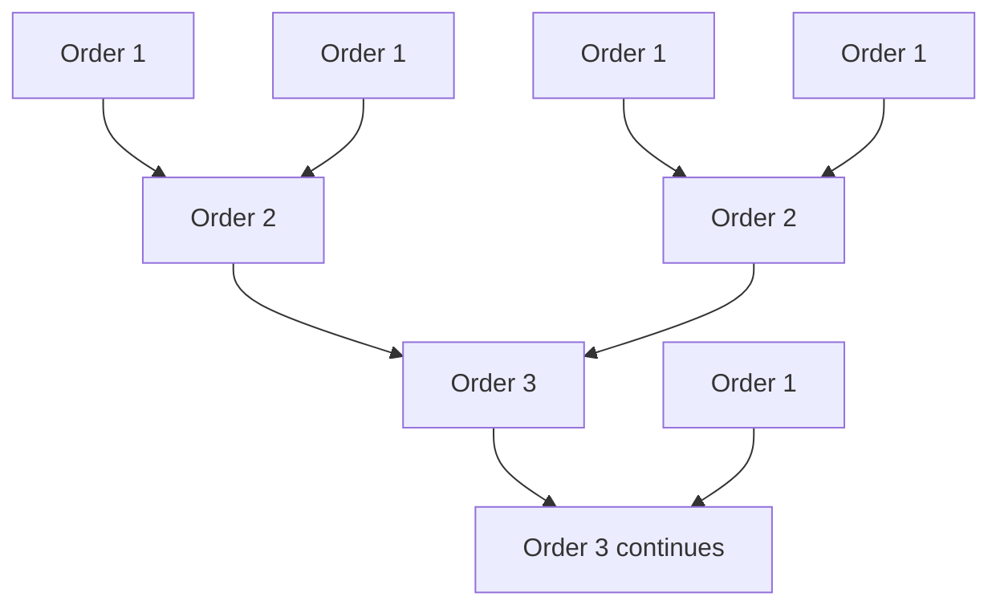
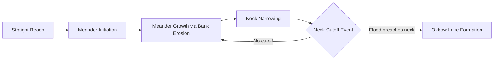

## Drainage Basins and River Systems

### Definition and Basic Concepts

A drainage basin (watershed or catchment) is the land area from which all surface runoff and, in most conceptualizations, contributing groundwater converges to a single outlet point — a river mouth, lake, or confluence with a larger stream. Drainage basins are separated from adjacent basins by a **drainage divide** (watershed boundary), typically following topographic ridgelines, though subsurface groundwater divides do not always coincide precisely with surface topographic divides.

### Drainage Basin Hierarchy

Basins are nested hierarchically:

- **Headwater/first-order basins**: smallest unglaciated tributary catchments
- **Sub-basins**: intermediate drainage areas contributing to a larger river
- **River basin**: the total area draining to a major river's mouth
- **Continental/oceanic divides**: largest-scale boundaries separating drainage toward different oceans (e.g., the Continental Divide of the Americas)

### Stream Order Classification

The **Strahler stream ordering system** is the standard method for classifying stream network hierarchy:

- A stream with no tributaries is **order 1**
- When two streams of the same order $n$ meet, the resulting stream becomes order $n+1$
- When two streams of different orders meet, the resulting stream retains the higher of the two orders

Stream order correlates with basin area, discharge, and channel width; higher-order streams (order 6+) represent major rivers, while low-order streams (order 1-3) comprise the majority of total channel length in a network.

### Drainage Patterns

Drainage network geometry reflects underlying geology, structure, and lithology:

| Pattern | Description | Typical Geologic Control |
| --- | --- | --- |
| Dendritic | Tree-like, branching randomly | Uniform, flat-lying rock with little structural control |
| Trellis | Parallel main channels with right-angle tributaries | Alternating resistant/weak rock bands (folded terrain) |
| Radial | Streams diverge outward from a central high point | Volcanoes, domal uplifts |
| Centripetal | Streams converge toward a central low point | Basins, calderas, sinkholes |
| Rectangular | Right-angle bends following joint/fault patterns | Jointed or faulted bedrock |
| Parallel | Closely spaced, roughly parallel channels | Uniform steep slope or parallel structural fabric |
| Deranged | Irregular, disorganized pattern with many lakes/wetlands | Recently glaciated terrain lacking established drainage |

### Drainage Pattern Diagram (svg_diagram)

<svg xmlns="http://www.w3.org/2000/svg" viewBox="0 0 780 420">
<text x="390" y="26" font-size="17" font-weight="bold" text-anchor="middle" fill="#1a1a1a">Drainage Pattern Types (svg_diagram)</text>

<g>
<text x="120" y="60" font-size="12" text-anchor="middle" font-weight="bold" fill="#333">Dendritic</text>
<path d="M120,80 L120,150 M120,150 L90,180 M120,150 L150,190 M90,180 L70,210 M90,180 L100,220 M150,190 L170,220 M150,190 L140,230" stroke="#2f7bbf" stroke-width="2" fill="none" />
</g>

<g>
<text x="330" y="60" font-size="12" text-anchor="middle" font-weight="bold" fill="#333">Trellis</text>
<path d="M280,90 L280,230 M330,90 L330,230 M380,90 L380,230" stroke="#2f7bbf" stroke-width="2" fill="none" />
<path d="M280,110 L330,110 M330,140 L380,140 M280,160 L330,160 M330,190 L380,190" stroke="#2f7bbf" stroke-width="2" fill="none" />
</g>

<g>
<text x="560" y="60" font-size="12" text-anchor="middle" font-weight="bold" fill="#333">Radial</text>
<circle cx="560" cy="150" r="4" fill="#7a5c2e" />
<path d="M560,150 L560,90 M560,150 L610,110 M560,150 L620,160 M560,150 L600,210 M560,150 L530,220 M560,150 L500,180 M560,150 L510,110" stroke="#2f7bbf" stroke-width="2" fill="none" />
</g>

<g>
<text x="120" y="280" font-size="12" text-anchor="middle" font-weight="bold" fill="#333">Rectangular</text>
<path d="M70,300 L70,340 L110,340 L110,380 L150,380 L150,400" stroke="#2f7bbf" stroke-width="2" fill="none" />
<path d="M110,340 L150,340 M70,340 L70,380 L100,380" stroke="#2f7bbf" stroke-width="2" fill="none" />
</g>

<g>
<text x="400" y="280" font-size="12" text-anchor="middle" font-weight="bold" fill="#333">Centripetal</text>
<circle cx="400" cy="360" r="4" fill="#1a5a8a" />
<path d="M400,360 L400,300 M400,360 L450,320 M400,360 L460,370 M400,360 L440,410 M400,360 L360,400 M400,360 L340,340" stroke="#2f7bbf" stroke-width="2" fill="none" />
</g>

<g>
<text x="640" y="280" font-size="12" text-anchor="middle" font-weight="bold" fill="#333">Parallel</text>
<path d="M600,300 L610,400 M630,300 L638,400 M660,300 L666,400 M690,300 L694,400" stroke="#2f7bbf" stroke-width="2" fill="none" />
</g>
</svg>

### Longitudinal River Profile and Base Level

Rivers exhibit a characteristic concave-upward longitudinal profile (elevation vs. downstream distance), reflecting the graded balance between erosive capacity and sediment load. **Base level** is the lowest elevation to which a stream can erode, with:

- **Ultimate base level**: sea level (global)
- **Local/temporary base level**: lakes, resistant rock layers, or dam-created reservoirs

Streams approaching graded equilibrium adjust channel slope, width, depth, and roughness to transport the available sediment and discharge without net aggradation or degradation. Perturbations (base-level change, tectonic uplift, climate shift) trigger a graded stream to re-adjust via headward erosion, knickpoint migration, or channel aggradation.

### Channel Morphology and Pattern

#### Channel Patterns

- **Straight channels**: rare in nature, typically structurally controlled (fault-aligned) or short-lived
- **Meandering channels**: sinuous, single-thread channels developing in lower-gradient, fine-sediment settings; migrate laterally via erosion on the outer (cut) bank and deposition on the inner (point bar) bank, driven by helicoidal secondary flow
- **Braided channels**: multiple interweaving channels separated by bars, typical of high sediment load, variable discharge, and steep gradient (e.g., glacial outwash systems)
- **Anastomosing channels**: multiple stable, low-gradient channels separated by vegetated, stable islands

#### Meander Dynamics

Meander migration rate is influenced by bank material cohesion, vegetation, and discharge variability. Over time, meander necks can be cut off, forming **oxbow lakes** as the abandoned channel segment becomes isolated from active flow.

### Fluvial Processes: Erosion, Transport, Deposition

#### Erosion Mechanisms

- **Hydraulic action**: force of flowing water dislodging bank/bed material
- **Abrasion (corrasion)**: mechanical wearing by transported sediment
- **Corrosion (solution)**: chemical dissolution of soluble bedrock (carbonates)
- **Cavitation**: localized pressure-drop-induced bubble collapse at high flow velocities

#### Sediment Transport Modes

- **Dissolved load**: chemically dissolved ions in solution
- **Suspended load**: fine particles (silt, clay) held in suspension by turbulence
- **Bed load**: coarser particles (sand, gravel) moving via traction, saltation, and rolling along the channel bed

Sediment transport capacity relates to discharge and velocity, commonly approximated by relationships such as the Hjulström-Sundborg diagram, which shows critical erosion, transport, and deposition velocities as a function of grain size — notably showing that fine cohesive clays require higher velocities to erode than to transport, due to interparticle cohesion.

#### Depositional Landforms

- **Point bars**: inner-bank meander deposits
- **Levees**: elevated banks formed by coarse sediment deposition during overbank flooding
- **Floodplains**: low-relief areas adjacent to channels, periodically inundated and receiving fine overbank sediment
- **Alluvial fans**: cone-shaped deposits at abrupt slope breaks (e.g., mountain front to valley floor)
- **Deltas**: sediment accumulations at a river's mouth where flow decelerates entering a standing body of water, classified by dominant process as fluvial-, wave-, or tide-dominated

### Discharge and the Hydrograph

Discharge ($Q$) is calculated as:

$$Q = A \times v$$

Where $A$ is cross-sectional area and $v$ is mean flow velocity. A **hydrograph** plots discharge over time in response to a precipitation event, characterized by:

- **Rising limb**: increasing discharge as runoff reaches the channel
- **Peak discharge**: maximum flow rate
- **Falling/recession limb**: declining discharge as surface runoff diminishes and baseflow dominates
- **Lag time**: interval between peak rainfall intensity and peak discharge, influenced by basin size, shape, slope, drainage density, and land cover

Urbanization and impervious surface expansion typically shorten lag time and increase peak discharge magnitude, elevating flood risk, since reduced infiltration increases the fraction of rainfall converted to rapid surface runoff. [Unverified: magnitude of hydrograph alteration depends on the extent and configuration of impervious cover, storm drainage infrastructure, and pre-existing land cover, and varies by watershed.]

### Drainage Basin Morphometry

Quantitative basin descriptors used in hydrologic analysis:

$$\text{Drainage Density} = \frac{\text{Total Stream Length}}{\text{Basin Area}}$$

$$\text{Basin Relief Ratio} = \frac{\text{Basin Relief (max elevation - outlet elevation)}}{\text{Basin Length}}$$

$$\text{Bifurcation Ratio} = \frac{N_u}{N_{u+1}}$$

Where $N_u$ is the number of streams of order $u$, and $N_{u+1}$ is the number of streams of the next higher order. High drainage density is associated with impermeable substrates, sparse vegetation, and high relief, while low drainage density is associated with permeable substrates and dense vegetation cover.

### Flooding and Flood Frequency Analysis

Flood magnitude-frequency relationships are commonly expressed using **recurrence interval** ($T$), estimated via the Weibull plotting position formula:

$$T = \frac{n+1}{m}$$

Where $n$ is the number of years of record and $m$ is the rank of the event (largest = 1). The commonly referenced "100-year flood" denotes an event with a 1% probability of occurrence in any given year — a probabilistic statement, not a literal 100-year interval, meaning such events can occur in consecutive years. [Inference: under a non-stationary climate, historical flood frequency statistics may not reliably predict future flood probabilities, an active area of hydrologic research.]

### Human Modification of River Systems

- **Channelization**: straightening/lining channels to increase conveyance, often increasing downstream flood peak and reducing habitat complexity
- **Dam construction**: alters flow regime, traps sediment (reducing downstream sediment supply and delta progradation), and fragments aquatic habitat connectivity
- **Levee construction**: confines flood flows, often increasing flood stage for a given discharge and transferring risk downstream
- **Water abstraction**: irrigation and municipal withdrawal reduce in-channel discharge, in extreme cases causing channel disconnection (e.g., historically documented cases of major rivers failing to reach the sea in dry seasons)

### Common Misconceptions

- **Misconception**: A river's drainage basin is defined solely by visible surface topography. **Clarification**: While surface topographic divides are the primary basis for basin delineation, subsurface geological structure can cause groundwater flow to cross topographic divides, meaning true water balance boundaries do not always match mapped surface divides.
- **Misconception**: A "100-year flood" occurs exactly once every 100 years. **Clarification**: It denotes a 1% annual exceedance probability; multiple such events can occur within a short period, or none may occur for well over a century, by chance.

### Related Topics

- Fluvial geomorphology and channel evolution models
- Flood risk assessment and floodplain management
- Sediment budget analysis and reservoir sedimentation
- Watershed delineation using digital elevation models (DEMs)
- Delta formation and coastal sediment dynamics
- Baseflow separation and groundwater-surface water interaction
- River restoration and dam removal ecology