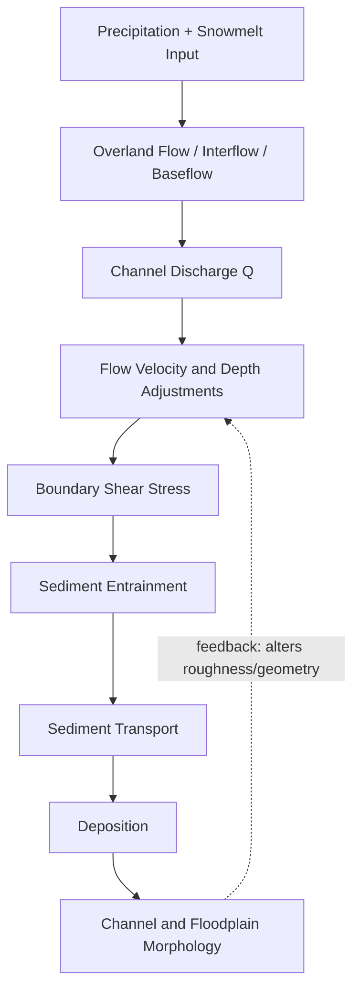
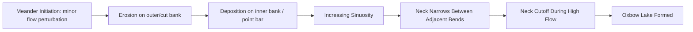

## Stream Flow and Fluvial Processes

### Overview

Fluvial processes encompass the mechanics of water flow in channels and the associated erosion, transport, and deposition of sediment. Streamflow is the primary agent shaping river channels, valleys, and floodplains, and it integrates precipitation, infiltration, and runoff from an entire drainage basin into a measurable discharge at any given point along a channel.

### Fundamental Concepts

#### Discharge

Discharge ($Q$) is the volume of water passing a cross-section per unit time, the master variable in fluvial hydrology.

$$Q = A \times v$$

Where $A$ is cross-sectional area (m²) and $v$ is mean flow velocity (m/s), yielding $Q$ in m³/s (cumecs).

**Key Points**

- Discharge generally increases downstream as tributaries add flow, even though channel width, depth, and velocity all vary independently.
- Discharge is not constant through time at a given station; it fluctuates with precipitation, snowmelt, and baseflow contributions.

#### Hydraulic Geometry

Channel dimensions adjust systematically to discharge, following empirical power-law relationships (Leopold and Maddock, 1953):

$$w = aQ^{b}, \quad d = cQ^{f}, \quad v = kQ^{m}$$

Where $w$ is width, $d$ is depth, $v$ is velocity, and $a, b, c, f, k, m$ are empirically fitted coefficients/exponents, with $b + f + m = 1$ by continuity.

- **At-a-station hydraulic geometry**: how width, depth, and velocity change at a single cross-section as discharge varies over time
- **Downstream hydraulic geometry**: how these variables change along the channel length at a constant discharge frequency (e.g., bankfull)

[Unverified: specific exponent values vary substantially by channel type, bed material, and region and require local calibration]

### Flow Types and Regimes

#### Laminar vs. Turbulent Flow

Characterized by the Reynolds number:

$$Re = \frac{\rho v L}{\mu}$$

Where $\rho$ is fluid density, $v$ is velocity, $L$ is a characteristic length (often hydraulic radius), and $\mu$ is dynamic viscosity.

- **Laminar flow** ($Re$ low, typically <500 for open channels): fluid moves in parallel layers with minimal mixing — rare in natural streams except in very shallow, slow groundwater seepage or thin sheet flow
- **Turbulent flow** ($Re$ high): chaotic, mixing-dominated flow — the dominant regime in virtually all natural stream channels

#### Subcritical vs. Supercritical Flow

Characterized by the Froude number:

$$Fr = \frac{v}{\sqrt{gd}}$$

Where $v$ is velocity, $g$ is gravitational acceleration, and $d$ is flow depth.

| Regime | Froude Number | Characteristics |
| --- | --- | --- |
| Subcritical | $Fr < 1$ | Tranquil flow; disturbances propagate upstream; typical of most lowland rivers |
| Critical | $Fr = 1$ | Transitional threshold |
| Supercritical | $Fr > 1$ | Rapid, shooting flow; disturbances cannot propagate upstream; occurs in steep channels, rapids, spillways |

### Flow Velocity Distribution

- Velocity is not uniform across a channel cross-section; it is typically maximum near the surface at the center of the channel (slightly below the surface due to air friction) and minimum near the bed and banks due to boundary friction
- **Mean velocity** is often approximated at 0.6 of flow depth from the surface in vertical velocity profiles, a standard field measurement convention
- In meandering channels, maximum velocity shifts toward the outer bank of bends due to the **thalweg** (the line of deepest, fastest flow) migrating with channel curvature

### Erosion, Transport, and Deposition (Fluvial Sediment Dynamics)

#### The Hjulström Curve

A classic empirical diagram relating flow velocity to particle behavior across grain sizes.

- **Erosion threshold**: velocity required to entrain a stationary particle from the bed
- **Transport (settling) threshold**: lower velocity below which a moving particle will deposit
- Notably, fine clay particles require *higher* velocities to erode than fine sand (due to cohesion between clay particles), despite being easier to keep in suspension once entrained — this is the classic "erosion vs. transport" asymmetry the curve is used to illustrate

<svg xmlns="http://www.w3.org/2000/svg" viewBox="0 0 700 400" font-family="sans-serif">
<text x="350" y="20" text-anchor="middle" font-size="14" font-weight="bold">Hjulström Curve — Erosion, Transport, Deposition (svg_diagram)</text>
<line x1="80" y1="350" x2="650" y2="350" stroke="black" stroke-width="1.5" />
<line x1="80" y1="350" x2="80" y2="40" stroke="black" stroke-width="1.5" />
<text x="365" y="380" text-anchor="middle" font-size="12">Particle size (log scale: clay → silt → sand → gravel)</text>
<text x="30" y="200" text-anchor="middle" font-size="12" transform="rotate(-90 30 200)">Velocity (log scale)</text>
<path d="M 100,150 C 200,50 350,60 450,90 C 550,120 620,160 640,200" fill="none" stroke="#ef4444" stroke-width="2" />
<text x="450" y="55" font-size="11" fill="#ef4444">Erosion threshold</text>
<path d="M 100,300 C 250,280 400,270 640,310" fill="none" stroke="#3b82f6" stroke-width="2" />
<text x="450" y="335" font-size="11" fill="#3b82f6">Settling (deposition) threshold</text>

<text x="150" y="130" font-size="11">Erosion zone</text>

<text x="330" y="200" font-size="11">Transport zone</text>

<text x="200" y="330" font-size="11">Deposition zone</text>

</svg>

#### Modes of Sediment Transport

| Mode | Mechanism | Particle Size |
| --- | --- | --- |
| Dissolved load | Chemical solution, no mechanical transport | Ions/solutes |
| Suspended load | Turbulence keeps particles suspended in the water column | Silt, clay, fine sand |
| Saltation | Particles bounce along the bed | Sand |
| Traction (bed load) | Particles roll/slide along the bed | Sand, gravel, cobbles |

**Key Points**

- Suspended load typically constitutes the majority of total sediment load by mass in most rivers, though the proportion of bed load can be much higher in steep, coarse-bedded mountain streams.
- Total sediment load = dissolved load + suspended load + bed load.

#### Competence and Capacity

- **Competence**: the maximum particle size a stream can transport at a given velocity (a threshold/quality measure)
- **Capacity**: the total volume/mass of sediment a stream can carry at a given discharge (a quantity measure)
- Both increase with discharge, but competence is highly sensitive to velocity (roughly proportional to velocity squared to the sixth power depending on the specific relationship used), meaning flood peaks disproportionately govern the transport of coarse material

### Channel Patterns

#### Straight, Meandering, and Braided Channels

- **Straight channels**: rare in nature over long distances; even straight channels typically have a sinuous thalweg
- **Meandering channels**: single-thread, sinuous channels with alternating pools (outer bends, deep, low velocity gradient near bed) and riffles (straight/crossover segments, shallow, higher gradient)
- **Braided channels**: multiple interconnected, shifting channels separated by bars; typically associated with high sediment supply, variable discharge, and easily erodible banks

| Pattern | Sinuosity | Sediment Load | Typical Setting |
| --- | --- | --- | --- |
| Straight | Low (<1.3) | Variable | Structurally controlled, rare |
| Meandering | High (>1.5) | Moderate, often suspended-dominated | Lowland, fine-grained banks |
| Braided | Low-moderate | High, often bedload-dominated | High-gradient, glacial/proglacial, erodible banks |

#### Meander Dynamics

- Meanders migrate through erosion on the outer (cut) bank and deposition on the inner (point bar) bank
- Meander wavelength scales roughly proportionally with channel width (commonly cited as roughly 10–14× channel width, though this varies by study and channel type)
- Progressive meander migration can lead to **neck cutoff**, isolating an **oxbow lake** from the active channel

### Longitudinal Profile and Grade

- Most streams exhibit a concave-up longitudinal profile: steep in headwaters, progressively gentler toward the mouth
- A stream is described as being at **grade** when its slope is just sufficient to transport the sediment load supplied to it, given prevailing discharge — a dynamic, self-adjusting condition rather than a permanent state
- **Knickpoints** are abrupt breaks in the longitudinal profile (waterfalls, rapids) often reflecting base-level change, lithologic contrasts, or tectonic activity, and they tend to migrate upstream over time as they erode

### Floodplain Processes

- Floodplains form through lateral channel migration (point bar deposition) and vertical accretion during overbank flooding
- **Levees** (natural) form adjacent to channels from rapid deposition of coarser sediment as floodwaters lose velocity upon leaving the confined channel
- Fine sediment and nutrients are deposited across the floodplain during overbank events, historically supporting high agricultural productivity in floodplain soils

### Discharge and Flood Frequency Analysis

#### Hydrographs

A hydrograph plots discharge against time at a given gauging station, showing the basin's response to a rainfall or snowmelt event.

- **Rising limb**: increasing discharge following the onset of precipitation/runoff
- **Peak discharge**: maximum flow reached
- **Falling (recession) limb**: discharge decline as surface runoff diminishes and baseflow contribution dominates
- **Lag time**: interval between peak rainfall intensity and peak discharge, controlled by basin size, shape, slope, and drainage density

**Key Points**

- Urbanized basins typically show shorter lag times and higher peak discharges due to increased impervious surface and reduced infiltration, though the specific magnitude of change depends on the extent and design of urban drainage infrastructure.

#### Recurrence Interval

$$T = \frac{n+1}{m}$$

Where $T$ is the recurrence interval (years), $n$ is the number of years of record, and $m$ is the rank of the flood event (largest = 1) — a standard formula (Weibull plotting position) used in flood frequency analysis.

**Key Points**

- A "100-year flood" denotes a flood magnitude with a 1% probability of occurrence in any given year, not a flood that occurs exactly once every 100 years.
- Recurrence interval estimates are based on historical records and statistical extrapolation; actual future flood behavior may differ, particularly under changing climate or land-use conditions.

### Worked Example

**Example**

A gauging station records a channel cross-sectional area of 25 m² and a mean velocity of 1.2 m/s.

$$Q = A \times v = 25 \times 1.2 = 30 \, m^3/s$$

If a downstream tributary contributes an additional 12 m³/s, and no losses occur (evaporation, infiltration, abstraction):

$$Q_{total} = 30 + 12 = 42 \, m^3/s$$

Using downstream hydraulic geometry relationships, this discharge increase would typically be accommodated by some combination of increased width, depth, and velocity, though the exact partitioning depends on the site-specific exponents ($b$, $f$, $m$) for that river system. [Inference] exact channel response would require field-calibrated hydraulic geometry coefficients for the specific river.

### Common Misconceptions

- Higher velocity does not always mean higher discharge; a narrow, deep channel can carry the same discharge as a wide, shallow one at different velocities.
- Meandering and braided channels are not simply "young" vs. "old" stream forms; channel pattern is primarily controlled by sediment supply, bank material, and discharge variability, not solely by stream age.
- A "100-year flood" can occur multiple times within a decade; the label reflects a statistical probability, not a fixed periodic recurrence.

**Related Topics**

- Drainage basin morphometry and stream order (Strahler classification)
- Flood hydrology and hydrograph analysis
- Sediment transport modeling (Hjulström, Shields diagram)
- Fluvial landforms: deltas, alluvial fans, terraces
- River channel restoration and management
- Groundwater-surface water interactions (baseflow contribution)
- Watershed sediment budgets and denudation rates
- Climate change impacts on streamflow regimes