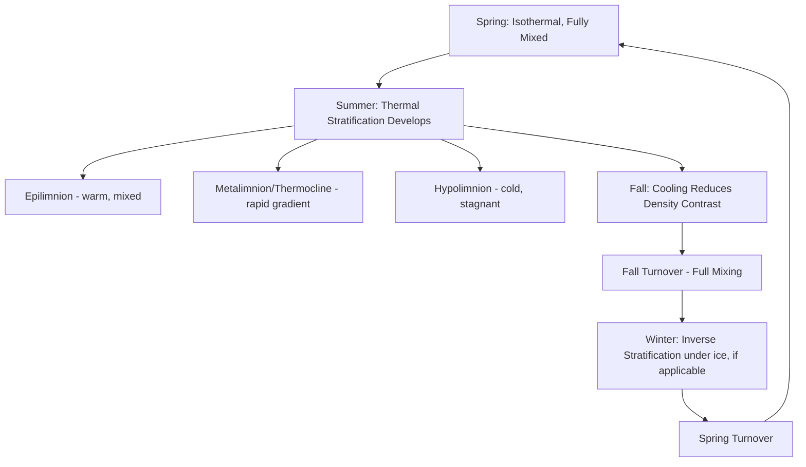

## Lakes and Wetlands

### Overview

Lakes and wetlands are standing-water bodies and saturated landscapes that form critical components of the hydrologic cycle, acting as storage reservoirs, biogeochemical processing zones, and habitat systems. Lakes are relatively deep, open-water bodies with limited emergent vegetation, while wetlands are transitional environments between terrestrial and aquatic systems, characterized by saturated soils and hydrophytic vegetation for at least part of the year.

### Fundamental Concepts

#### Lake Formation Mechanisms

| Origin | Mechanism | Example Type |
| --- | --- | --- |
| Tectonic | Basin formed by faulting/rifting | Rift valley lakes (e.g., Lake Tanganyika) |
| Volcanic | Crater or caldera collapse fills with water | Crater lakes |
| Glacial | Ice scouring, moraine damming, kettle formation | Cirque lakes, kettle lakes, finger lakes |
| Fluvial | Channel abandonment or damming | Oxbow lakes |
| Solution | Dissolution of soluble bedrock (karst) | Sinkhole/karst lakes |
| Landslide/Damming | Mass movement blocks a valley | Landslide-dammed lakes |
| Artificial | Human-constructed impoundment | Reservoirs |

**Key Points**

- Glacial processes are responsible for the majority of the world's natural lakes by number, largely due to the widespread distribution of formerly glaciated terrain in the Northern Hemisphere.
- Most lakes are geologically short-lived features (thousands to tens of thousands of years) relative to other landforms, as sedimentation and outlet erosion progressively fill or drain basins.

#### Lake Water Balance

$$\Delta S = (P + Q_{in} + G_{in}) - (E + Q_{out} + G_{out})$$

Where $\Delta S$ is change in lake storage, $P$ is precipitation, $Q_{in}/Q_{out}$ are surface inflow/outflow, $G_{in}/G_{out}$ are groundwater inflow/outflow, and $E$ is evaporation.

**Key Points**

- Closed-basin (endorheic) lakes have no surface outlet; water balance is maintained solely through evaporation, making them highly sensitive to climate change and susceptible to salinization over time.
- Open-basin lakes have a surface outlet and generally maintain lower, more stable salinity due to continuous flushing.

### Lake Thermal Stratification

Lakes in temperate climates typically develop a seasonal thermal structure driven by water's density-temperature relationship (maximum density at ~4°C).

#### Stratification Zones (Summer)

- **Epilimnion**: warm, well-mixed surface layer, in contact with the atmosphere
- **Metalimnion (thermocline)**: zone of rapid temperature decline with depth, acting as a density barrier limiting vertical mixing
- **Hypolimnion**: cold, dense bottom layer, isolated from atmospheric mixing during stratification

#### Lake Mixing Regimes (Classification by Turnover Frequency)

| Type | Mixing Pattern | Typical Setting |
| --- | --- | --- |
| Dimictic | Two turnovers per year (spring and fall) | Temperate lakes |
| Monomictic | One turnover per year | Warmer or polar climates (only one seasonal density crossing) |
| Polymictic | Frequent/continuous mixing | Shallow lakes, weak stratification |
| Meromictic | Permanently stratified, bottom layer never mixes | Deep, sheltered, or density-stabilized (e.g., saline bottom) basins |

**Key Points**

- Turnover is ecologically critical because it redistributes dissolved oxygen to depth and recycles nutrients from bottom sediments to the surface.
- Meromictic lakes often develop anoxic, nutrient-rich bottom waters due to the absence of turnover-driven oxygenation.

### Lake Trophic Classification (Eutrophication Gradient)

| Trophic State | Nutrient Level | Productivity | Water Clarity | Oxygen in Hypolimnion |
| --- | --- | --- | --- | --- |
| Oligotrophic | Low | Low | High | Well-oxygenated |
| Mesotrophic | Moderate | Moderate | Moderate | Moderate |
| Eutrophic | High | High | Low | Often depleted (hypoxic) |
| Hypereutrophic | Very high | Very high | Very low | Frequently anoxic |

- **Eutrophication** can occur naturally over long timescales through sediment/nutrient accumulation, or be accelerated ("cultural eutrophication") by anthropogenic nutrient inputs (agricultural runoff, wastewater)
- Algal blooms associated with eutrophication can lead to hypoxic "dead zones" when decomposition consumes dissolved oxygen

### Wetland Classification

#### By Hydrology and Vegetation

| Wetland Type | Water Source | Vegetation | Example |
| --- | --- | --- | --- |
| Marsh | Surface water, mineral soil | Emergent herbaceous (reeds, sedges) | Everglades (partial) |
| Swamp | Surface/groundwater, mineral or organic soil | Woody vegetation (trees, shrubs) | Bottomland hardwood swamp |
| Bog | Precipitation-fed (ombrotrophic) | Sphagnum moss, acidic, nutrient-poor | Peat bogs |
| Fen | Groundwater-fed (minerotrophic) | Sedges, less acidic, more nutrient-rich than bogs | Groundwater-fed fen |

**Key Points**

- Bogs and fens are both peat-accumulating wetlands but differ fundamentally in water source, pH, and nutrient status — this distinction is a common source of confusion.
- Marshes and swamps are distinguished primarily by dominant vegetation structure (herbaceous vs. woody), not by water chemistry.

#### The Three Wetland Identification Criteria

Formal wetland delineation (e.g., under U.S. Army Corps of Engineers methodology) generally requires evidence of all three:

1. **Hydrophytic vegetation**: plant species adapted to saturated/anaerobic soil conditions
2. **Hydric soils**: soils exhibiting anaerobic conditions (gleying, mottling, high organic content) due to prolonged saturation
3. **Wetland hydrology**: evidence of periodic or permanent saturation/inundation (e.g., saturation within a defined depth for a set duration during the growing season)

[Unverified: exact regulatory thresholds and durations vary by jurisdiction and delineation manual]

### Hydrological Functions of Wetlands

- **Flood attenuation**: temporary storage of floodwaters reduces downstream peak discharge and delays timing
- **Groundwater recharge/discharge**: depending on position in the landscape, wetlands can recharge aquifers or represent groundwater discharge zones
- **Water quality improvement**: sediment trapping, nutrient uptake (denitrification), and pollutant filtration via vegetation and microbial activity
- **Carbon sequestration**: particularly significant in peat-forming wetlands (bogs, fens), which store large amounts of organic carbon under anaerobic, slow-decomposition conditions

**Key Points**

- Peatlands cover a relatively small fraction of global land area but store a disproportionately large share of global soil carbon, making their degradation a significant concern for carbon cycle feedbacks. [Inference] exact global peatland carbon storage estimates vary across studies and are periodically revised as mapping improves.

### Lake and Wetland Diagram — Cross-Section

<svg xmlns="http://www.w3.org/2000/svg" viewBox="0 0 720 320" font-family="sans-serif">
<text x="360" y="20" text-anchor="middle" font-size="14" font-weight="bold">Lake Stratification and Adjacent Wetland Zone (svg_diagram)</text>
<rect x="50" y="60" width="620" height="60" fill="#93c5fd" opacity="0.7" />
<text x="360" y="95" text-anchor="middle" font-size="12">Epilimnion (warm, mixed)</text>
<rect x="50" y="120" width="620" height="30" fill="#60a5fa" opacity="0.7" />
<text x="360" y="140" text-anchor="middle" font-size="11">Metalimnion / Thermocline</text>
<rect x="50" y="150" width="620" height="90" fill="#1e40af" opacity="0.7" />
<text x="360" y="200" text-anchor="middle" font-size="12" fill="white">Hypolimnion (cold, dense)</text>
<path d="M 30,60 L 50,60 L 50,240 L 30,260 Z" fill="#a3a3a3" />
<path d="M 690,60 L 670,60 L 670,240 L 690,260 Z" fill="#a3a3a3" />
<path d="M 30,260 Q 60,255 90,258 Q 120,262 130,255" fill="none" stroke="#166534" stroke-width="3" />
<text x="80" y="280" text-anchor="middle" font-size="11">Fringing Marsh / Wetland</text>
<line x1="60" y1="255" x2="60" y2="235" stroke="#22c55e" stroke-width="2" />
<line x1="75" y1="255" x2="75" y2="230" stroke="#22c55e" stroke-width="2" />
<line x1="95" y1="258" x2="95" y2="238" stroke="#22c55e" stroke-width="2" />
</svg>

### Sediment and Nutrient Dynamics

- Lakes function as sediment sinks, with basin infill progressively reducing depth and volume over geologic time — the eventual fate of most natural lakes is terrestrialization (conversion to wetland, then dry land) absent continued tectonic or glacial renewal of the basin
- Wetlands positioned at the land-water interface intercept sediment and nutrients from upland runoff before they reach open water, functioning as natural buffers
- Internal nutrient loading (release of phosphorus from anoxic bottom sediments) can sustain eutrophic conditions in lakes even after external nutrient inputs are reduced

### Worked Example

**Example**

A closed-basin lake receives 500 mm/yr of precipitation directly on its surface and 2,000 mm/yr equivalent inflow from its watershed via a single inlet stream, with no surface outlet. Evaporation from the lake surface is measured at 1,800 mm/yr, and groundwater exchange is assumed negligible.

$$\Delta S = (P + Q_{in}) - E = (500 + 2000) - 1800 = +700 \text{ mm/yr (net gain)}$$

Since the basin is closed (no surface outlet), this net positive water balance would cause **lake level to rise** over time, absent some counteracting withdrawal (e.g., irrigation abstraction) or a shift toward drier climate conditions. Conversely, if regional precipitation declined and evaporation exceeded combined inputs, the lake would show a long-term contraction — a pattern documented in numerous endorheic lakes globally (e.g., Aral Sea, Great Salt Lake) under combined climatic and anthropogenic pressures. [Inference] real-world trajectories depend on additional factors such as groundwater exchange and human water use not included in this simplified example.

### Common Misconceptions

- Bogs and fens are often used interchangeably, but they differ in water source (precipitation vs. groundwater) and resulting chemistry (acidic/nutrient-poor vs. less acidic/nutrient-richer).
- Wetlands are not simply "wasted" or unproductive land; they are among the most biologically productive and hydrologically functional ecosystems per unit area.
- Lake turnover does not mean the lake physically inverts; it refers to the breakdown of density stratification allowing full-depth vertical mixing.

**Related Topics**

- Eutrophication and nutrient loading dynamics
- Wetland delineation methodology and regulatory frameworks
- Peatland carbon cycling and climate feedbacks
- Karst hydrology and sinkhole lake formation
- Limnology: lake ecosystem structure and function
- Endorheic basin hydrology and salinization
- Groundwater-surface water interaction
- Wetland restoration and constructed wetlands for water treatment