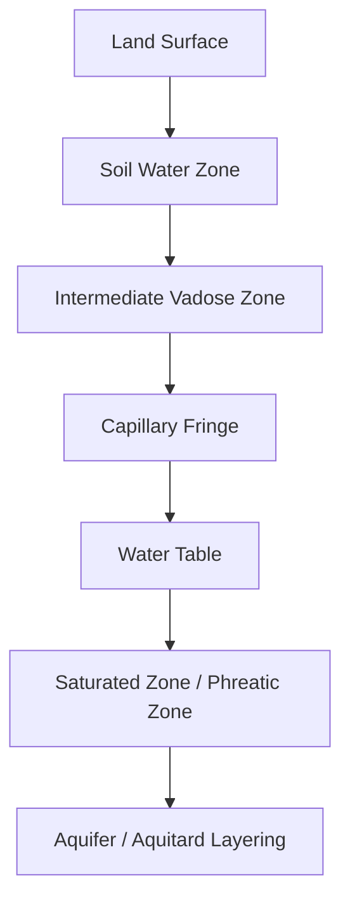
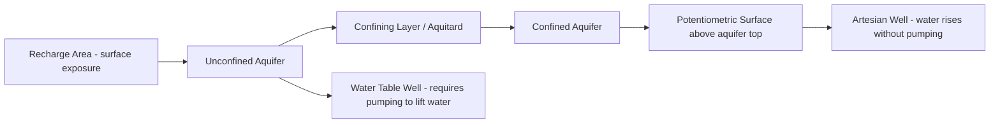

## Groundwater and Aquifer Systems

### Overview

Groundwater is water stored and moving within the pore spaces and fractures of subsurface geologic materials. It constitutes the largest reservoir of accessible freshwater on Earth (excluding ice caps/glaciers) and plays a central role in sustaining baseflow to streams, supplying wells for human use, and moderating the hydrologic cycle over timescales far longer than surface water systems.

### Fundamental Concepts

#### The Subsurface Water Zones

The subsurface is divided vertically based on the degree of pore-space saturation:

- **Unsaturated (vadose) zone**: pore spaces contain both air and water; includes the soil water zone near the surface and the intermediate vadose zone below it
- **Water table**: the upper surface of the saturated zone, where pore water pressure equals atmospheric pressure
- **Saturated zone**: all pore spaces are filled with water; this is the zone from which groundwater is extracted

#### Porosity and Permeability

- **Porosity** ($n$): the fraction of total rock/sediment volume that is void space, expressed as a percentage or decimal fraction — determines *storage capacity*
- **Permeability**: a measure of how well connected pore spaces are, controlling the ease with which water can flow through the material — determines *transmission capacity*

**Key Points**

- High porosity does not guarantee high permeability; clay has very high porosity but very low permeability because pores are poorly connected and extremely small.
- Well-sorted, coarse-grained materials (sand, gravel) generally exhibit both high porosity and high permeability, making them favorable aquifer materials.

| Material | Porosity | Permeability |
| --- | --- | --- |
| Clay | High | Very low |
| Silt | Moderate-high | Low |
| Sand | Moderate | Moderate-high |
| Gravel | Moderate | High |
| Fractured granite | Low (primary), variable (secondary/fracture) | Variable, fracture-dependent |
| Karst limestone | Variable, can be very high in solution channels | Can be very high, highly heterogeneous |

### Classification of Water-Bearing Units

| Unit Type | Definition |
| --- | --- |
| Aquifer | Geologic material that stores and transmits usable quantities of groundwater |
| Aquitard | Material that restricts groundwater flow but may still transmit some water slowly |
| Aquiclude | Material that is essentially impermeable, effectively blocking flow |
| Aquifuge | Material that is both impermeable and contains no interconnected pore space |

#### Aquifer Types by Confinement

- **Unconfined (water table) aquifer**: bounded above by the water table, in direct hydraulic connection with the surface; recharges relatively quickly and directly from local precipitation infiltration
- **Confined (artesian) aquifer**: bounded above and below by aquitards/aquicludes; water is under pressure exceeding atmospheric, so it rises above the top of the aquifer when tapped by a well (sometimes to the surface, producing a flowing artesian well)
- **Perched aquifer**: a localized, unconfined water body sitting above the regional water table, held up by a discontinuous, low-permeability lens

### Groundwater Flow

#### Darcy's Law

The fundamental equation governing groundwater flow through porous media, established experimentally by Henry Darcy (1856):

$$Q = -KA\frac{dh}{dl}$$

Where $Q$ is flow rate, $K$ is hydraulic conductivity, $A$ is cross-sectional area, and $\frac{dh}{dl}$ is the hydraulic gradient (change in head over distance).

Often expressed in terms of specific discharge (Darcy velocity):

$$v = -K\frac{dh}{dl}$$

**Key Points**

- Darcy's Law describes laminar flow through porous media, which is generally valid at the low velocities typical of groundwater flow; it breaks down in highly permeable settings like karst conduits or large fractures where flow becomes turbulent.
- Hydraulic conductivity ($K$) depends on both the properties of the medium (grain size, sorting, fracturing) and the properties of the fluid (viscosity, density).

#### Hydraulic Head and Flow Direction

- Groundwater flows from areas of higher hydraulic head to lower hydraulic head, not simply "downhill" in a topographic sense
- Hydraulic head combines elevation head and pressure head; flow direction must be determined from head gradients, not surface topography alone
- **Equipotential lines** connect points of equal hydraulic head; flow lines are drawn perpendicular to equipotential lines in isotropic, homogeneous media

#### Aquifer Storage Properties

- **Specific yield**: the volume of water an unconfined aquifer releases per unit surface area per unit decline in water table, due to gravity drainage
- **Storativity (storage coefficient)**: the volume of water a confined aquifer releases per unit surface area per unit decline in head, due to compression of the aquifer matrix and expansion of water
- Storativity values for confined aquifers are typically several orders of magnitude smaller than specific yield values for unconfined aquifers, reflecting the different release mechanisms (matrix compression/water expansion vs. gravity drainage)

### Groundwater Recharge and Discharge

#### Recharge Mechanisms

- Direct infiltration of precipitation through the unsaturated zone
- Seepage loss from losing streams (channel bed elevation above water table)
- Artificial recharge via injection wells or infiltration basins (managed aquifer recharge)

#### Discharge Mechanisms

- Baseflow contribution to gaining streams (water table intersects the channel bed)
- Natural springs where the water table intersects the land surface
- Evapotranspiration from shallow water tables (phreatophyte vegetation)
- Well pumping (anthropogenic discharge)

#### Gaining vs. Losing Streams

| Stream Type | Water Table Relationship | Flow Direction |
| --- | --- | --- |
| Gaining stream | Water table above stream bed | Groundwater → stream |
| Losing stream | Water table below stream bed | Stream → groundwater |
| Disconnected losing stream | Unsaturated zone separates stream from water table entirely | Stream → groundwater (independent of aquifer head) |

### Wells and Aquifer Testing

#### Cone of Depression

Pumping a well lowers the water table (or potentiometric surface, for confined aquifers) locally, forming an inverted cone-shaped depression centered on the well.

- **Drawdown**: the vertical distance the water level is lowered at a given point due to pumping
- Cone of depression radius and depth increase with pumping rate and duration, and depend on aquifer transmissivity and storativity
- Overlapping cones of depression from closely spaced wells can cause interference, reducing yield at each well

#### Aquifer Pumping Test Analysis

Pumping tests use observed drawdown over time in monitoring wells to estimate aquifer parameters (transmissivity $T$, storativity $S$), commonly using the Theis solution or its simplified approximations (e.g., Cooper-Jacob method):

$$s = \frac{Q}{4\pi T}W(u)$$

Where $s$ is drawdown, $Q$ is pumping rate, $T$ is transmissivity, and $W(u)$ is the Theis well function of the dimensionless parameter $u$ (related to storativity, distance, time, and transmissivity). [Unverified: application requires assumptions of aquifer homogeneity, isotropy, and infinite extent that are rarely fully met in real field settings — actual test interpretation typically requires correction methods]

### Overexploitation and Land Subsidence

- Groundwater withdrawal exceeding natural recharge rate over sustained periods leads to progressive water table (or potentiometric surface) decline
- In unconsolidated aquifer systems (especially those with significant clay/silt interbeds), sustained overdraft can cause **irreversible land subsidence** as aquitard layers compact once dewatered and cannot fully rebound
- Coastal aquifer overdraft can induce **saltwater intrusion**, as reduced freshwater head allows seawater to migrate landward into the aquifer

#### Saltwater Intrusion — Ghyben-Herzberg Relation

A simplified approximation for the depth of the freshwater-saltwater interface below sea level in a coastal unconfined aquifer:

$$z = \frac{\rho_f}{\rho_s - \rho_f}h$$

Where $z$ is depth of the interface below sea level, $h$ is height of the freshwater table above sea level, $\rho_f$ is freshwater density, and $\rho_s$ is saltwater density.

With typical density values ($\rho_f \approx 1000 \, kg/m^3$, $\rho_s \approx 1025 \, kg/m^3$), this yields the commonly cited approximation:

$$z \approx 40h$$

**Key Points**

- This relation is a simplified static approximation assuming sharp interface and hydrostatic equilibrium; real interfaces are typically a diffuse mixing zone, and the relationship does not account for active pumping stresses or tidal dynamics.

### Karst Aquifers

- Karst aquifers develop in soluble rocks (predominantly limestone, dolomite, gypsum) where groundwater dissolution creates highly permeable secondary porosity: conduits, caves, and enlarged fractures
- Flow can be extremely rapid (much faster than typical porous-media Darcian flow) and highly heterogeneous, making karst aquifers particularly vulnerable to rapid contaminant transport with limited natural filtration
- Karst aquifer behavior is notoriously difficult to characterize using standard porous-media assumptions and typically requires specialized hydrogeologic investigation methods (dye tracing, spring hydrograph analysis)

### Worked Example

**Example**

An unconfined sand aquifer has a hydraulic conductivity $K = 15$ m/day and a hydraulic gradient of 0.004 (measured between two monitoring wells 500 m apart with a 2 m head difference). Cross-sectional flow area is 200 m².

$$Q = KA\frac{dh}{dl} = 15 \times 200 \times 0.004 = 12 \, m^3/day$$

If the aquifer's specific yield is 0.2 and a nearby well is pumped continuously, causing a 1.5 m decline in water table over a 10,000 m² area, the volume of water released from storage is:

$$V = S_y \times A \times \Delta h = 0.2 \times 10{,}000 \times 1.5 = 3{,}000 \, m^3$$

This illustrates how specific yield governs the volume of water actually available from unconfined aquifer storage per unit of water table decline — a value substantially smaller than the aquifer's total porosity, since some water remains held by capillary forces (specific retention) and is not released by gravity drainage. [Inference] real aquifer response would also depend on boundary conditions, heterogeneity, and recharge occurring concurrently with pumping.

### Common Misconceptions

- Groundwater does not flow through vast underground rivers or caverns in most settings; the overwhelming majority moves slowly through interconnected pore spaces (karst systems are a notable exception).
- Artesian wells do not require pumping to flow, but "artesian" refers to pressure conditions in a confined aquifer, not necessarily to water reaching the surface (flowing artesian wells are a subset).
- High porosity materials are not automatically good aquifers; permeability (pore connectivity), not just porosity (pore volume), determines whether water can be extracted at a useful rate.

**Related Topics**

- Darcy's Law and hydraulic conductivity measurement methods
- Aquifer pumping tests and parameter estimation (Theis, Cooper-Jacob)
- Saltwater intrusion in coastal aquifers
- Land subsidence from groundwater overdraft
- Karst hydrogeology and contaminant vulnerability
- Managed aquifer recharge and sustainable yield concepts
- Groundwater-surface water interaction and baseflow separation
- Groundwater contamination and remediation approaches