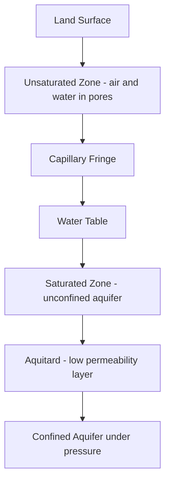
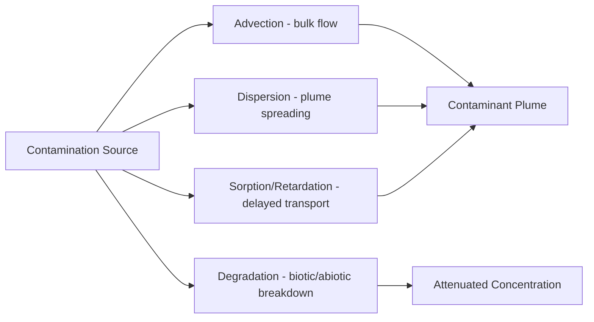

## Groundwater Flow and Contamination

### Overview

Groundwater is water stored and moving within saturated subsurface geologic materials. It represents the largest accessible freshwater reserve on Earth, far exceeding the combined volume of surface lakes and rivers, and it sustains baseflow in streams, wetlands, and ecosystems during dry periods. Understanding how it moves and how it becomes contaminated is central to water resource management, agriculture, and environmental remediation.

### The Subsurface Water Environment

**Zones of Subsurface Water**

- **Unsaturated (vadose) zone**: pore spaces contain both air and water; water here is held by capillary and adsorptive forces
- **Capillary fringe**: a thin transition zone above the water table where water is pulled upward by capillary action
- **Saturated zone**: all pore spaces are filled with water; this is the zone tapped by wells
- **Water table**: the upper surface of the saturated zone, where pressure equals atmospheric pressure

**Aquifer Classification**

- **Unconfined aquifer**: bounded above by the water table; directly recharged by infiltration from the surface
- **Confined (artesian) aquifer**: bounded above and below by impermeable or low-permeability layers (aquitards/aquicludes); water is under pressure and can rise above the top of the aquifer when tapped
- **Perched aquifer**: a localized saturated zone sitting above the regional water table, held up by a discontinuous impermeable lens

### Aquifer Material Properties

**Porosity**

Porosity ($n$) is the fraction of total rock or sediment volume occupied by void space:

$$n = \frac{V_v}{V_t}$$

where $V_v$ is void volume and $V_t$ is total volume. Well-sorted sands and gravels typically have high porosity (25–50%), while unfractured crystalline rocks have very low porosity (<1%). Porosity alone does not determine how easily water moves — a clay can have high porosity but transmit water poorly because pores are small and poorly connected.

**Permeability and Hydraulic Conductivity**

- **Permeability** describes the intrinsic ability of a material to transmit fluid, independent of the fluid's properties
- **Hydraulic conductivity** ($K$) incorporates both the material's permeability and the properties of water (density, viscosity); it is expressed in units of length/time (e.g., m/day)

Typical $K$ values span many orders of magnitude: gravel ($10^{-1}$ to $10^{2}$ cm/s), sand ($10^{-4}$ to $10^{-1}$ cm/s), silt ($10^{-6}$ to $10^{-4}$ cm/s), and unfractured clay/shale (as low as $10^{-11}$ cm/s).

**Specific Yield and Specific Retention**

- **Specific yield** ($S_y$): the fraction of water in an unconfined aquifer that drains freely under gravity
- **Specific retention** ($S_r$): the fraction retained against gravity by molecular and surface tension forces
- Related by: $n = S_y + S_r$

### Groundwater Flow: Darcy's Law

Groundwater flow is governed by **Darcy's Law**, developed empirically by Henry Darcy in 1856. It states that the flow rate through a porous medium is proportional to the hydraulic gradient:

$$Q = -KA\frac{dh}{dl}$$

where:

- $Q$ = volumetric flow rate
- $K$ = hydraulic conductivity
- $A$ = cross-sectional area of flow
- $\frac{dh}{dl}$ = hydraulic gradient (change in head over distance)

Dividing by area gives the **specific discharge** (Darcy velocity), $q = -K\frac{dh}{dl}$, which is not the actual (linear) velocity of water particles. The true average linear velocity through pores is:

$$v = \frac{q}{n_e}$$

where $n_e$ is effective porosity. Because $n_e < 1$, actual groundwater velocity is always greater than the Darcy velocity — a common point of confusion.

**Key Points**

- Groundwater flow is driven by hydraulic head differences, not simply elevation
- Flow direction is from high head to low head, following the steepest hydraulic gradient, and is perpendicular to equipotential lines in isotropic media
- Darcy's Law applies to laminar flow through porous media; it breaks down in highly fractured/karst systems or near pumping wells where flow becomes turbulent

**Hydraulic Head**

Total hydraulic head combines elevation head and pressure head:

$$h = z + \frac{P}{\rho g}$$

where $z$ is elevation, $P$ is fluid pressure, $\rho$ is fluid density, and $g$ is gravitational acceleration. Groundwater flow nets are constructed using lines of equal head (equipotentials) and flow lines drawn perpendicular to them in isotropic aquifers.

### Groundwater Flow Systems and Recharge/Discharge

Groundwater moves through **local, intermediate, and regional flow systems**, nested according to topography. Local systems have short flow paths from a nearby recharge area (e.g., a hilltop) to a nearby discharge area (e.g., an adjacent valley). Regional systems may involve flow paths of tens to hundreds of kilometers and correspondingly longer residence times.

- **Recharge areas**: typically topographic highs where infiltration exceeds evapotranspiration and water moves downward to the water table
- **Discharge areas**: topographic lows (streams, springs, wetlands, lakes) where groundwater re-emerges at the surface

**Example**

A watershed with a ridge and adjacent valley: precipitation infiltrates near the ridge (recharge), flows laterally and downward through the aquifer along a curved flow path, and discharges into the valley stream as baseflow. During dry seasons, this baseflow contribution can sustain stream flow entirely.

### Wells, Pumping, and Cones of Depression

When a well pumps water from an aquifer, the water table (or potentiometric surface in a confined aquifer) is drawn down locally, forming a **cone of depression**. The **Theis equation** and its simplifications (e.g., Cooper-Jacob approximation) are used to predict drawdown over time and distance from a pumping well, based on aquifer **transmissivity** ($T = Kb$, where $b$ is aquifer thickness) and **storativity** ($S$).

Overpumping can cause:

- Well interference (overlapping cones of depression between adjacent wells)
- Land subsidence, particularly in unconsolidated sediments where clay compaction is irreversible
- Saltwater intrusion in coastal aquifers, where the reduction in freshwater head allows denser saline water to migrate inland and upward (described by the **Ghyben-Herzberg relation**, which approximates that for every meter of freshwater above sea level, roughly 40 meters of freshwater extend below sea level, given the density contrast between fresh and saline water)

### Groundwater Contamination

**Common Contaminant Sources**

- **Point sources**: leaking underground storage tanks, landfills, septic systems, industrial spill sites, abandoned mines
- **Non-point (diffuse) sources**: agricultural fertilizer and pesticide application, atmospheric deposition, urban runoff infiltration
- **Saltwater intrusion**: from over-extraction in coastal zones
- **Naturally occurring contaminants**: arsenic, fluoride, and radon mobilized from aquifer minerals under certain geochemical conditions

**Major Contaminant Categories**

- **Nitrate** ($NO_3^-$): from fertilizers and septic systems; highly mobile and poses health risks (e.g., methemoglobinemia in infants)
- **Pathogens**: bacteria and viruses from sewage or septic leachate, generally attenuated by filtration through fine-grained media but can travel significant distances in fractured or karst aquifers
- **Heavy metals**: arsenic, lead, chromium — from both industrial sources and natural mineral dissolution
- **Organic solvents (DNAPLs/LNAPLs)**: chlorinated solvents like trichloroethylene (TCE) are denser than water (DNAPLs) and sink through the aquifer, pooling on low-permeability layers; petroleum hydrocarbons are lighter than water (LNAPLs) and float near the water table
- **Pesticides and herbicides**: variable mobility and persistence depending on soil sorption characteristics

### Contaminant Transport Mechanisms

**Advection**

The bulk movement of dissolved contaminants carried along with flowing groundwater at the average linear velocity $v$. This is typically the dominant transport mechanism in permeable aquifers.

**Dispersion**

Spreading of a contaminant plume beyond simple advective movement, caused by variability in pore-scale velocities and flow path tortuosity. Dispersion is characterized by longitudinal and transverse dispersivity, and it dilutes contaminant concentration while broadening the plume.

**Diffusion**

Molecular diffusion driven by concentration gradients, generally significant only at very low flow velocities or over long time scales, particularly in low-permeability zones like clay lenses.

**Retardation and Sorption**

Many contaminants interact chemically with aquifer solids, temporarily adsorbing onto mineral or organic surfaces. This is quantified by the **retardation factor**:

$$R = 1 + \frac{\rho_b K_d}{n}$$

where $\rho_b$ is bulk density, $K_d$ is the distribution coefficient (partitioning between solid and dissolved phases), and $n$ is porosity. A higher $R$ means the contaminant moves more slowly relative to the groundwater itself — this is why nitrate (low sorption, $R \approx 1$) migrates almost as fast as the water, while many organic compounds and metals move much more slowly.

**Degradation and Attenuation**

Natural attenuation processes include biodegradation (microbial breakdown, especially of petroleum hydrocarbons and some solvents), chemical transformation (e.g., redox reactions), and radioactive decay for certain isotopes. These processes, combined with dispersion and sorption, are collectively termed **natural attenuation** and can reduce contaminant concentrations over distance and time without active intervention. [Inference: rates of natural attenuation are highly site-specific and depend on microbial community composition, redox conditions, and contaminant chemistry, so generalized timeframes should be treated cautiously.]

### Contaminant Plume Behavior

<svg xmlns="http://www.w3.org/2000/svg" viewBox="0 0 700 320">
<title>Groundwater Contaminant Plume Migration (svg_diagram)</title>
<rect x="0" y="0" width="700" height="320" fill="#f4f1ea" />
<text x="350" y="25" font-size="16" text-anchor="middle" font-family="Arial" fill="#333">Groundwater Contaminant Plume Migration (svg_diagram)</text>

<rect x="50" y="60" width="600" height="15" fill="#8a6d3b" />
<text x="55" y="55" font-size="12" font-family="Arial" fill="#333">Land Surface</text>

<rect x="50" y="75" width="600" height="40" fill="#e8dcc0" />
<text x="55" y="98" font-size="11" font-family="Arial" fill="#555">Unsaturated Zone</text>

<line x1="50" y1="115" x2="650" y2="130" stroke="#2266aa" stroke-width="2" stroke-dasharray="6,3" />
<text x="500" y="112" font-size="11" font-family="Arial" fill="#2266aa">Water Table</text>

<rect x="50" y="115" width="600" height="150" fill="#cfe2f3" />
<text x="55" y="270" font-size="11" font-family="Arial" fill="#333">Saturated Zone (Aquifer)</text>

<rect x="50" y="265" width="600" height="30" fill="#7a7a7a" />
<text x="55" y="285" font-size="11" font-family="Arial" fill="#eee">Aquitard (low permeability)</text>

<rect x="120" y="45" width="30" height="20" fill="#b33" stroke="#700" stroke-width="1" />
<text x="90" y="42" font-size="10" font-family="Arial" fill="#700">Leaking Source</text>

<path d="M135,120 C160,150 220,160 300,175 C400,195 480,210 560,230 C580,236 600,245 610,255 L590,255 C570,245 540,232 460,212 C380,195 300,180 220,165 C170,155 145,140 135,120 Z" fill="#c26b6b" fill-opacity="0.55" stroke="#a33" stroke-width="1.5" />
<text x="330" y="200" font-size="12" font-family="Arial" fill="#600" font-weight="bold">Contaminant Plume</text>

<line x1="80" y1="200" x2="640" y2="200" stroke="#003366" stroke-width="1.5" marker-end="url(#arrow)" />
<text x="330" y="215" font-size="10" font-family="Arial" fill="#003366">Groundwater Flow Direction</text>

<rect x="250" y="60" width="6" height="210" fill="#444" />
<text x="230" y="55" font-size="10" font-family="Arial" fill="#333">MW-1</text>
<rect x="420" y="60" width="6" height="210" fill="#444" />
<text x="400" y="55" font-size="10" font-family="Arial" fill="#333">MW-2</text>
<rect x="580" y="60" width="6" height="210" fill="#444" />
<text x="560" y="55" font-size="10" font-family="Arial" fill="#333">MW-3</text>
</svg>

### Investigation and Remediation Approaches

**Site Characterization**

- Installation of monitoring well networks to determine plume extent, flow direction, and concentration gradients
- Aquifer testing (pump tests, slug tests) to determine $K$, $T$, and $S$
- Geophysical surveys (electrical resistivity, ground-penetrating radar) to map subsurface stratigraphy
- Tracer studies to empirically determine flow velocity and dispersion characteristics

**Remediation Technologies**

- **Pump-and-treat**: extraction wells remove contaminated water for surface treatment; effective for dissolved-phase plumes but often slow for source-zone cleanup, especially with sorbed or DNAPL contamination
- **Permeable reactive barriers (PRBs)**: subsurface walls of reactive material (e.g., zero-valent iron) installed across a plume's flow path to passively degrade or immobilize contaminants
- **In-situ bioremediation**: injecting nutrients or oxygen to stimulate microbial degradation of organic contaminants
- **Air sparging / soil vapor extraction**: used for volatile organic compounds, injecting air below the water table (sparging) and extracting vapors from the vadose zone
- **Monitored natural attenuation (MNA)**: relying on and verifying natural degradation processes with long-term monitoring, often used where risk is low and remediation costs would be disproportionate

**Preventive Management**

- Wellhead protection zones and aquifer vulnerability mapping (e.g., DRASTIC index, which scores Depth to water, Recharge, Aquifer media, Soil media, Topography, Impact of vadose zone, and hydraulic Conductivity)
- Regulation of underground storage tanks, septic system siting, and agricultural best management practices
- Groundwater quality monitoring programs under frameworks such as the U.S. Safe Drinking Water Act or equivalent national regulations [Unverified: specific regulatory frameworks and standards vary by country and are subject to legislative change]

### Worked Example: Estimating Contaminant Travel Time

Given an aquifer with hydraulic conductivity $K = 10$ m/day, hydraulic gradient $\frac{dh}{dl} = 0.005$, and effective porosity $n_e = 0.25$:

Specific discharge:

$$q = K\frac{dh}{dl} = 10 \times 0.005 = 0.05 \text{ m/day}$$

Average linear (seepage) velocity:

$$v = \frac{q}{n_e} = \frac{0.05}{0.25} = 0.2 \text{ m/day}$$

For a contaminant with retardation factor $R = 2$ (moderate sorption), the effective contaminant velocity is:

$$v_c = \frac{v}{R} = \frac{0.2}{2} = 0.1 \text{ m/day}$$

Over a 500-meter distance to a drinking water well, the estimated travel time is:

$$t = \frac{500}{0.1} = 5000 \text{ days} \approx 13.7 \text{ years}$$

**Conclusion**

Groundwater flow is governed by predictable physical laws (Darcy's Law) shaped by aquifer geometry, material properties, and hydraulic gradients, while contaminant behavior in that same system depends on an interplay of advection, dispersion, sorption, and degradation. Effective groundwater protection requires integrating hydrogeologic characterization with contaminant-specific transport modeling, since travel times and remediation feasibility can vary from days to decades depending on aquifer type and pollutant chemistry.

**Related Topics**

- Aquifer testing methods (pump tests, slug tests, Theis and Cooper-Jacob solutions)
- Karst hydrogeology and preferential flow in fractured rock
- Saltwater intrusion modeling in coastal aquifers
- Vadose zone hydrology and infiltration modeling
- Groundwater-surface water interaction and baseflow separation
- Geochemistry of naturally occurring groundwater contaminants (arsenic, fluoride, radon)
- Numerical groundwater flow modeling (e.g., finite-difference and finite-element approaches)
- Groundwater sustainability and managed aquifer recharge