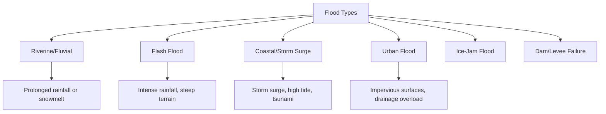
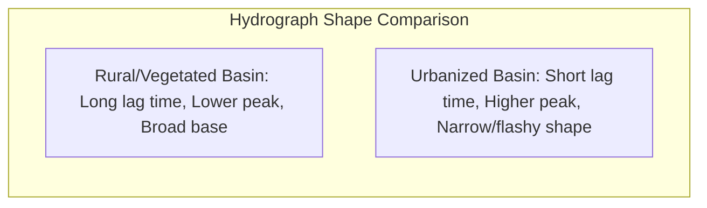
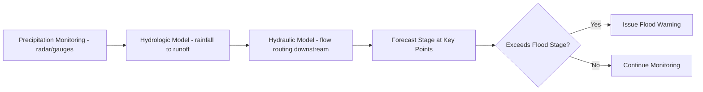

## Floods and Flood Hazards

### Overview

A flood is the temporary inundation of normally dry land by water, occurring when the volume of water in a river, coastal zone, or drainage system exceeds the capacity of its channel or containment system. Floods are among the most frequent and costly natural hazards worldwide, driven by a combination of meteorological, hydrological, and human land-use factors.

### Types of Floods

**Riverine (Fluvial) Floods**

Occur when a river's discharge exceeds channel capacity and water spreads onto the adjacent floodplain. These typically develop over hours to days and are associated with prolonged or intense rainfall, snowmelt, or a combination of both.

**Flash Floods**

Rapid-onset floods occurring within minutes to a few hours of intense rainfall or a dam/levee failure, typically in small, steep watersheds or urbanized catchments with limited infiltration capacity. Flash floods carry high destructive energy due to the speed of rise and associated debris load.

**Coastal Floods**

Caused by storm surge, high tides, or tsunami wave action pushing seawater onto low-lying coastal land. Often exacerbated by high astronomical tides ("king tides") coinciding with storm events.

**Urban Floods**

Result from impervious surfaces (pavement, rooftops) overwhelming stormwater drainage infrastructure, causing localized ponding and flash flooding even from moderate rainfall.

**Ice-Jam Floods**

Occur when river ice breaks up and accumulates, damming flow and causing rapid upstream water level rise; common in high-latitude and temperate rivers during spring thaw.

**Dam and Levee Failure Floods**

Sudden, often catastrophic floods resulting from structural failure of engineered water-retention structures, releasing large volumes of stored water rapidly.

### Hydrologic Drivers of Flooding

**Precipitation Characteristics**

Flood magnitude is closely tied to rainfall intensity, duration, and spatial distribution over a watershed. A given total rainfall volume produces different flood responses depending on whether it falls as a brief intense burst or a prolonged steady event.

**Antecedent Soil Moisture**

Watersheds with already-saturated soils (from prior rainfall or snowmelt) generate greater runoff for a given storm, since infiltration capacity is reduced. This is a major factor in multi-day flood events where later storms produce disproportionately larger floods than earlier ones of similar intensity.

**Watershed Characteristics**

- **Drainage basin size and shape**: larger basins generally have longer, more attenuated flood responses; elongated basins tend to produce lower, more prolonged peaks than compact, circular basins
- **Slope and relief**: steep terrain accelerates runoff concentration time
- **Land cover**: vegetated and forested land increases interception and infiltration, reducing peak runoff; urbanization and deforestation increase runoff volume and peak flow while shortening the time to peak
- **Drainage density**: densely channeled basins concentrate flow more rapidly

**The Hydrograph**

A **hydrograph** plots discharge over time at a given point in a stream, showing the rising limb (increasing discharge), peak discharge, and recession limb (declining discharge) in response to a rainfall event.

Key hydrograph parameters:

- **Lag time**: interval between peak rainfall intensity and peak discharge
- **Time to peak**: interval from the start of runoff to peak discharge
- **Base flow**: the sustained groundwater contribution to streamflow, distinct from the rapid storm-driven surface runoff component

Urbanization characteristically shortens lag time and increases peak discharge relative to an equivalent undeveloped watershed, because impervious surfaces route water to channels faster and reduce infiltration.

### Flood Frequency and Recurrence Interval

Flood magnitude is statistically characterized using **recurrence interval** (return period) analysis, which estimates the average number of years between floods of a given magnitude or greater at a specific location, based on historical discharge records.

The recurrence interval ($T$) is calculated using the Weibull formula:

$$T = \frac{n+1}{m}$$

where $n$ is the number of years of record and $m$ is the rank of the flood event (ranked from largest = 1 to smallest).

The **annual exceedance probability (AEP)** is the inverse of the recurrence interval:

$$P = \frac{1}{T}$$

For example, a "100-year flood" has a 1% chance of being equaled or exceeded in any given year — it does **not** mean such a flood occurs only once every 100 years, and multiple 100-year floods can occur in consecutive years. [Inference: this statistical framework assumes stationarity in the underlying climate and watershed conditions; where land use change or climate trends alter flood regimes, historical recurrence intervals become less reliable predictors of future risk.]

**Example**

A river with 50 years of discharge records has its largest flood ranked $m = 1$:

$$T = \frac{50+1}{1} = 51 \text{ years}$$

This flood has an annual exceedance probability of $\frac{1}{51} \approx 2\%$.

### Floodplain Mapping and Zonation

Floodplains are mapped using hydraulic modeling combined with topographic data (often LiDAR-derived digital elevation models) to delineate zones of varying flood risk:

- **Floodway**: the channel and adjacent area that must remain open to convey flood discharge without significantly increasing flood heights
- **Flood fringe**: the area beyond the floodway that is still inundated during the design flood but with lower velocity
- **100-year floodplain (1% annual chance floodplain)**: the area with a 1% annual probability of flooding, commonly used as the regulatory baseline for floodplain management and insurance in many countries
- **500-year floodplain (0.2% annual chance floodplain)**: used for higher-risk critical infrastructure siting

**Key Points**

- Floodplain maps are probabilistic estimates based on historical data, modeling assumptions, and channel/watershed conditions at the time of mapping
- Maps require periodic updates as land use, channel morphology, and climate patterns change
- Floodplain boundaries can shift substantially after major land-use changes (urbanization, deforestation, levee construction) upstream

### Coastal Flooding: Storm Surge and Tsunami

**Storm Surge**

An abnormal rise in sea level generated by a storm's wind stress pushing water toward shore, combined with reduced atmospheric pressure at the storm's center. Surge height depends on:

- Storm intensity (wind speed, central pressure)
- Storm size and forward speed
- Angle of approach relative to the coastline
- Coastal bathymetry (shallow, gently sloping continental shelves amplify surge height)
- Timing relative to astronomical tide

**Tsunami**

Series of ocean waves generated by sudden displacement of a large water volume, typically from submarine earthquakes, but also landslides or volcanic activity. Unlike wind-driven waves, tsunamis have very long wavelengths and travel at high speed in open ocean, then dramatically slow and increase in height as they approach shallow coastal water (wave shoaling).

### Human and Environmental Flood Hazard Factors

**Levees and Their Paradox**

Levees constrain a river to its channel, protecting adjacent land, but by preventing lateral floodplain spreading they can increase flood stage (height) for a given discharge and transfer flood risk downstream. Levee failure or overtopping, when it occurs, can be more catastrophic than an unleveed flood because it happens suddenly and at higher water levels than would otherwise occur — sometimes termed the "**levee effect**," the paradox of flood control infrastructure encouraging floodplain development that increases long-term exposure.

**Land Use Change**

Urbanization, wetland drainage, and deforestation reduce a watershed's natural water storage and infiltration capacity, increasing runoff volume and peak discharge for a given rainfall event. Loss of wetlands specifically removes natural flood-attenuation capacity, since wetlands act as temporary storage basins that slow and reduce peak flows.

**Climate Considerations**

[Inference: warming atmospheric temperatures increase atmospheric water vapor holding capacity, which is broadly expected by climate science to intensify precipitation extremes in many regions; however, the specific magnitude and direction of flood risk change varies significantly by region, watershed characteristics, and the balance between precipitation and evapotranspiration changes, so localized projections should be treated as region-specific rather than universal.]

### Flood Hazard Assessment and Mitigation

**Structural Measures**

- Levees and floodwalls
- Dams and reservoirs for flood storage and controlled release
- Channelization and channel widening/deepening
- Diversion channels and floodways (engineered overflow routes)

**Non-Structural Measures**

- Floodplain zoning and land-use regulation restricting development in high-hazard zones
- Flood insurance programs that price risk and incentivize mitigation
- Early warning systems combining precipitation forecasting, real-time stream gauge networks, and hydrologic/hydraulic modeling
- Floodproofing of structures (elevation, wet/dry floodproofing techniques)
- Wetland restoration and natural infrastructure approaches that restore floodplain storage capacity

**Example**

A flood early warning system for a river basin typically integrates: (1) upstream rain gauge and radar precipitation estimates, (2) real-time stream gauge discharge data, (3) a hydrologic model converting rainfall to runoff, and (4) a hydraulic model routing that runoff downstream to predict arrival time and stage at forecast points, issuing alerts when forecast stage exceeds flood-stage thresholds.

### Flood Stage Terminology

- **Action stage**: level at which monitoring agencies begin heightened observation
- **Flood stage**: level at which water begins to cause damage or pose hazard to life/property in the affected reach
- **Moderate/major flood stage**: escalating thresholds tied to increasing extent and severity of expected impacts, as defined by local hydrologic agencies

### Worked Example: Peak Flow and Return Period Estimation

Given a set of annual peak discharge records ranked in descending order, with the largest flood being 8,500 m³/s over a 40-year record:

$$T = \frac{n+1}{m} = \frac{40+1}{1} = 41 \text{ years}$$

$$P = \frac{1}{41} \approx 2.4\% \text{ annual exceedance probability}$$

If a proposed levee is designed to contain the 1% AEP flood (100-year flood) but the historical dataset only reliably characterizes floods with a recurrence interval up to roughly the length of record, the 100-year flood magnitude must be estimated via statistical extrapolation (e.g., fitting a Log-Pearson Type III distribution to the annual peak series), introducing greater uncertainty than for floods within the observed record range. [Unverified: specific extrapolation methodology and required statistical distributions vary by national engineering standards and agency guidelines.]

**Conclusion**

Floods arise from the interaction of meteorological triggers, watershed hydrology, and human modification of the landscape, ranging from slow-developing riverine floods to sudden flash floods and coastal surge events. Effective flood hazard management combines probabilistic hazard mapping, structural and non-structural mitigation, and real-time forecasting, while recognizing that historical flood frequency statistics carry inherent uncertainty and can shift as land use and climate conditions evolve.

**Related Topics**

- Hydrograph analysis and unit hydrograph theory
- Floodplain hydraulic modeling (steady vs. unsteady flow models)
- Storm surge modeling and coastal vulnerability assessment
- Dam safety and reservoir flood-control operations
- Urban stormwater management and green infrastructure
- Flood risk communication and early warning system design
- Paleoflood hydrology and long-term flood record reconstruction
- Wetland ecosystem services in flood attenuation