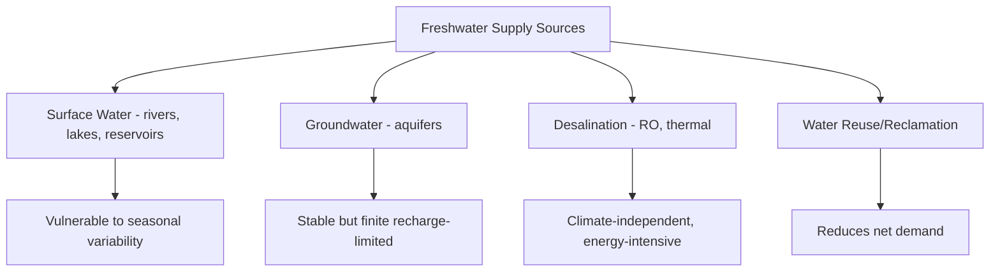
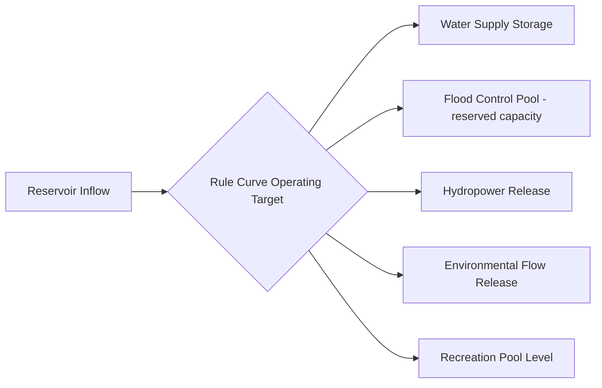

## Water Resource Management

### Overview

Water resource management encompasses the planning, development, distribution, and stewardship of freshwater resources to balance human needs (domestic, agricultural, industrial, energy) against ecological sustainability and long-term supply security. It integrates hydrology, engineering, economics, law, and policy to address the growing gap between finite freshwater availability and rising global demand.

### The Water Budget Framework

Water resource management is grounded in the **water balance equation**, which accounts for inflows, outflows, and storage change in a defined system (watershed, aquifer, or reservoir):

$$P = ET + R + \Delta S$$

where:

- $P$ = precipitation (input)
- $ET$ = evapotranspiration (loss to atmosphere)
- $R$ = runoff (surface and subsurface outflow)
- $\Delta S$ = change in storage (soil moisture, groundwater, surface reservoirs)

Effective management requires quantifying each term at the relevant spatial and temporal scale, since water availability varies seasonally and interannually even within a single basin.

### Sources of Freshwater Supply

**Surface Water**

Rivers, lakes, and reservoirs provide the majority of water used for irrigation, municipal supply, and industry in most regions. Surface water is directly influenced by precipitation patterns and is vulnerable to seasonal and drought-driven variability, but is generally easier to monitor and treat than groundwater.

**Groundwater**

Aquifers provide a more temporally stable source due to large storage volumes and slow response times, making them critical during drought periods when surface water is scarce. However, groundwater extraction rates exceeding natural recharge rates ("aquifer mining") lead to long-term water table decline, as discussed in groundwater flow topics.

**Desalination**

Removal of salts from seawater or brackish water, primarily via:

- **Reverse osmosis (RO)**: pressure-driven filtration through semipermeable membranes; the dominant modern technology due to lower energy requirements relative to thermal methods
- **Multi-stage flash distillation / multi-effect distillation**: thermal evaporation-condensation processes, historically more common in energy-rich, water-scarce regions

Desalination provides a climate-independent supply but carries significant energy costs and produces concentrated brine discharge that requires careful disposal to avoid localized marine ecosystem impacts.

**Water Reuse (Reclaimed Water)**

Treated wastewater reused for irrigation, industrial processes, groundwater recharge, or (with advanced treatment) potable supply ("indirect potable reuse" and increasingly "direct potable reuse"). Reuse reduces demand on freshwater sources and reduces discharge volumes to receiving waters.

### Water Demand Sectors

**Agricultural Use**

Globally the largest consumptive use of freshwater, primarily through irrigation. Irrigation efficiency varies substantially by method:

- **Surface/flood irrigation**: lowest efficiency (often 40–60%), significant losses to evaporation and deep percolation
- **Sprinkler irrigation**: moderate efficiency (65–75%)
- **Drip/micro-irrigation**: highest efficiency (85–95%), delivering water directly to the root zone with minimal loss

**Municipal and Domestic Use**

Includes potable supply, sanitation, and landscape irrigation. Demand is influenced by population density, climate, pricing structures, and conservation infrastructure (e.g., low-flow fixtures, leak detection programs).

**Industrial Use**

Includes process water, cooling water (notably for thermoelectric power generation), and manufacturing. Industrial water demand can be substantially reduced through recycling within closed-loop systems.

**Environmental Flows**

Water intentionally allocated to sustain river ecosystems, wetlands, and downstream water quality, increasingly recognized as a legitimate demand category rather than a residual after other uses are satisfied.

**Key Points**

- Consumptive use (water removed from the system, e.g., via evapotranspiration in crops) differs from non-consumptive use (water returned to the system after use, e.g., most municipal wastewater discharge)
- Water stress assessments must account for both total withdrawal and consumptive loss, since a highly consumptive use reduces downstream availability more than a use with high return flow

### Water Allocation Systems and Governance

**Riparian Rights**

A legal doctrine (common in humid regions, e.g., much of the eastern United States and many countries with British-derived common law) granting water use rights to landowners adjacent to a water body, generally proportional to their frontage, without requiring the water to leave the watershed.

**Prior Appropriation**

A doctrine common in arid and semi-arid regions (e.g., the western United States) based on the principle of "first in time, first in right" — the earliest established water right holder has priority claim during shortages, regardless of land adjacency, and water can be transferred away from its source ("beneficial use" doctrine).

**Water Markets and Trading**

Systems allowing transfer of water rights or allocations between users (e.g., agriculture to municipal, or between regions), intended to move water to higher-value uses during scarcity. Effectiveness depends on well-defined property rights, monitoring infrastructure, and regulatory oversight to prevent third-party impacts (e.g., harm to other water users or ecosystems from a transfer).

**Integrated Water Resources Management (IWRM)**

A widely referenced management framework promoting coordinated development and management of water, land, and related resources to maximize economic and social welfare without compromising ecosystem sustainability. IWRM emphasizes basin-scale (rather than purely administrative-boundary) planning, stakeholder participation, and cross-sectoral coordination. [Unverified: specific institutional implementation of IWRM varies substantially by country and river basin authority structure.]

### Reservoir Operations and Multi-Purpose Management

Reservoirs are managed to balance often-competing objectives:

- **Water supply storage**: maintaining minimum pool levels for drought reliability
- **Flood control**: reserving capacity ("flood control pool") to capture peak inflows and attenuate downstream flood peaks
- **Hydropower generation**: releasing water through turbines, often requiring specific timing and flow rates tied to energy demand
- **Recreation**: maintaining stable pool levels for boating and fishing
- **Environmental flow requirements**: releasing minimum flows to support downstream aquatic ecosystems

These objectives frequently conflict — flood control favors low reservoir levels prior to wet seasons to preserve capacity, while water supply and recreation favor high levels — requiring **rule curves** that specify target storage levels by time of year, balancing these competing demands based on historical inflow patterns and risk tolerance.

### Drought Management

**Drought Classification**

- **Meteorological drought**: precipitation deficit relative to long-term average
- **Agricultural drought**: soil moisture deficit sufficient to stress crops
- **Hydrological drought**: below-normal streamflow, reservoir, or groundwater levels
- **Socioeconomic drought**: water shortage affecting economic activity and human wellbeing, occurring when demand exceeds available supply during a hydrological or meteorological drought

**Drought Response Measures**

- Water use restrictions (tiered, escalating with drought severity)
- Drought contingency planning with pre-defined triggers tied to reservoir levels or streamflow indices
- Emergency supply augmentation (temporary interbasin transfers, emergency desalination, groundwater banking withdrawal)
- Demand-side conservation incentives (tiered pricing, rebate programs for efficient fixtures/landscaping)

### Water Quality Management

Water resource management is inseparable from water quality protection, since contamination effectively reduces usable supply:

- **Point source regulation**: permitting and monitoring of discrete discharge points (industrial outfalls, wastewater treatment plants)
- **Non-point source management**: best management practices for diffuse agricultural and urban runoff pollution, which is generally harder to regulate directly than point sources
- **Source water protection**: land-use controls around reservoirs, well fields, and river intakes to minimize contamination risk before treatment
- **Watershed-based management**: coordinating water quality goals across an entire drainage basin, recognizing that upstream land use directly affects downstream water quality and treatment costs

### Conjunctive Use Management

The coordinated management of surface water and groundwater as a single integrated resource, typically involving:

- Using surface water preferentially during wet periods while allowing aquifer recharge
- Relying more heavily on groundwater during dry periods, allowing it to serve as a drought buffer
- **Managed aquifer recharge (MAR)**: deliberately infiltrating or injecting surface water (often surplus wet-season flow) into aquifers for later recovery, using methods such as spreading basins, recharge wells, or aquifer storage and recovery (ASR) systems

Conjunctive use can substantially increase overall system yield and drought resilience compared to managing either source independently. [Inference: the magnitude of yield improvement is highly site-specific, depending on aquifer storage capacity, recharge rates, and the timing correlation between surface water surplus and groundwater demand.]

### Worked Example: Water Supply-Demand Balance

A municipal utility serves a population with the following annual water balance:

- Available yield from reservoir system: 50 million cubic meters (MCM)/year
- Available sustainable groundwater yield: 15 MCM/year
- Current total demand: 55 MCM/year
- Projected demand growth: 2% per year

Current total supply:

$$50 + 15 = 65 \text{ MCM/year}$$

Current supply margin:

$$65 - 55 = 10 \text{ MCM/year surplus}$$

Projecting demand forward, the number of years until demand reaches current supply capacity:

$$55 \times (1.02)^n = 65$$

$$n = \frac{\ln(65/55)}{\ln(1.02)} \approx \frac{0.1671}{0.0198} \approx 8.4 \text{ years}$$

This indicates the utility has approximately 8 years before demand exceeds current firm supply, absent new supply development, demand reduction measures, or reassessment of the growth assumption.

**Conclusion**

Water resource management requires balancing finite and variable supply against growing and competing demands, using a combination of engineering infrastructure, legal allocation frameworks, and adaptive operational strategies. Effective management increasingly emphasizes integrated approaches — coordinating surface water and groundwater, balancing multiple reservoir objectives, and treating water quality and quantity as interconnected challenges — rather than managing each water source or use sector in isolation.

**Related Topics**

- Interbasin water transfer projects and their ecological/political tradeoffs
- Water pricing structures and demand-side conservation economics
- Transboundary water conflict and international river basin agreements
- Climate change impacts on water supply reliability and planning
- Virtual water and water footprint accounting in trade
- Stormwater harvesting and urban water sensitive design
- Groundwater banking and aquifer storage and recovery (ASR) systems
- Water-energy nexus (energy requirements of water treatment, conveyance, and desalination)