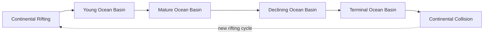

## Ocean Basin Formation and Seafloor Topography

### Overview

Ocean basins are the large depressions in Earth's lithosphere occupied by seawater, formed and continuously reshaped through plate tectonic processes. Seafloor topography (bathymetry) refers to the three-dimensional relief of the ocean floor, ranging from shallow continental shelves to the deepest oceanic trenches. Together, these concepts explain both the origin of ocean basins and the physical features that characterize them.

### Theoretical Foundation: Plate Tectonics and Seafloor Formation

**Key Points**

- Ocean basins form primarily through seafloor spreading at divergent plate boundaries
- The theory of plate tectonics, consolidated in the 1960s, unified earlier concepts of continental drift (Wegener, 1912) and seafloor spreading (Hess, 1962)
- Oceanic lithosphere is created at mid-ocean ridges and destroyed at subduction zones, giving rise to the concept of the "Wilson Cycle" — the lifecycle of an ocean basin from rifting to closure

**The Wilson Cycle stages:**

1. **Continental rifting** — Extensional stress thins continental crust (e.g., East African Rift)
2. **Young ocean basin** — Narrow seaway forms as rifting continues (e.g., Red Sea)
3. **Mature ocean basin** — Full-fledged ocean with passive margins (e.g., Atlantic Ocean)
4. **Declining ocean basin** — Subduction begins, consuming oceanic crust (e.g., Pacific margins)
5. **Terminal/closing basin** — Narrow remnant sea (e.g., Mediterranean Sea)
6. **Continental collision** — Ocean basin closes entirely; orogeny (mountain building) occurs (e.g., Himalayas from closure of Tethys Sea)

### Mechanisms of Ocean Basin Formation

#### 1. Seafloor Spreading

At mid-ocean ridges, magma rises from the asthenosphere to fill the gap created by diverging plates, cooling to form new basaltic oceanic crust. This process is symmetric on either side of the ridge axis, producing mirror-image patterns of crust.

**Key evidence:**

- **Magnetic striping**: Alternating bands of normal and reversed magnetic polarity, symmetric about the ridge axis, recorded in cooling basalt as it passes through the Curie point
- **Age progression**: Oceanic crust age increases systematically with distance from the ridge axis, confirmed by deep-sea drilling (Deep Sea Drilling Project/DSDP)
- **Heat flow**: Highest heat flow values occur at ridge crests, decreasing with crustal age

The age-depth relationship of oceanic lithosphere follows a well-established thermal subsidence model:

$$d(t) = d_0 + c\sqrt{t}$$

where $d(t)$ is depth at age $t$, $d_0$ is ridge-crest depth, and $c$ is an empirical cooling constant (approximately 350 m/Myr$^{0.5}$ for young lithosphere, per the half-space cooling model).

#### 2. Rifting and Continental Breakup

Ocean basins begin as continental rifts driven by mantle upwelling (plume-related) or far-field tectonic stresses (plate boundary forces). Rifting thins the lithosphere until breakup occurs, marked by a **breakup unconformity** in the geologic record, after which true oceanic crust begins forming.

#### 3. Subduction and Basin Destruction

Where oceanic lithosphere is denser than underlying asthenosphere (typically once it exceeds ~180 Ma in age), it subducts beneath adjacent plates, recycling crust into the mantle. This limits the maximum age of oceanic crust found today (~200 Ma, Jurassic), in contrast to continental crust, which can exceed 4 billion years.

### Major Bathymetric Provinces

Seafloor topography is conventionally divided into large-scale provinces, each with distinct origin and morphology.

#### Continental Margins

**Passive margins** (e.g., U.S. Atlantic coast):

- Formed by rifting, tectonically quiescent
- Include continental shelf, continental slope, and continental rise
- Sediment-rich, low seismicity

**Active margins** (e.g., U.S. Pacific coast, Andean margin):

- Associated with subduction zones or transform faults
- Narrow or absent shelf, steep slope, often lack a continental rise
- High seismicity and volcanism

| Feature | Passive Margin | Active Margin |
| --- | --- | --- |
| Tectonic setting | Divergent (rifted, now intraplate) | Convergent or transform |
| Shelf width | Wide (up to hundreds of km) | Narrow or absent |
| Seismicity | Low | High |
| Example | East Coast, USA | West Coast, South America |

#### Continental Shelf, Slope, and Rise

- **Continental shelf**: Gently sloping (~0.1°) submerged extension of the continent, average depth ~130 m at the shelf break, width varies from <1 km to >1000 km
- **Continental slope**: Steeper gradient (3–6°) marking the true edge of the continental crust; often dissected by submarine canyons
- **Continental rise**: Gently sloping accumulation of sediment (turbidites) at the base of the slope, formed by turbidity currents and contour currents

#### Abyssal Plains

Extremely flat regions (slopes <1:1000) of the deep ocean floor, typically at 4,000–6,000 m depth, formed by sediment blanketing pre-existing rugged oceanic crust. Abyssal plains are more extensive in the Atlantic and Indian Oceans than the Pacific, because the Pacific's proximity to subduction trenches traps terrigenous sediment before it reaches the deep basin.

#### Mid-Ocean Ridges

- Longest mountain chain on Earth (~65,000 km), forming a continuous submarine network
- Rise 2,000–3,000 m above adjacent abyssal plains
- Characterized by a central **rift valley** at slow-spreading ridges (e.g., Mid-Atlantic Ridge, <5 cm/yr) versus a smoother **axial high** at fast-spreading ridges (e.g., East Pacific Rise, >9 cm/yr)
- Host hydrothermal vent systems and associated chemosynthetic ecosystems

#### Oceanic Trenches

- Deepest points in the ocean, formed at subduction zones where oceanic lithosphere bends and descends
- Mariana Trench (Challenger Deep) reaches approximately 10,935 m, the deepest known point on Earth [Unverified — precise figure varies by survey method and dataset, typically cited between 10,902–10,994 m]
- Asymmetric cross-section, with steeper slope on the overriding plate side

#### Seamounts, Guyots, and Volcanic Chains

- **Seamounts**: Submarine volcanoes rising >1,000 m from the seafloor without breaching the surface
- **Guyots** (tablemounts): Flat-topped seamounts, truncated by wave erosion when they were near sea level, then subsided below the surface as the lithosphere cooled and thermally contracted
- **Hotspot chains**: Linear volcanic island/seamount chains formed as a plate moves over a stationary mantle plume (e.g., Hawaiian–Emperor Seamount Chain), providing a record of plate motion direction and rate

#### Fracture Zones and Transform Faults

- **Transform faults**: Active strike-slip faults offsetting mid-ocean ridge segments
- **Fracture zones**: Inactive scars extending from transform faults into older crust on both sides, marking former plate boundary offsets; visible as linear topographic and gravity anomalies

### Global Bathymetric Data and Measurement Techniques

**Key Points**

- **Echo sounding (SONAR)**: Single-beam and multibeam systems measure water depth via acoustic travel time
- **Satellite altimetry**: Measures subtle sea-surface height variations caused by gravitational anomalies from seafloor topography, enabling global bathymetric mapping even in unsurveyed areas (e.g., Smith & Sandwell global bathymetry model)
- **GEBCO (General Bathymetric Chart of the Oceans)**: International collaborative project producing authoritative global bathymetric grids
- **Seismic reflection profiling**: Used to image sediment layers and crustal structure beneath the seafloor

The relationship between two-way acoustic travel time and depth in echo sounding is:

$$d = \frac{v \cdot t}{2}$$

where $d$ is depth, $v$ is the speed of sound in seawater (~1,500 m/s, varying with temperature, salinity, and pressure), and $t$ is two-way travel time.

### Ocean Basin Depth Distribution

**Hypsometric curve**: A cumulative frequency plot of Earth's surface elevation showing two dominant modes — continental platforms (~0 to 1 km above sea level) and ocean basin floors (~4–5 km below sea level) — reflecting the bimodal density/thickness contrast between continental (felsic, ~2.7 g/cm³) and oceanic (mafic, ~3.0 g/cm³) crust.

Average depth of the world ocean is approximately 3,682 m, with the following approximate volumetric distribution:

- Continental shelf and slope: ~15–20%
- Abyssal plains and hills: ~40–50%
- Mid-ocean ridges: ~30%
- Trenches: <2%

### Illustrative Diagram: Ocean Basin Cross-Section

<svg xmlns="http://www.w3.org/2000/svg" viewBox="0 0 900 400">
<text x="450" y="25" font-size="16" text-anchor="middle" font-weight="bold">Generalized Ocean Basin Cross-Section (svg_diagram)</text>
<rect x="0" y="30" width="900" height="370" fill="#cfe8f3" />
<polygon points="0,150 150,150 250,220 900,270 900,400 0,400" fill="#c2b280" />
<polygon points="250,220 320,260 420,235 500,150 580,235 680,260 900,270 900,400 250,400" fill="#8a7350" opacity="0.6" />
<line x1="0" y1="150" x2="150" y2="150" stroke="black" stroke-width="1.5" />
<text x="60" y="140" font-size="12">Continental Shelf</text>
<line x1="150" y1="150" x2="250" y2="220" stroke="black" stroke-width="1.5" />
<text x="140" y="195" font-size="12">Slope</text>
<line x1="250" y1="220" x2="420" y2="235" stroke="black" stroke-width="1.5" />
<text x="270" y="250" font-size="12">Continental Rise</text>
<line x1="420" y1="235" x2="480" y2="270" stroke="black" stroke-width="1.5" />
<text x="380" y="290" font-size="12">Abyssal Plain</text>
<polygon points="500,150 540,235 460,235" fill="#6b4226" />
<text x="500" y="140" font-size="12" text-anchor="middle">Mid-Ocean Ridge</text>
<rect x="580" y="235" width="100" height="25" fill="#c2b280" opacity="0.6" />
<text x="630" y="252" font-size="11" text-anchor="middle">Abyssal Hills</text>
<polygon points="700,270 730,380 760,270" fill="#4a4a4a" />
<text x="730" y="260" font-size="12" text-anchor="middle">Seamount</text>
<polygon points="850,270 870,390 890,270" fill="#333333" />
<text x="870" y="260" font-size="12" text-anchor="middle">Trench</text>
<line x1="0" y1="150" x2="900" y2="150" stroke="#4477aa" stroke-dasharray="4,4" />
<text x="10" y="145" font-size="11" fill="#225588">Sea Level</text>
</svg>

### Example: Applying the Age-Depth Relationship

**Example**

Given oceanic crust with an age of 25 Myr, and using a ridge-crest depth $d_0$ of 2,500 m and cooling constant $c$ = 350 m/Myr$^{0.5}$:

$$d(25) = 2500 + 350\sqrt{25} = 2500 + 1750 = 4250 \text{ m}$$

This predicts a seafloor depth of approximately 4,250 m — consistent with observed abyssal depths at this crustal age, illustrating how thermal subsidence models are used to estimate seafloor depth from magnetic-anomaly-derived crustal ages. [Inference: exact depth will vary with local sediment loading and regional thermal anomalies]

### Common Misconceptions

- Ocean basins are not simply "bowls filled with water" — they are dynamic features actively created and destroyed by plate tectonics
- The deepest parts of the ocean (trenches) are not in the mid-ocean, but at convergent plate margins
- Continental shelves are geologically part of the continent, not the deep ocean floor, despite being submerged

### Related Topics

- Plate tectonic boundary types (divergent, convergent, transform)
- Seafloor spreading rates and magnetic reversal chronology
- Marine sediment types and distribution (pelagic vs. terrigenous)
- Hydrothermal vent ecosystems and chemosynthesis
- Isostasy and crustal thermal subsidence
- Paleoceanography and reconstruction of past ocean basins
- Submarine canyons and turbidity current dynamics
- Hotspot volcanism and mantle plume theory
- Global bathymetric mapping technologies (multibeam sonar, satellite altimetry)
- Sea level change and its relationship to ocean basin volume