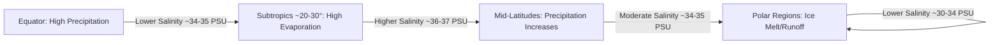
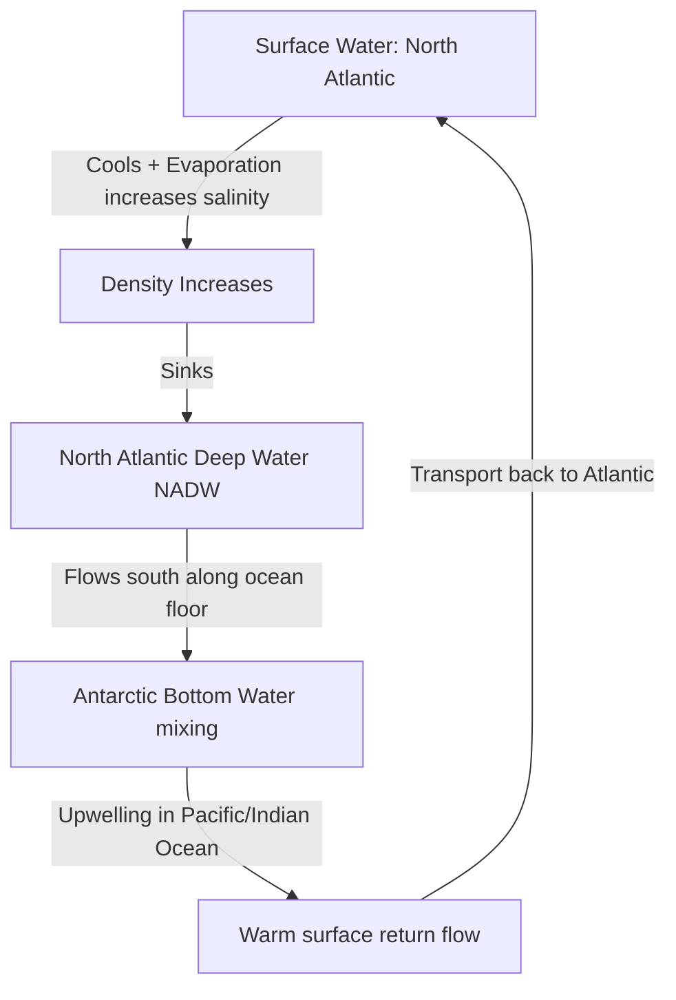
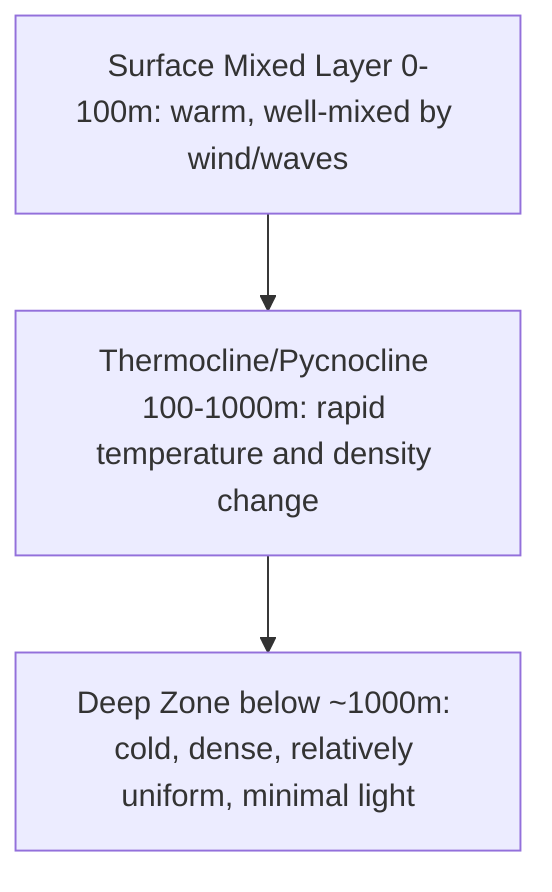

## Seawater Composition and Properties

### Overview

Seawater is a complex aqueous solution containing dissolved salts, gases, organic compounds, and suspended particulate matter. It covers approximately 71% of Earth's surface and constitutes about 96.5% of all water on the planet. Understanding seawater composition and its physical/chemical properties is foundational to oceanography, as these properties govern ocean circulation, marine ecosystem viability, climate regulation, and biogeochemical cycling.

### Chemical Composition

#### Major Dissolved Constituents

Seawater's dissolved salt content is dominated by six ions that together account for over 99% of all dissolved solids:

| Ion | Symbol | Approximate Concentration (g/kg) | % of Total Salinity |
| --- | --- | --- | --- |
| Chloride | $Cl^-$ | 19.35 | 55.03% |
| Sodium | $Na^+$ | 10.76 | 30.61% |
| Sulfate | $SO_4^{2-}$ | 2.71 | 7.68% |
| Magnesium | $Mg^{2+}$ | 1.29 | 3.69% |
| Calcium | $Ca^{2+}$ | 0.41 | 1.16% |
| Potassium | $K^+$ | 0.39 | 1.10% |

**Key Points**

- These six ions maintain a nearly constant ratio to one another across the world's open oceans, a principle known as the **Law of Constant Proportions** (or Marcet's Principle).
- This constancy exists despite absolute salinity varying by location, because ocean mixing timescales (~1,000 years) are much shorter than the residence times of these major ions.
- Minor constituents include bicarbonate ($HCO_3^-$), bromide ($Br^-$), boric acid, and strontium, which together make up a small remainder of dissolved solids.
- Trace elements (iron, zinc, copper, nickel) occur in parts-per-billion or lower concentrations but are critical as micronutrients limiting phytoplankton growth in some regions.

#### Dissolved Gases

The principal dissolved gases in seawater are:

- **Nitrogen ($N_2$)** — Largest fraction by volume, largely biologically inert except for nitrogen-fixing organisms.
- **Oxygen ($O_2$)** — Sourced from atmospheric exchange and photosynthesis; concentration decreases with depth in the oxygen minimum zone due to microbial respiration, then may rise slightly in deep water from cold, oxygen-rich source waters.
- **Carbon Dioxide ($CO_2$)** — Highly soluble; forms carbonic acid and participates in the carbonate buffering system.

Gas solubility in seawater is inversely related to temperature and salinity: colder, less saline water holds more dissolved gas. This relationship underlies the efficiency of high-latitude regions as sinks for atmospheric $CO_2$.

#### The Carbonate System

Dissolved inorganic carbon in seawater exists in three interrelated forms, governed by the following equilibrium:

$$CO_2 + H_2O \rightleftharpoons H_2CO_3 \rightleftharpoons H^+ + HCO_3^- \rightleftharpoons 2H^+ + CO_3^{2-}$$

- At typical ocean pH (~8.1), bicarbonate ($HCO_3^-$) dominates (~90%), with carbonate ($CO_3^{2-}$) making up roughly 9% and dissolved $CO_2$/carbonic acid less than 1%.
- This system buffers ocean pH and controls the saturation state of calcium carbonate minerals (calcite and aragonite), which are essential for shell- and skeleton-forming organisms.
- Increased atmospheric $CO_2$ absorption drives the equilibrium toward higher $H^+$ concentration, a process termed **ocean acidification**, which lowers carbonate ion availability. [Inference: the precise regional and depth-dependent rate of this shift depends on local circulation and biological uptake, so specific projected pH values should be treated as model-dependent estimates.]

### Salinity

#### Definition and Measurement

**Salinity** is a measure of the total dissolved salt content in seawater, historically expressed in parts per thousand (‰) or practical salinity units (PSU), and now more precisely defined via the **Absolute Salinity** ($S_A$) framework under the Thermodynamic Equation of Seawater 2010 (TEOS-10).

- Average open-ocean salinity is approximately 35 PSU (35 g of dissolved salts per kg of seawater).
- Modern measurement relies on conductivity, since dissolved ions make seawater electrically conductive in proportion to ion concentration; this is converted to **Practical Salinity** via standardized conductivity ratio formulas.
- TEOS-10 replaced the older Practical Salinity Scale (PSS-78) as the oceanographic standard, using Absolute Salinity (g/kg) for more thermodynamically consistent calculations of density and other properties.

#### Factors Affecting Salinity Distribution

**Key Points**

- **Evaporation** increases surface salinity by removing freshwater while leaving salts behind; dominant in subtropical high-pressure belts (~20–30° latitude).
- **Precipitation** decreases salinity by adding freshwater; dominant near the Intertropical Convergence Zone and in high-latitude regions.
- **River runoff** lowers salinity in coastal and estuarine zones (e.g., the Baltic Sea, Amazon plume).
- **Sea ice formation** increases salinity of surrounding water through **brine rejection**, as ice crystals exclude salt ions during freezing.
- **Sea ice melt** decreases local salinity by introducing freshwater.
- The highest-salinity open-ocean water occurs in restricted, high-evaporation basins such as the Red Sea (~40 PSU) and the Persian Gulf, while the lowest occurs in semi-enclosed, high-runoff seas such as the Baltic (as low as 6–8 PSU in some areas).

#### Global Salinity Pattern

### Physical Properties

#### Density

Seawater density is a function of three variables: temperature, salinity, and pressure, typically expressed as $\sigma_t$ or $\sigma_\theta$ (sigma-t/sigma-theta, density minus 1000 kg/m³ for readability).

$$\rho = f(T, S, P)$$

- Density **increases** with increasing salinity (more dissolved mass per unit volume).
- Density **decreases** with increasing temperature (thermal expansion), except near the freezing point of fresh water, though seawater's dissolved salt content suppresses the freshwater density-maximum anomaly seen at 4°C.
- Density **increases** with increasing pressure (depth), due to the slight compressibility of water.
- Typical open-ocean surface seawater density is approximately 1,020–1,029 kg/m³, denser than pure water (1,000 kg/m³) due to dissolved solids.

This density dependency drives **thermohaline circulation**, the global "conveyor belt" of deep ocean currents, where cold, salty (dense) water sinks at high latitudes (notably the North Atlantic and around Antarctica) and is compensated by warmer surface flow elsewhere.

#### Freezing Point Depression

Dissolved salts lower the freezing point of seawater below that of pure water (0°C):

- Standard seawater at 35 PSU freezes at approximately **-1.9°C**.
- This is a colligative property: freezing point depression is proportional to the concentration of dissolved solute particles.
- As sea ice forms, it excludes most dissolved salts (brine rejection), so sea ice itself is much less saline than the water it formed from.

#### Thermal Properties

- Seawater has a high **specific heat capacity** (~3,850–3,995 J/(kg·°C), slightly lower than pure water's ~4,186 J/(kg·°C) due to dissolved salts), enabling oceans to absorb and store large quantities of heat with relatively small temperature changes. This underlies the ocean's role as Earth's dominant climate thermal buffer.
- **Thermal expansion coefficient** increases with temperature, meaning warm water expands more per degree of heating than cold water — a key driver of contemporary sea-level rise via thermal expansion.

#### Compressibility and Sound Transmission

- Seawater is only slightly compressible, but at great depths this becomes measurable, contributing to density increases with pressure.
- Sound travels faster in seawater (~1,450–1,570 m/s) than in air (~343 m/s), with speed increasing with temperature, salinity, and pressure. This property underlies sonar-based bathymetry and the existence of the **SOFAR channel** (Sound Fixing and Ranging channel), a depth zone of minimum sound speed that traps and propagates sound waves over enormous distances.

#### Optical Properties

- Seawater absorbs and scatters light selectively by wavelength: red and infrared light are absorbed within the first few meters, while blue light penetrates deepest (typically to ~200 m in clear open ocean), explaining the blue appearance of open ocean water.
- The **euphotic zone** (photic zone) is the depth range where sufficient light penetrates for net photosynthesis, generally extending to ~100–200 m in clear water but much shallower in turbid coastal waters.
- Turbidity from suspended sediment, dissolved organic matter, and phytoplankton reduces light penetration and shifts water color toward green.

### Vertical Structure and Stratification

**Key Points**

- The **pycnocline** is a zone of rapid density change with depth, which restricts vertical mixing between surface and deep water.
- The **thermocline** (rapid temperature change with depth) and **halocline** (rapid salinity change with depth) are the primary contributors to the pycnocline in most ocean regions.
- In tropical and temperate oceans, a permanent thermocline typically exists year-round below the mixed layer; a seasonal thermocline may also form in summer within the surface mixed layer.
- Polar oceans often lack a strong permanent thermocline because surface-to-deep temperature differences are small, but a pronounced halocline may exist instead (e.g., driven by ice melt freshwater layering over saltier deep water).

### Example

**Example: Density Comparison Calculation (Conceptual)**

Consider two water parcels:

- Parcel A: T = 25°C, S = 35 PSU → lower density (warm, moderate salinity)
- Parcel B: T = 2°C, S = 34.5 PSU → higher density (cold dominates despite slightly lower salinity)

Because temperature effects on density are generally larger than salinity effects in the range of typical ocean values, Parcel B will sink beneath Parcel A if the two come into contact, illustrating the mechanism by which cold polar water sinks beneath warmer subtropical water in thermohaline circulation. [Inference: the exact density crossover point depends on the nonlinear equation of state for seawater and must be computed with the full TEOS-10 formulation for precision; this is a simplified conceptual illustration, not a computed result.]

### pH and Buffering

- Open-ocean surface pH averages approximately 8.1, making seawater mildly alkaline (basic).
- The carbonate buffering system (bicarbonate/carbonate equilibrium described above) resists large pH swings from natural $CO_2$ input/output.
- Anthropogenic $CO_2$ uptake has driven measurable surface ocean pH decline since the pre-industrial era (commonly cited as roughly 0.1 pH units, corresponding to about a 30% increase in hydrogen ion concentration since logarithmic pH scale changes are non-linear in concentration). [Unverified: exact global mean figures vary slightly between monitoring datasets and time periods cited; consult current NOAA/IPCC data for the most precise up-to-date value.]

### Related Topics

- Thermohaline Circulation and the Global Conveyor Belt
- Ocean Acidification: Mechanisms and Ecological Impacts
- TEOS-10 and the Modern Seawater Equation of State
- Water Masses: Formation, Identification, and T-S Diagrams
- The Global Hydrological Cycle and Ocean-Atmosphere Water Exchange
- Sea Ice Formation, Brine Rejection, and Polar Oceanography
- Marine Biogeochemical Cycles (Carbon, Nitrogen, Phosphorus)
- Sound Propagation in the Ocean and the SOFAR Channel
- Light Penetration, the Euphotic Zone, and Ocean Color Remote Sensing
- Estuarine Mixing and Coastal Salinity Gradients