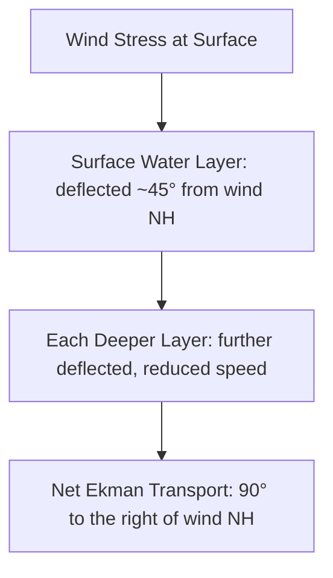
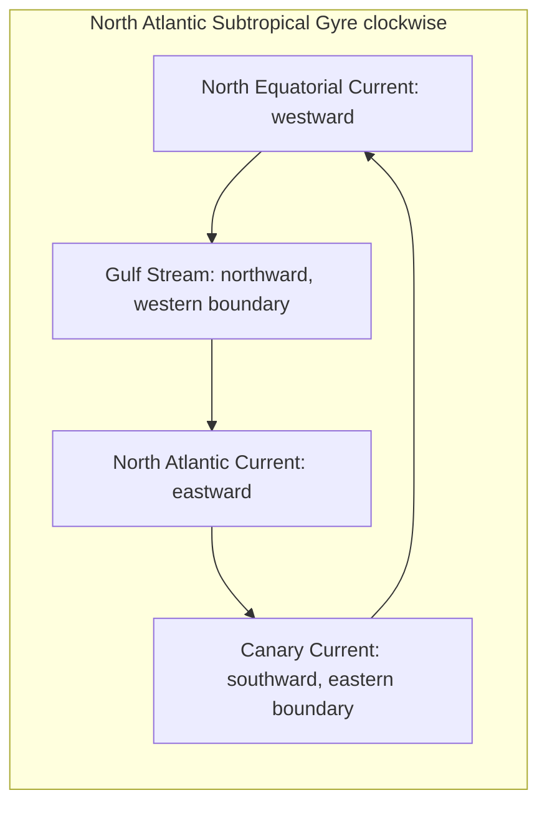
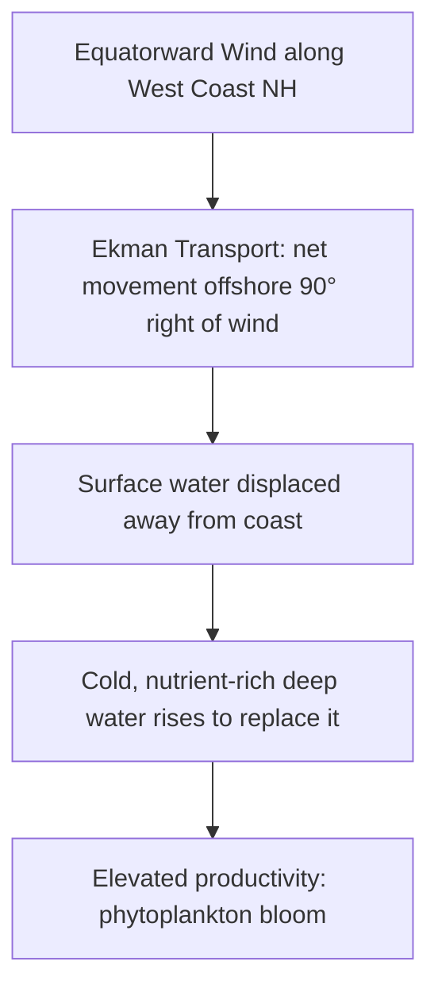
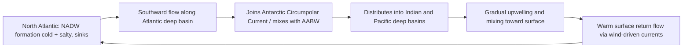

## Ocean Circulation and Currents

### Overview

Ocean circulation refers to the large-scale movement of seawater driven by wind, density differences, tides, and Earth's rotation. Currents transport heat, salt, nutrients, dissolved gases, and organisms across the globe, making circulation a central control on climate, weather, marine ecosystems, and biogeochemical cycling. Circulation is broadly divided into **surface circulation** (wind-driven, upper ~400 m) and **deep circulation** (density-driven, thermohaline).

### Forces Driving Ocean Circulation

**Key Points**

- **Wind stress** transfers momentum from the atmosphere to the ocean surface, generating surface currents.
- **Density differences** (from temperature and salinity variation) drive deep, thermohaline circulation.
- **Coriolis effect** deflects moving water (and air) due to Earth's rotation — to the right in the Northern Hemisphere and to the left in the Southern Hemisphere — and is central to the formation of gyres and geostrophic currents.
- **Tidal forces** (gravitational interaction with the Moon and Sun) generate tidal currents, particularly significant in coastal and shelf regions.
- **Pressure gradients**, arising from sea surface height differences (due to wind piling, density variation, or atmospheric pressure), drive water from high to low pressure zones.

### Ekman Transport and Ekman Spiral

Wind blowing over the ocean surface does not simply push water in the wind's direction. Due to the Coriolis effect acting on successively deeper, frictionally-coupled layers of water, the **Ekman spiral** develops:

- Each successively deeper layer of water is deflected further from the wind direction and moves more slowly, tracing a spiral pattern with depth.
- The **net transport** of the entire Ekman layer (typically the upper ~100–200 m) is oriented at 90° to the wind direction — to the right of the wind in the Northern Hemisphere, to the left in the Southern Hemisphere.
- This net transport is called **Ekman transport** and is fundamental to the formation of subtropical gyres and coastal upwelling/downwelling.

### Geostrophic Currents

**Geostrophic currents** result from a balance between the pressure gradient force (from sea surface slope) and the Coriolis force:

$$f v = -\frac{1}{\rho}\frac{\partial P}{\partial x}$$

where $f$ is the Coriolis parameter, $v$ is current velocity, $\rho$ is seawater density, and $\frac{\partial P}{\partial x}$ is the horizontal pressure gradient.

- In geostrophic balance, currents flow parallel to lines of constant sea surface height (isobars) rather than directly down the pressure gradient, because the Coriolis force deflects the flow until it balances the pressure gradient force.
- This balance explains why major current systems like the Gulf Stream flow along, rather than across, regions of sea surface height difference.

### Surface Ocean Circulation: Gyres

The combination of wind patterns (trade winds, westerlies), Coriolis deflection, and continental boundaries produces large, semi-closed circulation systems called **gyres**.

- **Subtropical gyres**: Centered around 30° latitude in each major ocean basin, rotating clockwise in the Northern Hemisphere and counterclockwise in the Southern Hemisphere. Major examples: North Atlantic Gyre, North Pacific Gyre, South Atlantic Gyre, South Pacific Gyre, Indian Ocean Gyre.
- **Subpolar gyres**: Located at higher latitudes, rotating in the opposite sense to adjacent subtropical gyres (counterclockwise in the Northern Hemisphere).
- **Western intensification**: Currents on the western boundary of ocean basins (e.g., the Gulf Stream, Kuroshio Current) are narrower, faster, and deeper than their eastern boundary counterparts (e.g., the Canary Current, California Current), a consequence of the Coriolis parameter's variation with latitude combined with basin geometry.

#### Major Surface Current Systems

| Current | Type | Location | Notes |
| --- | --- | --- | --- |
| Gulf Stream | Western boundary | North Atlantic | Warm, fast (~2 m/s), transports heat to NW Europe |
| Kuroshio Current | Western boundary | North Pacific | Warm, analogous to Gulf Stream |
| California Current | Eastern boundary | North Pacific | Cool, slow, broad; supports upwelling |
| Canary Current | Eastern boundary | North Atlantic | Cool, supports coastal upwelling off NW Africa |
| Antarctic Circumpolar Current | Circumpolar | Southern Ocean | Largest volume transport of any current; unimpeded by continents |
| Equatorial Currents | Equatorial | All basins | Wind-driven, flow westward along equator |
| Equatorial Countercurrent | Equatorial | Between N/S equatorial currents | Flows eastward, compensating westward transport |

### Coastal Upwelling and Downwelling

- **Upwelling** occurs where Ekman transport moves surface water away from a coastline, drawing cold, nutrient-rich deep water to the surface. Classic examples: the coasts of Peru/Chile, California, and Northwest Africa.
- **Downwelling** occurs where Ekman transport converges surface water toward a coastline, pushing surface water downward.
- Upwelling zones are highly biologically productive, supporting major fisheries, because nutrient-rich deep water fuels phytoplankton growth at the surface where light is available.

### Deep (Thermohaline) Circulation

Deep circulation is driven by density differences arising from temperature and salinity variation rather than wind, often described collectively as the **global thermohaline circulation** or "global conveyor belt."

**Key Points**

- Dense water forms primarily at high latitudes where cold temperatures and, in some regions, brine rejection from sea ice formation increase surface water density enough to sink.
- **North Atlantic Deep Water (NADW)** forms in the Norwegian and Greenland Seas/Labrador Sea, sinking and flowing southward along the deep Atlantic.
- **Antarctic Bottom Water (AABW)** forms primarily in the Weddell Sea and Ross Sea around Antarctica, and is the densest, coldest water mass, occupying the deepest ocean layers globally.
- These deep water masses spread throughout the world's ocean basins over centuries to a millennium, gradually upwelling and warming, eventually returning to the surface primarily via wind-driven and mixing-driven upwelling in the Southern Ocean and other regions, closing the circulation loop.
- The full cycle of the conveyor belt is estimated to take on the order of 1,000 years. [Inference: precise circulation timescales vary by water mass and are derived from tracer studies (e.g., radiocarbon, CFCs) with model-dependent uncertainty, so this figure should be treated as an order-of-magnitude estimate rather than an exact value.]

### Water Mass Identification: T-S Diagrams

Oceanographers identify and track distinct water masses using **Temperature-Salinity (T-S) diagrams**, which plot temperature against salinity for water samples at different depths.

- Each major water mass (e.g., NADW, AABW, Antarctic Intermediate Water, Mediterranean Water) occupies a characteristic, relatively narrow region on a T-S diagram, acting as a signature that persists as the water mass spreads and mixes.
- Because density is a function of both temperature and salinity, T-S diagrams are often overlaid with isopycnal (constant density) lines to assess water mass stability and mixing behavior.

### Tides and Tidal Currents

While distinct from wind-driven and thermohaline circulation, tidal currents are a major component of coastal and shelf water movement:

- Driven by the gravitational pull of the Moon (dominant) and Sun, modulated by Earth's rotation and ocean basin geometry.
- **Semidiurnal tides**: two high and two low tides per day (common along the U.S. Atlantic coast).
- **Diurnal tides**: one high and one low tide per day (common in the Gulf of Mexico).
- **Mixed tides**: two unequal highs and lows per day (common along the U.S. Pacific coast).
- Tidal currents are especially strong in narrow straits, estuaries, and bays, where they can dominate local water circulation and sediment transport.

### El Niño–Southern Oscillation (ENSO) and Circulation Anomalies

ENSO is a periodic disruption of normal Pacific equatorial circulation with global climatic effects:

- **Normal (La Niña-like) conditions**: Strong trade winds push warm surface water westward, maintaining a deep thermocline in the western Pacific and a shallow thermocline (with upwelling of cold water) in the eastern Pacific off South America.
- **El Niño conditions**: Trade winds weaken or reverse, allowing warm water to slosh eastward, suppressing upwelling off South America, deepening the eastern Pacific thermocline, and shifting precipitation patterns globally.
- ENSO cycles typically recur every 2–7 years and represent one of the strongest sources of interannual climate variability on Earth. [Inference: while the general mechanism is well-established, individual event magnitude and precise recurrence intervals are not fully predictable and remain an active area of coupled ocean-atmosphere modeling.]

### Example

**Example: Tracing a Water Parcel Through the Conveyor Belt**

A parcel of surface water in the Norwegian Sea cools and, combined with high salinity from evaporation and sea-ice-related brine rejection, becomes dense enough to sink as NADW. It flows southward at depth through the Atlantic, eventually mixing into the Antarctic Circumpolar Current, then spreads into the deep Indian and Pacific basins. Centuries later, mixing and wind-driven upwelling (notably in the Southern Ocean) bring a portion of this water back to the surface, where it warms, freshens somewhat, and eventually returns toward the North Atlantic via surface currents — completing one loop of the global conveyor belt.

### Impacts of Ocean Circulation

- **Climate regulation**: Poleward heat transport by currents like the Gulf Stream moderates regional climates (e.g., keeping Northwest Europe milder than other regions at similar latitudes).
- **Nutrient cycling**: Upwelling and deep circulation redistribute nutrients essential for marine productivity and global fisheries.
- **Carbon sequestration**: Deep circulation transports dissolved and biologically-fixed carbon to depth, forming a major component of the ocean's role as a long-term carbon sink.
- **Marine debris and larval transport**: Surface gyres concentrate floating debris (e.g., the Great Pacific Garbage Patch) and influence the dispersal of planktonic larvae and species distributions.
- **Sea level and coastal impacts**: Changes in current strength (e.g., a weakening Atlantic Meridional Overturning Circulation, AMOC) can alter regional sea level and storm patterns. [Speculation: the long-term trajectory and tipping-point behavior of AMOC under continued climate forcing remains an active research question with significant scientific uncertainty regarding timing and magnitude.]

### Next Steps

- Thermohaline Circulation and the Global Conveyor Belt (detailed water mass formation)
- Atlantic Meridional Overturning Circulation (AMOC) and Climate Stability
- El Niño–Southern Oscillation: Mechanisms and Global Teleconnections
- Coastal Upwelling Ecosystems and Fisheries Productivity
- Tides: Generation, Types, and Tidal Bulge Dynamics
- Water Masses and T-S Diagram Analysis
- Wind-Driven Circulation and Ekman Dynamics (mathematical treatment)
- Ocean-Atmosphere Coupling and Climate Feedback Systems
- Marine Debris Transport and the Garbage Patches
- Paleoceanography: Reconstructing Past Circulation Patterns