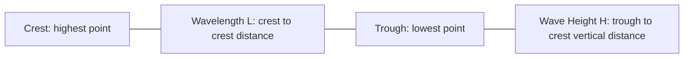
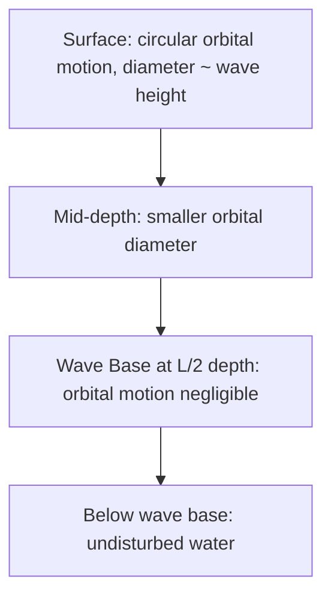
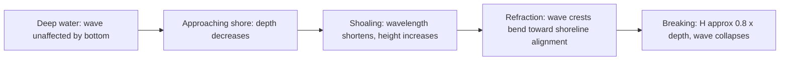
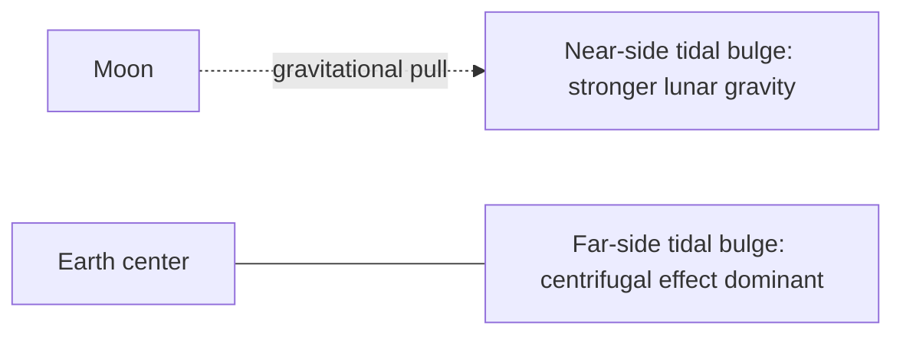
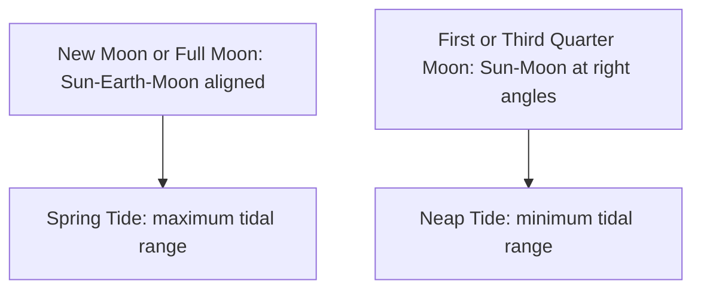

## Waves and Tidal Dynamics

### Overview

Ocean waves and tides are periodic disturbances that move energy through seawater without net long-term transport of the water itself (in most wave cases). Waves are primarily generated by wind, while tides are generated by gravitational forces from the Moon and Sun combined with Earth's rotation. Both are fundamental to coastal geomorphology, navigation, marine engineering, and ecosystem dynamics.

### Wave Fundamentals

#### Basic Wave Anatomy

- **Crest**: The highest point of a wave.
- **Trough**: The lowest point of a wave.
- **Wave height ($H$)**: Vertical distance from trough to crest.
- **Wavelength ($L$)**: Horizontal distance between two successive crests (or troughs).
- **Wave period ($T$)**: Time for one full wavelength to pass a fixed point.
- **Wave frequency ($f$)**: Number of waves passing a point per unit time, $f = 1/T$.
- **Wave speed (celerity, $C$)**: Speed at which the wave form propagates, $C = L/T$.
- **Amplitude ($A$)**: Half the wave height, measured from still water level to crest (or trough).

#### Orbital Motion of Water Particles

In a wind-generated wave, individual water particles do not travel horizontally with the wave form. Instead, they move in circular (or elliptical, in shallow water) orbits:

- At the surface, particles trace circular orbits with diameter approximately equal to the wave height.
- Orbital diameter decreases exponentially with depth.
- The **wave base** is the depth at which orbital motion becomes negligible, conventionally taken as half the wavelength ($L/2$) below the still water surface.
- Below the wave base, water is essentially unaffected by surface wave motion, which is why submarines and deep-diving organisms are undisturbed by surface storms.

### Wave Classification by Water Depth

Wave behavior depends on the ratio of water depth ($d$) to wavelength ($L$):

| Classification | Depth Criterion | Speed Formula | Orbital Motion |
| --- | --- | --- | --- |
| Deep-water wave | $d > L/2$ | $C = \sqrt{gL/2\pi}$ | Circular, unaffected by bottom |
| Transitional wave | $L/20 < d < L/2$ | Full form (depth-dependent) | Circular, becoming elliptical |
| Shallow-water wave | $d < L/20$ | $C = \sqrt{gd}$ | Elliptical, flattened near bottom |

where $g$ is gravitational acceleration.

**Key Points**

- In **deep water**, wave speed depends only on wavelength (longer waves travel faster), not on water depth.
- In **shallow water**, wave speed depends only on water depth, not wavelength — this is why waves slow down as they approach shore.
- **Tsunamis**, despite occurring in the deep ocean, behave as shallow-water waves because their wavelengths (often hundreds of kilometers) vastly exceed ocean depth.

### Wave Generation and Wind Waves

Wind-generated waves develop through frictional transfer of energy from moving air to the sea surface. Their size depends on three factors:

- **Wind speed**: Faster winds transfer more energy.
- **Wind duration**: Longer sustained winds allow more energy transfer.
- **Fetch**: The uninterrupted distance over which wind blows in a consistent direction; longer fetch allows larger wave development.
- **Sea state**: The chaotic, mixed-wavelength wave field within or near the generating storm area.
- **Swell**: Regular, uniform waves that have propagated away from their generating area, having sorted by wavelength (longer wavelength waves travel faster and outpace shorter ones — a process called **dispersion**).

### Wave Transformation Near Shore

As waves move from deep to shallow water, several transformations occur:

- **Shoaling**: As depth decreases, wave speed decreases, wavelength shortens, and wave height increases (since energy flux must be conserved).
- **Refraction**: Waves bend as different parts of the wave front encounter different depths and travel at different speeds, causing wave crests to align more parallel to the shoreline; this concentrates wave energy on headlands and disperses it in bays.
- **Wave breaking**: Occurs when wave height-to-depth ratio becomes unstable, conventionally when wave height reaches approximately 0.8 times the water depth ($H \approx 0.8d$), causing the wave to collapse as a breaker.
- **Breaker types**: Spilling (gentle, gradually sloping beaches), plunging (moderate slopes, curling breaker classically associated with surfing), and surging (steep beaches, wave surges up without breaking conventionally).

### Wave Energy

Wave energy per unit surface area is proportional to the square of wave height:

$$E \propto H^2$$

This relationship explains why even modest increases in wave height (e.g., during storms) produce disproportionately large increases in destructive energy delivered to coastlines and structures.

### Special Wave Types

#### Tsunamis

- Generated by sudden, large-volume displacements of water, most commonly from submarine earthquakes, but also landslides, volcanic eruptions, or (rarely) meteorite impacts.
- Behave as shallow-water waves throughout the ocean due to extremely long wavelengths, allowing high speed (up to ~800 km/h in deep ocean) with minimal surface expression (often under 1 m in the open ocean).
- Undergo dramatic shoaling near shore: as depth decreases and speed drops, wave height increases dramatically, sometimes reaching many meters, causing severe coastal destruction.
- Should not be referred to as "tidal waves," as they are unrelated to tidal forces despite the historical misnomer.

#### Internal Waves

- Occur at density interfaces within the ocean (e.g., at the pycnocline) rather than at the sea surface, generated by tidal flow over underwater topography, current shear, or other disturbances.
- Can have wavelengths and amplitudes far exceeding surface waves, and play a role in vertical mixing and nutrient transport.

#### Rogue Waves

- Unusually large, unpredictable waves (conventionally defined as more than twice the significant wave height of the surrounding sea state) that can arise from constructive interference of multiple wave trains or wave-current interactions. [Inference: while rogue wave occurrence is well-documented via satellite and buoy data, their precise predictability at a given time and location remains limited by the chaotic nature of the underlying wave interactions.]

### Tidal Dynamics

#### Tide-Generating Forces

Tides result from the differential gravitational pull of the Moon (and, to a lesser extent, the Sun) across Earth's diameter, combined with the centrifugal effect of the Earth-Moon (and Earth-Sun) system rotating about their common center of mass.

- The Moon's gravitational pull is stronger on the side of Earth nearest it, creating a tidal bulge on that side.
- A second bulge forms on the opposite side of Earth, primarily due to the inertial/centrifugal effect exceeding the (weaker) lunar pull at that distance.
- These two bulges are the basis for the twice-daily tidal cycle experienced at most locations as Earth rotates beneath them.
- The Sun exerts roughly 46% of the tide-generating force of the Moon (due to its much greater mass but much greater distance), meaning solar tides modulate but do not dominate the lunar tidal pattern.

#### Spring and Neap Tides

- **Spring tides**: Occur during new and full moon, when the Sun, Earth, and Moon are aligned (syzygy), causing solar and lunar tidal forces to reinforce each other, producing the greatest tidal range.
- **Neap tides**: Occur during first and third quarter moon phases, when the Sun and Moon are at right angles relative to Earth, causing solar and lunar forces to partially cancel, producing the smallest tidal range.
- The spring-neap cycle repeats approximately every 14–15 days, tracking the lunar phase cycle.

#### Tidal Patterns

- **Semidiurnal tide**: Two high tides and two low tides of roughly equal height each lunar day (~24 hours 50 minutes); common along the U.S. Atlantic coast.
- **Diurnal tide**: One high tide and one low tide per lunar day; common in the Gulf of Mexico.
- **Mixed semidiurnal tide**: Two high and two low tides per day of unequal heights; common along the U.S. Pacific coast.

The specific pattern at a given location depends on complex interactions between the astronomical tidal forces, basin geometry, water depth, and Coriolis effects — collectively described by **dynamic tidal theory**, which supersedes the simpler "equilibrium tide" model for predicting real-world tidal behavior.

#### Tidal Range and Coastal Geometry

- **Tidal range** (difference between high and low tide) varies enormously by location, from under 1 m in the open ocean and on some coastlines to over 15 m in the Bay of Fundy, Canada — the largest tidal range on Earth.
- Funnel-shaped bays and estuaries amplify tidal range through resonance effects, where the natural oscillation period of the basin approaches the tidal forcing period.
- A **tidal bore** can form in some estuaries with strong tidal range and funnel geometry, where the incoming tide forms a visible wave front moving upstream against river flow.

### Tidal Currents

- Distinct from tidal height changes, tidal currents describe the horizontal flow of water associated with the rise and fall of tides.
- **Flood current**: Tidal current flowing toward shore/upstream as the tide rises.
- **Ebb current**: Tidal current flowing away from shore/downstream as the tide falls.
- **Slack water**: The brief period of minimal current flow at the turn between flood and ebb.
- Tidal currents are strongest in constricted passages (straits, inlets, river mouths) and can reach several meters per second in extreme cases, representing a significant and predictable source of renewable energy potential (tidal stream generation).

### Example

**Example: Predicting Relative Tidal Range**

A location experiencing a full moon (syzygy alignment) will see spring tides with a larger-than-average tidal range for that location's baseline. If that location is also a narrow, funnel-shaped estuary whose natural resonance period is close to the ~12.4-hour semidiurnal tidal period, the combination of spring tide timing and basin resonance can produce an especially extreme tidal range event — the mechanism behind the Bay of Fundy's exceptional tides.

### Human and Ecological Relevance

- **Coastal engineering**: Wave and tidal dynamics inform seawall design, breakwater placement, port engineering, and beach nourishment projects.
- **Navigation and shipping**: Tidal predictions are essential for safe passage in shallow or constricted waterways.
- **Renewable energy**: Tidal range (barrage) and tidal stream (turbine) systems harness predictable tidal energy; wave energy converters aim to capture wind-wave energy, though wave energy technology remains less mature and less widely deployed than tidal technology. [Inference: the commercial-scale viability and deployment timeline of wave energy technology specifically is still developing and subject to engineering and economic uncertainty.]
- **Intertidal ecology**: The regular exposure/submersion cycle from tides creates the intertidal zone, a highly stratified habitat supporting zonation of specially adapted organisms.
- **Coastal hazards**: Storm surge (wind- and pressure-driven sea level rise during storms) combined with high tide timing can produce the most severe coastal flooding events.

### Next Steps

- Tsunami Generation, Propagation, and Early Warning Systems
- Coastal Erosion, Sediment Transport, and Longshore Drift
- Storm Surge Dynamics and Coastal Flood Hazards
- Tidal Energy Systems: Barrage and Stream Turbine Technology
- Intertidal Zonation and Ecological Adaptation
- Wave Forecasting Models and Buoy Observation Networks
- Estuarine Circulation and Tidal Mixing
- Internal Waves and Deep Ocean Mixing Processes
- Coastal Landform Evolution (Beaches, Spits, Barrier Islands)