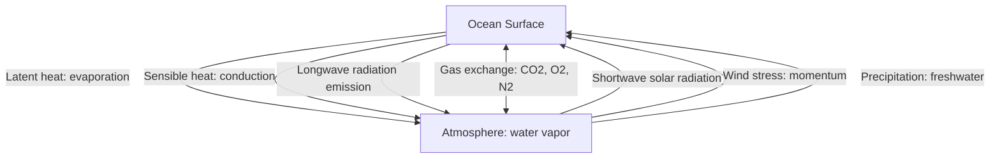
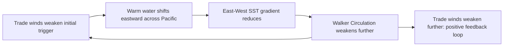

## Ocean and Atmosphere Interactions

### Overview

The ocean and atmosphere form a tightly coupled system, continuously exchanging heat, moisture, momentum, and gases across the sea surface. This coupling drives global climate patterns, weather systems, and large-scale phenomena such as monsoons and El Niño. Because the ocean has roughly a thousand-fold greater heat capacity than the atmosphere per unit volume, it functions as the dominant thermal reservoir and regulator of Earth's climate system, while the atmosphere provides the momentum (wind) that drives much of surface ocean circulation.

### Fundamental Exchange Processes

#### Heat Exchange

Heat transfers between ocean and atmosphere through four primary mechanisms:

- **Solar (shortwave) radiation absorption**: The ocean absorbs incoming solar radiation, particularly in the visible spectrum, warming surface waters. Absorption is greatest in clear, low-latitude waters.
- **Longwave radiation**: The ocean surface emits infrared radiation continuously, and also absorbs downwelling longwave radiation from the atmosphere (including greenhouse gas re-emission).
- **Sensible heat flux**: Direct conductive/convective heat transfer between sea surface and air, proportional to the temperature difference between them.
- **Latent heat flux**: Heat consumed during evaporation (transferred to the atmosphere as water vapor, later released upon condensation); this is typically the single largest term in the ocean surface heat budget in most regions.

$$Q_{net} = Q_{SW} - Q_{LW} - Q_{SH} - Q_{LH}$$

where $Q_{SW}$ is net shortwave radiation, $Q_{LW}$ is net longwave radiation, $Q_{SH}$ is sensible heat flux, and $Q_{LH}$ is latent heat flux (sign conventions vary by source; the equation represents the net surface energy balance).

#### Moisture Exchange

- **Evaporation**: The ocean is the dominant source of atmospheric water vapor, supplying roughly 85–90% of moisture that eventually falls as precipitation, with the remainder from terrestrial evapotranspiration. [Unverified: precise global partitioning figures vary slightly among hydrological cycle studies and datasets.]
- **Precipitation**: Returns freshwater to the ocean surface (directly, or via river runoff after falling on land), influencing surface salinity.
- The balance of evaporation minus precipitation ($E - P$) at a given location strongly influences regional sea surface salinity patterns.

#### Gas Exchange

- The ocean and atmosphere exchange gases (notably $O_2$, $N_2$, and $CO_2$) across the air-sea interface, driven by partial pressure differences between the two reservoirs.
- The ocean is estimated to have absorbed roughly a quarter to a third of anthropogenic $CO_2$ emissions since the industrial era, making it a major carbon sink and a primary driver of ocean acidification. [Inference: exact percentages vary across carbon budget assessments and time periods, so this figure should be treated as an approximate, literature-consistent range rather than a precise constant.]
- Gas exchange rates depend on wind speed (increasing turbulence and surface area via wave breaking), temperature, and the gas solubility properties of seawater.

### Wind-Driven Momentum Transfer

- Wind stress on the sea surface is the primary driver of surface ocean currents, wave generation, and upwelling/downwelling via Ekman transport (see Ocean Circulation and Currents for detailed treatment).
- Momentum transfer is proportional to the square of wind speed and is modulated by sea surface roughness (wave state), captured in bulk aerodynamic formulas using a drag coefficient.

### Atmospheric Circulation's Role in Driving Ocean Circulation

- **Trade winds**: Persistent easterly winds in the tropics (roughly 0–30° latitude) drive westward-flowing equatorial currents and are central to ENSO dynamics.
- **Westerlies**: Prevailing winds at mid-latitudes (roughly 30–60°) drive the poleward-flowing limbs of subtropical gyres and the Antarctic Circumpolar Current.
- **Polar easterlies**: Winds at high latitudes contribute to subpolar gyre circulation.
- These wind belts arise from the global atmospheric circulation cells (Hadley, Ferrel, Polar cells), themselves driven by differential solar heating between equator and poles combined with the Coriolis effect.

### El Niño–Southern Oscillation (ENSO) as a Coupled System

ENSO is the archetypal example of ocean-atmosphere coupling, in which changes in one system reinforce changes in the other through a positive feedback loop known as the **Bjerknes feedback**.

**Key Points**

- **Normal/La Niña conditions**: Strong trade winds maintain warm water piled in the western Pacific (with a deep thermocline there) and cold, upwelled water in the eastern Pacific (shallow thermocline). This sea surface temperature gradient reinforces the trade winds via the resulting atmospheric pressure gradient (Walker Circulation).
- **El Niño conditions**: An initial weakening of trade winds allows warm water to shift eastward; this reduces the east-west temperature gradient, further weakening the trade winds, in a self-reinforcing (positive feedback) loop. This suppresses eastern Pacific upwelling and shifts atmospheric convection and rainfall patterns eastward.
- **Southern Oscillation**: The atmospheric pressure component of ENSO, measured as the pressure difference between Tahiti and Darwin, Australia — it oscillates in tandem with the oceanic (El Niño/La Niña) temperature pattern, hence the coupled "ENSO" naming.
- ENSO events typically recur every 2–7 years and represent one of the most significant sources of interannual global climate variability, affecting rainfall, drought, hurricane activity, and fisheries productivity far beyond the tropical Pacific via atmospheric teleconnections.

### The Walker Circulation

- A zonal (east-west) atmospheric circulation cell over the tropical Pacific, driven by the west-warm/east-cool sea surface temperature gradient under normal conditions.
- Rising air (associated with convection and rainfall) occurs over the warm western Pacific, with descending air (dry conditions) over the cooler eastern Pacific.
- During El Niño, the Walker Circulation weakens or reverses, shifting rainfall patterns dramatically (e.g., drought in Indonesia/Australia, increased rainfall in the eastern/central Pacific and parts of South America).

### Monsoon Systems

Monsoons are large-scale seasonal wind reversals driven by differential heating between continents and adjacent oceans:

- In summer, land heats faster than the ocean, creating a low-pressure zone over land that draws moist ocean air inland, producing heavy monsoon rainfall (e.g., the South Asian monsoon).
- In winter, the pattern reverses as land cools faster than the ocean, producing dry, offshore-flowing winds.
- Monsoon strength and timing are influenced by ocean surface temperature patterns, including modulation by ENSO and the Indian Ocean Dipole (a separate but related ocean-atmosphere coupled mode in the Indian Ocean).

### Tropical Cyclones as an Ocean-Atmosphere Feedback

- Tropical cyclones (hurricanes/typhoons) form over warm ocean water (typically requiring sea surface temperatures above approximately 26.5°C) that supplies the latent heat energy fueling storm intensification.
- As cyclones move, they draw heat and moisture from the ocean surface, while their strong winds simultaneously induce ocean mixing and upwelling of cooler subsurface water beneath the storm track, which can act as a negative feedback limiting further intensification if mixing is strong relative to upper-ocean heat content. [Inference: the net effect of storm-induced ocean mixing on intensification varies by case, depending on pre-storm ocean heat content and mixed layer depth, so this feedback is not uniformly negative across all storms.]
- Ocean heat content (not just surface temperature) is increasingly used in intensity forecasting, since a deep warm layer resists storm-induced cooling more effectively than a shallow warm layer.

### The Ocean's Role in Climate Regulation

- **Heat storage and redistribution**: The ocean absorbs the large majority of excess heat trapped by greenhouse gases (commonly cited as over 90% of net anthropogenic heat gain in the climate system), buffering atmospheric temperature rise. [Unverified: precise percentages differ slightly among climate heat budget assessments and reporting periods; consult current IPCC or NOAA ocean heat content reports for the latest figures.]
- **Thermal inertia**: Because water heats and cools more slowly than air or land, the ocean moderates coastal climates and dampens the rate of atmospheric temperature change relative to what greenhouse forcing alone would produce.
- **Carbon sequestration**: Both a physical (dissolution) pump and a biological pump (via photosynthesis and sinking organic matter) transfer atmospheric carbon into the deep ocean, where it can be sequestered on timescales of centuries to millennia.

### Example

**Example: Tracing a Coupled Feedback Chain**

A weakening of Pacific trade winds allows the western Pacific warm pool to spread eastward. This reduces the east-west sea surface temperature gradient, which weakens the Walker Circulation's pressure gradient, further reducing trade wind strength. The resulting warm eastern Pacific surface suppresses coastal upwelling off South America (reducing nutrient supply to surface waters and impacting regional fisheries), while atmospheric convection and rainfall shift eastward, producing drought conditions in Indonesia and heavier rainfall in parts of the eastern Pacific and southern United States — the observable signature of a developing El Niño event.

### Related Topics

- El Niño–Southern Oscillation: Detailed Mechanisms and Global Teleconnections
- The Global Carbon Cycle and Ocean Carbon Sequestration
- Tropical Cyclone Formation, Structure, and Intensification
- Monsoon Systems and the Indian Ocean Dipole
- Ocean Heat Content and Climate Change Observations
- Atmospheric General Circulation (Hadley, Ferrel, Polar Cells)
- Air-Sea Gas Exchange and Ocean Acidification
- Ocean Circulation and Currents (wind-driven circulation mechanisms)
- Paleoclimatology: Ocean-Atmosphere Coupling in Earth's Past