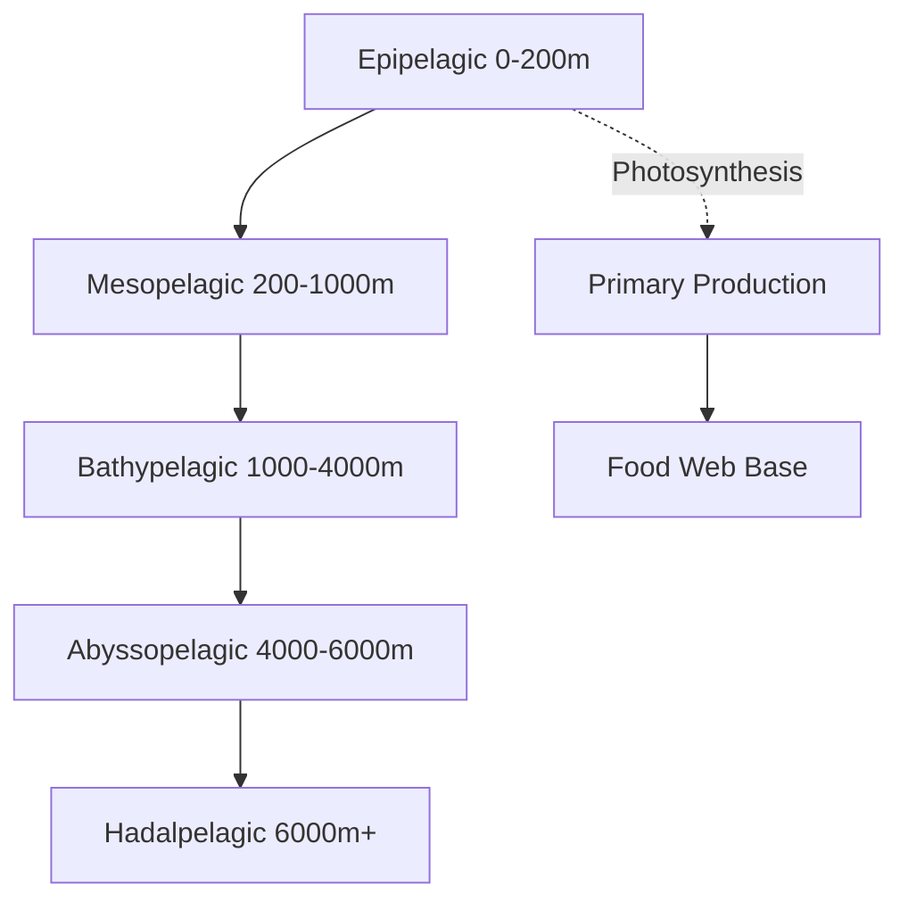

## Marine Ecosystems and Biological Oceanography

### Overview

Biological oceanography examines the distribution, abundance, and interactions of marine organisms in relation to the physical, chemical, and geological properties of the ocean. Marine ecosystems span the full range of ocean environments, from sunlit coastal waters to the perpetual darkness of the hadal trenches, and are structured around energy flow, nutrient cycling, and adaptation to physical gradients such as light, pressure, temperature, and salinity.

### Foundational Concepts

**Key Points**

- Marine ecosystems are organized by vertical light zonation and horizontal distance from shore
- Primary production forms the energetic base of nearly all marine food webs
- Biological and physical oceanography are tightly coupled: circulation, upwelling, and mixing directly control nutrient availability and thus biological productivity

#### Vertical Zonation of the Ocean

| Zone | Depth Range | Light Availability | Key Characteristics |
| --- | --- | --- | --- |
| Epipelagic (photic) | 0–200 m | Sufficient for photosynthesis | Phytoplankton, most fisheries |
| Mesopelagic (twilight) | 200–1,000 m | Dim, no net photosynthesis | Diel vertical migration, bioluminescence |
| Bathypelagic (midnight) | 1,000–4,000 m | None | Sparse biomass, scavengers |
| Abyssopelagic | 4,000–6,000 m | None | Extreme pressure, low temperature |
| Hadalpelagic | >6,000 m | None | Trench-confined, specialized fauna |

#### Horizontal Zonation

- **Neritic zone**: Water over the continental shelf, nutrient-rich, high productivity
- **Oceanic zone**: Open ocean beyond the shelf break, often nutrient-limited except in upwelling regions
- **Intertidal (littoral) zone**: Area between high and low tide marks, subject to extreme physical stress

### Primary Production

#### Phytoplankton and Photosynthesis

Phytoplankton (diatoms, dinoflagellates, coccolithophores, cyanobacteria) are responsible for an estimated 45–50% of global net primary production, despite representing less than 1% of Earth's photosynthetic biomass. The general photosynthetic reaction:

$$6CO_2 + 6H_2O + \text{light energy} \rightarrow C_6H_{12}O_6 + 6O_2$$

**Factors limiting primary production:**

- **Light**: Attenuates exponentially with depth per the Beer-Lambert law:

$$I(z) = I_0 e^{-kz}$$

where $I(z)$ is irradiance at depth $z$, $I_0$ is surface irradiance, and $k$ is the diffuse attenuation coefficient (water-clarity dependent)

- **Nutrients**: Nitrogen, phosphorus, and silica (for diatoms) are the primary limiting macronutrients; iron is a critical micronutrient limiting production in High-Nutrient, Low-Chlorophyll (HNLC) regions (e.g., Southern Ocean, equatorial Pacific)
- **Mixing and stratification**: Determines nutrient resupply to the euphotic zone from deeper waters

#### The Critical Depth Concept

Sverdrup's Critical Depth Hypothesis (1953) explains the timing of spring phytoplankton blooms in temperate waters: a bloom initiates when the mixed layer shoals above the critical depth, the depth at which integrated photosynthesis equals integrated respiration losses across the water column.

#### Chemosynthetic Primary Production

At hydrothermal vents and cold seeps, chemoautotrophic bacteria oxidize reduced compounds (e.g., hydrogen sulfide, methane) to fix carbon in the absence of sunlight:

$$6CO_2 + 6H_2O + 3H_2S \rightarrow C_6H_{12}O_6 + 3H_2SO_4$$

This supports dense, endemic communities (tube worms, vent crabs, vent mussels) independent of solar energy input.

### Upwelling and Nutrient Cycling

**Key Points**

- Upwelling brings cold, nutrient-rich deep water to the surface, fueling exceptionally high productivity
- Major upwelling systems occur along eastern ocean boundaries due to wind-driven Ekman transport (e.g., California Current, Humboldt/Peru Current, Benguela Current, Canary Current)
- These four Eastern Boundary Upwelling Ecosystems (EBUEs) support a disproportionate share of global fish catch relative to their area

The Ekman transport mechanism driving coastal upwelling operates via wind stress deflected 90° from wind direction (Northern Hemisphere: to the right; Southern Hemisphere: to the left) due to the Coriolis effect, causing net offshore surface water movement replaced by upwelled subsurface water.

**Biological pump**: The process by which biologically fixed carbon is transported from the surface ocean to depth via sinking organic particles (marine snow), fecal pellets, and vertical migration, playing a central role in the global carbon cycle and long-term $CO_2$ sequestration.

### Trophic Structure and Food Webs

#### Classic Marine Food Chain

$$\text{Phytoplankton} \rightarrow \text{Zooplankton} \rightarrow \text{Small fish} \rightarrow \text{Large predators}$$

**Trophic efficiency**: Approximately 10% of energy transfers between trophic levels (the "ten percent rule"), meaning marine food chains rarely exceed 4–5 levels before energy becomes limiting.

#### Microbial Loop

A pathway wherein dissolved organic matter (DOM), excreted or leaked by organisms, is taken up by heterotrophic bacteria, which are then consumed by protozoan grazers, returning otherwise-lost energy back into the classical food web. This concept, formalized by Azam et al. (1983), substantially revised earlier views of marine trophic dynamics.

### Major Marine Ecosystem Types

#### Coral Reef Ecosystems

- Restricted to warm (typically >18°C), shallow, well-lit, low-nutrient tropical waters
- Reef-building (hermatypic) corals rely on a mutualistic symbiosis with photosynthetic dinoflagellates (*Symbiodinium*, zooxanthellae) housed within coral tissue
- Despite covering <1% of the ocean floor, reefs are estimated to support roughly a quarter of all described marine species [Inference: precise percentage varies by source and survey methodology]
- **Coral bleaching**: Expulsion of zooxanthellae under thermal or other stress, causing loss of coloration and, if prolonged, coral mortality

#### Kelp Forests

- Found in cold, nutrient-rich temperate and subpolar coastal waters
- Dominated by large brown algae (e.g., *Macrocystis*, *Laminaria*), forming complex three-dimensional habitat
- Classic example of a keystone species interaction: sea otters predate sea urchins, preventing urchin overgrazing ("urchin barrens") that would otherwise deplete kelp stands

#### Estuarine and Salt Marsh Ecosystems

- Transitional zones between freshwater and marine environments, characterized by strong salinity gradients
- Among the most biologically productive ecosystems on Earth per unit area, functioning as nursery habitat for many commercially important species
- Salt marshes and mangroves provide significant blue carbon storage capacity

#### Polar Marine Ecosystems

- Sea ice algae form the base of Arctic and Antarctic food webs
- Antarctic krill (*Euphausia superba*) is a keystone species linking primary production to higher predators (whales, seals, penguins)
- Seasonal sea ice extent strongly regulates the timing and magnitude of primary production

#### Deep-Sea and Hydrothermal Vent Ecosystems

- Reliant on chemosynthesis (see above) or on sinking organic detritus ("marine snow") from surface waters
- Characterized by low biomass but often high species endemism
- Whale falls create temporary, localized chemosynthetic ecosystems on the abyssal seafloor, passing through successive faunal stages over years to decades

### Diel Vertical Migration

**Key Points**

- The largest synchronized animal migration on Earth by biomass, occurring daily
- Zooplankton and mesopelagic fish migrate from mesopelagic depths to the surface at night to feed, returning to depth at dawn to avoid visual predators
- This migration actively transports carbon to depth, contributing to the biological pump (sometimes termed the "migrant pump")

### Measurement and Methods in Biological Oceanography

- **Chlorophyll-a concentration**: Standard proxy for phytoplankton biomass, measurable via satellite ocean color sensors (e.g., MODIS, VIIRS) or in situ fluorometry
- **Net primary production (NPP) estimation**: Via $^{14}$C uptake incubation experiments or satellite-derived productivity models (e.g., Vertically Generalized Production Model)
- **Plankton tows and net sampling**: Physical collection for taxonomic and biomass assessment
- **Acoustic methods (echosounders)**: Used to detect and quantify zooplankton and fish biomass, including the "deep scattering layer" corresponding to mesopelagic organism aggregations
- **Molecular/genomic techniques**: Environmental DNA (eDNA) metabarcoding increasingly used for biodiversity assessment and species detection

### Example: Estimating Light Attenuation

**Example**

Given surface irradiance $I_0$ = 1,000 µmol photons m$^{-2}$s$^{-1}$ and an attenuation coefficient $k$ = 0.1 m$^{-1}$ (clear oceanic water), the irradiance at 30 m depth:

$$I(30) = 1000 \, e^{-0.1 \times 30} = 1000 \, e^{-3} \approx 49.8 \, \mu\text{mol photons m}^{-2}\text{s}^{-1}$$

This value approaches the typical light compensation point for many phytoplankton species, illustrating why the euphotic zone in clear oceanic water often extends to approximately 100–150 m (depth at which irradiance drops to ~1% of surface value), while more turbid coastal waters may have euphotic zones of only a few meters. [Inference: exact compensation points vary by species and photoacclimation state]

### Human Impacts on Marine Ecosystems

- **Overfishing**: Trophic cascades from removal of top predators or key forage species
- **Eutrophication**: Nutrient loading (especially nitrogen and phosphorus) from agricultural runoff driving harmful algal blooms and hypoxic "dead zones"
- **Ocean acidification**: Uptake of anthropogenic $CO_2$ lowering seawater pH, impairing calcification in corals, mollusks, and some plankton
- **Ocean warming**: Range shifts, altered phenology, and increased bleaching event frequency
- **Marine plastic pollution**: Physical and potentially chemical impacts across trophic levels

### Common Misconceptions

- Marine primary production is not dominated by large, visible algae — microscopic phytoplankton contribute the overwhelming majority
- Deep-sea ecosystems are not devoid of life; they host low-density but often highly specialized biological communities
- Coral reefs are not purely animal structures — their productivity and calcification depend fundamentally on algal symbionts

### Related Topics

- Ocean circulation patterns and their biological consequences (gyres, upwelling, thermohaline circulation)
- Global carbon cycle and the ocean's role as a carbon sink
- Harmful algal blooms and eutrophication dynamics
- Fisheries science and sustainable yield models
- Ocean acidification chemistry and carbonate system
- Marine biodiversity hotspots and biogeography
- Symbiosis and mutualism in marine systems
- Satellite remote sensing of ocean color and productivity
- Climate change impacts on marine species distribution
- Deep-sea exploration technologies (ROVs, AUVs, submersibles)