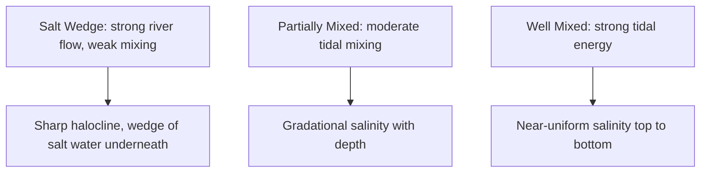
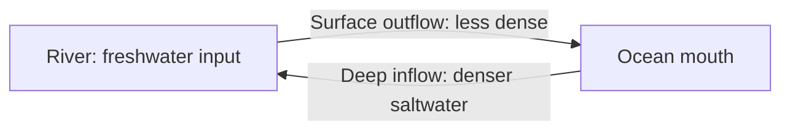
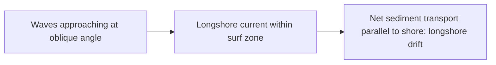

## Coastal and Estuarine Environments

### Overview

Coastal and estuarine environments occupy the dynamic transition zone between land and open ocean, shaped by the interplay of waves, tides, river discharge, sediment supply, and sea-level change. Despite covering a small fraction of the ocean's total area, these environments host disproportionately high biological productivity, biodiversity, and human population density, while also representing some of the most geomorphologically and ecologically vulnerable settings on Earth.

### Estuaries: Definition and Classification

An **estuary** is a semi-enclosed coastal water body with a free connection to the open sea, within which seawater is measurably diluted by freshwater derived from land drainage.

#### Classification by Origin (Geomorphology)

- **Coastal plain estuaries (drowned river valleys)**: Formed by post-glacial sea-level rise flooding existing river valleys; typically shallow and funnel-shaped (e.g., Chesapeake Bay).
- **Fjords**: Deep, glacially carved valleys flooded by the sea, often featuring a shallow sill at the mouth that restricts deep water exchange (e.g., Norwegian fjords).
- **Bar-built estuaries**: Shallow water bodies partially enclosed by sandbars or barrier islands built by wave and longshore sediment processes (e.g., many U.S. Gulf and Atlantic coast lagoons).
- **Tectonic estuaries**: Formed by fault-related subsidence or other tectonic processes creating a basin subsequently flooded by the sea (e.g., San Francisco Bay).

#### Classification by Circulation and Salinity Structure

| Type | Characteristics | Example Setting |
| --- | --- | --- |
| Salt wedge estuary | Strong river flow, weak tidal mixing; distinct wedge of denser saltwater intrudes beneath outflowing freshwater | High-discharge river mouths (e.g., Mississippi River mouth) |
| Partially mixed estuary | Moderate tidal mixing partially blends fresh and salt layers; gradational salinity with depth | Chesapeake Bay |
| Well-mixed estuary | Strong tidal energy relative to river flow thoroughly mixes water column; minimal vertical salinity gradient | Shallow, high-tidal-range systems |
| Fjord-type estuary | Deep basin with shallow sill restricting deep exchange; often stratified with potential for deep water stagnation | Norwegian and British Columbia fjords |

### Estuarine Circulation

- Freshwater input creates a horizontal density (salinity) gradient along the length of the estuary, less dense near the river mouth and more saline toward the ocean connection.
- This density gradient drives a characteristic **two-layer estuarine circulation**: less dense freshwater flows seaward at the surface, while denser seawater flows landward at depth, with turbulent mixing exchanging water and dissolved/suspended material between the layers.
- Tidal currents are typically superimposed on this net density-driven circulation, and in strongly tidal systems can dominate over the residual estuarine flow at any given moment.
- This circulation pattern is central to estuarine nutrient trapping, sediment retention, and the transport of larvae and pollutants.

### Sediment Dynamics in Coastal Systems

#### Sources and Transport

- Coastal sediment derives from river discharge, cliff/bluff erosion, biogenic production (shell material, coral debris), and offshore sources reworked shoreward by waves.
- **Longshore drift (littoral drift)**: The net alongshore transport of sediment caused by waves approaching the shore at an oblique angle, generating a longshore current within the surf zone that moves sand progressively along the coast.
- **Cross-shore transport**: Sediment movement perpendicular to shore, driven by wave energy variation (e.g., seasonal onshore transport during calm summer swell versus offshore transport during energetic winter storms in some settings).

#### Coastal Landforms

- **Beaches**: Accumulations of sediment (sand, gravel, or shell fragments) shaped by wave action, exhibiting a characteristic profile with berm, foreshore, and nearshore bar features that shift seasonally with wave energy.
- **Spits**: Elongated sand/gravel ridges extending from shore into open water, built by longshore drift where the coastline changes direction or an inlet interrupts sediment transport.
- **Barrier islands**: Long, narrow, sand islands paralleling the mainland shore, separated by a lagoon or sound; formed and maintained by wave, tidal, and sediment supply processes, and highly dynamic in response to storms and sea-level change.
- **Tidal flats and salt marshes**: Low-energy, sediment-accumulating environments in the intertidal zone, often vegetated (marshes) or unvegetated (mudflats), critically important for sediment trapping and shoreline stabilization.
- **Deltas**: Sediment deposits formed where a river enters standing water (ocean, sea, or lake) and sediment supply exceeds the removal capacity of waves and currents, producing characteristic distributary channel patterns.

### Coastal Ecosystems

#### Salt Marshes

- Vegetated intertidal wetlands dominated by salt-tolerant grasses (e.g., *Spartina* species), typically found in temperate latitudes with moderate to low wave energy.
- Provide critical nursery habitat for fish and invertebrates, filter pollutants and excess nutrients from land runoff, stabilize shorelines against erosion, and sequester substantial "blue carbon" in their sediments.

#### Mangrove Forests

- Salt-tolerant tree and shrub communities occupying tropical and subtropical intertidal zones, functionally analogous to temperate salt marshes but structurally more complex due to woody vegetation and specialized root systems (prop roots, pneumatophores) adapted to anoxic, saline sediment.
- Provide storm surge and wave attenuation, nursery habitat, and some of the highest carbon storage densities of any ecosystem type on a per-area basis.

#### Seagrass Meadows

- Submerged flowering plants (not algae) forming dense meadows in shallow, sheltered coastal waters; provide critical nursery and feeding habitat, stabilize sediment with their root systems, and contribute significantly to coastal blue carbon storage.

#### Estuarine Productivity

- Estuaries are frequently among the most biologically productive natural ecosystems on Earth, driven by nutrient input from land, efficient nutrient recycling via shallow depth and tidal mixing, and the trapping effect of estuarine circulation retaining nutrients and organic matter within the system.
- This productivity supports critical nursery habitat for a large proportion of commercially important fish and shellfish species, many of which spend only part of their life cycle in estuarine waters before migrating to open ocean or freshwater habitats.

### Physical Processes Shaping the Coast

#### Wave and Tidal Energy Regimes

- Coastlines are classified along a spectrum from **wave-dominated** (strong wave energy relative to tidal range, producing well-developed barrier/beach systems) to **tide-dominated** (strong tidal range relative to wave energy, producing funnel-shaped estuaries and extensive tidal flats), with many real coastlines falling in a **mixed-energy** category.

#### Sea-Level Change and Coastal Response

- Coastal environments continuously adjust to relative sea-level change, which integrates global (eustatic) sea-level change with local vertical land motion (subsidence or uplift, e.g., from sediment compaction, groundwater extraction, or tectonics).
- Barrier islands and marshes can migrate landward in response to sea-level rise (a process termed "rollover" or transgression) if sediment supply and accommodation space allow; where sediment supply is insufficient or human infrastructure prevents landward migration ("coastal squeeze"), these systems can drown or erode.
- Modern accelerated sea-level rise, combined with widespread coastal sediment supply reduction (from dam construction and shoreline hardening), places many coastal ecosystems under increasing stress. [Inference: the specific resilience or vulnerability of any given coastal system depends on local sediment budgets, subsidence rates, and management interventions, so generalized global vulnerability statements should be treated as broad tendencies rather than site-specific predictions.]

### Human Modification of Coastal Environments

**Key Points**

- **Shoreline hardening** (seawalls, bulkheads, riprap): Protects specific infrastructure but often increases erosion on adjacent unprotected shorelines and prevents natural landward marsh/beach migration.
- **Dredging and channelization**: Alters natural sediment transport and estuarine circulation patterns, often required for navigation but with ecological trade-offs.
- **Damming of rivers**: Reduces sediment supply to downstream deltas and coastlines, a major driver of delta subsidence and land loss (e.g., the Mississippi River Delta).
- **Nutrient loading**: Agricultural and urban runoff-derived nutrients can drive eutrophication and hypoxia in poorly flushed estuarine systems.
- **Coastal development**: Direct habitat loss and increased impervious surface runoff alter natural hydrology and sediment dynamics.

### Example

**Example: Estuarine Salinity Gradient and Nursery Habitat Use**

In a partially mixed, coastal plain estuary such as Chesapeake Bay, salinity increases progressively from nearly freshwater at the river mouth to fully marine conditions near the bay's ocean connection. Many commercially important species (e.g., blue crab, certain finfish) exploit this gradient by using the lower-salinity upper estuary as juvenile nursery habitat, offering some protection from marine predators and competitors, before migrating toward higher-salinity waters as they mature — illustrating how estuarine physical structure directly shapes life-history strategies of resident and migratory species.

### Related Topics

- Estuarine Circulation and Salinity Stratification in Detail
- Beach Morphodynamics and Longshore Sediment Transport
- Salt Marsh, Mangrove, and Seagrass Blue Carbon Ecosystems
- Sea-Level Rise, Land Subsidence, and Coastal Vulnerability Assessment
- Delta Formation, Subsidence, and River Sediment Management
- Barrier Island Dynamics and Storm Response
- Coastal Eutrophication and Estuarine Hypoxia
- Waves and Tidal Dynamics (physical forcing of coastal processes)
- Marine Ecosystems and Biological Oceanography (estuaries as nursery habitat)
- Coastal Zone Management and Living Shoreline Approaches