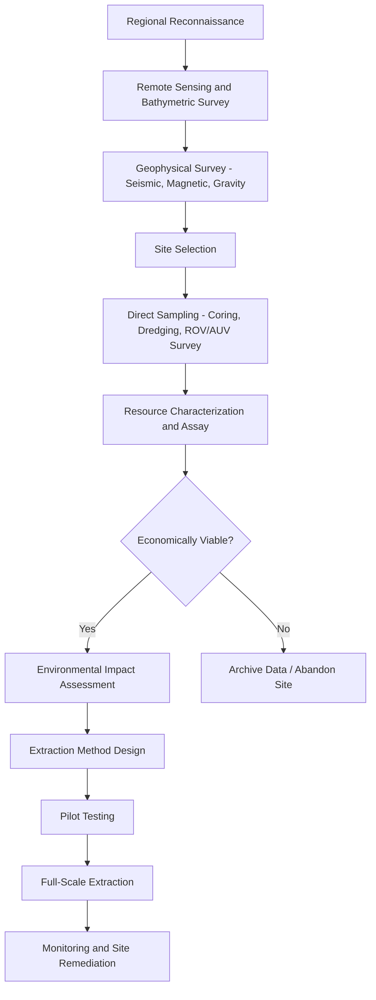

## Ocean Resources and Exploration

### Overview

Ocean resources and exploration encompass the scientific, technological, and economic activities involved in identifying, assessing, extracting, and sustainably managing materials and energy derived from marine environments, alongside the methods used to investigate the ocean's physical, chemical, biological, and geological properties. This domain spans shallow coastal waters to hadal trenches exceeding 10,000 meters in depth.

### Classification of Ocean Resources

**Key Points**

- Ocean resources are broadly categorized into physical (mineral and energy), biological (living), and chemical (dissolved substances) resources.
- Renewability varies significantly: biological resources are generally renewable if managed sustainably, while most mineral resources are non-renewable on human timescales.

#### Physical Resources

##### Mineral Resources

- **Placer deposits**: Concentrations of heavy minerals (gold, diamonds, tin as cassiterite, titanium-bearing sands) formed by wave and current sorting in nearshore sediments.
- **Polymetallic (manganese) nodules**: Potato-sized concretions found on abyssal plains, typically 4,000–6,000 m depth, containing manganese, nickel, copper, and cobalt. Formed through slow precipitation of metal hydroxides over millions of years, at growth rates on the order of a few millimeters per million years [Inference: precise growth rate depends on location and is an active research area].
- **Polymetallic sulfides**: Metal-rich deposits (copper, zinc, gold, silver) forming at hydrothermal vents along mid-ocean ridges and back-arc basins, precipitated when superheated, mineral-laden vent fluid mixes with cold seawater.
- **Cobalt-rich ferromanganese crusts**: Layered mineral coatings on seamount flanks, rich in cobalt, tellurium, and rare earth elements, forming through hydrogenetic precipitation from cold ambient seawater over geologic time.
- **Marine phosphorites**: Phosphate-rich sediments on continental margins, used in fertilizer production.
- **Sand and gravel**: Extracted for construction aggregate, typically from continental shelf deposits.

##### Energy Resources

- **Offshore oil and natural gas**: Hydrocarbons trapped in sedimentary basins beneath the seafloor, extracted via fixed platforms, floating production systems, or subsea completions.
- **Methane hydrates (gas hydrates)**: Ice-like crystalline structures of methane trapped within water molecule lattices, stable under high pressure and low temperature conditions found in continental margin sediments and permafrost. Represent a potentially vast but currently largely uncommercialized energy reserve [Inference: global estimates vary widely across studies].
- **Marine renewable energy**:
  - *Offshore wind*: Turbines mounted on fixed or floating foundations.
  - *Tidal energy*: Harnesses kinetic energy of tidal currents (barrages, tidal stream turbines) or potential energy of tidal range.
  - *Wave energy*: Converts oscillatory wave motion into electricity via point absorbers, oscillating water columns, or attenuators.
  - *Ocean Thermal Energy Conversion (OTEC)*: Exploits the temperature gradient between warm surface water and cold deep water to drive a heat engine.

#### Biological (Living) Resources

- **Fisheries**: Wild-capture harvesting of finfish, shellfish, and crustaceans; the largest economically exploited living marine resource category.
- **Aquaculture (mariculture)**: Controlled cultivation of marine organisms (fish, mollusks, crustaceans, macroalgae) in coastal or open-water systems.
- **Marine biotechnology / bioprospecting**: Extraction of bioactive compounds from marine organisms (sponges, algae, extremophile microbes) for pharmaceutical, cosmetic, and industrial applications.
- **Seaweed and algae harvesting**: Used for food, agar, alginates, and increasingly as biofuel feedstock.

#### Chemical Resources

- **Desalinated freshwater**: Produced via reverse osmosis or thermal distillation of seawater.
- **Dissolved salts and minerals**: Sodium chloride, magnesium, bromine, and potassium extracted through evaporation or chemical processing.

### Ocean Exploration Methods and Technologies

#### Remote Sensing (Surface-Based)

- **Satellite altimetry**: Measures sea surface height to infer ocean currents, eddies, and gravity-driven seafloor topography.
- **Satellite ocean color sensors**: Detect chlorophyll concentration and phytoplankton distribution via reflected light spectra.
- **Synthetic Aperture Radar (SAR)**: Used for sea ice mapping, oil spill detection, and surface wave characterization.

#### Acoustic Methods

- **Multibeam echosounders**: Emit fan-shaped sonar pulses to generate high-resolution bathymetric maps of the seafloor.
- **Side-scan sonar**: Produces detailed imagery of seafloor texture and objects by measuring the intensity of reflected acoustic signals.
- **Sub-bottom profilers**: Use lower-frequency acoustic pulses to image sediment layering beneath the seafloor surface.

#### Direct Sampling and In-Situ Instruments

- **CTD (Conductivity-Temperature-Depth) rosette**: Standard oceanographic instrument package measuring water column properties and collecting discrete water samples via Niskin bottles.
- **Sediment corers**: Gravity corers, piston corers, and box corers retrieve stratified seafloor sediment samples for paleoceanographic and geological analysis.
- **Dredges and grabs**: Mechanical samplers for retrieving rock, nodules, or biological specimens from the seafloor.
- **Argo floats**: Autonomous profiling floats that drift at depth and periodically surface, recording temperature and salinity profiles as part of a global observation array.

#### Underwater Vehicles

- **ROVs (Remotely Operated Vehicles)**: Tethered, pilot-controlled vehicles equipped with cameras, manipulator arms, and sampling tools; used for deep-sea exploration where direct human presence is impractical.
- **AUVs (Autonomous Underwater Vehicles)**: Untethered, pre-programmed or adaptively-controlled vehicles used for seafloor mapping, water column surveys, and infrastructure inspection.
- **HOVs (Human-Occupied Vehicles / submersibles)**: Crewed submersibles (e.g., deep-diving research submersibles) enabling direct human observation and sample collection at extreme depths.
- **Gliders**: Buoyancy-driven AUVs that use minimal energy to traverse long distances via a sawtooth vertical profile.

#### Drilling and Subsurface Investigation

- **Scientific ocean drilling**: Recovers sediment and rock cores from beneath the seafloor to study Earth's geological history, plate tectonics, and past climate, conducted through international scientific drilling programs.
- **Seismic reflection surveys**: Use sound wave reflection off subsurface rock boundaries to image sedimentary basin structure, critical for hydrocarbon exploration.

### Resource Extraction and Exploration Workflow

### Deep-Sea Mining: Case Study

**Example**

A polymetallic nodule mining operation in the Clarion-Clipperton Zone (a nodule-rich abyssal region of the Pacific Ocean) illustrates the integrated exploration-to-extraction pipeline:

1. Regional surveys using AUV-mounted multibeam sonar establish nodule density and distribution.
2. Box corer and camera sled sampling confirm nodule grade (metal concentration) and assess benthic community baseline.
3. A seafloor collector vehicle gathers nodules and pumps them via a riser system to a surface support vessel.
4. Nodules are dewatered and transferred to bulk carriers for transport to onshore processing facilities.
5. Sediment plumes generated by collection are monitored for dispersal and ecological impact.

[Inference: Commercial-scale deep-sea mining operations of this type were not yet in full-scale commercial production as of the most recent widely available data; regulatory frameworks under the International Seabed Authority remain under active development, and this should be treated as an evolving, unverified area subject to change.]

### Cross-Cutting Formula: Sound-Based Depth Determination

Bathymetric sonar systems calculate water depth ($d$) using the two-way travel time of an acoustic pulse:

$$d = \frac{v \cdot t}{2}$$

where $v$ is the speed of sound in seawater (approximately $1500 , \text{m/s}$, varying with temperature, salinity, and pressure) and $t$ is the round-trip travel time of the acoustic pulse.

### Environmental and Regulatory Considerations

**Key Points**

- The **International Seabed Authority (ISA)** regulates mineral-related activities in "the Area" — seabed and subsoil beyond national jurisdiction — under the UN Convention on the Law of the Sea (UNCLOS).
- **Exclusive Economic Zones (EEZs)** extend 200 nautical miles from a coastal state's baseline, granting that state resource rights within the zone.
- Major environmental concerns include sediment plume dispersal, benthic habitat destruction, noise pollution affecting marine mammals, and disruption of chemosynthetic ecosystems at hydrothermal vents.
- Marine Protected Areas (MPAs) and Areas of Particular Environmental Interest (APEIs) are designated to preserve representative habitats from extraction impacts.

### Illustrative Diagram: Ocean Resource Zonation by Depth (svg_diagram)

<svg xmlns="http://www.w3.org/2000/svg" viewBox="0 0 700 420">
<rect x="0" y="0" width="700" height="420" fill="url(#oceanGrad)" />
<text x="350" y="24" font-size="16" fill="#ffffff" text-anchor="middle" font-weight="bold">Ocean Resource Zonation by Depth (svg_diagram)</text>
<line x1="80" y1="40" x2="80" y2="400" stroke="#ffffff" stroke-width="1" stroke-dasharray="2,2" />

<rect x="80" y="40" width="150" height="60" fill="#c2e59c" fill-opacity="0.4" />
<text x="90" y="60" font-size="12" fill="#ffffff">0–200 m: Continental Shelf</text>
<text x="90" y="78" font-size="11" fill="#ffffff">Sand/gravel, placers, fisheries,</text>
<text x="90" y="92" font-size="11" fill="#ffffff">offshore oil &amp; gas, offshore wind</text>

<rect x="80" y="100" width="300" height="80" fill="#f6d186" fill-opacity="0.3" />
<text x="90" y="120" font-size="12" fill="#ffffff">200–3000 m: Continental Slope</text>
<text x="90" y="138" font-size="11" fill="#ffffff">Gas hydrates, deepwater oil &amp; gas,</text>
<text x="90" y="152" font-size="11" fill="#ffffff">cobalt-rich crusts (seamounts)</text>

<rect x="80" y="180" width="450" height="120" fill="#e29578" fill-opacity="0.25" />
<text x="90" y="200" font-size="12" fill="#ffffff">3000–6000 m: Abyssal Plain</text>
<text x="90" y="218" font-size="11" fill="#ffffff">Polymetallic nodules,</text>
<text x="90" y="232" font-size="11" fill="#ffffff">hydrothermal vent sulfides (ridges)</text>

<rect x="80" y="300" width="250" height="80" fill="#5b3a29" fill-opacity="0.3" />
<text x="90" y="320" font-size="12" fill="#ffffff">6000–11000 m: Hadal Zone</text>
<text x="90" y="338" font-size="11" fill="#ffffff">Trench sediments, scientific</text>
<text x="90" y="352" font-size="11" fill="#ffffff">exploration (HOV/ROV only)</text>

<circle cx="480" cy="220" r="6" fill="#ff6b35" />
<text x="492" y="224" font-size="10" fill="#ffffff">Hydrothermal vent</text>

<polygon points="330,180 360,100 390,180" fill="#8d6e63" fill-opacity="0.6" />
<text x="335" y="195" font-size="9" fill="#ffffff">Seamount</text>
</svg>

### Comparative Summary Table

| Resource Type | Primary Depth Zone | Extraction Method | Renewability |
| --- | --- | --- | --- |
| Placer deposits | 0–200 m | Dredging | Non-renewable |
| Offshore oil/gas | 0–3000 m | Platform/subsea wells | Non-renewable |
| Gas hydrates | 200–3000 m (slope) | Depressurization/thermal (experimental) | Non-renewable |
| Cobalt-rich crusts | Seamounts, 800–2500 m | Crust-cutting collector | Non-renewable |
| Polymetallic sulfides | Mid-ocean ridges | Seafloor massive sulfide mining | Non-renewable |
| Polymetallic nodules | 4000–6000 m | Collector vehicle + riser | Non-renewable |
| Fisheries | Variable (mostly shelf) | Trawling, longlining, netting | Renewable (if managed) |
| Tidal/wave/OTEC energy | Coastal/surface | Turbines, converters | Renewable |

### Next Steps

**Related Topics**

- Plate tectonics and seafloor spreading (formation context for mineral deposits)
- Hydrothermal vent ecosystems and chemosynthesis
- Marine Protected Areas and international ocean governance (UNCLOS, ISA)
- Bathymetry and seafloor mapping techniques
- Fisheries management and sustainable yield models
- Marine renewable energy systems engineering
- Deep-sea biodiversity and extremophile biology
- Climate change impacts on ocean resource distribution