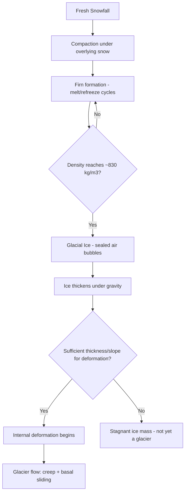

## Glacier Formation and Types

### Overview

A glacier is a persistent, large accumulation of crystalline ice, snow, rock, sediment, and water that originates on land and moves under its own weight via internal deformation and basal sliding. Glaciers form where annual snow accumulation exceeds ablation (melting, sublimation, and calving) over successive years, allowing snow to compact and recrystallize into glacial ice. They currently cover approximately 10% of Earth's land surface and store roughly 69% of the planet's freshwater [Inference: precise percentages vary slightly across sources and update as ice sheets change].

### Glacier Formation Process

#### Snow-to-Ice Transformation

Glacial ice forms through a progressive densification sequence:

1. **Fresh snow**: Newly fallen snow with density approximately $50$–$70 , \text{kg/m}^3$, composed of loosely packed ice crystals with high air content.
2. **Firn (névé)**: Snow that has survived at least one melt season, compacted by overlying snow load and partial melt-refreeze cycles; density increases to roughly $400$–$830 , \text{kg/m}^3$. Air passages between grains remain interconnected.
3. **Glacial ice**: Once density reaches approximately $830$–$917 , \text{kg/m}^3$, air passages become sealed off into discrete bubbles, and the material is classified as glacial ice. This transformation typically requires multiple years to centuries depending on accumulation rate and temperature.

$$\rho_{ice} \approx 917 , \text{kg/m}^3$$

#### Conditions Required for Glacier Formation

- **Climatic requirement**: Mean annual temperature must remain low enough that winter accumulation is not fully offset by summer ablation, sustaining a positive or balanced long-term mass budget.
- **Sufficient precipitation**: Adequate snowfall must occur, typically concentrated in a cold season, to supply the accumulation zone.
- **Time**: Sustained accumulation over years to millennia is required for sufficient compaction and ice thickness to enable flow.
- **Topographic setting**: High elevation, high latitude, or a combination of both provides the necessary cold conditions; local topography (cirques, valleys) often localizes initial snow accumulation.

#### Glacier Mass Balance

The health of a glacier is governed by its mass balance, the net difference between accumulation and ablation over a defined period (typically one year):

$$B = A - M$$

where $B$ is net mass balance, $A$ is total accumulation (snowfall, wind-deposited snow, avalanching, refreezing), and $M$ is total ablation (surface melt, sublimation, calving, wind erosion).

- **Equilibrium Line Altitude (ELA)**: The elevation on a glacier where accumulation equals ablation over a balance year ($B = 0$); above the ELA lies the **accumulation zone**, below it the **ablation zone**.
- A glacier with a positive long-term mass balance advances; a negative long-term mass balance causes retreat and thinning.

### Glacier Movement Mechanisms

**Key Points**

- **Internal deformation (creep)**: Ice crystals deform plastically under the stress of overlying ice mass, with individual crystal layers sliding past one another; described approximately by Glen's Flow Law.
- **Basal sliding**: The glacier slides over its bed, lubricated by a thin film of meltwater; dominant in temperate (warm-based) glaciers where the bed is at the pressure-melting point.
- **Bed deformation**: Where the glacier rests on unconsolidated, water-saturated sediment (till), the deforming sediment layer itself contributes to overall glacier motion.

Glen's Flow Law relates strain rate to applied shear stress:

$$\dot{\varepsilon} = A\tau^n$$

where $\dot{\varepsilon}$ is the strain rate, $\tau$ is shear stress, $A$ is a temperature-dependent flow parameter, and $n$ is typically taken as approximately 3 for glacial ice [Inference: the exponent $n$ is an empirically derived constant that can vary with ice fabric, impurity content, and temperature].

### Classification of Glacier Types

#### By Thermal Regime

- **Temperate (warm) glaciers**: Ice throughout is at or near the pressure-melting point; basal sliding is significant; common in mid-latitude and maritime settings.
- **Polar (cold) glaciers**: Ice is well below the pressure-melting point throughout, frozen to the bed; movement dominated by internal deformation with minimal basal sliding; typical of Antarctica and high-Arctic settings.
- **Polythermal glaciers**: Exhibit a mixture of temperate and cold ice within the same glacier, often cold at the surface and margins, temperate at depth or in the accumulation zone.

#### By Morphology and Setting

##### Alpine (Mountain) Glaciers

- **Cirque glaciers**: Small glaciers occupying bowl-shaped depressions (cirques) carved into mountainsides, often the initial stage of alpine glaciation.
- **Valley glaciers**: Larger glaciers that flow down pre-existing river valleys, confined by valley walls; often fed by one or more cirque glaciers.
- **Hanging glaciers**: Valley glaciers perched on steep mountainsides above a main valley, sometimes terminating in ice avalanches.
- **Piedmont glaciers**: Form where a valley glacier emerges from confining mountain terrain onto a broad lowland and spreads out into a lobe-shaped ice mass.
- **Tidewater glaciers**: Valley glaciers that terminate directly in the ocean, calving icebergs at the marine margin.

##### Ice Sheets and Related Large-Scale Forms

- **Ice sheets (continental glaciers)**: Massive ice masses exceeding 50,000 km² that bury underlying topography entirely; only two exist today, covering Antarctica and Greenland.
- **Ice caps**: Smaller dome-shaped ice masses (under 50,000 km²) that similarly bury underlying terrain but do not reach ice-sheet scale.
- **Ice fields**: Ice masses that follow underlying topography rather than fully burying it, with mountain peaks (nunataks) protruding through the ice surface.
- **Outlet glaciers**: Rivers of ice draining an ice sheet or ice cap through a topographic constraint (valley or gap in bounding mountains).
- **Ice streams**: Fast-flowing corridors of ice within an ice sheet, moving significantly faster than surrounding ice due to reduced basal friction, often channeling the bulk of an ice sheet's discharge to the ocean.
- **Ice shelves**: Floating extensions of an ice sheet where outlet glaciers or ice streams flow off land and onto the ocean surface, remaining attached to the grounded ice sheet.

### Comparative Table: Major Glacier Types

| Type | Typical Scale | Thermal Regime | Defining Feature |
| --- | --- | --- | --- |
| Cirque glacier | <1 km² | Variable | Bowl-shaped source basin |
| Valley glacier | 1–100+ km | Often temperate | Confined by valley walls |
| Piedmont glacier | Variable, lobate | Variable | Spreads out on lowland |
| Tidewater glacier | Variable | Often temperate | Terminates in ocean, calves |
| Ice cap | <50,000 km² | Often polar | Domes over topography |
| Ice sheet | >50,000 km² | Polar/polythermal | Buries continental-scale terrain |
| Ice shelf | Variable, floating | Polar | Floating, attached to ice sheet |

### Illustrative Diagram: Glacier Zones and Cross-Section (svg_diagram)

<svg xmlns="http://www.w3.org/2000/svg" viewBox="0 0 700 380">
<text x="350" y="24" font-size="16" fill="#1a1a1a" text-anchor="middle" font-weight="bold">Alpine Glacier Cross-Section (svg_diagram)</text>

<polygon points="0,300 150,80 300,300" fill="#8d99ae" fill-opacity="0.5" />
<polygon points="250,300 400,60 550,300" fill="#8d99ae" fill-opacity="0.6" />

<polygon points="150,80 300,300 400,300 400,60" fill="#e8f4fb" stroke="#5aa9c9" stroke-width="1.5" />
<text x="230" y="150" font-size="12" fill="#1f5f7a">Accumulation Zone</text>
<text x="230" y="168" font-size="10" fill="#1f5f7a">(snowfall &gt; melt)</text>

<line x1="120" y1="220" x2="580" y2="220" stroke="#e63946" stroke-width="2" stroke-dasharray="6,3" />
<text x="440" y="215" font-size="11" fill="#e63946">Equilibrium Line Altitude (ELA)</text>

<polygon points="300,300 400,300 400,220 550,300 620,300" fill="#cde4f0" stroke="#5aa9c9" stroke-width="1.5" />
<text x="440" y="270" font-size="12" fill="#1f5f7a">Ablation Zone</text>
<text x="440" y="288" font-size="10" fill="#1f5f7a">(melt &gt; snowfall)</text>

<text x="600" y="315" font-size="11" fill="`#1a1a1a`">Terminus</text>

<line x1="595" y1="300" x2="620" y2="300" stroke="`#1a1a1a`" stroke-width="2" />

<path d="M 250 180 L 320 260" stroke="#0a1f2e" stroke-width="2" marker-end="url(#arrow)" />
<path d="M 350 150 L 450 260" stroke="#0a1f2e" stroke-width="2" marker-end="url(#arrow)" />
<rect x="0" y="300" width="700" height="60" fill="#5b3a29" fill-opacity="0.4" />
<text x="10" y="330" font-size="10" fill="#3a2416">Bedrock</text>
</svg>

### Glacial Landforms as Formation Evidence

**Example**

The type and scale of a glacier's associated landforms provide direct evidence of formation history and dynamics:

- **Cirques**: Amphitheater-shaped basins left by cirque glacier erosion, often containing a tarn (small lake) after ice retreat.
- **U-shaped (glacial trough) valleys**: Distinctive broad, flat-floored, steep-sided valleys carved by valley glacier erosion, contrasting with V-shaped fluvial valleys.
- **Moraines**: Ridges of unsorted glacial till marking former ice margins (lateral, medial, terminal, and ground moraines).
- **Roche moutonnée**: Asymmetric bedrock knobs with a smooth, striated up-glacier face and a plucked, jagged down-glacier face, indicating ice flow direction.
- **Drumlins**: Streamlined, elongated hills of glacial till formed beneath moving ice sheets, with their long axis parallel to ice flow direction.

### Next Steps

**Related Topics**

- Glacier mass balance monitoring and remote sensing techniques
- Glacial erosion and depositional landforms
- Ice core stratigraphy and paleoclimate reconstruction
- Ice sheet dynamics and sea-level rise contributions
- Permafrost and periglacial processes
- Glacial isostatic adjustment (post-glacial rebound)