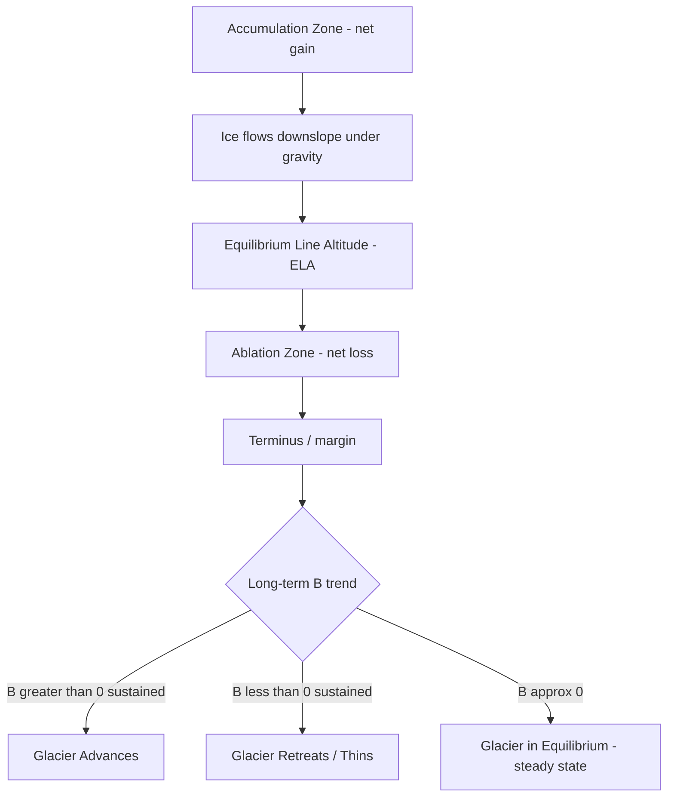

## Glacial Mass Balance and Movement

### Overview

Glacial mass balance describes the net gain or loss of ice and snow mass on a glacier over a defined time interval, while glacial movement encompasses the physical mechanisms by which glacial ice flows under gravitational and internal stresses. These two processes are fundamentally linked: mass balance determines the ice thickness and surface slope that drive flow, while flow redistributes mass from accumulation areas to ablation areas, sustaining the glacier's overall geometry.

### Mass Balance Fundamentals

#### Components of Mass Balance

- **Accumulation**: All processes adding mass to a glacier, including direct snowfall, wind-drifted snow, avalanche deposition, and refreezing of meltwater within the snowpack (superimposed ice formation).
- **Ablation**: All processes removing mass, including surface melting, sublimation, calving of icebergs at marine or lacustrine margins, and wind erosion (scouring) of surface snow.

The net mass balance ($B$) over a balance year is:

$$B = A - M$$

This is often normalized to a specific mass balance ($b$), expressed per unit area, typically in units of meters water equivalent (m w.e.):

$$b = \frac{B}{S}$$

where $S$ is the glacier's surface area.

#### Equilibrium Line Altitude (ELA)

**Key Points**

- The **ELA** is the elevation contour on a glacier's surface where the local mass balance is exactly zero ($b = 0$) at the end of the balance year.
- Above the ELA lies the **accumulation zone** (net mass gain); below it lies the **ablation zone** (net mass loss).
- ELA position fluctuates annually with climate variability and is widely used as a proxy indicator of climatic conditions; a rising ELA trend over successive years generally signals warming or reduced precipitation.
- The **Accumulation Area Ratio (AAR)**, the fraction of total glacier area lying above the ELA, is another commonly used diagnostic of glacier health; an AAR near 0.5–0.8 is often associated with a glacier in approximate equilibrium [Inference: the specific equilibrium AAR value varies by glacier morphology and region and is empirically calibrated per glacier or glacier population].

#### Types of Mass Balance Measurement

- **Glaciological (direct) method**: Uses stakes drilled into the ice and snow pits to directly measure accumulation and ablation at point locations, then extrapolates across the glacier surface.
- **Geodetic method**: Compares repeat surface elevation measurements (from aerial photogrammetry, satellite altimetry, or lidar) over multi-year intervals to calculate volume change, converted to mass using an assumed or measured density.
- **Gravimetric method**: Uses satellite gravity measurements (such as those from the GRACE and GRACE-FO satellite missions) to detect mass changes at regional to global scales via changes in Earth's gravity field.
- **Input-output (mass budget) method**: Compares modeled or measured accumulation (input) against measured ice discharge and runoff (output) to infer mass balance, commonly applied to ice sheets and outlet glacier systems.

### Mechanisms of Glacial Movement

#### Internal Deformation (Creep)

Ice behaves as a non-Newtonian viscous fluid under sustained stress, deforming through the movement of dislocations within individual ice crystals and slippage along crystal planes. This process, called creep, is described empirically by **Glen's Flow Law**:

$$\dot{\varepsilon} = A\tau^n$$

where:

- $\dot{\varepsilon}$ = strain rate (deformation per unit time)
- $\tau$ = applied shear stress
- $A$ = a flow rate parameter, strongly temperature-dependent (increases with warmer ice)
- $n$ = a flow law exponent, commonly taken as approximately 3

Because shear stress increases with depth (proportional to overlying ice thickness and surface slope), deformation velocity typically increases toward the glacier bed, producing a characteristic velocity profile.

#### Basal Sliding

- Occurs when the base of the glacier is at the pressure-melting point, allowing a thin film of meltwater to lubricate the ice-bed interface.
- **Regelation**: A component of basal sliding in which ice melts under high pressure on the up-glacier side of a bedrock obstacle, flows around the obstacle as water, and refreezes on the down-glacier (lower-pressure) side.
- **Enhanced basal creep**: Ice flows around bedrock obstacles too large for regelation alone to bypass efficiently.
- Basal sliding rates are strongly influenced by subglacial water pressure; elevated water pressure reduces effective friction at the bed, increasing sliding velocity.

#### Bed (Subglacial Sediment) Deformation

- Where glaciers rest on water-saturated, unconsolidated sediment (till) rather than bedrock, the till itself can deform plastically, contributing directly to forward motion.
- This mechanism is particularly significant beneath fast-flowing ice streams and portions of ice sheets underlain by soft sedimentary basins.

#### Relative Contribution by Glacier Type

| Glacier Type | Dominant Mechanism(s) | Basal Sliding Contribution |
| --- | --- | --- |
| Polar (cold-based) glacier | Internal deformation | Minimal to none (frozen bed) |
| Temperate (warm-based) glacier | Internal deformation + basal sliding | Significant, often majority of surface velocity |
| Ice stream (soft bed) | Bed deformation + basal sliding | Dominant |
| Polythermal glacier | Mixed, depth- and location-dependent | Variable |

### Velocity Profile and Flow Patterns

**Key Points**

- Surface velocity is generally the sum of the internal deformation component (integrated through the ice thickness) and the basal sliding component.
- Velocity typically increases from the glacier margins toward the center line (due to reduced drag from valley walls) and can vary substantially along flow due to changes in bed slope, ice thickness, and basal conditions.
- **Extending flow**: Occurs where the glacier bed steepens or ice thickness decreases down-glacier, causing longitudinal stretching and surface crevassing.
- **Compressing flow**: Occurs where the bed shallows or ice thickens down-glacier, causing longitudinal compression, thickening, and sometimes overriding of ice (thrust faulting in the case of cold ice).

The approximate surface velocity can be conceptually decomposed as:

$$u_{surface} = u_{deformation} + u_{sliding}$$

### Response of Glacier Geometry to Mass Balance

**Example**

Consider a valley glacier subjected to a sustained period of negative mass balance due to regional warming:

1. Ablation zone expands as the ELA migrates upglacier.
2. Reduced ice supply to lower elevations causes the terminus to retreat.
3. Thinning reduces driving stress (proportional to ice thickness and surface slope), which in turn reduces flow velocity via Glen's Flow Law.
4. Reduced velocity further limits mass transfer from the accumulation zone to the ablation zone, reinforcing thinning in a feedback loop.
5. If the imbalance persists, the glacier may fragment into disconnected ice masses or disappear entirely at lower elevations, a process observed broadly across many mountain glacier systems globally [Inference: rates and thresholds are highly glacier- and region-specific and continue to be actively monitored].

### Illustrative Diagram: Ice Velocity Profile Through a Glacier Cross-Section (svg_diagram)

<svg xmlns="http://www.w3.org/2000/svg" viewBox="0 0 700 380">
<text x="350" y="24" font-size="16" fill="#1a1a1a" text-anchor="middle" font-weight="bold">Glacier Velocity Profile (svg_diagram)</text>

<rect x="80" y="80" width="500" height="220" fill="#cde4f0" stroke="#5aa9c9" stroke-width="1.5" />
<text x="90" y="70" font-size="12" fill="#1a1a1a">Ice Surface</text>

<rect x="80" y="300" width="500" height="40" fill="#5b3a29" fill-opacity="0.5" />
<text x="90" y="325" font-size="11" fill="#3a2416">Bedrock (basal boundary)</text>

<line x1="150" y1="290" x2="165" y2="290" stroke="#0a1f2e" stroke-width="2" />
<line x1="150" y1="240" x2="200" y2="240" stroke="#0a1f2e" stroke-width="2" />
<line x1="150" y1="190" x2="260" y2="190" stroke="#0a1f2e" stroke-width="2" />
<line x1="150" y1="140" x2="320" y2="140" stroke="#0a1f2e" stroke-width="2" />
<line x1="150" y1="95" x2="370" y2="95" stroke="#0a1f2e" stroke-width="2" />
<path d="M 150 300 L 150 90" stroke="#1a1a1a" stroke-width="1" stroke-dasharray="3,3" />

<text x="400" y="98" font-size="10" fill="`#1a1a1a`">Max velocity (deformation + sliding)</text>

<text x="270" y="192" font-size="10" fill="`#1a1a1a`">Intermediate (internal deformation)</text>

<text x="170" y="288" font-size="10" fill="`#1a1a1a`">Basal sliding component</text>

<text x="90" y="360" font-size="11" fill="`#1a1a1a`">Velocity increases from bed to surface due to cumulative internal deformation;</text>

<text x="90" y="375" font-size="11" fill="`#1a1a1a`">offset at base reflects basal sliding contribution (temperate glacier example)</text>

</svg>

### Next Steps

**Related Topics**

- Glacier formation and firn-to-ice densification
- Ice sheet dynamics and ice stream discharge
- Remote sensing methods for glacier monitoring (satellite altimetry, InSAR, GRACE)
- Glacial isostatic adjustment and sea-level rise contributions
- Crevasse formation and glacial hazards (icefalls, calving events)
- Subglacial hydrology and its influence on basal sliding