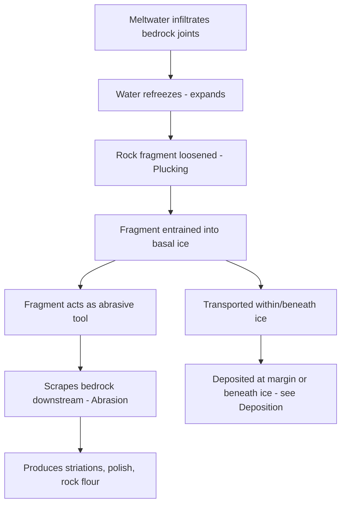

## Glacial Erosion and Deposition

### Overview

Glacial erosion and deposition are the complementary processes by which moving ice sculpts landscapes: erosion removes and entrains rock and sediment from the glacier bed and margins, while deposition releases this transported material to form distinctive landforms. Together they constitute the primary agents of landscape modification in glaciated regions, producing landform assemblages that remain diagnostic long after the ice itself has retreated.

### Glacial Erosion

#### Erosional Mechanisms

- **Plucking (quarrying)**: Meltwater infiltrates joints and fractures in bedrock beneath or at the margin of a glacier, then refreezes, expanding and prying rock fragments loose, which are subsequently entrained into the moving ice. Most effective where bedrock is already fractured or jointed.
- **Abrasion**: Rock fragments embedded in the base and sides of the glacier act as an abrasive tool, scraping and grinding against the underlying bedrock as the ice moves, producing polished surfaces, striations (linear scratches), and fine-grained rock flour.
- **Meltwater erosion**: Subglacial and englacial meltwater channels erode bedrock and sediment through fluvial-style hydraulic action, sometimes at high pressure.
- **Freeze-thaw (frost) weathering**: Operating at glacier margins and on adjacent exposed rock, repeated freezing and thawing of water in cracks weakens rock, supplying additional debris for glacial transport.

#### Factors Controlling Erosion Rate

**Key Points**

- **Ice velocity**: Faster-moving ice generally increases both plucking and abrasion rates.
- **Basal debris concentration**: Erosion by abrasion requires rock fragments at the ice-bed interface; debris-poor basal ice erodes less effectively regardless of velocity.
- **Bedrock lithology and structure**: Jointed, fractured, or mechanically weak rock is more susceptible to plucking; hard, massive rock resists erosion but can still be abraded and polished.
- **Basal thermal regime**: Erosion (particularly plucking, which depends on meltwater refreezing) is generally more effective beneath temperate (warm-based) glaciers than beneath cold-based, frozen glaciers where the ice is largely frozen to the bed and basal motion is minimal.
- **Subglacial water pressure**: Influences both basal sliding rate and the effectiveness of meltwater-driven quarrying processes.

#### Erosional Landforms

##### Small-Scale (Surface) Features

- **Striations**: Fine, parallel scratches on bedrock surfaces caused by abrasion, useful for reconstructing former ice flow direction.
- **Glacial polish**: Smooth, shiny bedrock surface produced by fine-grained abrasion.
- **Roche moutonnée**: An asymmetric bedrock knob with a gently sloping, smoothed, striated up-glacier (stoss) face shaped by abrasion, and a steep, jagged down-glacier (lee) face shaped by plucking; indicates ice flow direction.
- **Chattermarks and crescentic gouges**: Small curved fractures produced by the vibrating, chipping action of debris-laden ice moving over bedrock.

##### Large-Scale Landforms

- **Cirques**: Amphitheater-shaped erosional basins carved at the head of alpine glaciers through a combination of plucking, abrasion, and freeze-thaw weathering (nivation); often contain a tarn (small lake) following ice retreat.
- **Arêtes**: Sharp, knife-edged ridges formed where two adjacent cirques erode headward toward one another from opposite sides.
- **Horns**: Pyramidal peaks formed where three or more cirques erode a mountain from multiple sides (a classically cited example is the Matterhorn in the Alps).
- **Glacial troughs (U-shaped valleys)**: Broad, steep-sided, flat-floored valleys produced when a valley glacier erodes and widens a pre-existing V-shaped river valley.
- **Hanging valleys**: Tributary glacial valleys left elevated above the main trough after the (typically larger, faster-eroding) trunk glacier has cut down more deeply; often produce waterfalls at the valley mouth after deglaciation.
- **Fjords**: Glacial troughs that have been eroded below sea level and subsequently flooded by the ocean following deglaciation and sea-level rise.
- **Roches moutonnées fields and streamlined bedrock**: Regions of extensively abraded and plucked bedrock indicating former ice sheet cover.

### Glacial Deposition

#### Depositional Mechanisms

- **Lodgement**: Debris-laden basal ice deposits sediment directly onto the bed through pressure melting and frictional resistance as the glacier moves over it, producing a compact, often overconsolidated till.
- **Melt-out**: Sediment is released as stagnant or slow-moving ice melts in place, without significant subsequent reworking, often producing looser, less compacted deposits than lodgement till.
- **Meltwater (fluvioglacial) deposition**: Sediment is transported and deposited by glacial meltwater streams, both beneath, within, at the margin of, and beyond the ice, sorted and stratified according to normal fluvial processes.
- **Ice-marginal dumping**: Debris carried on or within the ice is deposited directly at the glacier terminus or lateral margins as the ice melts back.

#### Classification of Glacial Deposits

**Key Points**

- **Till**: Unsorted, unstratified sediment deposited directly by glacial ice, containing a heterogeneous mixture of grain sizes from clay to boulders.
- **Glaciofluvial (outwash) sediment**: Sorted and stratified sediment deposited by glacial meltwater, exhibiting normal fluvial bedding and grain-size sorting, distinct from till.
- **Glaciolacustrine and glaciomarine sediment**: Fine-grained, often laminated sediment deposited in glacial lakes or the ocean, respectively, from suspended sediment settling out of meltwater plumes (varves are an example of annually laminated glaciolacustrine deposits).

#### Depositional Landforms

##### Ice-Contact (Direct Ice-Deposited) Landforms

- **Moraines**: Ridges or mounds of till marking former ice margins or flow paths.
  - *Terminal (end) moraine*: Marks the farthest advance (maximum extent) of a glacier.
  - *Recessional moraine*: Marks a temporary standstill position during overall glacier retreat.
  - *Lateral moraine*: Ridge of debris deposited along the sides of a valley glacier.
  - *Medial moraine*: Forms where two valley glaciers converge and their lateral moraines merge into a single debris stripe running down the center of the combined ice stream.
  - *Ground moraine*: A relatively thin, widespread layer of till deposited beneath a glacier as it retreats, often forming gently undulating terrain.
- **Drumlins**: Streamlined, elongated hills of till (or occasionally bedrock-cored) shaped by moving ice, with a blunt, steep end facing up-ice and a tapered, gentler end facing down-ice; typically occur in swarms ("drumlin fields") and indicate former ice flow direction.
- **Erratics**: Individual boulders or rock fragments transported by ice and deposited far from their bedrock source, often of a distinctly different lithology than the local bedrock.

##### Glaciofluvial (Meltwater-Deposited) Landforms

- **Eskers**: Long, sinuous ridges of sorted sand and gravel deposited by meltwater streams flowing within, beneath, or on top of stagnant or slow-moving ice; upon ice melt, the former channel deposit is left as a positive-relief ridge.
- **Kames**: Mounds or hummocks of stratified sand and gravel deposited by meltwater in contact with stagnant ice (e.g., in crevasses, at the ice margin, or in supraglacial depressions).
- **Kettles (kettle holes)**: Depressions formed when a block of stagnant ice buried in outwash sediment eventually melts, causing the overlying sediment to collapse into the resulting void; often fill with water to form kettle lakes.
- **Outwash plains (sandar)**: Broad, gently sloping plains of stratified glaciofluvial sediment deposited beyond the ice margin by braided meltwater streams.
- **Kame terraces**: Terrace-like deposits of stratified sediment formed between a glacier margin and a valley wall.

### Comparative Table: Erosional vs. Depositional Landforms

| Category | Landform | Formation Process | Diagnostic Indicator |
| --- | --- | --- | --- |
| Erosional | Cirque | Plucking + abrasion + nivation | Amphitheater shape, often with tarn |
| Erosional | Arête / Horn | Convergent cirque erosion | Sharp ridges/peaks |
| Erosional | Glacial trough (U-valley) | Valley widening/deepening | Flat floor, steep walls |
| Erosional | Roche moutonnée | Abrasion (stoss) + plucking (lee) | Asymmetric bedrock knob |
| Depositional | Terminal moraine | Ice-margin debris dumping | Arcuate ridge at max extent |
| Depositional | Drumlin | Subglacial till streamlining | Blunt up-ice, tapered down-ice |
| Depositional | Esker | Subglacial/englacial meltwater channel infill | Sinuous ridge, sorted sediment |
| Depositional | Kettle | Buried ice block melt-out | Closed depression, often a lake |
| Depositional | Outwash plain | Braided meltwater deposition | Broad, sorted, stratified sediment |

### Illustrative Diagram: Glacial Landform Assemblage in a Retreating Valley Glacier System (svg_diagram)

<svg xmlns="http://www.w3.org/2000/svg" viewBox="0 0 750 420">
<text x="375" y="24" font-size="16" fill="#1a1a1a" text-anchor="middle" font-weight="bold">Glacial Landform Assemblage (svg_diagram)</text>

<polygon points="20,340 120,120 220,340" fill="#8d99ae" fill-opacity="0.5" />
<polygon points="150,340 260,90 370,340" fill="#8d99ae" fill-opacity="0.6" />

<polygon points="120,120 220,340 260,340 260,90" fill="#dceefb" stroke="#5aa9c9" stroke-width="1.5" />
<text x="150" y="200" font-size="11" fill="#1f5f7a">Remaining Ice</text>

<path d="M 220 340 Q 400 380 600 340" fill="none" stroke="#5b3a29" stroke-width="3" />
<text x="380" y="400" font-size="11" fill="#3a2416">Glacial Trough (U-shaped valley floor)</text>

<ellipse cx="300" cy="335" rx="40" ry="12" fill="#8d6e63" />
<text x="260" y="360" font-size="10" fill="#3a2416">Terminal Moraine</text>

<ellipse cx="420" cy="330" rx="18" ry="10" fill="#5aa9c9" />
<text x="400" y="358" font-size="10" fill="#1f5f7a">Kettle Lake</text>

<path d="M 340 320 Q 420 300 500 315" fill="none" stroke="#c19a6b" stroke-width="6" stroke-linecap="round" />
<text x="470" y="300" font-size="10" fill="#5b3a29">Esker</text>

<rect x="500" y="320" width="200" height="20" fill="#e8d9b5" />
<text x="560" y="358" font-size="10" fill="#5b3a29">Outwash Plain</text>

<path d="M 120 130 L 145 335" stroke="#8d6e63" stroke-width="5" />
<text x="60" y="250" font-size="10" fill="#3a2416">Lateral Moraine</text>

<ellipse cx="600" cy="345" rx="30" ry="8" fill="#a0785a" />
<text x="620" y="335" font-size="10" fill="#3a2416">Drumlin</text>
</svg>

### Applied Example: Reconstructing Former Ice Flow

**Example**

A field geologist mapping a deglaciated terrain can reconstruct former ice flow direction and dynamics using a combination of erosional and depositional evidence:

1. Striation orientation on exposed bedrock indicates the direction of ice movement at that point.
2. Roche moutonnée asymmetry (smooth stoss side vs. plucked lee side) confirms flow direction and distinguishes up-ice from down-ice.
3. Drumlin long-axis orientation across a broader area corroborates regional ice flow patterns.
4. The distribution and lithology of erratic boulders can be traced back to a specific bedrock source area, quantifying transport distance and confirming flow path.
5. A sequence of nested recessional moraines allows reconstruction of successive still-stands during overall ice retreat, sometimes datable using cosmogenic exposure dating or radiocarbon dating of associated organic material.

### Next Steps

**Related Topics**

- Glacier formation and firn-to-ice densification
- Glacial mass balance and movement mechanics
- Subglacial hydrology and meltwater drainage systems
- Periglacial and permafrost landscapes
- Paleoclimate reconstruction from glacial and glaciolacustrine deposits
- Isostatic rebound following deglaciation