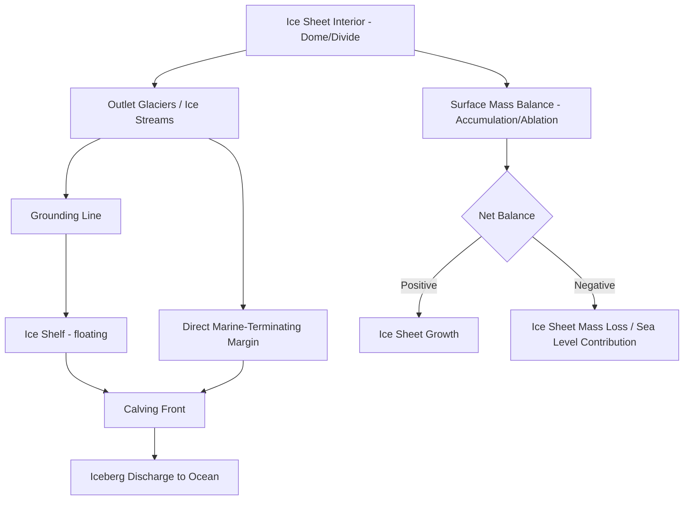

## Ice Sheets and Ice Cores

### Overview

Ice sheets are continental-scale masses of glacial ice that bury underlying topography and flow outward under their own weight, while ice cores are cylindrical samples drilled through these ice masses (and other glaciers) that preserve a stratified archive of past atmospheric composition, temperature, and environmental conditions. Together, ice sheets represent both a major component of the global cryosphere with direct implications for sea-level rise, and, through ice core science, one of the most detailed and continuous paleoclimate records available to Earth science.

### Ice Sheets

#### Definition and Global Distribution

- An **ice sheet** is defined as a glacial ice mass exceeding 50,000 km² in area that completely buries the underlying landscape, in contrast to smaller ice caps or ice fields that may leave peaks (nunataks) exposed.
- Two ice sheets exist on Earth today: the **Antarctic Ice Sheet** and the **Greenland Ice Sheet**. Collectively they store the vast majority of Earth's freshwater ice.
- The Antarctic Ice Sheet is conventionally divided into the **East Antarctic Ice Sheet (EAIS)**, generally grounded above sea level and considered comparatively more stable, and the **West Antarctic Ice Sheet (WAIS)**, substantially grounded below sea level on a reverse-sloping bed and considered more dynamically vulnerable to ocean-driven melting [Inference: relative stability assessments are drawn from the broader glaciological literature and are subject to ongoing refinement as monitoring continues].

#### Structural Components

- **Ice divides**: Topographic ridgelines on the ice sheet surface analogous to a drainage divide, separating flow into different outlet directions.
- **Interior (ice sheet dome)**: The thickest, slowest-moving central portion, dominated by internal deformation with minimal basal sliding, typically cold-based.
- **Outlet glaciers**: Fast-flowing channels of ice draining the interior through gaps in bounding topography (e.g., mountain ranges), often reaching several kilometers in thickness.
- **Ice streams**: Corridors of markedly faster-flowing ice within the ice sheet interior itself, not necessarily topographically constrained, often underlain by deformable, water-saturated sediment; responsible for transporting the bulk of an ice sheet's mass toward its margins.
- **Ice shelves**: Floating extensions of the ice sheet formed where outlet glaciers and ice streams flow off the grounded bed and onto the ocean surface, remaining structurally attached to the grounded ice.
- **Grounding line**: The boundary where grounded, bed-supported ice transitions to floating ice shelf; its position is a critical indicator of ice sheet stability, as grounding line retreat generally indicates ice sheet mass loss.

#### Mass Balance and Stability Concerns

**Key Points**

- Ice sheet mass balance is governed by the same accumulation-minus-ablation framework as smaller glaciers, but with an additional major loss term: **iceberg calving** and **basal melting beneath ice shelves**, alongside surface melt and runoff.
- **Marine Ice Sheet Instability (MISI)**: A hypothesized (and, for parts of West Antarctica, observationally supported) feedback mechanism in which grounding line retreat onto a reverse-sloping (deepening inland) bed leads to increasing ice flux and further retreat, potentially self-sustaining once initiated [Inference: the degree to which MISI is actively underway in specific sectors remains an area of active research with evolving assessments].
- **Marine Ice Cliff Instability (MICI)**: A more speculative mechanism proposing that sufficiently tall ice cliffs exposed at calving fronts (following ice shelf loss) could structurally fail under their own weight, contributing to rapid ice loss; this remains more uncertain and is treated with caution in the scientific literature. [Speculation: MICI's magnitude and applicability are contested and represent a less well-constrained area of glaciological modeling.]
- Ice sheet contributions to global mean sea-level rise are tracked through a combination of satellite gravimetry, altimetry, and input-output mass budget methods.

### Ice Cores

#### Purpose and Scientific Rationale

Ice cores preserve an approximately chronological archive of past atmospheric and environmental conditions because falling snow traps air bubbles, dust, volcanic ash, and chemical tracers as it is progressively buried and compacted into ice. Because accumulation is generally continuous over long timescales in cold, high-accumulation regions, the resulting stratigraphy can be used to reconstruct climate history extending back hundreds of thousands of years in the longest Antarctic records.

#### Drilling Methods

- **Shallow coring**: Hand augers or lightweight mechanical drills used to recover the upper firn layers (typically tens of meters), sufficient for recent (multi-decadal to centennial) climate records.
- **Deep ice core drilling**: Employs rotating drill barrels with cutting heads, typically using a drilling fluid (such as a low-freezing-point liquid) to counteract borehole closure from ice pressure at depth and to reduce friction, capable of reaching depths of several kilometers to bedrock in the thickest parts of ice sheets.
- **Core handling**: Retrieved core sections are logged, cut, and preserved in refrigerated conditions to prevent structural or chemical alteration prior to laboratory analysis.

#### What Ice Cores Preserve

**Key Points**

- **Trapped air bubbles**: Direct physical samples of ancient atmosphere, analyzed for greenhouse gas concentrations (CO₂, CH₄, N₂O) and other atmospheric constituents.
- **Stable water isotopes** ($\delta^{18}O$ and $\delta D$, deuterium): Ratios of heavy to light isotopes in the ice itself serve as a temperature proxy, since isotopic fractionation during evaporation and precipitation is temperature-dependent.
- **Dust and aerosol particles**: Provide evidence of past atmospheric circulation patterns, aridity in dust source regions, and volcanic activity (via sulfate spikes and tephra layers).
- **Chemical impurities**: Trace ions (sulfate, nitrate, sea salt species) record volcanic eruptions, marine influence, and biomass burning history.
- **Annual layering**: In high-accumulation sites, seasonal variations in dust content, isotopic composition, or visible structure allow individual annual layers to be counted, analogous to tree rings, providing precise chronological control for the upper (younger) portion of a core.

#### Dating Methods for Ice Cores

- **Annual layer counting**: Direct counting of seasonal cycles, most reliable in the upper, less-compressed sections of high-accumulation cores.
- **Reference horizons**: Matching known volcanic eruption signatures (sulfate spikes) or other independently dated events across multiple cores to synchronize and validate chronologies.
- **Ice flow (glaciological) modeling**: Used for deeper, more compressed ice where annual layers become too thin to resolve individually, modeling the thinning and vertical strain history of ice as it is buried and flows.
- **Gas-age vs. ice-age offset**: Because air is trapped in bubbles only after firn pores close off (a process that takes years to centuries after the surrounding ice itself was deposited), the age of trapped gas is systematically younger than the age of the surrounding ice at the same depth; this offset must be corrected for when interpreting greenhouse gas records precisely.

$$\Delta age = age_{ice} - age_{gas}$$

### Key Ice Core Records

**Example**

Several long ice core records have been central to reconstructing Late Pleistocene and Holocene climate history:

- Deep Antarctic ice cores (such as those recovered from Vostok Station and Dome C, East Antarctica) have extended continuous climate records to several hundred thousand years, revealing multiple glacial-interglacial cycles.
- Greenland ice cores (such as those from the GRIP and GISP2 projects) provide high-resolution records of Northern Hemisphere climate variability, including rapid climate oscillations during the last glacial period.
- Comparison of Greenland and Antarctic records has been used to study the relative timing and possible interhemispheric linkages of abrupt climate events. [Unverified: specific site names, exact record lengths, and precise interhemispheric timing offsets should be checked against current primary literature, as these figures are periodically revised as new, deeper cores are recovered and reanalyzed.]

### Comparative Table: Ice Sheet vs. Alpine Glacier Ice Core Records

| Attribute | Ice Sheet Cores (Antarctica/Greenland) | Alpine/Mountain Glacier Cores |
| --- | --- | --- |
| Typical maximum record length | Hundreds of thousands of years | Decades to a few millennia |
| Accumulation rate | Low (interior) to moderate | Often higher (more melt risk) |
| Melt layer disturbance | Minimal in cold interior sites | Can be significant, complicating annual layers |
| Primary climate signal | Global/hemispheric | Often regional/local |
| Typical use | Long-term paleoclimate, greenhouse gas history | Recent climate, regional pollution history |

### Next Steps

**Related Topics**

- Glacial mass balance and movement mechanics
- Marine Ice Sheet Instability and grounding line dynamics
- Paleoclimate proxy methods beyond ice cores (sediment cores, speleothems, tree rings)
- Sea-level rise projections and ice sheet contribution modeling
- Satellite remote sensing of ice sheets (altimetry, InSAR, gravimetry)
- Antarctic and Arctic subglacial lake systems