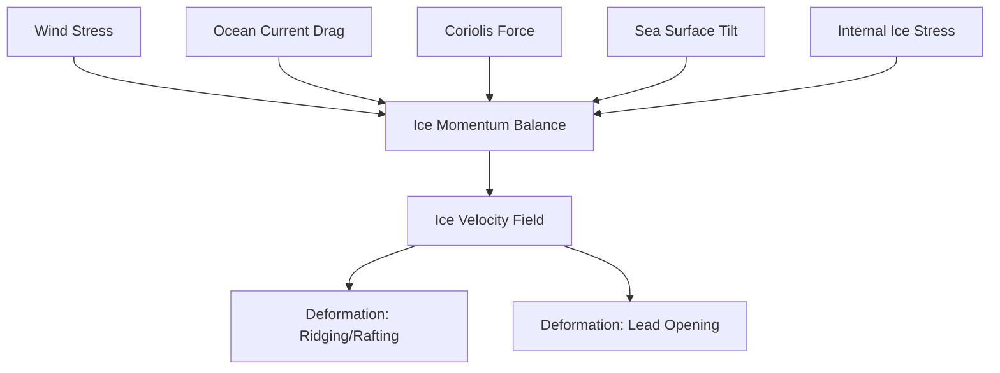
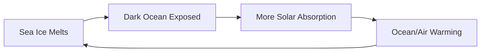

## Sea Ice Dynamics

### Overview

Sea ice dynamics refers to the study of motion, deformation, and mechanical behavior of floating sea ice under the influence of wind, ocean currents, and internal ice stresses. This is distinguished from sea ice thermodynamics, which governs ice growth and melt via heat exchange. Together, dynamics and thermodynamics control the distribution, thickness, and extent of sea ice in polar regions, with direct implications for global climate, ocean circulation, and polar ecosystems.

### Fundamental Physical Framework

**Key Points**

- Sea ice behaves as a granular, discontinuous material composed of individual floes separated by leads and ridges, distinct from a continuous fluid or a rigid solid
- Motion is governed by the balance of external forces (wind stress, ocean current drag, Coriolis force, sea surface tilt) and internal ice interaction forces
- Ice concentration (fractional area coverage) and ice thickness are the primary state variables tracked in dynamic models

#### The Sea Ice Momentum Balance

The governing equation for sea ice motion, per unit area, is expressed as:

$$m\frac{d\vec{u}}{dt} = \vec{\tau}_a + \vec{\tau}_w + \vec{F}_c - mg\nabla H + \nabla \cdot \sigma$$

where:

- $m$ = ice mass per unit area
- $\vec{u}$ = ice velocity vector
- $\vec{\tau}_a$ = wind stress (atmospheric drag)
- $\vec{\tau}_w$ = ocean current stress (water drag)
- $\vec{F}_c$ = Coriolis force
- $-mg\nabla H$ = force due to sea surface tilt (dynamic topography gradient)
- $\nabla \cdot \sigma$ = divergence of the internal ice stress tensor

Wind and water stresses are typically parameterized using quadratic drag laws:

$$\vec{\tau}_a = \rho_a C_a |\vec{U}_a| \vec{U}_a$$

$$\vec{\tau}_w = \rho_w C_w |\vec{U}_w - \vec{u}| (\vec{U}_w - \vec{u})$$

where $\rho_a$, $\rho_w$ are air and water density, $C_a$, $C_w$ are drag coefficients, and $\vec{U}_a$, $\vec{U}_w$ are wind and surface current velocities.

### Rheology: Internal Ice Stress

Sea ice rheology describes how the ice pack internally resists or accommodates deformation, which is essential for closing the momentum balance.

- **Viscous-Plastic (VP) rheology** (Hibler, 1979): The foundational model treating sea ice as a nonlinear viscous-plastic material — behaving plastically under convergence/shear (resisting compression up to a yield strength) and viscously under divergence (offering little resistance to spreading)
- **Elastic-Viscous-Plastic (EVP) rheology** (Hunke & Dukowicz, 1997): Introduces an elastic term to improve numerical efficiency in large-scale sea ice models, now standard in most operational and climate models
- **Yield curve**: Typically an elliptical curve in principal stress space defining the boundary between elastic/reversible and plastic/irreversible deformation

**Key Points**

- Ice under convergence forms pressure ridges (deformed, thickened ice) and rafts (one floe overriding another)
- Ice under divergence opens leads (narrow openings of open water or thin ice) and polynyas (larger, persistent open-water areas)
- These deformation features are critical because they dominate the heat, moisture, and momentum exchange between ocean and atmosphere despite occupying a small fractional area

### Deformation Features

#### Leads

Linear fractures in the ice pack, ranging from meters to kilometers in width, that expose open water or thin new ice. Leads are a major source of heat loss to the atmosphere in winter (up to two orders of magnitude greater turbulent heat flux than through adjacent thick ice) and are critical habitat access points for marine mammals.

#### Polynyas

Persistent or recurring areas of open water or thin ice surrounded by consolidated pack ice or fast ice.

- **Latent heat polynyas**: Maintained by continuous ice removal via wind or current divergence (e.g., coastal katabatic wind-driven polynyas in Antarctica)
- **Sensible heat polynyas**: Maintained by upwelling of relatively warm subsurface water preventing ice formation (e.g., some Arctic shelf polynyas)

#### Pressure Ridges

Formed when converging ice floes collide, buckling and fracturing to pile ice both above (sail) and below (keel) the waterline. Keels can extend tens of meters below the surface [Inference: extreme keel depths vary regionally and by measurement method] and represent significant obstacles to submarine navigation and under-ice profiling.

### Ice Types by Mobility

| Type | Description | Dynamic Behavior |
| --- | --- | --- |
| Fast ice (landfast ice) | Attached to coastline, grounded icebergs, or seabed | Immobile, no dynamic motion |
| Pack ice | Free-floating, wind and current-driven | Fully mobile, responds to forcing |
| Marginal ice zone (MIZ) | Transition zone at pack ice edge | Highly dynamic, wave-affected |
| Consolidated pack | Densely packed, high concentration | Limited internal motion, plastic behavior |

### Large-Scale Circulation Patterns

#### Arctic Sea Ice Circulation

- **Beaufort Gyre**: Wind-driven clockwise circulation in the Beaufort Sea, historically accumulating and thickening multi-year ice
- **Transpolar Drift Stream**: Transports ice from the Siberian shelf seas across the Arctic Basin toward Fram Strait, where it exports into the North Atlantic
- **Fram Strait export**: The primary outflow gateway for Arctic sea ice into the Greenland Sea, a major term in the Arctic ice mass budget

#### Antarctic Sea Ice Circulation

- Generally more mobile and seasonal than Arctic ice, due to the unbounded ocean surrounding Antarctica (versus the largely land-locked Arctic Ocean)
- Dominated by the Antarctic Coastal Current (East Wind Drift, westward, driven by polar easterlies) nearshore and the Antarctic Circumpolar Current influence farther offshore
- Ice export from coastal polynyas is a major driver of Antarctic Bottom Water formation via brine rejection

### Ice-Ocean-Atmosphere Coupling

**Key Points**

- Sea ice dynamics cannot be modeled in isolation; ice motion both responds to and modifies ocean and atmospheric boundary layers
- Ice-albedo feedback: Sea ice loss exposes darker ocean water (albedo ~0.06) versus ice/snow (albedo 0.5–0.9), amplifying regional warming
- Brine rejection during ice formation increases surface water salinity and density, contributing to deep/bottom water formation and thermohaline circulation

The ice-albedo feedback loop:

### Numerical Modeling Approaches

- **Free drift models**: Simplified approach assuming ice motion driven solely by wind and current stress with no internal ice interaction (valid only at very low ice concentrations)
- **VP/EVP dynamic-thermodynamic sea ice models**: Standard in coupled climate models (e.g., CICE, the Los Alamos Sea Ice Model), solving coupled momentum and mass/energy balance equations on a grid
- **Elastic-Anisotropic-Plastic (EAP) rheology**: More recent refinement accounting for the anisotropic (directionally dependent) fracture patterns observed in sea ice
- Behavior of specific model implementations may vary by version, grid resolution, and parameterization choices; results described here reflect standard, well-documented formulations [Inference: specific numerical outcomes are implementation-dependent]

### Example: Estimating Wind-Driven Ice Drift

**Example**

A simplified free-drift approximation states that sea ice drift speed is roughly 2% of the overlying geostrophic wind speed, deflected approximately 20–40° to the right of the wind direction in the Northern Hemisphere (due to Coriolis effect and water drag), a relationship historically termed the "2% rule" or Nansen's rule.

Given a geostrophic wind speed of 10 m/s:

$$u_{ice} \approx 0.02 \times 10 \, \text{m/s} = 0.2 \, \text{m/s} \approx 17 \, \text{km/day}$$

This approximation holds best for free-drift conditions (low ice concentration, minimal internal stress); in consolidated pack ice, internal stress substantially reduces this ratio. [Inference: actual drift ratios vary with ice concentration, thickness, and rheological state]

### Satellite Observation and Measurement

- **Passive microwave radiometry**: Primary method for retrieving sea ice concentration and extent (e.g., SSM/I, SSMIS, AMSR2 sensors), unaffected by cloud cover or polar darkness
- **Synthetic Aperture Radar (SAR)**: Used for ice motion tracking via feature-tracking algorithms and for distinguishing ice types
- **Satellite altimetry**: ICESat-2 (laser) and CryoSat-2 (radar) measure ice freeboard, from which ice thickness is derived via buoyancy calculations
- **Buoy networks**: In situ drift and thickness measurement (e.g., International Arctic Buoy Programme)

### Climate Change Context

- Arctic sea ice extent has exhibited a statistically significant declining trend since satellite records began in 1979, with the summer minimum declining more rapidly than the winter maximum
- Transition from thicker, multi-year ice to thinner, more mobile first-year ice has altered dynamic behavior, generally increasing ice drift speeds and deformation rates
- Antarctic sea ice trends have historically been more variable and regionally heterogeneous than Arctic trends, with a notable sharp decline in extent beginning around 2016 [Unverified — attribution of Antarctic trends remains an active area of research with less scientific consensus than Arctic trends]

### Common Misconceptions

- Sea ice motion is not simply wind-driven drift; internal ice stress and ocean currents are often equally or more important, particularly in consolidated pack ice
- Sea ice dynamics and thermodynamics are coupled, not independent — deformation creates thin ice/open water that dramatically alters local thermodynamic growth rates
- Antarctic and Arctic sea ice do not necessarily respond to climate forcing in the same direction or magnitude, due to fundamentally different geographic and oceanographic settings

### Related Topics

- Sea ice thermodynamics and the ice mass balance equation
- Antarctic Bottom Water and North Atlantic Deep Water formation
- Ice-albedo feedback and polar amplification
- Arctic and Antarctic Oscillation influences on ice drift
- Remote sensing techniques for cryosphere monitoring
- Marine mammal habitat dependence on sea ice (polar bears, seals, penguins)
- Coupled climate model architecture (CICE, sea ice-ocean-atmosphere coupling)
- Iceberg calving and interaction with sea ice
- Paleoclimate proxies for historical sea ice extent
- Shipping and Arctic navigation implications of changing ice dynamics