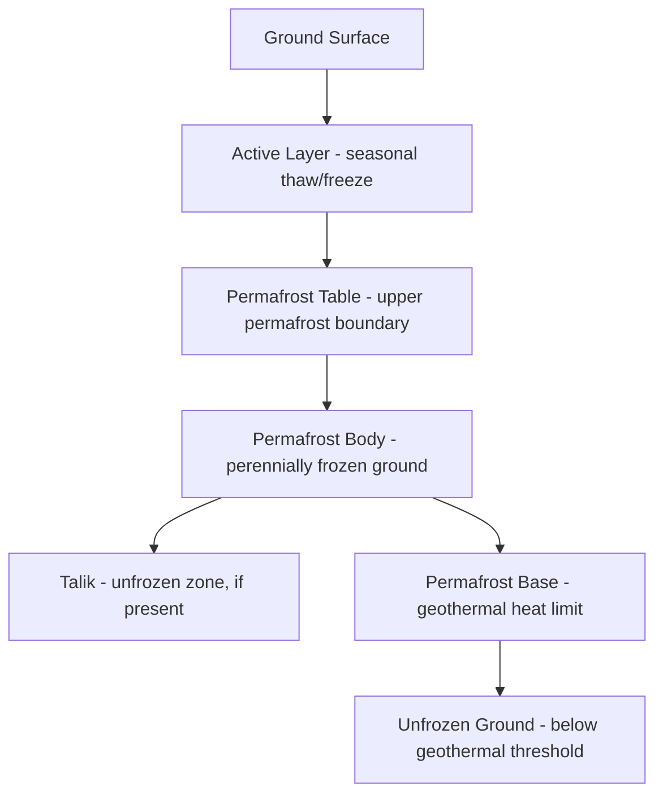

## Permafrost and Periglacial Processes

### Definition and Classification

**Permafrost** is defined strictly by temperature: any ground (soil, sediment, or rock, including ice content) that remains at or below $0°C$ for at least two consecutive years. This is a thermal definition, not a compositional one — permafrost may be ice-rich, ice-poor, or entirely lacking visible ice.

**Key Points**

- Continuous permafrost zone: 90–100% areal coverage, typically found in high Arctic regions with mean annual air temperature (MAAT) below $-8°C$
- Discontinuous permafrost zone: 50–90% coverage, MAAT roughly $-5°C$ to $-8°C$
- Sporadic permafrost zone: 10–50% coverage, MAAT roughly $-2°C$ to $-5°C$
- Isolated patches: less than 10% coverage, often confined to peatlands, north-facing slopes, or other microclimatic refugia

**Periglacial processes** refer to the suite of geomorphic processes operating in cold, non-glacial environments dominated by frost action and, where present, permafrost. The term "periglacial" originally meant "adjacent to glaciers" but now denotes any environment characterized by intense frost-related weathering and mass movement, regardless of proximity to actual ice masses.

### Ground Thermal Structure

Permafrost terrain is vertically stratified into three thermally distinct zones:

#### Active Layer

The uppermost layer that thaws each summer and refreezes each winter. Its thickness depends on surface energy balance, vegetation insulation, snow cover, soil moisture, and organic layer thickness. Typical active layer depths range from tens of centimeters in ice-rich tundra to several meters in well-drained gravelly terrain.

#### Permafrost Table

The upper boundary of permafrost — the depth below which ground temperature remains at or below $0°C$ year-round. This is the interface most sensitive to climate warming and surface disturbance.

#### Permafrost Base

The lower boundary where geothermal heat flux raises temperatures above $0°C$. Permafrost thickness is a function of surface temperature history, geothermal gradient, and thermal conductivity of subsurface materials, and can range from a few meters (sporadic zone) to over 1,000 m in parts of Siberia.

Below the permafrost base or within it, an isolated warmer layer that never freezes — called a **talik** — can occur beneath lakes, rivers, or other heat sources that locally disrupt the freezing front.

### Thermal Regime Mathematics

Ground temperature at depth $z$ under a simplified sinusoidal surface forcing follows the heat conduction solution:

$$T(z,t) = T_m + A_0 \, e^{-z/d} \sin\left(\omega t - \frac{z}{d}\right)$$

where $T_m$ is the mean annual surface temperature, $A_0$ is the amplitude of the surface temperature wave, $\omega$ is the annual angular frequency, and $d$ is the damping depth, given by:

$$d = \sqrt{\frac{2\kappa}{\omega}}$$

Here $\kappa$ is the thermal diffusivity of the ground. This relationship explains why permafrost thickness and stability depend heavily on soil thermal properties, since $\kappa$ varies significantly between organic-rich soils (low diffusivity, insulating) and mineral or ice-saturated soils (higher diffusivity).

The depth of zero annual amplitude (ZAA) — the depth at which seasonal temperature fluctuation becomes negligible (typically less than $0.1°C$) — is used as the standard reference depth for monitoring long-term permafrost temperature trends, since it filters out seasonal noise.

### Ground Ice Types

Ground ice content and morphology control almost all periglacial landform development and permafrost degradation hazards.

- **Pore ice**: fills void spaces in sediment without displacing grains; low volumetric ice content
- **Segregation ice**: forms as discrete lenses or layers through cryosuction, drawing water toward a freezing front; associated with frost heave
- **Wedge ice**: vertical, tapering ice bodies formed by repeated thermal contraction cracking and infiltration of meltwater or wind-blown snow (ice wedges), or by clastic infilling (sand wedges)
- **Intrusive ice**: forms from injection of pressurized water that freezes in situ, often associated with pingo formation
- **Massive ice**: large, relatively pure ice bodies (buried glacier ice or large ice wedges) that can be tens of meters thick; their thaw drives the most severe thermokarst subsidence

### Periglacial Landforms

#### Patterned Ground

A general term for the geometric organization of surface materials (circles, polygons, stripes, nets) caused by frost sorting and thermal contraction cracking.

- **Ice-wedge polygons**: form through annual thermal contraction cracking of the ground in extreme cold, with cracks widening over centuries as meltwater infiltrates and refreezes. Polygon diameters typically range 15–40 m.
- **Sorted circles/stripes**: result from frost heave differential sorting, where repeated freeze-thaw cycles migrate coarse clasts to the margins and fine material to the center, driven by convective soil movement
- **Non-sorted (tundra) polygons**: dominated by vegetation and organic-mineral differences without clast size sorting

#### Pingos

Ice-cored, dome-shaped mounds up to 70 m high and hundreds of meters in diameter, formed by localized groundwater freezing and expansion.

- **Hydrostatic (closed-system) pingos**: form in drained lake basins in continuous permafrost, where pore water in the closing talik is pressurized as it freezes from all sides — classic examples occur in the Mackenzie Delta, Canada
- **Hydraulic (open-system) pingos**: form where artesian groundwater under hydraulic pressure from adjacent uplands is forced upward and freezes near the surface, common in discontinuous permafrost such as parts of Alaska and Siberia

#### Thermokarst

Ground subsidence resulting from the thaw of ice-rich permafrost or massive ice, producing irregular, hummocky terrain.

- **Thermokarst lakes**: form in thaw depressions; can expand through lateral thermal and mechanical bank erosion
- **Alases**: large, flat-floored depressions formed by the drainage or infilling of thermokarst lakes, common in Siberian ice-complex ("yedoma") terrain
- **Retrogressive thaw slumps**: headwall-retreating failures exposing massive ice, common on coastal bluffs and riverbanks; rates have accelerated markedly in the Arctic in recent decades [Inference — magnitude of acceleration is regionally variable and dependent on local ice content and exposure]

#### Solifluction and Gelifluction

The slow downslope movement of saturated, thawed active-layer material over an impermeable frozen substrate. Gelifluction specifically refers to solifluction occurring over permafrost. This produces characteristic lobate and sheet-like landforms called solifluction lobes and terraces, typically moving at rates of centimeters to a few tens of centimeters per year.

#### Rock Glaciers and Talus-Derived Forms

Tongue- or lobate-shaped bodies of rock debris and interstitial ice that creep downslope under gravity, common in alpine periglacial settings. They are classified as:

- **Talus-derived rock glaciers**: formed from rockfall debris with infiltrated ice
- **Glacier-derived (debris-covered ice) rock glaciers**: transitional forms grading from true glaciers

#### Frost Weathering Landforms

- **Blockfields (felsenmeer)**: extensive accumulations of angular, frost-shattered rock covering plateau surfaces, produced by repeated freeze-thaw cycling
- **Tors**: residual bedrock outcrops standing above surrounding regolith, shaped by differential frost weathering along joint networks

### Cryogenic Processes

#### Frost Heave

The upward displacement of ground surface driven by ice lens growth. Governed by the availability of a freezing front, unfrozen water supply, and frost-susceptible fine-grained soil. The rate of heave $h$ relates to the volume of water drawn to the freezing front via cryosuction, described conceptually by Miller's secondary heaving theory, in which water migrates through unfrozen films toward the coldest, most recently formed ice lens.

#### Frost Cracking and Thermal Contraction

When ground temperatures drop rapidly (often below $-15°C$ to $-20°C$), thermal contraction generates tensile stresses exceeding the tensile strength of frozen soil, producing cracks that propagate to depths of 3–4 m. This is the mechanism underlying ice-wedge and sand-wedge polygon initiation.

#### Cryoturbation

The mechanical mixing and displacement of soil material by repeated freeze-thaw cycling, differential frost heave, and loading. Produces distinctive involuted, folded soil horizons visible in permafrost soil (Gelisol) profiles.

#### Nivation

Localized erosion beneath and around persistent snow patches, combining freeze-thaw weathering, meltwater erosion, and mass wasting, producing shallow nivation hollows that can evolve into cirque-like landforms over long timescales.

### Permafrost Degradation and Climate Sensitivity

Permafrost thaw is a major positive feedback mechanism in the climate system. Organic carbon accumulated over millennia in permafrost soils (particularly in yedoma deposits) is protected from microbial decomposition while frozen. Thaw exposes this carbon to microbial respiration, releasing $CO_2$ under aerobic conditions and $CH_4$ under anaerobic (saturated) conditions.

**Key Points**

- Northern circumpolar permafrost soils store an estimated large pool of organic carbon, roughly on the same order of magnitude as the current atmospheric carbon pool [Unverified — precise global estimates vary across studies and inventory methods]
- Abrupt thaw processes (thermokarst, thaw slumps) can release carbon far faster than gradual top-down thaw, since they expose deep, previously undisturbed ice-rich sediment
- Infrastructure built on ice-rich permafrost (roads, pipelines, buildings) is vulnerable to differential settlement as ground ice melts; engineering mitigation includes thermosyphons, elevated foundations, and insulated pads [Behavior may vary by site-specific ground ice content, drainage, and construction design]

### Diagram: Permafrost Thermal Zonation

### SVG Illustration: Ice-Wedge Polygon Cross-Section (svg_diagram)

<svg xmlns="http://www.w3.org/2000/svg" viewBox="0 0 700 380">
<rect x="0" y="0" width="700" height="380" fill="#eef3f7" />
<text x="350" y="25" font-size="16" text-anchor="middle" font-family="sans-serif" font-weight="bold">Ice-Wedge Polygon Cross-Section (svg_diagram)</text>
<rect x="40" y="60" width="620" height="40" fill="#8a6d3b" />
<text x="55" y="55" font-size="12" font-family="sans-serif">Active Layer</text>
<rect x="40" y="100" width="620" height="220" fill="#c9b79c" />
<text x="55" y="330" font-size="12" font-family="sans-serif">Permafrost</text>
<polygon points="150,100 170,300 130,300" fill="#a8d8f0" stroke="#4a90b8" stroke-width="1.5" />
<polygon points="350,100 372,300 328,300" fill="#a8d8f0" stroke="#4a90b8" stroke-width="1.5" />
<polygon points="550,100 570,300 530,300" fill="#a8d8f0" stroke="#4a90b8" stroke-width="1.5" />

<text x="150" y="90" font-size="11" text-anchor="middle" font-family="sans-serif">Ice Wedge</text>

<text x="350" y="90" font-size="11" text-anchor="middle" font-family="sans-serif">Ice Wedge</text>

<text x="550" y="90" font-size="11" text-anchor="middle" font-family="sans-serif">Ice Wedge</text>

<path d="M40,100 Q150,85 260,100 Q350,80 440,100 Q550,85 660,100" stroke="#4a3b2a" stroke-width="2" fill="none" />
<text x="55" y="115" font-size="10" font-family="sans-serif" fill="#4a3b2a">Raised Rims (heave)</text>
<line x1="40" y1="320" x2="660" y2="320" stroke="#333" stroke-dasharray="6,4" />
<text x="565" y="335" font-size="11" font-family="sans-serif">Permafrost Base (schematic)</text>
</svg>

### Field and Laboratory Methods

- **Boreholes with thermistor strings**: standard method for long-term ground temperature monitoring, referenced against ZAA depth for climate trend detection
- **Electrical resistivity tomography (ERT)**: distinguishes ice-rich vs. ice-poor ground via resistivity contrasts, useful for non-invasive ground ice mapping
- **Ground-penetrating radar (GPR)**: images shallow stratigraphy, ice wedge geometry, and active layer thickness
- **Mechanical probing**: simple metal rod probing to refusal depth for rapid active layer thickness surveys (CALM network protocol)
- **Remote sensing (InSAR)**: detects seasonal thaw subsidence at landscape scale, used to monitor thermokarst-prone regions over time

### Example: Active Layer Thickness Estimation

Using the Stefan equation, a simplified approximation for active layer depth $X$:

$$X = \sqrt{\frac{2k \, I}{L}}$$

where $k$ is soil thermal conductivity, $I$ is the surface thawing index (degree-days above $0°C$), and $L$ is the volumetric latent heat of fusion of soil water/ice. This first-order model illustrates why active layer thickness increases with both warmer summers (higher $I$) and drier/coarser soils (higher effective $k$ relative to ice content) [Inference — actual field values depend on moisture content, vegetation insulation, and snow timing, which the basic Stefan formulation does not fully capture].

**Related Topics**

- Glacial isostatic adjustment and postglacial rebound
- Rock glacier kinematics and alpine permafrost monitoring
- Arctic carbon cycle feedbacks and the permafrost-carbon feedback loop
- Cryosols (Gelisols) and soil taxonomy in cold regions
- Coastal permafrost erosion and Arctic shoreline retreat
- Engineering geocryology and infrastructure design in permafrost terrain
- Paleoclimate reconstruction from ice-wedge pseudomorphs and relict periglacial features