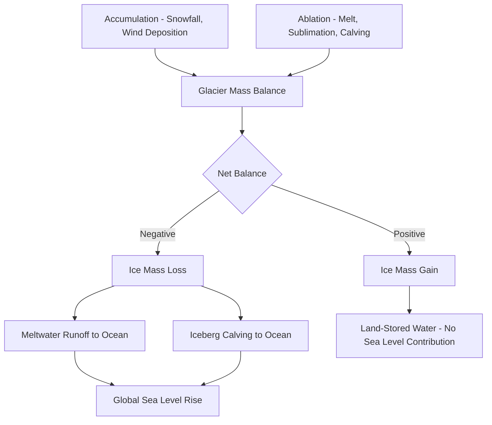

## Glaciers and Global Sea Level

### Overview of Sea Level Contributions

Global mean sea level (GMSL) rise results from two primary physical mechanisms: **thermal expansion** of ocean water (steric change) and **mass addition** from land-based ice. Glaciers and ice sheets fall into the mass-addition category, distinguishing them fundamentally from sea ice, which floats and displaces its own mass, contributing negligibly to sea level change when it melts (per Archimedes' principle).

**Key Points**

- Total GMSL rise is partitioned among: ocean thermal expansion, glacier mass loss (excluding ice sheets), Greenland Ice Sheet mass loss, Antarctic Ice Sheet mass loss, and terrestrial water storage changes
- Mountain glaciers and ice caps, despite holding a small fraction of global land ice volume compared to the ice sheets, have historically been a disproportionately large contributor to 20th-century sea level rise due to their faster response times
- Ice sheets (Greenland and Antarctica) are increasingly dominant contributors in recent decades as their dynamic mass loss accelerates [Inference — relative contribution ranking is time-period dependent and subject to ongoing revision as mass balance datasets are updated]

### Glacier Mass Balance Fundamentals

**Mass balance** is the net gain or loss of ice/snow mass over a defined period, typically a hydrological year, expressed in meters water equivalent (m w.e.).

$$B = \sum (Accumulation) - \sum (Ablation)$$

- **Accumulation**: snowfall, wind-deposited snow, avalanching, refreezing of meltwater
- **Ablation**: surface melt and runoff, sublimation, calving (for tidewater/marine-terminating glaciers), and wind erosion

The **equilibrium line altitude (ELA)** marks the elevation on a glacier where annual accumulation equals annual ablation ($B = 0$). Above the ELA lies the accumulation zone; below it, the ablation zone. The **accumulation area ratio (AAR)** — the fraction of total glacier area above the ELA — is a widely used proxy for glacier health, with an AAR near 0.5–0.8 typically associated with a glacier in approximate equilibrium, depending on glacier hypsometry.

#### Specific vs. Geodetic Mass Balance

- **Glaciological (direct) method**: uses stake networks and snow pits to measure point mass balance, then integrates over glacier area; provides high temporal resolution but is spatially limited and labor-intensive
- **Geodetic method**: differences repeat digital elevation models (DEMs) from stereo satellite imagery, airborne lidar, or radar altimetry to compute volume change over multi-year intervals, then converts to mass using an assumed or measured density; provides better spatial coverage and is used to calibrate/correct cumulative glaciological records

### Ice Dynamics and Flow

Glacier ice deforms as a non-Newtonian viscous fluid under gravitational stress, described by **Glen's Flow Law**:

$$\dot{\varepsilon} = A \tau^n$$

where $\dot{\varepsilon}$ is the strain rate, $\tau$ is the applied shear stress, $A$ is a temperature-dependent flow-rate factor, and $n$ is the flow law exponent (commonly taken as $n \approx 3$ for glacier ice). This nonlinearity means ice flow velocity is highly sensitive to stress increases, such as those caused by ice thickening or steepening.

Total glacier motion combines:

- **Internal deformation (creep)**: distributed shearing through the ice column, dominant in cold-based, land-terminating glaciers
- **Basal sliding**: motion at the ice-bed interface facilitated by a thin water film or deforming subglacial sediment; highly sensitive to subglacial hydrology and meltwater input
- **Subglacial till deformation**: shearing within a saturated, unconsolidated sediment layer beneath the glacier, important for many fast-flowing ice streams

### Marine-Terminating Glaciers and Calving Dynamics

Tidewater and marine-terminating glaciers lose mass through calving in addition to surface melt, introducing dynamics distinct from land-terminating glaciers.

- **Calving flux**: often parameterized using empirical relationships between calving rate, water depth, and glacier velocity, though no universally accepted physical calving law exists [Unverified — calving parameterization remains an active area of glaciological research with multiple competing formulations]
- **Marine Ice Sheet Instability (MISI)**: a self-reinforcing feedback where retreat of the grounding line onto a retrograde (downward-sloping inland) bed increases ice flux, driving further retreat without requiring additional external forcing
- **Marine Ice Cliff Instability (MICI)**: a proposed mechanism where ice cliffs exceeding a critical height (roughly 100 m) become structurally unable to support their own weight and mechanically collapse [Speculation — MICI's magnitude and applicability to real-world ice sheet projections remains contested in the glaciological literature]

### Diagram: Glacier Mass Balance and Sea Level Pathway

### Sea Level Budget Partitioning

The global sea level budget is typically closed by summing independently observed contributions and comparing against satellite altimetry-measured total GMSL rise.

| Component | Primary Observation Method | Relative Role |
| --- | --- | --- |
| Thermal expansion | Argo float network, ocean reanalysis | Major long-term contributor |
| Mountain glaciers | Geodetic DEM differencing, in-situ stakes | Historically dominant cryospheric term |
| Greenland Ice Sheet | GRACE/GRACE-FO gravimetry, altimetry | Growing dynamic and surface melt contributor |
| Antarctic Ice Sheet | GRACE/GRACE-FO gravimetry, InSAR velocity | Increasing, dominated by West Antarctic outlet glaciers |
| Terrestrial water storage | Hydrological modeling, GRACE | Net effect variable; groundwater extraction adds, reservoir impoundment subtracts |

**Example**

A glacier with a stake network showing mean annual ablation of 2.5 m w.e. at low elevations and accumulation of 1.0 m w.e. at high elevations, with an AAR of 0.3, would be classified as substantially out of equilibrium and retreating, since an AAR well below the 0.5–0.8 equilibrium range indicates the ablation zone has expanded well beyond a sustainable proportion of total glacier area.

### Regional Glacier Systems and Vulnerability

- **High Mountain Asia (Hindu Kush-Himalaya)**: feeds major river systems (Indus, Ganges, Brahmaputra); complicated by the debris-covered glacier effect, where surface rock debris insulates ice from melt at low elevations while accelerating melt at higher, thin-debris elevations
- **Andes**: strongly influenced by El Niño-Southern Oscillation (ENSO) variability, with tropical glaciers acting as sensitive indicators due to their proximity to the $0°C$ isotherm year-round
- **Alaska and Arctic Canada**: significant contributors to global glacier mass loss due to large glacierized area and relatively warm, maritime climate exposure
- **Patagonian Icefields**: among the fastest-thinning glacier systems globally, with strong dynamic (calving) contributions from lake- and ocean-terminating outlet glaciers [Inference — regional ranking of thinning rates shifts as new geodetic surveys are published]

### Ice Sheet vs. Glacier Distinction

While often discussed together, ice sheets (Greenland, Antarctica) and mountain glaciers/ice caps differ in scale, response time, and dominant loss mechanisms:

- Mountain glaciers respond to climate forcing over years to decades due to their smaller volume and shorter dynamic response time
- Ice sheets respond over centuries to millennia for their bulk mass, but their marginal, fast-flowing outlet glaciers and ice streams can respond dynamically on much shorter timescales, decoupling short-term mass loss signals from the ice sheet's long-term equilibrium state

### Projection Approaches

- **Volume-area/volume-length scaling**: empirical power-law relationships used to estimate glacier volume from more easily observed surface area, applied in global glacier projection models where detailed ice thickness data is unavailable
- **Process-based ice flow models**: solve simplified or full Stokes equations of ice flow coupled with surface mass balance models, used for both mountain glaciers and ice sheet outlet glacier projections
- **Semi-empirical sea level models**: statistically relate observed global temperature to historical sea level rise rates, used as a computationally efficient alternative to physical modeling, though they carry substantial structural uncertainty when extrapolated outside the historical calibration range [Unverified — extrapolation skill of semi-empirical models beyond the observational record is debated]

### SVG Illustration: Glacier Mass Balance Profile (svg_diagram)

<svg xmlns="http://www.w3.org/2000/svg" viewBox="0 0 700 400">
<rect x="0" y="0" width="700" height="400" fill="#f4f8fb" />
<text x="350" y="25" font-size="16" text-anchor="middle" font-family="sans-serif" font-weight="bold">Glacier Mass Balance Profile (svg_diagram)</text>
<polygon points="60,340 250,120 450,340" fill="#dbe9f5" stroke="#5a7f9a" stroke-width="2" />
<text x="250" y="360" font-size="12" text-anchor="middle" font-family="sans-serif">Elevation (m)</text>
<line x1="60" y1="240" x2="450" y2="240" stroke="#c0392b" stroke-width="2" stroke-dasharray="6,4" />
<text x="460" y="245" font-size="12" font-family="sans-serif" fill="#c0392b">ELA (Equilibrium Line)</text>

<text x="150" y="150" font-size="12" font-family="sans-serif" fill="`#2c3e50`">Accumulation Zone</text>

<text x="150" y="300" font-size="12" font-family="sans-serif" fill="`#2c3e50`">Ablation Zone</text>

<line x1="500" y1="120" x2="500" y2="340" stroke="#333" stroke-width="1" />
<polygon points="495,120 505,120 500,110" fill="#333" />
<text x="510" y="130" font-size="11" font-family="sans-serif">High Elevation</text>
<text x="510" y="335" font-size="11" font-family="sans-serif">Terminus</text>
<line x1="480" y1="240" x2="620" y2="240" stroke="#3498db" stroke-width="2" />
<polygon points="615,235 625,240 615,245" fill="#3498db" />
<text x="480" y="260" font-size="10" font-family="sans-serif" fill="#3498db">Meltwater flux increases downslope</text>
</svg>

### Monitoring Infrastructure

- **World Glacier Monitoring Service (WGMS)**: maintains the global standardized glacier mass balance and fluctuation database
- **GRACE/GRACE-FO satellite gravimetry**: measures time-variable gravity anomalies to estimate large-scale ice mass change, primarily used for ice sheets and large glacier complexes due to spatial resolution limits
- **Satellite altimetry (ICESat-2, CryoSat-2)**: measures surface elevation change via laser or radar ranging, enabling geodetic mass balance at broad spatial scales
- **Reference glacier network**: a subset of glaciers with continuous, long-term direct glaciological measurements (e.g., since the mid-20th century for some sites), used to extend and calibrate the historical mass balance record

**Next Steps**

- Ice sheet dynamics: grounding line migration and subglacial hydrology
- Isostatic and gravitational sea level "fingerprints" (regional deviation from GMSL)
- Debris-covered glacier energy balance modeling
- Paleo-sea level reconstruction from coral and sediment proxies
- Cryosphere-ocean-atmosphere coupling in climate models
- Glacial lake outburst floods (GLOFs) as a downstream hazard of glacier retreat