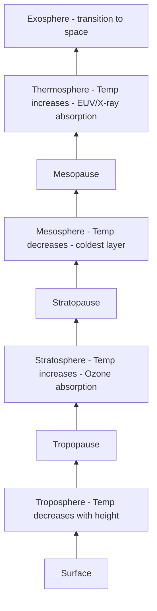

## Composition and Structure of the Atmosphere

### Bulk Chemical Composition

The atmosphere's composition is divided into constant (well-mixed) and variable components, distinguished by residence time and mixing behavior in the homosphere (the lower ~100 km where turbulent mixing dominates over molecular diffusion).

#### Permanent Gases (by volume, dry air)

| Gas | Approximate Volume Fraction |
| --- | --- |
| Nitrogen ($N_2$) | 78.08% |
| Oxygen ($O_2$) | 20.95% |
| Argon ($Ar$) | 0.93% |
| Neon, Helium, Krypton, Xenon | trace, combined < 0.01% |

**Key Points**

- These proportions have remained essentially stable over human timescales because their sources and sinks (biological, geological, photochemical) operate in near-balance
- $N_2$ is largely biologically and chemically inert in the atmosphere itself, cycling primarily through biological nitrogen fixation and denitrification at the surface
- $O_2$ is maintained by photosynthesis and consumed by respiration, combustion, and weathering, with a very long atmospheric residence time due to the enormous reservoir size relative to annual fluxes

#### Variable Gases

- **Water vapor ($H_2O$)**: ranges from near 0% in cold, dry polar air to about 4% in warm, humid tropical air; the most radiatively important variable gas and the primary driver of the greenhouse effect's baseline magnitude
- **Carbon dioxide ($CO_2$)**: currently above 420 ppm and rising due to anthropogenic fossil fuel combustion and land-use change [Unverified — exact current value changes year to year; consult current monitoring data such as NOAA's Mauna Loa record for the precise figure]
- **Methane ($CH_4$), nitrous oxide ($N_2O$), ozone ($O_3$)**: trace greenhouse gases with disproportionate radiative importance relative to their concentration
- **Aerosols**: suspended solid/liquid particles (dust, sea salt, sulfates, black carbon, biogenic particles) that influence radiative balance directly (scattering/absorption) and indirectly (cloud condensation nuclei)

### Vertical Thermal Structure

The atmosphere is vertically divided into layers based on the sign of the temperature-altitude gradient (lapse rate), not composition, since gas mixing ratios below ~100 km remain largely uniform.

#### Troposphere

Extends from the surface to the tropopause, at roughly 8–9 km at the poles and 16–18 km at the equator (varying with season and weather systems). Characterized by decreasing temperature with height, with an average environmental lapse rate near $6.5°C/km$, driven primarily by convective mixing and the adiabatic expansion of rising air parcels. Contains approximately 75–80% of total atmospheric mass and essentially all weather phenomena and water vapor.

#### Stratosphere

Extends from the tropopause to the stratopause (~50 km). Temperature increases with height due to absorption of ultraviolet radiation by the **ozone layer**, concentrated between roughly 15–35 km altitude. This temperature inversion creates strong static stability, suppressing vertical mixing and explaining why this layer is favored for commercial aviation cruise altitudes (reduced turbulence).

#### Mesosphere

Extends from the stratopause to the mesopause (~85 km), the coldest layer of the atmosphere, with temperatures dropping to around $-90°C$. Temperature decreases with height again because there is no significant local heat source (ozone absorption has diminished, and the layer is too thin/high for solar heating of surface-reflected radiation to matter).

#### Thermosphere

Extends from the mesopause to roughly 500–1000 km (the boundary is diffuse and varies with solar activity). Temperature increases dramatically with height due to absorption of high-energy extreme ultraviolet (EUV) and X-ray solar radiation by atomic oxygen and nitrogen, reaching kinetic temperatures of hundreds to over 1,000°C — though air density is so low that this "heat" contains little thermal energy in the conventional sense.

#### Exosphere

The outermost region, beyond roughly 500–1000 km, where the atmosphere gradually transitions to the vacuum of space. Gas molecules are so sparse that collisions are rare, and lighter atoms (hydrogen, helium) can achieve escape velocity and be lost to space.

### Diagram: Vertical Thermal Structure of the Atmosphere

### Alternative Vertical Classification: Homosphere and Heterosphere

This classification is based on mixing behavior rather than temperature:

- **Homosphere**: surface to ~100 km (the turbopause); turbulent mixing dominates over molecular diffusion, so the relative proportions of major gases remain constant with height
- **Heterosphere**: above ~100 km; molecular diffusion dominates, causing gases to stratify by molecular weight, with lighter species (atomic oxygen, helium, hydrogen) becoming progressively more dominant with altitude

The **ionosphere** is a compositionally defined (not thermally defined) region overlapping the upper mesosphere through thermosphere (roughly 60–1000 km), where solar radiation ionizes atmospheric gases, creating layers (D, E, F) important for radio wave propagation and reflection.

### Hydrostatic Structure and Pressure-Altitude Relationship

Atmospheric pressure decreases approximately exponentially with altitude, governed by the hydrostatic equation combined with the ideal gas law, yielding the **barometric formula**:

$$P(z) = P_0 \exp\left(-\frac{z}{H}\right)$$

where $P_0$ is sea-level pressure, $z$ is altitude, and $H$ is the **scale height**, defined as:

$$H = \frac{RT}{Mg}$$

Here $R$ is the universal gas constant, $T$ is temperature, $M$ is the mean molar mass of air, and $g$ is gravitational acceleration. For Earth's lower atmosphere, $H$ is approximately 8 km, meaning pressure drops by a factor of $e$ (about 2.7) for every 8 km gained in altitude. This explains why roughly 50% of atmospheric mass lies below about 5.5 km, and 99% lies below about 30 km.

**Example**

At sea level, standard pressure is approximately 1013.25 hPa. Applying the barometric formula with $H \approx 8$ km, the pressure at the summit of Mount Everest (~8.85 km) works out to roughly $1013.25 \times e^{-8.85/8} \approx 340$ hPa — consistent with observed high-altitude pressure readings, illustrating why supplemental oxygen becomes necessary at such elevations due to the reduced partial pressure of $O_2$, even though its volume fraction is unchanged.

### The Ozone Layer: Formation and Chemistry

Stratospheric ozone is produced and destroyed through the **Chapman cycle**:

1. $O_2 + h\nu \rightarrow O + O$ (UV photodissociation, wavelengths < 242 nm)
2. $O + O_2 + M \rightarrow O_3 + M$ (ozone formation, $M$ = third-body molecule absorbing excess energy)
3. $O_3 + h\nu \rightarrow O_2 + O$ (ozone photodissociation, absorbing UV-B/UV-C)
4. $O + O_3 \rightarrow 2O_2$ (catalytic destruction)

This cycle both produces the ozone layer and accounts for its role as a UV-B/UV-C shield, protecting surface life from harmful radiation. Catalytic destruction cycles involving chlorine and bromine radicals (originating from anthropogenic chlorofluorocarbons, CFCs) disrupt this natural balance, which was the underlying mechanism behind stratospheric ozone depletion and the Antarctic "ozone hole."

### SVG Illustration: Atmospheric Layers with Approximate Altitudes (svg_diagram)

<svg xmlns="http://www.w3.org/2000/svg" viewBox="0 0 700 500">
<rect x="0" y="0" width="700" height="500" fill="#0b1a33" />
<text x="350" y="25" font-size="16" text-anchor="middle" font-family="sans-serif" font-weight="bold" fill="#ffffff">Atmospheric Layers (svg_diagram)</text>
<rect x="150" y="430" width="300" height="40" fill="#7fb3d5" />
<text x="300" y="455" font-size="12" text-anchor="middle" font-family="sans-serif">Troposphere (0-12 km)</text>
<rect x="150" y="360" width="300" height="70" fill="#5499c7" />
<text x="300" y="400" font-size="12" text-anchor="middle" font-family="sans-serif" fill="#fff">Stratosphere (12-50 km)</text>
<rect x="150" y="290" width="300" height="70" fill="#2874a6" />
<text x="300" y="330" font-size="12" text-anchor="middle" font-family="sans-serif" fill="#fff">Mesosphere (50-85 km)</text>
<rect x="150" y="150" width="300" height="140" fill="#1b4f72" />
<text x="300" y="225" font-size="12" text-anchor="middle" font-family="sans-serif" fill="#fff">Thermosphere (85-600 km)</text>
<rect x="150" y="60" width="300" height="90" fill="#12283d" />
<text x="300" y="105" font-size="12" text-anchor="middle" font-family="sans-serif" fill="#fff">Exosphere (600+ km)</text>
<rect x="150" y="395" width="300" height="8" fill="#e74c3c" opacity="0.7" />
<text x="460" y="402" font-size="10" font-family="sans-serif" fill="#e74c3c">Ozone Layer (~15-35 km)</text>
<line x1="150" y1="470" x2="150" y2="60" stroke="#fff" stroke-width="1" />
<text x="60" y="470" font-size="10" font-family="sans-serif" fill="#fff">0 km</text>
<text x="60" y="65" font-size="10" font-family="sans-serif" fill="#fff">~600+ km</text>
</svg>

### Atmospheric Evolution Context

The current oxygen-nitrogen atmosphere is the product of billions of years of biogeochemical evolution, most notably the **Great Oxidation Event** (~2.4 billion years ago), when cyanobacterial photosynthesis began accumulating free $O_2$ beyond what could be absorbed by reduced surface minerals and dissolved species in the ocean. Earth's early atmosphere is generally reconstructed as dominated by $CO_2$, $N_2$, and reduced gases such as methane, with negligible free oxygen [Inference — precise early atmospheric composition is reconstructed from indirect geochemical proxies, such as paleosols and banded iron formations, and carries substantial uncertainty for the earliest Archean period].

### Measurement and Monitoring Techniques

- **Radiosondes**: balloon-borne instrument packages measuring temperature, humidity, and pressure profiles through the troposphere and lower stratosphere, launched twice daily at standardized global stations
- **Satellite sounders (e.g., infrared and microwave sounders)**: retrieve vertical temperature and humidity profiles from radiance measurements across the full atmospheric column
- **Lidar and ozonesondes**: used for high-resolution vertical profiling of aerosols and ozone concentration
- **Surface flask sampling networks**: the basis for long-term greenhouse gas monitoring records, such as the continuous $CO_2$ record maintained at Mauna Loa Observatory since 1958

**Related Topics**

- Atmospheric radiative transfer and the greenhouse effect
- Atmospheric circulation: Hadley, Ferrel, and Polar cells
- Stratospheric ozone depletion and the Montreal Protocol
- Air mass classification and frontal systems
- Aerosol-cloud interactions and radiative forcing
- Paleoatmospheric reconstruction methods (ice cores, paleosols)