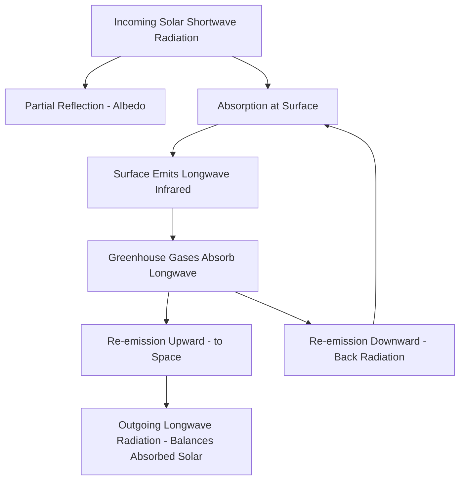

## Solar Radiation and the Greenhouse Effect

### Solar Radiation Fundamentals

The Sun emits radiation approximating a **blackbody** at an effective surface temperature of about 5,778 K, following the **Planck radiation law**, which describes spectral radiance as a function of wavelength and temperature:

$$B_\lambda(T) = \frac{2hc^2}{\lambda^5} \frac{1}{e^{hc/\lambda k_B T} - 1}$$

where $h$ is Planck's constant, $c$ is the speed of light, $\lambda$ is wavelength, and $k_B$ is Boltzmann's constant. Integrating this across all wavelengths yields the **Stefan-Boltzmann law**:

$$E = \sigma T^4$$

where $\sigma$ is the Stefan-Boltzmann constant ($5.67 \times 10^{-8} \text{ W/m}^2\text{K}^4$). This relationship is central to both solar emission and terrestrial radiative balance calculations.

**Key Points**

- The Sun's emission peaks in the visible spectrum (~0.5 μm), consistent with **Wien's displacement law**: $\lambda_{max} = b/T$, where $b \approx 2898 \, \mu m \cdot K$
- Earth, being far cooler (~255 K effective temperature), emits primarily in the thermal infrared, with peak emission near 10–12 μm
- This wavelength separation between incoming shortwave (solar) and outgoing longwave (terrestrial) radiation is the physical basis of the greenhouse effect, since different atmospheric gases absorb selectively across these two spectral regions

### Solar Constant and Insolation

The **solar constant** ($S_0$), the solar flux received at the top of Earth's atmosphere at mean Earth-Sun distance, is approximately $1361 \text{ W/m}^2$ [Inference — the commonly cited value has been revised slightly across measurement campaigns and varies with solar cycle phase by roughly 0.1%].

Because Earth is a sphere while the solar beam is effectively parallel, the flux must be averaged over the planet's full surface area. Since a sphere's cross-sectional area ($\pi r^2$) is one-quarter its total surface area ($4\pi r^2$), the globally and diurnally averaged insolation is:

$$\bar{S} = \frac{S_0}{4} \approx 340 \text{ W/m}^2$$

This factor of 4 is a critical and frequently tested concept in radiative balance calculations, since failing to apply it is one of the most common errors in estimating Earth's equilibrium temperature.

### Planetary Energy Balance and Effective Temperature

At radiative equilibrium, absorbed solar radiation equals emitted terrestrial radiation. Incorporating **planetary albedo** ($\alpha \approx 0.30$, the fraction of incoming solar radiation reflected back to space by clouds, ice, and surfaces):

$$\frac{S_0}{4}(1 - \alpha) = \sigma T_{eff}^4$$

Solving for effective temperature:

$$T_{eff} = \left[\frac{S_0(1-\alpha)}{4\sigma}\right]^{1/4}$$

**Example**

Using $S_0 = 1361 \text{ W/m}^2$ and $\alpha = 0.30$: absorbed flux equals $\frac{1361}{4}(1-0.30) \approx 238 \text{ W/m}^2$. Solving for $T_{eff}$ gives approximately 255 K (about $-18°C$). This is substantially colder than Earth's observed global mean surface temperature of approximately 288 K (~15°C) — a difference of roughly 33°C that must be explained by an additional mechanism: the greenhouse effect.

### The Greenhouse Effect Mechanism

The atmosphere is largely transparent to incoming shortwave solar radiation but selectively opaque to outgoing longwave terrestrial radiation, due to specific vibrational-rotational absorption bands of certain trace gases.

#### Radiatively Active Gases (Greenhouse Gases)

- **Water vapor ($H_2O$)**: the dominant natural greenhouse gas by radiative contribution, due to both high atmospheric concentration and broad absorption bands
- **Carbon dioxide ($CO_2$)**: strong absorption band centered near 15 μm, coinciding closely with Earth's thermal emission peak
- **Methane ($CH_4$)**: absorbs in the 7–8 μm range; per-molecule radiative efficiency substantially higher than $CO_2$ over shorter timeframes, though atmospheric lifetime is much shorter
- **Nitrous oxide ($N_2O$) and ozone ($O_3$)**: additional absorption bands contributing to the overall greenhouse effect
- $N_2$ and $O_2$, the two most abundant atmospheric gases, are radiatively inactive in the infrared because their symmetric diatomic structure lacks a changing dipole moment during vibration, so they do not absorb or emit longwave radiation

#### Mechanism Sequence

1. Shortwave solar radiation passes through the atmosphere with minimal absorption and is absorbed at the surface
2. The surface warms and re-emits energy as longwave (infrared) radiation, per the Stefan-Boltzmann law
3. Greenhouse gases in the atmosphere absorb a substantial portion of this outgoing longwave radiation
4. These gases re-emit absorbed energy in all directions, including back toward the surface (the "back radiation" component)
5. This downward re-emission adds to the direct solar heating of the surface, raising the equilibrium surface temperature above the no-atmosphere blackbody value

### Diagram: Simplified Greenhouse Effect Energy Flow

### Radiative Forcing Concept

**Radiative forcing** quantifies the change in net energy flux (W/m²) at the top of the atmosphere (or tropopause) resulting from a change in a climate driver, such as increased greenhouse gas concentration, before temperature has adjusted to a new equilibrium. For $CO_2$, forcing follows an approximately logarithmic relationship with concentration:

$$\Delta F = \alpha \ln\left(\frac{C}{C_0}\right)$$

where $C_0$ is a reference concentration and $\alpha$ is an empirically derived coefficient. The logarithmic (rather than linear) relationship arises because the strongest absorption lines in the $CO_2$ band are already substantially saturated at current atmospheric concentrations, so additional molecules contribute progressively smaller marginal forcing increases, though the effect does not vanish entirely due to band broadening and weaker absorption lines becoming relevant [Inference — the precise numerical value of $\alpha$ has been refined across generations of radiative transfer models].

### Feedback Mechanisms

Climate feedbacks amplify or dampen the initial temperature response to radiative forcing:

- **Water vapor feedback (positive)**: warmer air holds more water vapor per the Clausius-Clapeyron relation, and since water vapor is itself a potent greenhouse gas, this amplifies initial warming
- **Ice-albedo feedback (positive)**: warming melts ice and snow, reducing surface albedo, increasing solar absorption, and further amplifying warming
- **Lapse rate feedback (typically negative in the tropics)**: enhanced warming aloft relative to the surface in a moist troposphere increases the efficiency of outgoing longwave emission
- **Cloud feedback (net sign uncertain)**: clouds both reflect incoming solar radiation (cooling effect) and trap outgoing longwave radiation (warming effect); the net feedback sign and magnitude remains one of the largest sources of uncertainty in climate sensitivity estimates [Unverified — cloud feedback quantification is an active area of ongoing climate science research]

### SVG Illustration: Earth's Energy Budget Schematic (svg_diagram)

<svg xmlns="http://www.w3.org/2000/svg" viewBox="0 0 700 420">
<rect x="0" y="0" width="700" height="420" fill="#eaf2f8" />
<text x="350" y="25" font-size="16" text-anchor="middle" font-family="sans-serif" font-weight="bold">Earth's Energy Budget (svg_diagram)</text>
<circle cx="80" cy="80" r="30" fill="#f5b041" />
<text x="80" y="125" font-size="11" text-anchor="middle" font-family="sans-serif">Sun</text>
<line x1="110" y1="90" x2="300" y2="200" stroke="#f39c12" stroke-width="3" />
<text x="180" y="140" font-size="11" font-family="sans-serif" fill="#d35400">Incoming Shortwave (~340 W/m²)</text>
<line x1="300" y1="200" x2="200" y2="90" stroke="#aed6f1" stroke-width="2" />
<text x="150" y="150" font-size="10" font-family="sans-serif" fill="#2980b9">Reflected (~30%)</text>
<rect x="200" y="330" width="300" height="30" fill="#7d6608" />
<text x="350" y="350" font-size="12" text-anchor="middle" font-family="sans-serif" fill="#fff">Earth Surface</text>
<line x1="300" y1="330" x2="300" y2="200" stroke="#e74c3c" stroke-width="3" />
<text x="230" y="270" font-size="11" font-family="sans-serif" fill="#c0392b">Outgoing Longwave IR</text>
<rect x="150" y="180" width="400" height="30" fill="#aab7b8" opacity="0.6" />
<text x="350" y="200" font-size="11" text-anchor="middle" font-family="sans-serif">Greenhouse Gas Layer</text>
<line x1="450" y1="200" x2="400" y2="330" stroke="#e74c3c" stroke-width="2" stroke-dasharray="5,3" />
<text x="440" y="270" font-size="10" font-family="sans-serif" fill="#c0392b">Back Radiation</text>
</svg>

### Distinguishing the Natural and Enhanced Greenhouse Effect

The **natural greenhouse effect** (driven primarily by water vapor and naturally occurring $CO_2$) is responsible for making Earth habitable, raising surface temperature from the ~255 K blackbody value to the observed ~288 K. The **enhanced (anthropogenic) greenhouse effect** refers to the additional radiative forcing from human-caused increases in greenhouse gas concentrations since the industrial era, primarily from fossil fuel combustion, deforestation, and industrial/agricultural emissions, which perturbs this pre-existing natural balance toward a warmer equilibrium state.

### Measurement and Verification

- **Satellite radiometers (e.g., CERES)**: directly measure Earth's top-of-atmosphere radiative budget, quantifying the balance between absorbed solar and outgoing longwave radiation
- **Spectrally resolved outgoing longwave radiation measurements**: satellite instruments have observed decreased outgoing radiation precisely within known $CO_2$ and $CH_4$ absorption bands over multi-decadal comparisons, providing direct observational evidence of the enhanced greenhouse effect's spectral signature [Inference — specific quantitative trends depend on the instrument comparison and time period analyzed]
- **Surface pyranometers and pyrgeometers**: measure incoming shortwave and downwelling longwave (back radiation) at the surface, respectively

**Related Topics**

- Radiative-convective equilibrium models
- Climate sensitivity and equilibrium climate sensitivity (ECS) estimation
- Milankovitch cycles and orbital forcing
- Aerosol radiative forcing and the "global dimming" effect
- Paleoclimate proxies for reconstructing past radiative forcing
- Atmospheric window and outgoing longwave radiation spectral analysis