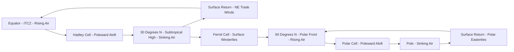

## Atmospheric Pressure and Wind Patterns

### Atmospheric Pressure Fundamentals

Atmospheric pressure is the force per unit area exerted by the weight of the overlying column of air, formally defined by the **hydrostatic equation**:

$$\frac{dP}{dz} = -\rho g$$

where $P$ is pressure, $z$ is altitude, $\rho$ is air density, and $g$ is gravitational acceleration. This equation states that pressure decreases with height at a rate proportional to local air density, explaining the approximately exponential pressure-altitude profile described by the barometric formula.

**Key Points**

- Standard sea-level pressure is defined as 1013.25 hPa (equivalently, 1 atm, 29.92 inHg, or 760 mmHg)
- Pressure varies horizontally at a given altitude due to differential heating, air density variation, and dynamic effects — this horizontal pressure variation is the fundamental driver of wind
- Pressure is measured with barometers (mercury or aneroid) at the surface and via radiosonde or satellite-derived methods aloft

### Horizontal Pressure Gradients and the Pressure Gradient Force

Wind exists because the atmosphere continuously seeks to eliminate horizontal pressure differences. The **pressure gradient force (PGF)** per unit mass is:

$$\vec{F}_{PG} = -\frac{1}{\rho}\nabla P$$

This force acts perpendicular to isobars (lines of constant pressure), directed from high pressure toward low pressure. Its magnitude is proportional to the pressure gradient's steepness — tightly packed isobars on a weather map indicate strong PGF and hence strong wind speeds, while widely spaced isobars indicate weak PGF and light winds.

### The Coriolis Effect

Because Earth rotates, moving air is deflected from a straight-line path relative to the rotating surface reference frame. The **Coriolis force** per unit mass is:

$$\vec{F}_{Co} = -2\vec{\Omega} \times \vec{v}$$

which simplifies in scalar form for horizontal motion to:

$$f = 2\Omega \sin\phi$$

where $f$ is the **Coriolis parameter**, $\Omega$ is Earth's angular rotation rate, and $\phi$ is latitude.

**Key Points**

- Deflection is to the right of motion in the Northern Hemisphere and to the left in the Southern Hemisphere
- The Coriolis parameter is zero at the equator and maximum at the poles, meaning Coriolis deflection is negligible in equatorial regions and strongest at high latitudes — this is why tropical cyclones cannot form within roughly 5° of the equator, since sufficient background rotation is unavailable to organize a coherent vortex
- The Coriolis force does no work and does not initiate motion; it only deflects air that is already moving, making it fundamentally different in character from the pressure gradient force

### Geostrophic Balance

Above the frictional boundary layer (typically above ~1 km altitude), where isobars are relatively straight and the flow is not accelerating, the pressure gradient force and Coriolis force approximately balance, producing **geostrophic wind**:

$$V_g = \frac{1}{\rho f}\left|\frac{\partial P}{\partial n}\right|$$

where $n$ is the direction perpendicular to the isobars. Geostrophic wind blows parallel to isobars (not from high to low pressure directly), with low pressure to the left in the Northern Hemisphere (Buys Ballot's Law) and to the right in the Southern Hemisphere.

### Diagram: Force Balance Producing Geostrophic Wind

### Frictional Effects and the Ekman Spiral

Within the planetary boundary layer (surface to ~1 km), surface friction reduces wind speed, which in turn reduces the Coriolis force (proportional to speed) while the pressure gradient force remains largely unchanged. This imbalance causes wind to cross isobars at an angle, flowing partially from high to low pressure rather than purely parallel to isobars. This effect, combined with the **Ekman spiral** (the theoretical turning of wind direction with height through the boundary layer due to the changing friction-Coriolis balance), explains why surface winds around a low-pressure system spiral inward (convergence) while winds around a surface high spiral outward (divergence).

### Curved Flow: Gradient Wind and Cyclostrophic Balance

For curved flow around pressure systems, a third force — the **centrifugal (or centripetal) effect** — must be incorporated, yielding the **gradient wind** balance:

$$\frac{V^2}{R} + fV = \frac{1}{\rho}\frac{\partial P}{\partial n}$$

where $R$ is the radius of curvature. This produces asymmetric behavior:

- Around cyclones (low pressure), gradient wind speed is slightly less than geostrophic wind speed (subgeostrophic) for the same pressure gradient
- Around anticyclones (high pressure), gradient wind speed is slightly greater than geostrophic wind speed (supergeostrophic)

In small, intense vortices (tornadoes, some tropical cyclone cores) where the Coriolis term becomes negligible relative to the centrifugal term, flow approximates **cyclostrophic balance**:

$$\frac{V^2}{R} = \frac{1}{\rho}\frac{\partial P}{\partial n}$$

This explains why small-scale intense vortices can rotate in either direction (cyclonic or anticyclonic) independent of hemisphere, since the Coriolis constraint that governs large-scale rotational sense is effectively absent.

### Global-Scale Circulation: The Three-Cell Model

Global wind patterns arise from the combination of differential solar heating (equator vs. poles) and Coriolis deflection, conceptually organized into three circulation cells per hemisphere:

#### Hadley Cell

Extends from the equator to roughly 30° latitude. Warm, moist air rises at the Intertropical Convergence Zone (ITCZ), flows poleward aloft, subsides around 30° latitude (creating the subtropical high-pressure belts and associated arid climate zones), then returns equatorward at the surface as the **trade winds**, deflected by Coriolis into northeasterlies (Northern Hemisphere) and southeasterlies (Southern Hemisphere).

#### Ferrel Cell

Extends roughly from 30° to 60° latitude. A thermally indirect cell (driven mechanically by the adjacent Hadley and Polar cells rather than direct thermal convection), associated with the **prevailing westerlies** and the mid-latitude storm track, where transient cyclones and anticyclones dominate day-to-day weather variability.

#### Polar Cell

Extends from roughly 60° to 90° latitude. Cold, dense air sinks at the poles, flows equatorward at the surface (deflected into the **polar easterlies**), and rises again near 60° latitude at the polar front, where it meets the Ferrel cell's poleward flow.

### Diagram: Idealized Three-Cell Global Circulation (One Hemisphere)

### Jet Streams

Narrow bands of very strong upper-tropospheric wind, formed where strong horizontal temperature gradients (and thus strong vertical wind shear, per the **thermal wind relationship**) are concentrated.

- **Polar jet stream**: located near the boundary between the Ferrel and Polar cells (~60° latitude, though highly variable), associated with the polar front and mid-latitude storm development
- **Subtropical jet stream**: located near the boundary between the Hadley and Ferrel cells (~30° latitude), generally weaker and less variable than the polar jet
- The **thermal wind relationship** describes how geostrophic wind must change with height in the presence of a horizontal temperature gradient, explaining why jet streams intensify where temperature contrasts are sharpest, such as along the polar front

### Local and Regional Wind Systems

- **Sea and land breezes**: driven by differential heating rates of land and water; daytime onshore sea breeze forms as warmer land air rises and cooler marine air flows in to replace it, reversing at night as land cools faster than water
- **Mountain and valley breezes**: daytime upslope (valley) breeze driven by faster heating of slopes than the valley floor/free atmosphere at the same elevation; nighttime downslope (mountain) breeze driven by katabatic drainage of cooled, denser air
- **Katabatic winds**: gravity-driven downslope flows of cold, dense air, most extreme in Antarctica and Greenland where large ice sheet slopes generate persistent, sometimes hurricane-force drainage winds
- **Chinook/Foehn winds**: warm, dry downslope winds occurring on the lee side of mountain ranges, resulting from adiabatic compression heating as air descends after having lost moisture via orographic precipitation on the windward side

### Example: Estimating Geostrophic Wind Speed

Given a pressure gradient of 4 hPa per 100 km at 45°N, with air density $\rho \approx 1.2 \text{ kg/m}^3$:

First, compute the Coriolis parameter: $f = 2\Omega\sin(45°) \approx 2(7.29\times10^{-5})(0.707) \approx 1.03 \times 10^{-4} \text{ s}^{-1}$.

Convert the pressure gradient to SI units: $\frac{\partial P}{\partial n} = \frac{400 \text{ Pa}}{100{,}000 \text{ m}} = 0.004 \text{ Pa/m}$.

$$V_g = \frac{0.004}{(1.2)(1.03\times10^{-4})} \approx 32 \text{ m/s}$$

This corresponds to roughly 115 km/h, illustrating why tightly packed isobars at mid-latitudes on a synoptic chart correspond to strong sustained winds aloft [Behavior may vary — actual surface wind will be lower than this geostrophic estimate due to boundary layer friction not accounted for in this calculation].

### Measurement and Analysis Tools

- **Synoptic weather charts**: display isobars (surface) or geopotential height contours (upper-air) to visualize pressure/height patterns and infer wind via spacing and orientation
- **Anemometers**: measure wind speed at the surface (cup, propeller, sonic/ultrasonic types)
- **Wind profilers and pilot balloons (pibals)**: measure vertical wind profiles through the troposphere
- **Numerical weather prediction (NWP) models**: solve the primitive equations (incorporating pressure gradient, Coriolis, and other forces) on a global or regional grid to forecast future pressure and wind fields

**Related Topics**

- Extratropical cyclone development and the Norwegian cyclone model
- Tropical cyclone formation and structure
- Rossby waves and upper-level trough/ridge patterns
- El Niño-Southern Oscillation (ENSO) and large-scale circulation anomalies
- Monsoon circulation systems
- Orographic effects on precipitation and wind (rain shadow, foehn effect)