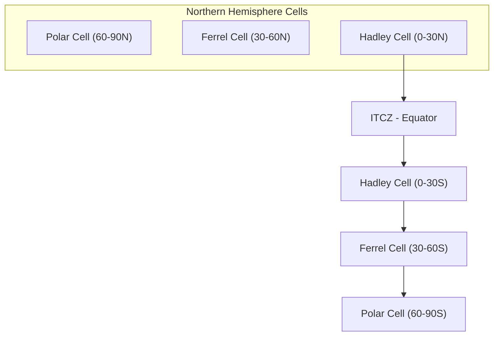
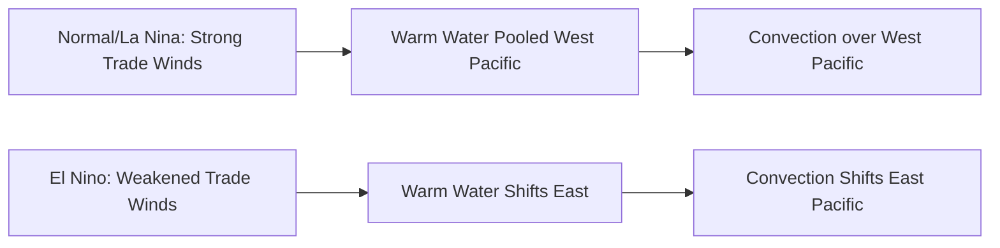

## Global Atmospheric Circulation

### Overview

Global atmospheric circulation describes the large-scale movement of air across the planet, driven primarily by differential solar heating between the equator and poles, and modified by Earth's rotation, geography, and energy redistribution requirements. This circulation system transports heat, moisture, and momentum poleward, fundamentally shaping global climate zones, weather patterns, and ocean-atmosphere interactions.

### Fundamental Driving Mechanisms

**Key Points**

- Uneven solar heating creates a latitudinal temperature (and thus pressure) gradient, the primary energy source for atmospheric circulation
- The atmosphere acts as a heat engine, converting thermal energy gradients into kinetic energy of motion
- Earth's rotation (Coriolis effect) prevents a simple single-cell circulation from equator to pole, instead breaking circulation into distinct cells

#### Radiative Imbalance

The tropics receive more incoming solar radiation than they emit as outgoing longwave radiation, while polar regions emit more than they receive. This imbalance necessitates poleward heat transport, accomplished jointly by atmospheric circulation (~⅔) and oceanic circulation (~⅓) [Inference: exact partitioning varies by latitude and season].

#### The Coriolis Effect

Moving air is deflected by Earth's rotation: to the right in the Northern Hemisphere, to the left in the Southern Hemisphere. The Coriolis parameter is expressed as:

$$f = 2\Omega \sin\phi$$

where $\Omega$ is Earth's angular rotation rate ($7.292 \times 10^{-5}$ rad/s) and $\phi$ is latitude. This term is zero at the equator and maximal at the poles, explaining why equatorial circulation is dominated by direct thermal overturning while higher latitudes are dominated by rotational (geostrophic) dynamics.

### The Three-Cell Circulation Model

**Key Points**

- Each hemisphere's meridional (north-south) circulation is conventionally divided into three cells: Hadley, Ferrel, and Polar
- This is an idealized, zonally-averaged model; actual circulation is significantly modified by continents, oceans, and seasonal variation

#### Hadley Cell (0°–30° N/S)

- Warm, moist air rises at the Intertropical Convergence Zone (ITCZ) near the equator, driven by intense solar heating and convective activity
- Air moves poleward aloft, cools, and subsides around 30° latitude, forming the subtropical high-pressure belts
- Surface return flow forms the **trade winds**, deflected by the Coriolis effect into northeasterly (NH) and southeasterly (SH) flow
- Named after George Hadley (1735), who first proposed a rotational explanation for trade winds

#### Ferrel Cell (30°–60° N/S)

- An indirect, thermally driven-in-reverse cell, sandwiched between the Hadley and Polar cells
- Surface flow is poleward and eastward (mid-latitude westerlies), while upper-level flow returns equatorward
- Driven largely by eddy momentum transport from mid-latitude cyclones rather than direct thermal convection, distinguishing it mechanistically from the Hadley and Polar cells

#### Polar Cell (60°–90° N/S)

- Cold, dense air sinks at the poles, flows equatorward at the surface, forming the **polar easterlies**
- Air converges with the westerlies at the **polar front** (~60° latitude), rises, and returns poleward aloft
- Weakest and shallowest of the three cells due to limited solar energy input at high latitudes

### Surface Pressure Belts and Wind Systems

| Latitude Zone | Pressure | Surface Winds | Climate Association |
| --- | --- | --- | --- |
| 0° (Equator) | Low (ITCZ) | Doldrums (light/variable) | Heavy convective precipitation |
| 30° N/S | High (subtropical high) | Trade winds (equatorward) | Arid, desert belts |
| 60° N/S | Low (subpolar low) | Westerlies (poleward) | Storm tracks, frontal precipitation |
| 90° (Poles) | High (polar high) | Polar easterlies | Cold, dry |

### The Intertropical Convergence Zone (ITCZ)

- A band of convergence between the Northern and Southern Hemisphere trade winds, tracking seasonally with the point of maximum solar heating (roughly following, with lag, the subsolar latitude)
- Associated with the heaviest global precipitation totals due to persistent convective uplift
- Its seasonal migration drives monsoon systems in regions such as South and Southeast Asia, West Africa, and northern Australia

### Jet Streams

**Key Points**

- Narrow bands of fast-moving air in the upper troposphere (typically 9–16 km altitude), formed by strong horizontal temperature gradients per the thermal wind relationship
- **Polar jet stream**: Located near the polar front (~50–60°), highly variable, strongly influences mid-latitude weather systems
- **Subtropical jet stream**: Located near 30° latitude at the poleward edge of the Hadley cell, generally more consistent and higher altitude than the polar jet

The thermal wind relationship linking jet stream strength to temperature gradients:

$$\frac{\partial \vec{u}_g}{\partial z} = -\frac{g}{fT}\hat{k} \times \nabla T$$

where $\vec{u}_g$ is geostrophic wind, $T$ is temperature, and the equation shows that vertical wind shear is proportional to the horizontal temperature gradient — steeper gradients (as at the polar front) produce stronger jets.

### Monsoon Circulation

Large-scale seasonal reversals in wind direction driven by differential heating/cooling between continents and oceans:

- **Summer monsoon**: Land heats faster than ocean, creating a thermal low over land that draws in moist oceanic air, producing heavy rainfall
- **Winter monsoon**: Reversed pattern; land cools faster than ocean, producing dry offshore flow
- The Asian monsoon system is the most prominent example, affecting the livelihoods of a substantial fraction of the global population [Inference: precise population figures vary by source and definitional boundaries of "monsoon Asia"]

### Semi-Permanent Pressure Systems

- **Subtropical highs** (e.g., Azores/Bermuda High, Pacific High): Persistent high-pressure cells near 30° latitude, associated with descending air and arid climates beneath them
- **Aleutian Low, Icelandic Low**: Persistent subpolar low-pressure centers, storm generation regions strongly influencing North Atlantic and North Pacific weather
- **Siberian High**: Intense winter continental high-pressure system over Asia, driving the East Asian winter monsoon

### Coupled Modes of Variability

#### El Niño–Southern Oscillation (ENSO)

A coupled ocean-atmosphere phenomenon involving the Walker Circulation, a zonal (east-west) atmospheric circulation over the tropical Pacific:

- **Normal (La Niña-like) conditions**: Trade winds push warm surface water westward, sustaining upwelling of cold water in the eastern Pacific; rising air and rainfall concentrated over the western Pacific warm pool
- **El Niño conditions**: Weakened trade winds allow warm water to migrate eastward, shifting the primary convective center and disrupting global weather teleconnections
- ENSO is the dominant mode of interannual climate variability globally, with well-documented effects on precipitation and temperature patterns across multiple continents

#### Other Major Teleconnection Patterns

- **North Atlantic Oscillation (NAO)**: Pressure difference between the Icelandic Low and Azores High, controlling storm track position and winter climate over Europe and eastern North America
- **Madden-Julian Oscillation (MJO)**: An eastward-propagating pulse of tropical convection and circulation with a 30–60 day period, modulating monsoon activity, tropical cyclone formation, and mid-latitude weather

### General Circulation Models (GCMs)

Numerical models that solve the primitive equations (conservation of momentum, mass, energy, and moisture) on a global grid to simulate atmospheric circulation. Standard components include:

- **Dynamical core**: Solves fluid motion equations
- **Radiation scheme**: Computes shortwave/longwave radiative transfer
- **Convection parameterization**: Represents sub-grid-scale processes such as cumulus convection
- **Boundary layer scheme**: Represents surface-atmosphere exchange of heat, moisture, and momentum

These models form the foundation of both numerical weather prediction and climate projection, coupled with ocean, land-surface, and sea-ice models in Earth System Models (ESMs).

### Example: Estimating Coriolis Deflection

**Example**

For an air parcel moving at 15 m/s at 45° latitude, the Coriolis parameter:

$$f = 2 \times 7.292 \times 10^{-5} \times \sin(45°) \approx 1.031 \times 10^{-4} \, \text{s}^{-1}$$

The resulting Coriolis acceleration:

$$a_c = f \times v = 1.031 \times 10^{-4} \times 15 \approx 1.55 \times 10^{-3} \, \text{m/s}^2$$

While small in instantaneous magnitude, this acceleration acting continuously over large distances and timescales is sufficient to organize large-scale wind systems into the geostrophic balance patterns (e.g., westerlies, trade winds) observed globally. [Inference: real-world wind deflection also depends on pressure gradient force and friction, not Coriolis force alone]

### Common Misconceptions

- Global circulation is not driven by Earth's rotation itself — rotation modifies and organizes circulation driven fundamentally by differential solar heating
- The three-cell model is an idealized zonal average; real-time circulation is highly asymmetric and dominated by traveling weather systems, especially in mid-latitudes
- Trade winds and westerlies are surface phenomena; upper-level flow within the same cells often moves in the opposite direction

### Related Topics

- Hadley, Ferrel, and Polar cell dynamics in depth
- Geostrophic and gradient wind balance
- Ocean-atmosphere coupling and thermohaline circulation
- Tropical cyclone formation and steering by circulation patterns
- Climate zones and Köppen climate classification
- Paleoclimatology and past circulation regime shifts
- Numerical weather prediction model architecture
- Stratospheric circulation and the polar vortex
- Walker Circulation and Pacific climate variability
- Anthropogenic climate change effects on circulation pattern shifts (e.g., Hadley cell expansion)