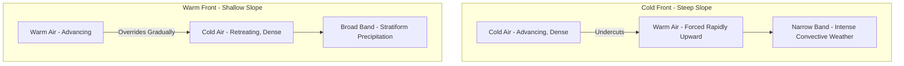

## Air Masses and Frontal Systems

### Air Mass Fundamentals

An **air mass** is a large body of air, often spanning thousands of kilometers, with relatively uniform horizontal temperature and humidity characteristics acquired from prolonged residence over a particular **source region**. Air masses form when air remains stationary or moves slowly over a homogeneous surface long enough to acquire the thermal and moisture properties of that surface through radiative and turbulent exchange.

**Key Points**

- Ideal source regions are large, flat, thermally uniform surfaces with light prevailing winds, allowing sufficient residence time for equilibration (typically several days to over a week)
- Once an air mass leaves its source region, it undergoes **modification** as it moves over surfaces with different thermal/moisture characteristics, gradually losing its original identity
- The degree of modification depends on the air mass's travel speed, the thermal contrast with the new surface, and the duration of exposure

### Air Mass Classification System

Air masses are classified using a two-letter (sometimes three-letter) system describing moisture source and thermal source region.

#### Moisture Classification (lowercase, first letter)

- **c** (continental): dry, forms over large land areas
- **m** (maritime): moist, forms over oceans

#### Thermal Classification (uppercase, second letter)

- **A** (Arctic): extremely cold, forms over polar ice/snow surfaces
- **P** (Polar): cold, forms over high-latitude land or ocean
- **T** (Tropical): warm, forms over low-latitude land or ocean
- **E** (Equatorial): warm and very moist, forms near the equator (sometimes subsumed under mT in simplified schemes)

#### Common Combinations

| Classification | Characteristics | Typical Source Region |
| --- | --- | --- |
| cA (Continental Arctic) | Extremely cold, very dry | Arctic Basin, Greenland ice sheet |
| cP (Continental Polar) | Cold, dry | Northern Canada, Siberia |
| mP (Maritime Polar) | Cool, moist | North Pacific, North Atlantic |
| cT (Continental Tropical) | Hot, dry | Desert Southwest US, Sahara |
| mT (Maritime Tropical) | Warm, moist | Gulf of Mexico, tropical oceans |

**Example**

A cP air mass originating over northern Canada in winter, moving southeastward into the central United States, typically brings a sharp temperature drop and clear, dry conditions. As it continues moving south over progressively warmer land and potentially over the Gulf of Mexico, it undergoes modification, warming and gaining moisture, illustrating how source-region characteristics degrade with distance and travel time from origin.

### Fronts: Definition and General Structure

A **front** is the transition zone (not a true mathematical line, though often depicted as one on weather maps) between two air masses of differing density, typically arising from temperature contrast (though moisture contrasts can also matter). Fronts are zones of enhanced horizontal temperature gradient, often accompanied by wind shift, pressure trough, and frequently precipitation, since the density contrast forces one air mass to be lifted over or displace the other.

### Cold Fronts

Form where a colder, denser air mass actively advances and displaces a warmer air mass. Because cold air is denser, it undercuts the warm air, forcing it to rise abruptly along a relatively steep frontal slope (typically 1:50 to 1:100).

**Key Points**

- Associated with a narrow band of often intense, sometimes severe weather (thunderstorms, occasionally squall lines) due to rapid forced lifting
- Passage is marked by a sharp temperature drop, wind shift (typically veering, i.e., clockwise, in the Northern Hemisphere), and a pressure trough followed by rising pressure
- Move faster than warm fronts on average, since the denser air mass driving the front is not obstructed by the terrain of forced ascent the way warm air riding up a shallow slope is

### Warm Fronts

Form where a warmer air mass advances and rises gradually over a retreating, denser cold air mass. The frontal slope is much shallower (typically 1:100 to 1:300) than a cold front, since warm air gently overrides rather than forcibly displacing the cold air ahead of it.

**Key Points**

- Associated with a broad shield of stratiform clouds and often prolonged, steady precipitation extending hundreds of kilometers ahead of the surface front position, due to the shallow ascent slope over a large horizontal distance
- Passage is marked by a gradual temperature rise, clearing skies, and a wind shift, typically after an extended period of overcast, precipitating conditions
- Move more slowly than cold fronts on average

### Stationary Fronts

Occur when neither air mass is displacing the other, so the boundary remains roughly in place for an extended period. Weather along a stationary front can persist for days, since the same lifting and precipitation mechanisms as a warm or cold front may be present but without net frontal movement to eventually clear the area.

### Occluded Fronts

Form when a faster-moving cold front overtakes a slower-moving warm front, lifting the warm air mass entirely off the surface. Two sub-types exist depending on the relative temperature of the air masses involved:

- **Cold occlusion**: the coldest air is behind the overtaking cold front, which remains denser than the air ahead, so it continues to undercut both the warm sector air and the original cool air ahead of the warm front
- **Warm occlusion**: the air ahead of the original warm front is colder than the air behind the overtaking cold front, so the cold front rides up and over this colder air mass rather than undercutting it

Occlusion typically marks the mature-to-dissipating stage of an extratropical cyclone's life cycle, as the process gradually cuts off the cyclone's warm-air energy source.

### Diagram: Frontal Cross-Sections (Cold vs. Warm)

### The Norwegian Cyclone Model

The classical conceptual framework for mid-latitude cyclone development, formulated by the Bergen School in the early 20th century, describes a life cycle in stages:

1. **Frontogenesis**: a wave-like perturbation develops along a pre-existing stationary front (the polar front), initiating cyclonic circulation
2. **Open wave stage**: distinct cold and warm fronts develop, separated by a warm sector at the surface; the low-pressure center deepens as upper-level divergence (often associated with jet stream dynamics) supports continued surface pressure falls
3. **Occlusion stage**: the faster cold front catches the warm front, lifting the warm sector aloft and forming an occluded front; the storm typically reaches maximum intensity around this stage
4. **Dissipation stage**: the temperature contrast driving the system is exhausted as the warm air is fully lifted away from the surface, and the cyclone weakens into a cold-core low

**Key Points**

- This model remains pedagogically valuable but is understood as a simplification; modern research has identified additional cyclone development pathways, such as the Shapiro-Keyser model, which better describes certain rapidly intensifying oceanic cyclones with a different frontal fracture pattern [Inference — the relative applicability of the Norwegian vs. Shapiro-Keyser models depends on the specific cyclone's environment, particularly baroclinicity structure]
- Upper-level support, particularly divergence ahead of an upper trough (often associated with the right-entrance/left-exit regions of a jet streak), is essential for sustained surface cyclogenesis, per quasi-geostrophic theory

### Diagram: Norwegian Cyclone Model Life Cycle

### Baroclinic Instability

The underlying dynamical mechanism generating mid-latitude cyclones, arising in regions of strong horizontal temperature gradient combined with vertical wind shear (per the thermal wind relationship). Baroclinic instability converts available potential energy (stored in the tilted, sloping density surfaces of the temperature gradient) into kinetic energy of the developing cyclonic circulation. This process is most active along the polar front, where the temperature contrast between polar and subtropical air masses is greatest, explaining the concentration of mid-latitude storm development along this zone.

### SVG Illustration: Surface Weather Map Frontal Symbols (svg_diagram)

<svg xmlns="http://www.w3.org/2000/svg" viewBox="0 0 700 300">
<rect x="0" y="0" width="700" height="300" fill="#f7f9fb" />
<text x="350" y="25" font-size="16" text-anchor="middle" font-family="sans-serif" font-weight="bold">Frontal Symbols (svg_diagram)</text>
<line x1="60" y1="70" x2="300" y2="70" stroke="#2980b9" stroke-width="3" />
<polygon points="100,70 90,60 90,80" fill="#2980b9" />
<polygon points="160,70 150,60 150,80" fill="#2980b9" />
<polygon points="220,70 210,60 210,80" fill="#2980b9" />
<text x="380" y="75" font-size="12" font-family="sans-serif">Cold Front</text>
<line x1="60" y1="130" x2="300" y2="130" stroke="#c0392b" stroke-width="3" />
<path d="M90,130 a10,10 0 0,1 20,0" fill="none" stroke="#c0392b" stroke-width="2" />
<path d="M150,130 a10,10 0 0,1 20,0" fill="none" stroke="#c0392b" stroke-width="2" />
<path d="M210,130 a10,10 0 0,1 20,0" fill="none" stroke="#c0392b" stroke-width="2" />
<text x="380" y="135" font-size="12" font-family="sans-serif">Warm Front</text>
<line x1="60" y1="190" x2="300" y2="190" stroke="#8e44ad" stroke-width="3" />
<polygon points="100,190 90,180 90,200" fill="#8e44ad" />
<path d="M150,190 a10,10 0 0,1 20,0" fill="none" stroke="#8e44ad" stroke-width="2" />
<text x="380" y="195" font-size="12" font-family="sans-serif">Occluded Front</text>
<line x1="60" y1="250" x2="300" y2="250" stroke="#16a085" stroke-width="3" stroke-dasharray="1,0" />
<polygon points="90,250 80,240 80,260" fill="#16a085" />
<path d="M140,250 a10,10 0 0,0 -20,0" fill="none" stroke="#16a085" stroke-width="2" transform="translate(70,0)" />
<text x="380" y="255" font-size="12" font-family="sans-serif">Stationary Front</text>
</svg>

### Weather Associated with Frontal Passage

| Element | Cold Front Passage | Warm Front Passage |
| --- | --- | --- |
| Temperature | Sharp decrease | Gradual increase |
| Pressure | Trough then rise | Steady fall then leveling |
| Wind Shift | Abrupt, often veering | Gradual veering |
| Cloud Sequence | Cumulonimbus/towering cumulus | Cirrus to altostratus to nimbostratus |
| Precipitation | Brief, intense, sometimes severe | Prolonged, steady, widespread |
| Visibility | Improves rapidly after passage | Often poor in fog/precipitation before passage |

### Monitoring and Analysis Methods

- **Surface synoptic weather stations**: report temperature, dewpoint, pressure, and wind used to identify frontal boundaries via manual or automated analysis
- **Surface weather map analysis**: fronts are drawn based on discontinuities in temperature, dewpoint, wind direction, and pressure tendency fields
- **Satellite imagery (visible, infrared, water vapor channels)**: used to identify cloud patterns associated with frontal systems, particularly the comma-shaped cloud signature of a mature occluding cyclone
- **Numerical weather prediction (NWP) output**: automated frontal identification algorithms increasingly supplement manual analysis, based on gradients in equivalent potential temperature or similar thermodynamic fields

**Related Topics**

- Extratropical cyclogenesis and the Shapiro-Keyser model
- Jet streak dynamics and upper-level divergence
- Thunderstorm and severe weather formation along frontal boundaries
- Quasi-geostrophic theory and vertical motion diagnostics
- Tropical cyclone structure compared to extratropical systems
- Synoptic-scale weather map interpretation techniques