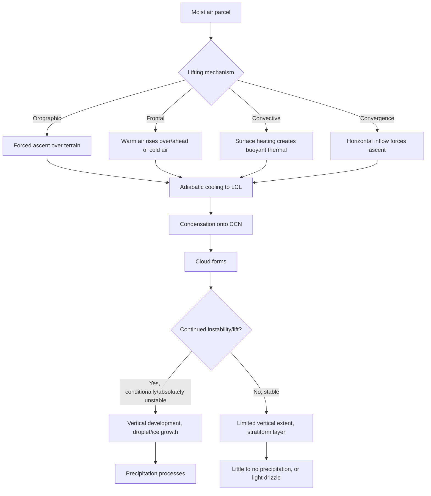
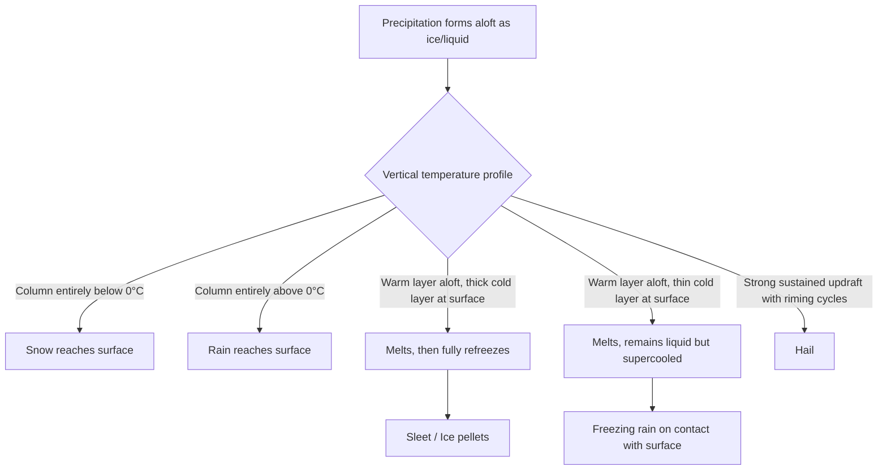

## Cloud Formation and Precipitation

### Overview

Cloud formation and precipitation are governed by the thermodynamics of moist air, the microphysics of phase change, and the dynamics of atmospheric motion. Clouds form when air is cooled to saturation or when moisture is added faster than it can be held as vapor, causing water vapor to condense onto small particles suspended in the atmosphere. Precipitation occurs when cloud droplets or ice crystals grow large enough that gravity overcomes updraft support and drag, allowing them to fall to the surface. These processes link the hydrologic cycle, the energy budget of the atmosphere, and large-scale weather systems.

### Atmospheric Moisture Fundamentals

**Humidity Variables**

- **Vapor pressure ($e$)**: The partial pressure exerted by water vapor molecules in the air.
- **Saturation vapor pressure ($e_s$)**: The maximum vapor pressure the air can hold at a given temperature before condensation begins. Governed by the Clausius-Clapeyron relation:

$$\frac{de_s}{dT} = \frac{L_v \, e_s}{R_v T^2}$$

where $L_v$ is the latent heat of vaporization, $R_v$ is the specific gas constant for water vapor, and $T$ is absolute temperature. This relation shows saturation vapor pressure increases roughly exponentially with temperature — warm air can hold substantially more water vapor than cold air.

- **Relative humidity (RH)**: $RH = (e/e_s) \times 100\%$. Reaching 100% RH does not require adding moisture; cooling air to its saturation point achieves the same result.
- **Dew point ($T_d$)**: The temperature to which air must be cooled, at constant pressure and moisture content, to reach saturation.
- **Mixing ratio ($w$)**: Mass of water vapor per unit mass of dry air, conserved during unsaturated ascent or descent (unlike RH, which changes with temperature).

**Key Point**: The dew point depression ($T - T_d$) is a practical indicator of how close air is to saturation; a small depression signals cloud or fog formation is likely.

### Mechanisms of Cooling Leading to Saturation

Four primary cooling mechanisms bring air to saturation:

1. **Adiabatic cooling (expansional cooling)**: Rising air expands into lower-pressure surroundings and cools without heat exchange with its environment. This is the dominant mechanism for most cloud formation.
2. **Radiative cooling**: Loss of longwave radiation from the surface or air layer, common in the formation of radiation fog on clear, calm nights.
3. **Conductive cooling**: Air in contact with a colder surface loses heat by conduction, producing advection fog when warm, moist air moves over a cold surface.
4. **Evaporative cooling**: Evaporation of falling rain into unsaturated air below cloud base cools and moistens that air, sometimes producing virga-associated cloud fragments or frontal fog.

### Adiabatic Processes and Lapse Rates

**Dry Adiabatic Lapse Rate (DALR)**

For unsaturated air parcels, the rate of cooling with height is constant:

$$\Gamma_d = \frac{g}{c_p} \approx 9.8\ \text{°C/km}$$

where $g$ is gravitational acceleration and $c_p$ is the specific heat of dry air at constant pressure.

**Moist (Saturated) Adiabatic Lapse Rate (MALR)**

Once a parcel becomes saturated, continued ascent causes condensation, which releases latent heat and partially offsets the cooling. The MALR is variable, typically **4–7 °C/km**, being smaller in warm, moist air (more condensation, more latent heat release) and approaching the DALR in cold, dry air.

$$\Gamma_m = g \left( \frac{1 + \dfrac{L_v w_s}{R_d T}}{1 + \dfrac{L_v^2 w_s \epsilon}{c_p R_d T^2}} \right)$$

This is [Unverified as a universally-cited exact form — variants of this equation appear across textbooks with different simplifying assumptions]; the essential physical point (latent heat release reduces the lapse rate below the dry value) is standard and well established.

**Lifting Condensation Level (LCL)**

The height at which a rising, unsaturated parcel becomes saturated and cloud base forms. Approximated by:

$$\text{LCL (m)} \approx 125 \times (T - T_d)$$

where $T$ and $T_d$ are surface temperature and dew point in °C. This is a widely used field approximation; exact values depend on the specific thermodynamic diagram method used.

### Atmospheric Stability

Stability determines whether a lifted parcel continues to rise (favoring cloud development and precipitation) or sinks back (suppressing cloud growth).

- **Absolutely stable**: Environmental lapse rate (ELR) < MALR < DALR. A displaced parcel is cooler and denser than its environment at every level, so it resists both dry and moist lifting.
- **Absolutely unstable**: ELR > DALR. A displaced parcel is warmer than its surroundings at every level regardless of saturation, so it accelerates upward. Rare, and confined to shallow surface layers on strongly heated days.
- **Conditionally unstable**: MALR < ELR < DALR. The parcel is stable if unsaturated but unstable once saturated. This is the most common and meteorologically significant state, underlying thunderstorm and convective cloud development.

**Convective Available Potential Energy (CAPE)** quantifies the energy available to a rising, saturated, positively buoyant parcel:

$$CAPE = \int_{LFC}^{EL} g \left( \frac{T_{v,parcel} - T_{v,env}}{T_{v,env}} \right) dz$$

integrated from the Level of Free Convection (LFC) to the Equilibrium Level (EL). Higher CAPE values (roughly 1000–2500 J/kg for moderate instability, >2500 J/kg for extreme instability) correlate with more vigorous convective updrafts and severe thunderstorm potential, though realized storm intensity also depends on wind shear and moisture availability [Inference — CAPE thresholds are commonly used forecasting heuristics rather than strict physical boundaries, and outcomes vary with shear and triggering mechanisms].

### Lifting Mechanisms

Air must be lifted to cool adiabatically to saturation. Four principal lifting mechanisms are recognized:

1. **Orographic lifting**: Air forced upward over topographic barriers (mountains, hills). Produces enhanced precipitation on windward slopes and a rain shadow (drier conditions) on the leeward side, as descending air warms adiabatically and its RH drops.
2. **Frontal lifting**: Warm air rises over or is displaced by denser cold air along frontal boundaries.
   - **Warm front**: Warm air gradually overrides retreating cold air on a shallow slope, producing widespread stratiform clouds (cirrus → cirrostratus → altostratus → nimbostratus) and prolonged, steady precipitation.
   - **Cold front**: Cold air aggressively undercuts warm air on a steep slope, producing narrower bands of cumuliform clouds and more intense, shorter-duration precipitation, sometimes with thunderstorms.
3. **Convective lifting**: Localized surface heating creates buoyant thermals that rise through the surrounding cooler air, producing cumulus and, under sufficient instability, cumulonimbus clouds.
4. **Convergence lifting**: Horizontal airflows converge (e.g., at low-pressure centers, sea-breeze fronts, or convergence zones), forcing air upward because it has nowhere to go but up.

### Cloud Condensation Nuclei and Nucleation

Pure water vapor in perfectly clean air can become substantially supersaturated without condensing (homogeneous nucleation requires very high supersaturation, rarely reached in the real atmosphere). In practice, condensation occurs heterogeneously on **cloud condensation nuclei (CCN)** — microscopic aerosol particles such as sea salt, sulfates, dust, and combustion products, typically 0.1–1 micron in diameter.

- **Hygroscopic nuclei** (e.g., sea salt, sulfate aerosols) readily attract water and allow condensation at RH slightly below 100%, per **Köhler theory**, which combines the Kelvin effect (curvature raises equilibrium vapor pressure, inhibiting growth of very small droplets) and the Raoult effect (dissolved solutes lower equilibrium vapor pressure, promoting growth).
- Below approximately −40 °C, water can freeze homogeneously without any nucleus. Above this temperature, ice formation requires **ice nuclei (IN)**, which are less abundant than CCN, explaining why clouds can remain **supercooled** (liquid water below 0 °C) down to quite low temperatures.

### Cloud Classification

Clouds are classified by altitude of base and form.

**By Height (approximate mid-latitude bases)**

| Level | Height (mid-latitude) | Genera |
| --- | --- | --- |
| High | 5–13 km | Cirrus, cirrostratus, cirrocumulus |
| Middle | 2–7 km | Altostratus, altocumulus |
| Low | Surface–2 km | Stratus, stratocumulus, nimbostratus |
| Vertical | Surface–13 km | Cumulus, cumulonimbus |

**By Form**

- **Cirriform**: Thin, wispy, composed of ice crystals (high clouds).
- **Stratiform**: Layered, horizontally extensive, associated with stable lifting (frontal overrunning, large-scale ascent).
- **Cumuliform**: Puffy, vertically developed, associated with convective, unstable lifting.
- **Nimbus/nimbo-** prefix or suffix denotes a precipitating cloud (nimbostratus, cumulonimbus).

**Example**: A humid summer afternoon with strong surface heating typically progresses from fair-weather cumulus (cumulus humilis) → cumulus congestus (towering cumulus) → cumulonimbus, as conditional instability is released with increasing vertical development, often culminating in a thunderstorm.

### Cloud Droplet Growth Mechanisms

Condensation alone is insufficient to produce precipitation-sized particles; initial droplets are only about 10–20 microns in diameter, while raindrops are roughly 1,000–2,000 microns. Two principal growth mechanisms bridge this gap.

**1. Collision-Coalescence Process (Warm Rain Process)**

Dominant in warm clouds (entirely above 0 °C) such as tropical and some mid-latitude cumulus.

- Larger droplets fall faster than smaller ones due to greater terminal velocity (a function of droplet radius squared, for small droplets, per Stokes' law in the small-particle regime).
- Larger droplets sweep through a volume of smaller droplets, some fraction of which collide and coalesce (merge) with them, controlled by the **collision efficiency**.
- This produces a positive feedback: as droplets grow, their collection efficiency and fall speed increase, accelerating further growth ("the rich get richer").
- Requires a sufficiently deep, moist cloud with a range of droplet sizes (aided by giant CCN like sea salt) and time (updrafts that are neither too strong, which prevents fallout, nor too weak, which limits residence time).

**2. Bergeron-Findeisen Process (Ice Crystal / Cold Rain Process)**

Dominant in mid-latitude and high-latitude clouds that extend above the freezing level and contain a mixture of supercooled liquid droplets and ice crystals.

- At a given sub-freezing temperature, the saturation vapor pressure over ice is *lower* than the saturation vapor pressure over supercooled liquid water.
- Air that is saturated with respect to liquid water is therefore *supersaturated* with respect to ice.
- Ice crystals grow rapidly by vapor deposition at the expense of the surrounding liquid droplets, which evaporate to maintain equilibrium.
- Ice crystals grow large enough to fall, and may further grow by:
  - **Riming**: Collision with and freezing of supercooled liquid droplets onto the crystal surface, forming graupel or hail in strong updrafts.
  - **Aggregation**: Ice crystals colliding and sticking together, forming snowflakes (most efficient near 0 °C where crystal surfaces are slightly sticky).
- Upon falling through the freezing level, ice particles melt into raindrops if surface temperatures are above 0 °C, producing most mid-latitude rainfall — this is why the process is sometimes called "cold rain" even though it often reaches the ground as liquid.

**Key Point**: Most precipitation at mid-to-high latitudes originates as ice via the Bergeron-Findeisen process, even when it reaches the surface as rain, because deep tropospheric clouds in these regions commonly extend above the freezing level.

<svg xmlns="http://www.w3.org/2000/svg" viewBox="0 0 780 460">
<text x="390" y="28" text-anchor="middle" font-size="17" font-weight="bold" fill="#1a1a1a">Cloud Droplet Growth Mechanisms (svg_diagram)</text>
<line x1="390" y1="40" x2="390" y2="440" stroke="#999" stroke-width="1.5" stroke-dasharray="4,4" />
<text x="195" y="60" text-anchor="middle" font-size="14" font-weight="bold" fill="#1a5276">Warm Cloud (T &gt; 0°C)</text>
<text x="585" y="60" text-anchor="middle" font-size="14" font-weight="bold" fill="#1a5276">Cold/Mixed-Phase Cloud (T &lt; 0°C)</text>
<circle cx="120" cy="100" r="4" fill="#5dade2" />
<circle cx="160" cy="105" r="3" fill="#5dade2" />
<circle cx="140" cy="130" r="5" fill="#5dade2" />
<circle cx="200" cy="95" r="3" fill="#5dade2" />
<circle cx="180" cy="140" r="4" fill="#5dade2" />
<circle cx="230" cy="120" r="4" fill="#5dade2" />
<circle cx="255" cy="100" r="3" fill="#5dade2" />
<text x="195" y="180" text-anchor="middle" font-size="11" fill="#333">Cloud droplets, varied sizes</text>
<path d="M195 200 L195 230" stroke="#333" stroke-width="2" marker-end="url(#arrow1)" />
<text x="270" y="220" font-size="11" fill="#333">Collision-Coalescence</text>
<circle cx="170" cy="270" r="6" fill="#3498db" />
<circle cx="210" cy="275" r="7" fill="#3498db" />
<circle cx="230" cy="255" r="5" fill="#3498db" />
<text x="195" y="305" text-anchor="middle" font-size="11" fill="#333">Larger droplets sweep smaller ones</text>
<path d="M195 320 L195 350" stroke="#333" stroke-width="2" marker-end="url(#arrow1)" />
<text x="240" y="340" font-size="11" fill="#333">"Rich get richer"</text>
<circle cx="195" cy="390" r="14" fill="#2874a6" />
<text x="195" y="425" text-anchor="middle" font-size="12" font-weight="bold" fill="#1a1a1a">Raindrop</text>
<polygon points="585,90 592,105 585,120 578,105" fill="#eaf2f8" stroke="#7fb3d5" />
<circle cx="620" cy="100" r="4" fill="#5dade2" />
<circle cx="650" cy="115" r="4" fill="#5dade2" />
<circle cx="555" cy="110" r="4" fill="#5dade2" />
<text x="585" y="150" text-anchor="middle" font-size="11" fill="#333">Ice crystal + supercooled droplets</text>
<path d="M585 170 L585 200" stroke="#333" stroke-width="2" marker-end="url(#arrow1)" />
<text x="655" y="190" font-size="11" fill="#333">Bergeron-Findeisen</text>
<text x="655" y="205" font-size="10" fill="#555">(vapor deposition onto ice)</text>
<polygon points="585,220 596,240 585,260 574,240" fill="#d6eaf8" stroke="#5499c7" />
<text x="585" y="280" text-anchor="middle" font-size="11" fill="#333">Ice crystal grows</text>
<path d="M585 295 L585 320" stroke="#333" stroke-width="2" marker-end="url(#arrow1)" />
<text x="650" y="312" font-size="11" fill="#333">Riming / Aggregation</text>
<polygon points="560,340 585,330 610,340 600,360 570,360" fill="#aed6f1" stroke="#2874a6" />
<text x="585" y="380" text-anchor="middle" font-size="12" font-weight="bold" fill="#1a1a1a">Snow / Graupel</text>
<path d="M585 390 L585 415" stroke="#333" stroke-width="2" stroke-dasharray="3,3" marker-end="url(#arrow1)" />
<text x="670" y="408" font-size="10" fill="#555">melts below freezing level</text>
<text x="585" y="435" text-anchor="middle" font-size="11" fill="#1a1a1a">→ falls as rain or snow</text>
</svg>

### Types of Precipitation

**By Phase at Surface**

- **Rain**: Liquid droplets >0.5 mm diameter.
- **Drizzle**: Liquid droplets <0.5 mm, falling from shallow, weakly-forced stratiform clouds without strong updrafts.
- **Snow**: Ice crystals/aggregates, forms when the entire column from cloud to ground remains at or below 0 °C (or close enough that melting is incomplete).
- **Sleet (ice pellets)**: Raindrops that freeze into ice pellets after falling through an elevated sub-freezing layer below a warm layer aloft (melt-then-refreeze profile).
- **Freezing rain**: Similar temperature profile to sleet, but the sub-freezing surface layer is too shallow/thin for the drop to fully refreeze before impact; it freezes on contact with cold surfaces, producing dangerous ice accumulation.
- **Hail**: Layered ice formed by repeated cycles of ascent and riming within strong thunderstorm updrafts, sustained aloft until the updraft can no longer support the particle's weight.
- **Graupel (snow pellets)**: Heavily rimed, low-density ice particles, softer and more crumbly than hail, forming in weaker updrafts.

**By Precipitation Mechanism / Storm Type**

- **Convective precipitation**: Short-duration, high-intensity, localized (showers, thunderstorms), from cumuliform clouds.
- **Stratiform (frontal/cyclonic) precipitation**: Long-duration, lower-intensity, widespread, from nimbostratus and altostratus associated with large-scale ascent.
- **Orographic precipitation**: Enhanced on windward slopes of terrain barriers; leeward rain shadow effect follows.

### Precipitation Measurement

- **Rain gauges**: Standard (non-recording) and tipping-bucket (recording) gauges measure liquid-equivalent depth, typically in millimeters or inches.
- **Weather radar**: Estimates precipitation rate and type from the reflectivity of radar energy backscattered by hydrometeors; the **Z-R relationship** (e.g., $Z = 200 R^{1.6}$, the Marshall-Palmer relation, one of several empirically fitted variants) converts reflectivity ($Z$) to rainfall rate ($R$), though the coefficients vary by precipitation type and drop-size distribution [Inference — exact coefficients are regionally and event-calibrated rather than universal constants].
- **Satellite estimation**: Infrared and microwave sensors infer precipitation from cloud-top temperature and microwave scattering/emission signatures, useful over oceans and data-sparse regions.
- **Snow measurement**: Snow depth measured directly; snow water equivalent (SWE) measured via snow pillows, cores, or melted samples, since snow density varies widely (freshly fallen snow roughly 1:10 snow-to-liquid ratio, though this ratio is highly variable with temperature and crystal type).

### Global and Regional Precipitation Patterns

- **Intertropical Convergence Zone (ITCZ)**: Belt of converging trade winds near the equator, associated with intense convective precipitation and Earth's rainiest climates; migrates seasonally following the sun's zenith point.
- **Subtropical high-pressure belts** (~20–30° latitude): Associated with descending, warming, drying air, producing the world's major desert belts (Sahara, Arabian, Australian deserts).
- **Mid-latitude storm tracks**: Frontal cyclones driven by the polar jet stream deliver stratiform and convective precipitation in bands, with seasonal shifts.
- **Monsoon systems**: Seasonal reversal of wind patterns (e.g., South Asian monsoon) driven by differential land-ocean heating, producing pronounced wet and dry seasons.
- **Rain shadow deserts**: Leeward sides of major mountain ranges (e.g., Atacama Desert leeward of the Andes, Great Basin leeward of the Sierra Nevada).

### Cloud Seeding (Applied Microphysics)

Cloud seeding is a weather modification technique that introduces artificial nuclei to encourage precipitation or alter cloud microphysics.

- **Static seeding**: Introduces ice nuclei (commonly silver iodide, which has a crystal lattice similar to ice) into supercooled clouds to trigger the Bergeron-Findeisen process where natural ice nuclei are scarce.
- **Hygroscopic seeding**: Introduces large hygroscopic particles (e.g., salt) into warm clouds to broaden the droplet size distribution and accelerate collision-coalescence.
- Efficacy remains an active area of research; documented increases in precipitation from seeding programs are generally modest and highly dependent on ambient cloud conditions [Unverified as a general quantitative claim — reported effect sizes vary substantially across studies, cloud types, and seeding methodology, and isolating the seeding signal from natural variability is methodologically difficult].

### Fog as a Surface-Level Cloud

Fog is a cloud with its base at or very near the surface, classified by formation mechanism:

- **Radiation fog**: Forms on clear, calm nights via radiative cooling of the surface and adjacent air layer; common in valleys where cold, dense air drains and pools.
- **Advection fog**: Forms when warm, moist air moves horizontally over a colder surface (land or sea), common along coastlines (e.g., California coast, where warm marine air meets cold upwelled water).
- **Upslope fog**: Forms when moist air is mechanically lifted and adiabatically cooled along rising terrain, without requiring pre-existing instability.
- **Evaporation (mixing) fog**: Forms when cool air mixes with adjacent warm, saturated air from evaporating water, producing local supersaturation (e.g., steam fog over lakes in autumn, frontal fog associated with evaporating rain).

### Common Misconceptions

- Clouds are not composed of water vapor; vapor is invisible. Clouds are visible suspensions of liquid droplets and/or ice crystals.
- Cold air does not "hold less moisture" as a container-like limit; rather, saturation vapor pressure is temperature-dependent, so the *maximum* vapor the air can sustain before condensation decreases with temperature.
- Not all clouds produce precipitation; most do not, since droplet growth to precipitation size requires specific microphysical conditions (adequate depth, updraft duration, droplet size spectrum, or ice-liquid coexistence).

### Related Topics

- Atmospheric stability and skew-T log-P diagram interpretation
- Thunderstorm dynamics and severe weather (supercells, mesocyclones, downbursts)
- Frontal systems and mid-latitude cyclogenesis
- The global hydrologic cycle and water budget
- Radar and satellite meteorology techniques
- Climatology of monsoon systems
- Weather forecasting models and numerical weather prediction (NWP)
- Aerosol-cloud interactions and climate feedback