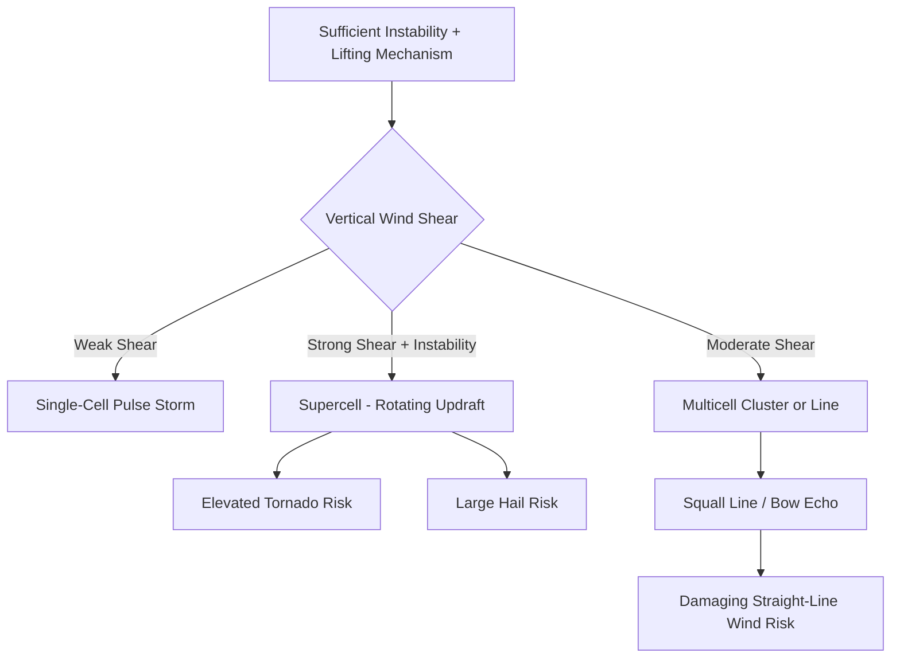

## Severe Weather and Storm Systems

### Thunderstorm Fundamentals

A thunderstorm is a localized convective storm producing lightning and thunder, requiring three basic ingredients: sufficient atmospheric **moisture**, **instability** (a favorable temperature lapse rate allowing sustained buoyant ascent), and a **lifting mechanism** to initiate convection.

#### Atmospheric Instability

Instability is quantified using **Convective Available Potential Energy (CAPE)**, the integrated positive buoyancy a parcel experiences as it rises from its level of free convection (LFC) to its equilibrium level (EL):

$$CAPE = \int_{LFC}^{EL} g\left(\frac{T_{v,parcel} - T_{v,env}}{T_{v,env}}\right) dz$$

where $T_v$ denotes virtual temperature. Higher CAPE values indicate greater potential updraft strength, since CAPE represents the kinetic energy available for vertical acceleration, related to maximum theoretical updraft velocity by $w_{max} \approx \sqrt{2 \times CAPE}$ [Inference — this theoretical maximum is rarely achieved in practice due to entrainment, precipitation loading, and other dissipative effects].

**Key Points**

- **Convective Inhibition (CIN)** represents a stable layer (often a capping inversion) that must be overcome before free convection can begin; some CIN is often necessary to allow instability to build to significant levels before storms initiate, since unrestrained convection would release instability gradually rather than explosively
- The **Lifted Index (LI)** and other stability indices provide simplified single-number instability assessments, calculated as the difference between environmental and parcel temperature at a reference pressure level (commonly 500 hPa)
- Vertical wind shear (the change in wind speed and/or direction with height) is the second critical ingredient distinguishing storm organization type, independent of instability magnitude

### Thunderstorm Types by Organization

#### Single-Cell (Ordinary/Pulse) Storms

Short-lived (30–60 minutes typically), weakly organized storms occurring in environments with weak vertical wind shear. The storm's own precipitation-driven downdraft eventually undercuts and chokes off the updraft that sustains it, since with weak shear the downdraft and updraft occupy nearly the same location.

#### Multicell Clusters and Lines

Groups of storm cells at various stages of development, where new cell development is triggered along the outflow boundary (gust front) of a decaying cell. Occurs in environments with moderate wind shear, allowing storm longevity to extend well beyond that of any single constituent cell through continuous regeneration.

#### Squall Lines

A linearly organized band of multicellular thunderstorms, often forming along or ahead of a cold front, capable of producing damaging straight-line winds, sometimes organized into a **bow echo** structure on radar when a segment of the line accelerates ahead of the rest, associated with the most intense surface wind damage.

#### Supercells

The most organized and typically most dangerous storm type, characterized by a persistent, rotating updraft called a **mesocyclone**. Requires strong vertical wind shear (both speed and directional shear) in addition to sufficient instability, since shear tilts the storm's horizontal vorticity into the vertical, allowing the updraft to rotate and become dynamically separated from the storm's downdraft — this separation is what allows supercells to persist for hours rather than being self-choked like single-cell storms.

**Key Points**

- Supercells are responsible for a disproportionate share of significant severe weather reports (large hail, strong tornadoes, damaging straight-line winds) relative to their frequency, due to their intensity and longevity
- The **storm-relative helicity (SRH)** parameter quantifies the streamwise vorticity available for updraft rotation, and is a key ingredient in forecasting supercell and tornado potential
- Classic supercells exhibit distinctive radar signatures, including a hook echo (associated with the rear-flank downdraft wrapping around the mesocyclone) and a bounded weak echo region (BWER) indicating an intense, sustained updraft

### Diagram: Storm Organization by Wind Shear and Instability

### Tornado Formation

Tornadoes are violently rotating columns of air extending from a thunderstorm base to the ground. The dominant pathway for significant tornado formation involves the supercell mesocyclone:

1. Strong vertical wind shear creates horizontal vorticity (a horizontal, tube-like rotation) in the ambient environment
2. The supercell's updraft tilts this horizontal vorticity into the vertical, initiating **mesocyclone** rotation at mid-levels
3. The **rear-flank downdraft (RFD)**, a region of sinking air wrapping around the back of the mesocyclone, is thought to play a critical role in concentrating and intensifying near-surface rotation, though the precise mechanisms remain an area of active research [Unverified — the relative importance of specific RFD thermodynamic and dynamic processes in tornadogenesis is still debated among severe storm researchers]
4. If near-surface rotation intensifies sufficiently and connects with the mid-level mesocyclone, a tornado may form, often visible as a **wall cloud** lowering from the storm base before touchdown

#### Enhanced Fujita (EF) Scale

Tornado intensity is estimated post-event based on surveyed damage, using the Enhanced Fujita scale, which correlates specific damage indicators (building types, vegetation damage) to estimated wind speed ranges:

| EF Rating | Estimated 3-Second Gust Wind Speed |
| --- | --- |
| EF0 | 105–137 km/h |
| EF1 | 138–178 km/h |
| EF2 | 179–218 km/h |
| EF3 | 219–266 km/h |
| EF4 | 267–322 km/h |
| EF5 | > 322 km/h |

**Key Points**

- The EF scale rates damage, not directly measured wind speed, since in-situ wind measurement within a tornado is exceptionally rare
- Not all tornadoes originate from supercells; **non-supercell (landspout) tornadoes** can form from surface-based vertical vorticity stretched upward by a growing cumulus updraft, typically weaker and shorter-lived than supercell tornadoes
- **Waterspouts** are tornado-like vortices over water, most commonly of the non-supercell (fair-weather) type, though tornadic waterspouts associated with supercells can also occur

### Hail Formation

Hail forms within strong convective updrafts when small ice particles (embryos) are suspended and repeatedly cycled through regions of supercooled liquid water within the storm, accreting successive layers of ice through the collision and freezing of supercooled droplets onto the growing hailstone. Larger hail requires stronger, more sustained updrafts capable of suspending increasingly heavy particles against gravity for longer growth periods, which is why the largest hail is strongly associated with intense, long-lived supercells.

### Derechos

A widespread, long-lived, and particularly damaging convectively induced straight-line windstorm, associated with a fast-moving band of severe thunderstorms (often a bow echo or a series of bow echoes), by definition producing a swath of wind damage extending at least 400 km with wind gusts of at least 93 km/h (58 mph) along most of its length [Inference — specific definitional thresholds have been refined over time across meteorological literature and may differ slightly by source].

### Tropical Cyclones

Tropical cyclones are warm-core, low-pressure systems that derive their energy primarily from the latent heat released by organized deep convection over warm ocean waters, structurally and thermodynamically distinct from mid-latitude extratropical cyclones (which are cold-core and driven by horizontal temperature contrasts).

#### Formation Requirements

- Sea surface temperature typically at or above approximately 26.5°C, to depths sufficient to sustain the necessary latent heat flux
- Sufficient Coriolis force to organize rotation, generally requiring formation at least 5° latitude from the equator
- Low vertical wind shear, since strong shear disrupts the vertical alignment of the storm's warm core and convective structure
- A pre-existing disturbance or area of organized convection to serve as a seed
- High mid-tropospheric relative humidity, since dry mid-level air can suppress convective development through entrainment

#### Structural Components

- **Eye**: a relatively calm, clear (or partly cloudy), low-pressure center, typically 30–60 km in diameter, where descending air suppresses convection
- **Eyewall**: the ring of most intense convection and strongest winds surrounding the eye, where the storm's lowest surface pressure and most severe conditions occur
- **Rainbands**: spiraling bands of convection extending outward from the eyewall, contributing to overall rainfall totals and sometimes producing embedded tornadoes upon landfall

#### Intensity Classification (Saffir-Simpson Scale, Atlantic/Pacific convention)

| Category | Sustained Wind Speed |
| --- | --- |
| Tropical Depression | < 63 km/h |
| Tropical Storm | 63–117 km/h |
| Category 1 | 119–153 km/h |
| Category 2 | 154–177 km/h |
| Category 3 (Major) | 178–208 km/h |
| Category 4 (Major) | 209–251 km/h |
| Category 5 (Major) | ≥ 252 km/h |

### Diagram: Tropical Cyclone Structure (Cross-Section)

### Example: Estimating Tropical Cyclone Energy Source

A tropical cyclone over water with sea surface temperature of 29°C and low wind shear provides a favorable thermodynamic environment for intensification, since higher sea surface temperature increases the theoretical maximum intensity a storm can achieve, as described by the **maximum potential intensity (MPI)** framework, which relates achievable minimum central pressure/maximum wind speed to the thermodynamic disequilibrium between the ocean surface and the outflow temperature in the upper troposphere. In contrast, an otherwise identical disturbance encountering strong upper-level wind shear or passing over a patch of anomalously cool water (such as upwelling regions or a prior storm's wake) may weaken rapidly, illustrating how favorable thermodynamics alone does not guarantee intensification if kinematic conditions are unfavorable [Behavior may vary — actual intensity change depends on the complex interaction of numerous environmental factors and internal storm dynamics not fully captured by any single index].

### Severe Weather Forecasting Tools and Indices

- **Doppler weather radar**: detects precipitation intensity (reflectivity) and, critically, radial velocity, enabling identification of mesocyclone rotation and tornado vortex signatures
- **Supercell Composite Parameter and Significant Tornado Parameter**: composite indices combining CAPE, shear, and helicity to assess overall severe/tornado potential in a single value
- **Storm Prediction Center (SPC) convective outlooks**: categorical and probabilistic forecasts of severe weather risk, issued at multiple lead times
- **Hurricane Hunter aircraft reconnaissance**: direct in-situ measurement of tropical cyclone central pressure, wind speed, and structure, supplementing satellite-based intensity estimation techniques (e.g., the Dvorak technique)

### SVG Illustration: Supercell Thunderstorm Structure (svg_diagram)

<svg xmlns="http://www.w3.org/2000/svg" viewBox="0 0 700 420">
<rect x="0" y="0" width="700" height="420" fill="#dfe6e9" />
<text x="350" y="25" font-size="16" text-anchor="middle" font-family="sans-serif" font-weight="bold">Supercell Structure (svg_diagram)</text>
<ellipse cx="350" cy="150" rx="220" ry="90" fill="#95a5a6" opacity="0.6" />
<text x="350" y="60" font-size="12" text-anchor="middle" font-family="sans-serif">Anvil</text>
<ellipse cx="380" cy="220" rx="80" ry="120" fill="#7f8c8d" />
<text x="380" y="220" font-size="11" text-anchor="middle" font-family="sans-serif" fill="#fff">Main Updraft</text>
<ellipse cx="480" cy="280" rx="60" ry="80" fill="#566573" />
<text x="480" y="285" font-size="10" text-anchor="middle" font-family="sans-serif" fill="#fff">Rear-Flank Downdraft</text>
<circle cx="400" cy="330" r="20" fill="#2c3e50" />
<text x="400" y="365" font-size="11" text-anchor="middle" font-family="sans-serif">Wall Cloud</text>
<line x1="400" y1="350" x2="400" y2="400" stroke="#1c2833" stroke-width="6" />
<text x="400" y="410" font-size="10" text-anchor="middle" font-family="sans-serif">Tornado</text>
<line x1="150" y1="200" x2="300" y2="220" stroke="#2980b9" stroke-width="2" />
<polygon points="300,220 290,212 292,228" fill="#2980b9" />
<text x="140" y="190" font-size="10" font-family="sans-serif" fill="#2980b9">Inflow</text>
</svg>

### Winter Storm Systems

- **Nor'easters**: intense extratropical cyclones affecting the U.S. East Coast, characterized by strong onshore winds, heavy snow or rain, and coastal flooding, often intensifying via a process resembling explosive cyclogenesis ("bombogenesis," defined as a pressure drop of at least 24 hPa in 24 hours) when interacting with the temperature contrast along the Gulf Stream
- **Blizzard conditions**: defined (in the U.S. National Weather Service criteria) by sustained winds or frequent gusts of at least 56 km/h combined with considerable falling or blowing snow reducing visibility to below 400 m, for a period of at least three hours

**Related Topics**

- Extratropical cyclogenesis and explosive intensification (bombogenesis)
- Radar meteorology and polarimetric storm interpretation
- Tropical cyclone rapid intensification prediction
- Lightning physics and charge separation mechanisms
- Climate change influence on severe storm frequency and intensity
- Storm chasing methodology and field research programs (e.g., VORTEX projects)