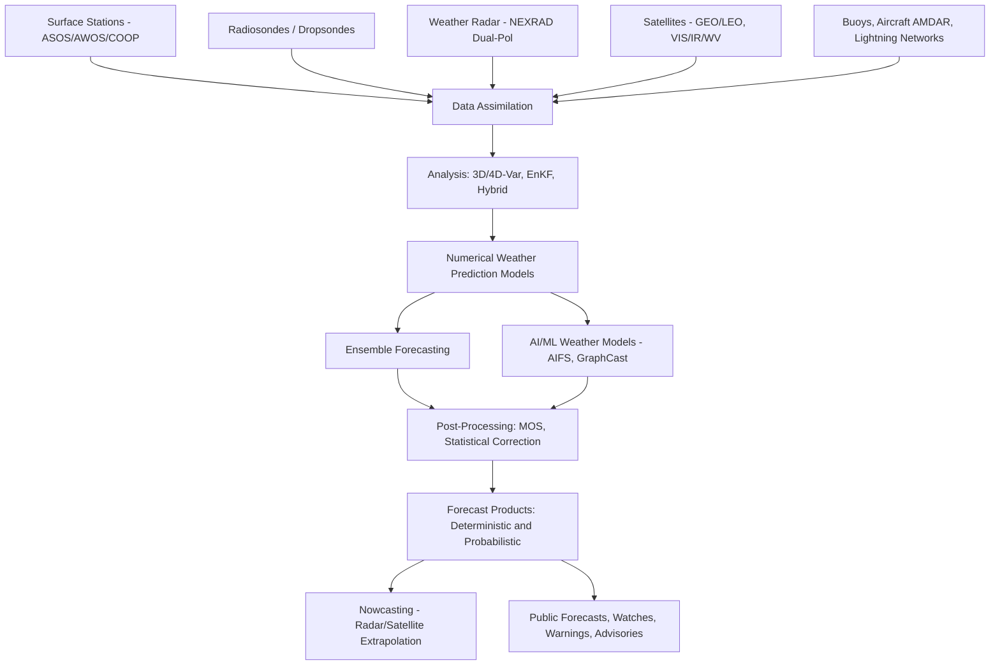

## Weather Observation and Forecasting


### Overview

Weather observation and forecasting is the practice of measuring the current state of the atmosphere and using that data, combined with physical models, to predict its future state. The discipline rests on two pillars: **observation** (collecting accurate, standardized measurements of atmospheric variables) and **forecasting** (applying statistical, numerical, and increasingly machine-learning-based methods to project how those variables will evolve). Modern operational meteorology integrates surface stations, upper-air soundings, radar, satellites, and ocean buoys into global data-assimilation systems that initialize numerical weather prediction (NWP) models running on supercomputers.

---

### Atmospheric Variables Measured

**Key Points**

- **Temperature**: measured in $°C$, $°F$, or $K$; governs stability, precipitation type, and energy balance.
- **Pressure**: measured in hectopascals ($hPa$) or millibars ($mb$); station pressure is corrected to sea-level pressure (SLP) for spatial comparability using the barometric formula.
- **Humidity**: expressed as relative humidity (RH, %), dew point ($T_d$), or mixing ratio ($w$, g/kg).
- **Wind**: speed (m/s, knots) and direction (degrees from true north, reported as the direction *from which* wind blows).
- **Precipitation**: liquid equivalent depth (mm/in), rate (mm/hr), and type (rain, snow, sleet, hail).
- **Cloud cover**: reported in oktas (eighths of sky covered) and cloud base height.
- **Visibility**: horizontal distance at which objects are discernible, in km or statute miles.
- **Solar/longwave radiation**: measured by pyranometers and pyrgeometers for energy-balance studies.

The relationship between temperature, pressure, and density is governed by the ideal gas law for dry air:

$$p = \rho R_d T$$

where $p$ is pressure, $\rho$ is air density, $R_d \approx 287\ \text{J·kg}^{-1}\text{K}^{-1}$ is the specific gas constant for dry air, and $T$ is temperature in kelvin.

---

### Surface Observation Networks

**Automated Surface Observing Systems (ASOS/AWOS)**

Automated stations report temperature, dew point, wind, pressure, precipitation, visibility, and cloud ceiling at fixed intervals (typically hourly, with special reports for rapidly changing conditions). ASOS is the primary US network operated jointly by NWS, FAA, and DoD; AWOS variants serve aviation.

**METAR Reports**

Surface observations are encoded in the international METAR format for aviation and general use. A simplified example:

```plaintext
METAR KJFK 081751Z 28014KT 10SM FEW050 SCT100 24/17 A3005 RMK AO2
```

Decoding: station KJFK, observation time 1751Z on the 8th, wind 280° at 14 kt, visibility 10 statute miles, few clouds at 5000 ft / scattered at 10000 ft, temperature 24°C / dew point 17°C, altimeter 30.05 inHg, automated station remark.

**Cooperative and Volunteer Networks**

Programs such as the US Cooperative Observer Program (COOP) and citizen-science networks (e.g., CoCoRaHS for precipitation) supplement automated stations, providing dense spatial coverage, particularly for precipitation extremes that automated gauges may miss or misclassify (e.g., snow undercatch in high wind).

**Instrument Siting Standards**

The World Meteorological Organization (WMO) and national agencies specify siting standards (e.g., thermometers at 1.25–2 m height in a ventilated radiation shield, anemometers at 10 m over open terrain) to ensure measurement comparability across the network. Deviations from siting standards are a documented source of systematic bias. [Inference: the magnitude of bias from any specific siting deviation varies by site and cannot be generalized without site-specific study.]

---

### Upper-Air Observation

**Radiosondes**

A radiosonde is a balloon-borne instrument package measuring pressure, temperature, and humidity as it ascends through the troposphere and into the stratosphere (typically to ~30 km before balloon burst), tracked via GPS to derive wind profiles. Radiosondes are launched twice daily (00Z and 12Z) from a global network of several hundred stations, forming the backbone of upper-air data assimilation.

**Rawinsonde and Pilot Balloons**

Rawinsonde specifically denotes wind-tracking via radio/GPS; pilot balloons (pibals), tracked optically without a full instrument package, provide wind-only profiles, now largely superseded by GPS radiosondes.

**Skew-T Log-P Diagrams**

Radiosonde data is conventionally plotted on a Skew-T log-P diagram, which skews temperature isotherms and uses a logarithmic pressure axis so that key thermodynamic processes (dry adiabats, moist adiabats, mixing ratio lines) appear as straight or gently curved reference lines. Forecasters use these diagrams to assess atmospheric stability, identify inversions, and compute indices such as CAPE (Convective Available Potential Energy):

$$\text{CAPE} = \int_{z_f}^{z_n} g \left( \frac{T_{v,parcel} - T_{v,env}}{T_{v,env}} \right) dz$$

where $z_f$ is the level of free convection, $z_n$ is the neutral buoyancy level, and $T_v$ is virtual temperature.

**Dropsondes**

Dropsondes are released from aircraft (notably NOAA/USAF "Hurricane Hunter" flights) and descend by parachute, providing vertical profiles in regions like tropical cyclones where routine radiosonde coverage is absent.

---

### Remote Sensing: Radar

**Weather Surveillance Radar (WSR-88D / NEXRAD)**

Doppler weather radar emits microwave pulses (typically S-band, ~10 cm wavelength for NEXRAD) and measures the backscattered energy (reflectivity, related to precipitation intensity and type) and the Doppler frequency shift (radial velocity, revealing wind motion toward/away from the radar).

Reflectivity is expressed in decibels of Z ($dBZ$):

$$dBZ = 10 \log_{10}(Z / Z_0)$$

where $Z$ is the radar reflectivity factor (proportional to the sixth power of hydrometeor diameter summed over the sample volume) and $Z_0$ is a reference value.

**Dual-Polarization Radar**

Modern radars transmit and receive both horizontal and vertical polarization pulses, yielding additional variables:

- **Differential reflectivity ($Z_{DR}$)**: distinguishes hydrometeor shape (raindrops flatten with size; hail tends to be more spherical/tumbling).
- **Correlation coefficient ($\rho_{HV}$)**: distinguishes meteorological targets from non-meteorological ones (birds, insects, debris — notably useful for confirming tornado debris signatures).
- **Specific differential phase ($K_{DP}$)**: improves rainfall-rate estimation in heavy rain.

**Velocity Signatures**

Doppler velocity couplets (adjacent regions of strong inbound/outbound velocity) identify mesocyclones and tornado vortex signatures (TVS), critical for severe weather warnings.

**Limitations**

Radar coverage is limited by Earth's curvature (beam height increases with range, causing "cone of silence" gaps aloft near the radar and overshoot of low-level features at long range), beam blockage by terrain, and attenuation in heavy precipitation (more severe at shorter wavelengths, e.g., C-band and X-band radars).

---

### Remote Sensing: Satellites

**Orbit Types**

- **Geostationary (GEO)**: orbit altitude ~35,786 km, matching Earth's rotation period, providing continuous full-disk imagery of a fixed region (e.g., GOES-R series for the Americas, Himawari for the western Pacific, Meteosat for Europe/Africa).
- **Polar-orbiting/Low Earth Orbit (LEO)**: altitude ~700–850 km, sun-synchronous orbits provide global coverage with higher spatial resolution but lower temporal frequency (e.g., NOAA-20, Suomi NPP, MetOp series).

**Spectral Channels**

- **Visible (VIS)**: reflected sunlight; useful only during daylight; shows cloud texture and albedo.
- **Infrared (IR)**: emitted thermal radiation; available day and night; brightness temperature approximates cloud-top temperature, used to infer cloud height and convective intensity.
- **Water vapor (WV)**: mid/upper-tropospheric moisture channels, used to track jet streams and dry/moist air advection even in cloud-free regions.

**Derived Products**

Satellite data feeds derived products including atmospheric motion vectors (winds inferred from tracking cloud/moisture features across successive images), sea surface temperature, and satellite-derived precipitation estimates (e.g., IMERG from the GPM mission), which are especially valuable over oceans and data-sparse regions.

---

### Other Observation Platforms

- **Weather buoys and ships**: surface pressure, temperature, sea state, and wind over oceans (e.g., NOAA's National Data Buoy Center network).
- **Commercial aircraft reports (AMDAR/ACARS)**: temperature and wind data collected automatically during commercial flights, densifying upper-air coverage along flight corridors.
- **Wind profilers**: ground-based Doppler radars pointed vertically, providing continuous wind profiles above a fixed site.
- **Lightning detection networks**: ground-based (e.g., National Lightning Detection Network) and satellite-based (e.g., GOES Geostationary Lightning Mapper) systems that locate cloud-to-ground and in-cloud lightning strikes, used as a proxy for convective intensity.

---

### Data Assimilation

Data assimilation is the process of statistically combining observations with a prior model forecast (the "background" or "first guess") to produce an optimal estimate of the current atmospheric state (the "analysis"), which then initializes the next forecast cycle.

**Core Methods**

- **3D-Var / 4D-Var**: variational methods that minimize a cost function balancing the distance from observations and from the background field, weighted by their respective error covariances. 4D-Var additionally incorporates the time dimension across an assimilation window.
- **Ensemble Kalman Filter (EnKF)**: uses an ensemble of model states to estimate flow-dependent background error covariance, updating each ensemble member with observations.
- **Hybrid methods**: combine variational and ensemble approaches (e.g., Hybrid 4D-EnVar, used operationally in systems like NOAA's GFS) to leverage the strengths of both.

The general cost function minimized in variational assimilation is:

$$J(x) = \frac{1}{2}(x - x_b)^T B^{-1} (x - x_b) + \frac{1}{2}(y - H(x))^T R^{-1} (y - H(x))$$

where $x$ is the state vector, $x_b$ is the background, $B$ and $R$ are background and observation error covariance matrices, $y$ is the observation vector, and $H$ is the observation operator mapping model space to observation space.

---

### Numerical Weather Prediction (NWP)

**Governing Equations**

NWP models numerically integrate the primitive equations describing atmospheric motion: conservation of momentum (the Navier–Stokes equations under the hydrostatic and Boussinesq approximations at large scale), conservation of mass (continuity equation), the thermodynamic energy equation, and moisture conservation, closed by the ideal gas law.

**Model Types**

- **Global models**: cover the entire Earth at coarser resolution (e.g., GFS at ~13 km, ECMWF's IFS at ~9 km as of recent cycles [Unverified: exact operational resolution changes with model upgrades]), providing boundary conditions for regional models and medium-range (3–10 day) guidance.
- **Regional/mesoscale models**: higher resolution (1–4 km) over a limited domain (e.g., the North American Mesoscale model, WRF-based configurations), resolving finer features like individual convective cells and terrain-driven flows, at the cost of needing lateral boundary conditions from a global model.
- **Convection-allowing models (CAMs)**: grid spacing fine enough (~1–4 km) to explicitly simulate deep convection without a cumulus parameterization scheme, improving representation of thunderstorm structure and timing.

**Parameterization**

Processes occurring at scales smaller than the model grid (cumulus convection, cloud microphysics, boundary-layer turbulence, radiation) cannot be explicitly resolved and are represented via parameterization schemes — simplified physical/statistical representations calibrated to reproduce the aggregate effect of sub-grid processes.

**Ensemble Forecasting**

Because initial-condition uncertainty and model imperfection cause forecast skill to degrade with lead time, operational centers run ensembles — multiple forecasts from perturbed initial conditions and/or varied model physics (e.g., NOAA's GEFS, ECMWF's ENS) — to quantify forecast uncertainty and produce probabilistic guidance rather than a single deterministic solution.

**Predictability Limits**

Atmospheric predictability is fundamentally bounded by sensitivity to initial conditions (chaos theory, as characterized by Lorenz). Operational deterministic skill for synoptic-scale features is generally considered to extend to roughly 7–10 days, beyond which forecasts converge toward climatology. [Inference: exact predictability limits are scale- and regime-dependent and are an active area of research, so this range should be read as a general guideline rather than a fixed threshold.]

---

### Forecasting Techniques

**Analog and Statistical Forecasting**

Historical case matching (finding past atmospheric states similar to the current one) and statistical relationships such as Model Output Statistics (MOS), which regresses NWP output against observed conditions to correct systematic model bias and downscale to station-specific detail.

**Nowcasting**

Very short-range forecasting (0–6 hours) relying heavily on radar and satellite extrapolation (tracking the motion of existing features forward in time) rather than full NWP, since NWP models require time to "spin up" realistic mesoscale detail from initialization.

**Machine Learning / AI Weather Models**

Recent operational and research systems (e.g., Google DeepMind's GraphCast, NVIDIA's FourCastNet, Huawei's Pangu-Weather, and ECMWF's AIFS) use neural networks trained on decades of reanalysis data to produce medium-range forecasts at a fraction of the computational cost of physics-based NWP.

Searched the webECMWF AIFS operational status 2026 AI weather forecasting model

ECMWF's AIFS became fully operational on 25 February 2025, running side by side with ECMWF's physics-based Integrated Forecasting System (IFS). The AIFS now comprises a deterministic model (AIFS Single) and an ensemble model (AIFS ENS), both upgraded to version 2 on 12 May 2026. Output is produced at 6-hourly time steps out to 15 days, initialized from the ECMWF operational analysis, four times daily at 00/06/12/18 UTC, on an approximately 0.25° × 0.25° grid. Benchmarks show gains of up to 20% over physics-based models for tropical cyclone tracks, alongside roughly a 1,000-fold reduction in the energy required per forecast. As of 12 May 2026, AIFS ENS also began producing ECMWF's first operational data-driven wave forecasts. [geogarage](https://blog.geogarage.com/2025/02/ecmwfs-ai-forecasts-become-operational.html)[geogarage](https://blog.geogarage.com/2025/02/ecmwfs-ai-forecasts-become-operational.html)

**Strengths and limitations of ML weather models**: they excel at speed and computational efficiency and match or exceed traditional NWP skill on many standard verification metrics for medium-range forecasts of large-scale fields. Limitations include reduced physical interpretability, potential unreliability for out-of-training-distribution extreme events, and (in early versions) a tendency toward over-smoothed precipitation fields — a gap that later AIFS updates specifically targeted via added physical-consistency constraints. [Inference: the relative skill of ML versus physics-based models for rare, high-impact extremes remains an active research question rather than a settled conclusion, since verification statistics are dominated by the much larger number of routine, non-extreme cases.]

---

### Forecast Products and Communication

**Deterministic vs. Probabilistic Forecasts**

A deterministic forecast presents a single expected outcome (e.g., "high of 28°C"). A probabilistic forecast conveys uncertainty explicitly, such as "70% chance of rain," which is properly interpreted as: given many days with similar atmospheric setups, precipitation occurred at that location on 70% of them.

**Verification Metrics**

- **Brier Score**: measures accuracy of probabilistic forecasts of a binary event:


  $$BS = \frac{1}{N}\sum_{i=1}^{N}(f_i - o_i)^2$$

  where $f_i$ is the forecast probability and $o_i \in \{0,1\}$ is the observed outcome.
- **Mean Absolute Error (MAE)** and **Root Mean Square Error (RMSE)**: standard metrics for continuous variables like temperature.
- **Skill scores**: compare forecast performance against a reference (climatology or persistence) to quantify genuine forecast value added.

**Watches, Warnings, and Advisories**

Operational agencies (e.g., NWS in the US) issue tiered alerts: an **outlook** flags general risk days in advance; a **watch** indicates conditions are favorable for hazardous weather over a broader area/time window; a **warning** indicates the hazard is imminent or occurring in a specific area, requiring immediate action.

---

### Illustration: Weather Observation and Forecasting Data Flow



---

### Illustration: Anatomy of a Weather Station Sensor Array (svg_diagram)

<svg xmlns="http://www.w3.org/2000/svg" viewBox="0 0 640 380">
<rect x="0" y="0" width="640" height="380" fill="#f5f7fa" />
<text x="320" y="24" font-family="Arial" font-size="16" font-weight="bold" text-anchor="middle" fill="#1a2b3c">Weather Station Sensor Array (svg_diagram)</text>

<line x1="40" y1="320" x2="600" y2="320" stroke="#555" stroke-width="2" />

<line x1="500" y1="320" x2="500" y2="60" stroke="#333" stroke-width="4" />

<circle cx="500" cy="60" r="6" fill="#2b6cb0" />
<line x1="480" y1="60" x2="520" y2="60" stroke="#2b6cb0" stroke-width="2" />
<line x1="500" y1="40" x2="500" y2="80" stroke="#2b6cb0" stroke-width="2" />
<text x="540" y="55" font-family="Arial" font-size="12" fill="#1a2b3c">Anemometer</text>
<text x="540" y="70" font-family="Arial" font-size="11" fill="#555">(wind, 10 m)</text>

<rect x="120" y="270" width="28" height="50" fill="#63b3ed" stroke="#2b6cb0" stroke-width="1.5" />
<polygon points="115,270 155,270 140,255 130,255" fill="#a0c4e8" />
<text x="165" y="290" font-family="Arial" font-size="12" fill="#1a2b3c">Rain Gauge</text>
<text x="165" y="305" font-family="Arial" font-size="11" fill="#555">(precip. depth)</text>

<rect x="300" y="200" width="50" height="40" rx="6" fill="#e2e8f0" stroke="#333" stroke-width="1.5" />
<line x1="310" y1="200" x2="310" y2="240" stroke="#999" stroke-width="1" />
<line x1="320" y1="200" x2="320" y2="240" stroke="#999" stroke-width="1" />
<line x1="330" y1="200" x2="330" y2="240" stroke="#999" stroke-width="1" />
<line x1="340" y1="200" x2="340" y2="240" stroke="#999" stroke-width="1" />
<text x="305" y="190" font-family="Arial" font-size="12" fill="#1a2b3c">Radiation Shield</text>
<text x="300" y="255" font-family="Arial" font-size="11" fill="#555">(temp / RH sensor, 1.25-2 m)</text>

<rect x="420" y="260" width="50" height="35" fill="#cbd5e0" stroke="#333" stroke-width="1.5" />
<circle cx="445" cy="277" r="10" fill="none" stroke="#333" stroke-width="1.5" />
<line x1="445" y1="277" x2="450" y2="270" stroke="#333" stroke-width="1" />
<text x="415" y="250" font-family="Arial" font-size="12" fill="#1a2b3c">Barometer</text>
<text x="415" y="310" font-family="Arial" font-size="11" fill="#555">(station pressure)</text>

<rect x="500" y="290" width="40" height="30" fill="#4a5568" stroke="#1a202c" stroke-width="1.5" />
<text x="470" y="345" font-family="Arial" font-size="12" fill="#1a2b3c">Data Logger / Transmitter</text>

<line x1="180" y1="320" x2="180" y2="90" stroke="#38a169" stroke-width="2" stroke-dasharray="4,3" />
<rect x="160" y="320" width="40" height="20" fill="#38a169" />
<text x="205" y="100" font-family="Arial" font-size="12" fill="#1a2b3c">Ceilometer</text>
<text x="205" y="115" font-family="Arial" font-size="11" fill="#555">(cloud base height)</text>

<rect x="40" y="345" width="560" height="1" fill="#ccc" />
<text x="40" y="368" font-family="Arial" font-size="10" fill="#777">All sensors sited per WMO/national standards; heights and spacing shown are illustrative, not to scale.</text>
</svg>

---

### Worked Example: Interpreting a Skew-T Sounding for Convective Potential

**Example**

Given a radiosonde sounding with surface temperature $T = 30°C$, surface dew point $T_d = 24°C$, and a mid-level temperature inversion near 850 hPa:

1. Compute the Lifting Condensation Level (LCL) height using the approximation:


   $$z_{LCL} \approx 125(T - T_d)$$

   With $T - T_d = 6°C$: $z_{LCL} \approx 750\ \text{m}$ above ground level — cumulus cloud bases are expected near this height.
2. Locate the Level of Free Convection (LFC) — the height at which a lifted parcel becomes warmer than its environment and continues rising unassisted.
3. If a mid-level inversion (a "cap") lies below the LFC, it inhibits convection despite high instability aloft, a setup associated with Convective Inhibition (CIN). Storms may be suppressed until surface heating or a lifting mechanism (front, outflow boundary) erodes the cap, after which explosive convective initiation can occur.
4. Forecasters combine CAPE (buoyant energy available) with CIN (energy barrier to initiation), wind shear profiles, and the height of the freezing level to assess severe-weather potential (e.g., large hail requires strong updrafts sustained through a deep sub-freezing layer).

**Conclusion**: A sounding showing high CAPE, moderate-to-strong CIN capping the boundary layer, and strong deep-layer shear is a classic pre-convective severe-weather setup, since the cap allows energy to build before a triggering mechanism releases it explosively into an environment favorable for organized (often supercellular) storms.

---

### Common Analysis Pitfalls

- Confusing station pressure with sea-level pressure when comparing observations across different elevations — always verify which pressure convention a dataset uses before contouring isobars.
- Treating radar reflectivity as a direct precipitation-type indicator without dual-pol variables; high reflectivity can indicate hail, heavy rain, or bright-band melting-layer artifacts.
- Over-interpreting single deterministic model runs at long lead times without consulting ensemble spread, given the well-documented loss of deterministic skill beyond roughly a week.
- Ignoring radiosonde launch-time representativeness — a single 00Z/12Z sounding may not capture rapid boundary-layer evolution occurring hours later, particularly for afternoon convection.

---

**Related Topics**

- Atmospheric Thermodynamics and Stability Indices
- Synoptic-Scale Weather Systems (Fronts, Cyclones, Anticyclones)
- Severe Convective Storms and Tornado Dynamics
- Tropical Cyclone Structure and Forecasting
- Climate Reanalysis Datasets (ERA5, MERRA-2)
- Remote Sensing Principles in Meteorology
- Boundary Layer Meteorology
- Data Assimilation Theory and Kalman Filtering
- Machine Learning Applications in Earth System Science
- Aviation Weather Hazards and METAR/TAF Interpretation