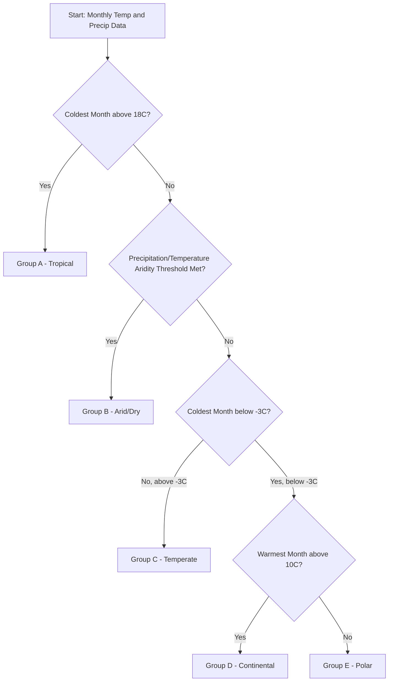
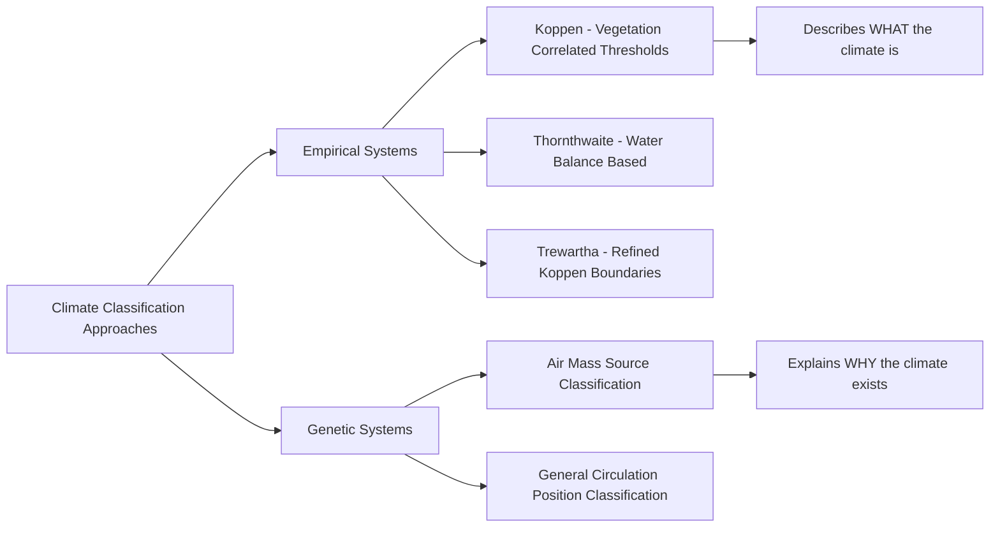

## Climate Classification Systems

### Purpose and General Approach

Climate classification systems organize the immense variability of Earth's regional climates into a manageable set of categories based on measurable climatic variables, primarily temperature and precipitation, sometimes supplemented by vegetation, evapotranspiration, or seasonality patterns. These systems serve both descriptive purposes (summarizing a region's climate) and analytical purposes (comparing regions, informing agricultural planning, and detecting climate shifts over time).

**Key Points**

- Classification systems differ fundamentally in their underlying logic: **empirical (genetic)** systems classify based on directly observed climate variables (temperature, precipitation), while **genetic** systems classify based on the atmospheric processes (air mass source, circulation patterns) that produce the climate
- No single classification system is universally superior; the appropriate system depends on the application, whether that is vegetation correlation, agricultural suitability, or general climatic description
- Boundaries between climate types are inherently somewhat arbitrary threshold choices along a continuous spectrum of climatic variation, so classification boundaries should be understood as convenient divisions rather than sharp natural discontinuities [Inference — the degree of "arbitrariness" varies by system, since some thresholds were empirically derived from vegetation correlations rather than chosen purely for mathematical convenience]

### The Köppen Climate Classification System

The most widely used climate classification system globally, originally developed by Wladimir Köppen in the late 19th and early 20th centuries, based on the empirical observation that natural vegetation boundaries correlate strongly with specific temperature and precipitation thresholds.

#### Structure: Letter-Coded Hierarchy

The Köppen system (in its modern Köppen-Geiger form) uses a hierarchical letter code, typically two to three letters, each conveying specific climatic information.

**First Letter (Major Climate Group)**

- **A** — Tropical: coldest month average temperature at or above 18°C
- **B** — Arid/Dry: defined by an aridity threshold relating annual precipitation to temperature, rather than a fixed precipitation amount, since evaporative demand (and thus effective aridity) increases with temperature
- **C** — Temperate/Mesothermal: coldest month between -3°C and 18°C, with at least one month above 10°C
- **D** — Continental/Microthermal: coldest month below -3°C (or 0°C in some variants), with at least one month above 10°C
- **E** — Polar: warmest month below 10°C

**Second Letter (Precipitation Pattern, for A/C/D groups) or Sub-type (for B/E groups)**

- **f** — no significant dry season (constantly moist)
- **s** — dry season in summer
- **w** — dry season in winter
- **m** — monsoon pattern (short dry season, but high enough annual total to support tropical rainforest)
- **W** — desert (for B group)
- **S** — steppe/semi-arid (for B group)
- **F** — ice cap (for E group)
- **T** — tundra (for E group)

**Third Letter (Temperature Detail, for C/D groups)**

- **a** — hot summer (warmest month above 22°C)
- **b** — warm summer (warmest month below 22°C, but at least 4 months above 10°C)
- **c** — cool summer (fewer than 4 months above 10°C)
- **d** — very cold winter (coldest month below -38°C, D group only)

**Example**

A location with a coldest month average of 5°C (placing it in the C group), a distinct dry summer with wet winters, and a warmest month of 28°C would be classified as **Csa** — a temperate climate with dry, hot summers, the classic Mediterranean climate type exemplified by much of coastal California, the Mediterranean Basin, and parts of central Chile.

### Diagram: Köppen Classification Decision Logic

### The Thornthwaite Climate Classification System

Developed by C.W. Thornthwaite, primarily as an alternative addressing a key limitation of Köppen's system: its reliance on raw temperature and precipitation values rather than a physically grounded measure of moisture availability for plants and hydrology.

#### Core Concept: Potential Evapotranspiration (PE)

Thornthwaite's system is built around **potential evapotranspiration**, an estimate of the water that would be lost via evaporation and plant transpiration under conditions of unlimited water availability, calculated from temperature (in Thornthwaite's original empirical formulation) as a proxy for available energy.

**Key Points**

- The system computes a **moisture index** comparing actual precipitation to potential evapotranspiration, allowing direct classification of moisture surplus or deficit rather than relying on fixed precipitation thresholds
- This approach is considered more physically meaningful for agricultural and hydrological applications, since it accounts for the fact that identical precipitation amounts represent very different effective moisture availability depending on temperature-driven evaporative demand
- The Thornthwaite system has seen less widespread general adoption than Köppen for basic climate description, but remains influential in water balance studies, irrigation planning, and drought index calculations [Inference — relative usage prevalence between the two systems varies substantially by academic discipline and regional research tradition]

### The Trewartha Climate Classification System

A modification of the Köppen system proposed by Glenn Trewartha, primarily addressing perceived issues with the size and boundary placement of Köppen's C (temperate) group, which Trewartha considered too broad and inconsistently matched to actual vegetation and land-use patterns.

**Key Points**

- Introduces a distinct **subtropical (C) versus temperate/continental (D) boundary** using a more restrictive definition requiring at least eight months above 10°C for the C category, narrowing what counts as "temperate" relative to Köppen's original scheme
- Also modifies the tropical/humid subtropical boundary treatment and consolidates or adjusts other subcategories, aiming for a classification more consistent with observed global vegetation zone boundaries
- Sees more use in some academic and regional climatological contexts, particularly in some geography curricula, but remains considerably less widely adopted in general practice than the original Köppen-Geiger system

### Genetic Classification Approaches

Unlike empirical systems, **genetic classification** systems categorize climates according to the atmospheric circulation processes and air mass characteristics that generate them, rather than solely by the resulting temperature/precipitation statistics.

- Classification by dominant air mass influence (e.g., regions dominated by continental polar air masses in winter vs. maritime tropical influence in summer)

  fulfilling
- Classification by position relative to the global general circulation (e.g., subtropical high-pressure dominated arid zones, ITCZ-influenced tropical wet zones, polar front-dominated mid-latitude zones)
- These approaches provide stronger explanatory power for *why* a climate exists as it does, complementing the descriptive strength of empirical systems like Köppen, though they are less commonly used for straightforward mapping and comparison purposes due to greater complexity in operational application

### Diagram: Empirical vs. Genetic Classification Philosophy

### Practical Applications and Limitations

**Key Points**

- Köppen-Geiger maps are widely used in ecological, agricultural, and climate change impact studies due to their strong historical vegetation correlation and ease of global mapping from standard meteorological station data
- All classification systems based on climate normals (typically 30-year averages) face an inherent challenge under a changing climate: category boundaries computed from historical baseline periods may not reflect current or future conditions, requiring periodic recalculation as the climate shifts
- Global Köppen-Geiger maps have been updated using both historical observational data and climate model projections to depict anticipated future climate zone shifts under various emissions scenarios, illustrating a practical modern application of an over a century-old classification framework [Inference — the specific magnitude and pattern of projected zone shifts depends on the emissions scenario and climate model ensemble used in any given study]
- Classification systems generally struggle to capture microclimatic variation (urban heat islands, coastal fog belts, elevation-driven local variation) since they are designed around station-representative regional climate characterization rather than fine-scale spatial detail

### Example: Comparing Classification Outcomes for a Single Region

Consider a semi-arid region with 300mm annual precipitation and a mean annual temperature of 20°C. Under the Köppen system, this location would likely fall into the **B (arid)** group, since Köppen's aridity threshold formula weighs the combination of low precipitation against relatively high temperature-driven evaporative demand. Under the Thornthwaite system, the same location's classification would be derived directly from its calculated moisture index (precipitation relative to computed potential evapotranspiration), which for a region with this temperature and precipitation combination would similarly indicate a moisture deficit condition, though the two systems' precise boundary thresholds and resulting sub-category labels differ in structure, since Thornthwaite's approach is built around a continuous water balance calculation rather than Köppen's discrete empirical threshold formula [Inference — exact sub-classification results depend on the specific seasonal distribution of precipitation and temperature, not just the annual totals used in this simplified example].

### Additional Specialized Classification Frameworks

- **Bailey's Ecoregion Classification**: integrates climate with vegetation, soil, and landform characteristics to define broader ecological regions, used prominently in North American land management contexts
- **Holdridge Life Zone System**: uses biotemperature, precipitation, and potential evapotranspiration ratio to classify vegetation zones, widely used in tropical and subtropical ecological research and forestry applications
- **Plant Hardiness Zone Maps**: a specialized, agriculturally-focused classification based specifically on minimum winter temperature extremes, used primarily for horticultural and gardening applications rather than general climate description

**Related Topics**

- Climate normals and the 30-year averaging convention
- Vegetation biomes and their climatic controls
- Climate change impacts on classification zone shifts
- Microclimate and urban heat island effects
- Paleoclimate reconstruction and historical climate zone mapping
- Agricultural climatology and crop suitability modeling