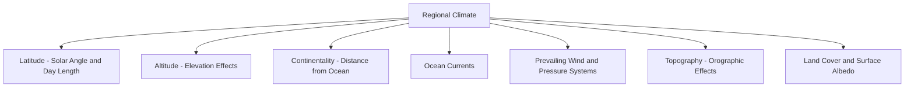

## Factors Controlling Regional Climate

### Overview of Climate Controls

Regional climate — the characteristic, long-term pattern of temperature, precipitation, and atmospheric conditions at a given location — is the product of multiple interacting physical controls operating at different spatial and temporal scales. No single factor determines a region's climate in isolation; rather, climate emerges from the combined influence of astronomical, geographic, atmospheric, and oceanic controls acting simultaneously.

**Key Points**

- Climate controls are often categorized as either **radiative/astronomical** (governing the fundamental energy input) or **geographic/dynamic** (governing how that energy is redistributed and modified regionally)
- The relative importance of individual controls varies substantially by location; a coastal mid-latitude city's climate may be dominated by ocean proximity, while a continental interior location at similar latitude may be dominated by distance-from-ocean (continentality) effects
- Climate controls interact nonlinearly, meaning the combined effect of multiple factors is not simply additive — for example, a mountain range's orographic effect on precipitation depends heavily on the moisture content of the prevailing wind, which itself depends on ocean proximity and circulation pattern

### Latitude and Solar Radiation Receipt

Latitude is the foundational control on regional climate because it determines the angle of incoming solar radiation and, correspondingly, the annual range of day length.

- **Solar angle effect**: radiation striking Earth's surface at a shallow angle (high latitudes) is spread over a larger surface area than the same amount of radiation striking at a steep angle (low latitudes), reducing radiation intensity per unit area
- **Day length variation**: increases with latitude and season, driven by Earth's axial tilt (approximately 23.5°), producing the dramatic seasonal daylight extremes at high latitudes (continuous daylight or darkness within the polar circles) versus the near-constant ~12-hour day length near the equator
- **Combined effect**: these two factors together produce the fundamental latitudinal temperature gradient from equator to poles that drives the entire global atmospheric and oceanic circulation system

### Diagram: Primary Regional Climate Controls

### Altitude and Elevation Effects

Temperature generally decreases with increasing elevation, following the **environmental lapse rate** (averaging approximately 6.5°C/km, though it varies with atmospheric moisture and stability conditions), because atmospheric pressure and density decrease with altitude, reducing the atmosphere's capacity to retain heat near the surface.

**Key Points**

- High-elevation locations at low latitudes can exhibit climates more characteristic of much higher latitudes, illustrated by permanent snow and ice caps on equatorial peaks such as Mount Kilimanjaro, despite their position within the tropics
- Elevation also affects precipitation patterns both directly (through orographic lifting) and indirectly (through temperature effects on atmospheric moisture-holding capacity, per the Clausius-Clapeyron relation)
- Mountain ranges can create distinct localized climate zones over short horizontal distances, producing rapid climate transitions unlike the gradual latitudinal gradient

### Continentality: Land-Ocean Thermal Contrast

**Continentality** describes the degree to which a location's climate is influenced by its distance from large water bodies, arising from the fundamentally different thermal properties of land and water.

#### Physical Basis

- Water has a much higher specific heat capacity than land surfaces, meaning it requires substantially more energy input to produce the same temperature change
- Water also allows solar radiation to penetrate to depth and redistributes absorbed heat through mixing and currents, spreading the thermal response over a much larger volume than the shallow, direct heating of land surfaces
- These properties cause oceans to warm and cool much more slowly than land, moderating the climate of nearby coastal regions and reducing their seasonal and diurnal temperature range

#### Continental vs. Maritime Climate Characteristics

| Characteristic | Maritime (Coastal) Climate | Continental (Interior) Climate |
| --- | --- | --- |
| Annual temperature range | Small | Large |
| Diurnal temperature range | Small | Large |
| Summer temperatures | Moderated (cooler) | Extreme (hotter) |
| Winter temperatures | Moderated (milder) | Extreme (colder) |
| Humidity | Generally higher | Generally lower |
| Precipitation timing | Often more evenly distributed | Often more seasonally concentrated |

**Example**

Two cities at the same latitude, one coastal and one deep in a continental interior, can exhibit dramatically different annual temperature ranges despite receiving essentially identical solar radiation inputs — the coastal city moderated by the adjacent ocean's thermal inertia, and the interior city experiencing much greater seasonal extremes due to the land surface's rapid thermal response to changing solar input, illustrating continentality's independent influence separate from latitude.

### Ocean Currents

Ocean currents transport substantial quantities of heat poleward (via warm currents) or equatorward (via cold currents), modifying the climate of adjacent coastal regions well beyond what latitude alone would predict.

- **Warm currents** (e.g., the Gulf Stream/North Atlantic Drift): carry warm tropical water poleward, moderating winter temperatures of adjacent coastlines substantially above their latitudinal expectation, a key factor in Western Europe's relatively mild winters compared to similar latitudes in eastern North America
- **Cold currents** (e.g., the Humboldt/Peru Current, California Current, Benguela Current): carry cool water equatorward along western coasts of continents, suppressing local temperatures and, critically, atmospheric convection, contributing to the formation of major coastal desert regions (Atacama, parts of coastal California, Namib) since the stable, cool marine air layer inhibits the vertical development needed for precipitation
- **Upwelling zones**: associated with cold currents and specific wind-driven surface water divergence patterns, bring cold, nutrient-rich deep water to the surface, further reinforcing local cooling and atmospheric stability

### Prevailing Winds and Pressure Systems

A location's position relative to the semi-permanent pressure systems and general circulation belts (subtropical highs, subpolar lows, trade winds, westerlies) strongly controls its typical weather patterns and moisture regime.

**Key Points**

- Locations dominated by subsiding air associated with subtropical high-pressure belts (~30° latitude) tend toward persistent aridity, since descending air warms adiabatically and its relative humidity decreases, suppressing cloud formation and precipitation
- Locations within the mid-latitude westerly wind belt experience weather dominated by traveling extratropical cyclones and associated frontal systems, producing more variable, less seasonally extreme precipitation patterns than either the tropics or subtropical deserts
- Wind direction relative to nearby water bodies determines whether a coastal location receives predominantly moist, moderating onshore flow or predominantly dry, more extreme offshore continental flow

### Topography and Orographic Effects

Mountain ranges modify regional climate through both direct mechanical lifting effects on precipitation and broader barrier effects on air mass movement.

- **Windward (upslope) effects**: forced ascent of moist air produces enhanced condensation and precipitation on the side of a mountain range facing the prevailing moisture-bearing wind
- **Rain shadow (leeward) effects**: air descending the lee side of a mountain range has typically already lost much of its moisture through windward precipitation, and further warms adiabatically during descent, producing markedly drier conditions than the windward side at similar distance from the range
- **Barrier effects**: mountain ranges can block or channel the movement of entire air masses, explaining, for example, how the Himalayas restrict the southward intrusion of cold continental Asian air into South Asia, contributing to the region's warmer winter climate relative to its latitude

### Diagram: Orographic Precipitation and Rain Shadow Effect

### Land Cover and Surface Albedo

The physical characteristics of the land surface itself feed back into local and regional climate through their influence on the surface energy balance.

- **Albedo effects**: surfaces with high reflectivity (fresh snow, ice, light-colored sand) reflect a larger fraction of incoming solar radiation, reducing local surface heating, while dark surfaces (dense forest, dark soil, urban infrastructure) absorb more radiation and warm more readily
- **Vegetation and evapotranspiration**: vegetated surfaces return substantial moisture to the atmosphere via transpiration, contributing to local humidity and potentially enhancing precipitation recycling in some regions, particularly large forested basins [Inference — the magnitude of vegetation-precipitation feedback varies substantially by region and has been a subject of ongoing hydroclimatic research, particularly regarding large tropical forest systems]
- **Urban heat island effect**: the replacement of natural vegetated surfaces with impervious, heat-absorbing materials (asphalt, concrete) combined with reduced evapotranspiration and anthropogenic heat release produces measurably elevated temperatures in urban areas relative to surrounding rural areas, particularly pronounced at night

### Interaction of Multiple Controls: A Synthesis Example

**Example**

Consider explaining the climate of a hypothetical coastal city at 35° latitude on the western edge of a continent: its latitude places it within the transition zone between subtropical high-pressure dominance (favoring dry summers as the high shifts poleward in summer) and mid-latitude westerly influence (favoring wetter winters as the westerlies and associated storm tracks shift equatorward in winter). Its position on the western coast places it under the influence of a cold ocean current, further suppressing summer convection and reinforcing the dry season. The combination of these controls — latitude-driven seasonal pressure belt migration plus the coastal cold-current effect — jointly produces the characteristic Mediterranean-type climate pattern (dry summer, wet winter) observed in such locations, rather than any single control acting in isolation [Inference — the exact strength and seasonal timing of this pattern varies with the specific regional configuration of coastline orientation, current strength, and larger-scale circulation anomalies].

### SVG Illustration: Continentality Effect on Annual Temperature Range (svg_diagram)

<svg xmlns="http://www.w3.org/2000/svg" viewBox="0 0 700 400">
<rect x="0" y="0" width="700" height="400" fill="#f4f6f7" />
<text x="350" y="25" font-size="16" text-anchor="middle" font-family="sans-serif" font-weight="bold">Continentality Effect (svg_diagram)</text>
<line x1="60" y1="350" x2="640" y2="350" stroke="#333" stroke-width="1" />
<text x="350" y="375" font-size="11" text-anchor="middle" font-family="sans-serif">Month (Jan to Dec)</text>
<text x="30" y="200" font-size="11" text-anchor="middle" font-family="sans-serif" transform="rotate(-90 30 200)">Temperature</text>
<polyline points="80,220 150,235 220,255 290,270 360,280 430,275 500,260 570,240 610,225" fill="none" stroke="#2980b9" stroke-width="3" />
<text x="610" y="215" font-size="11" font-family="sans-serif" fill="#2980b9">Maritime (small range)</text>
<polyline points="80,310 150,290 220,240 290,150 360,100 430,120 500,180 570,260 610,300" fill="none" stroke="#c0392b" stroke-width="3" />
<text x="610" y="90" font-size="11" font-family="sans-serif" fill="#c0392b">Continental (large range)</text>
</svg>

### Interannual and Multi-Decadal Modulation

Beyond the persistent, structural controls described above, regional climate is also modulated by recurring large-scale ocean-atmosphere oscillation patterns operating on interannual to decadal timescales:

- **El Niño-Southern Oscillation (ENSO)**: alters typical precipitation and temperature patterns across much of the tropics and, via atmospheric teleconnections, substantial portions of the mid-latitudes as well
- **Other coupled oscillation patterns** (e.g., North Atlantic Oscillation, Pacific Decadal Oscillation): influence storm track position, temperature anomaly patterns, and precipitation distribution across their respective regions of influence over multi-year to multi-decadal timescales

**Related Topics**

- Köppen and other climate classification systems
- Ocean-atmosphere teleconnections (ENSO, NAO, PDO)
- Orographic precipitation modeling
- Urban climate and heat island mitigation
- Paleoclimatology and long-term climate control shifts
- Microclimate variation and local surface energy balance