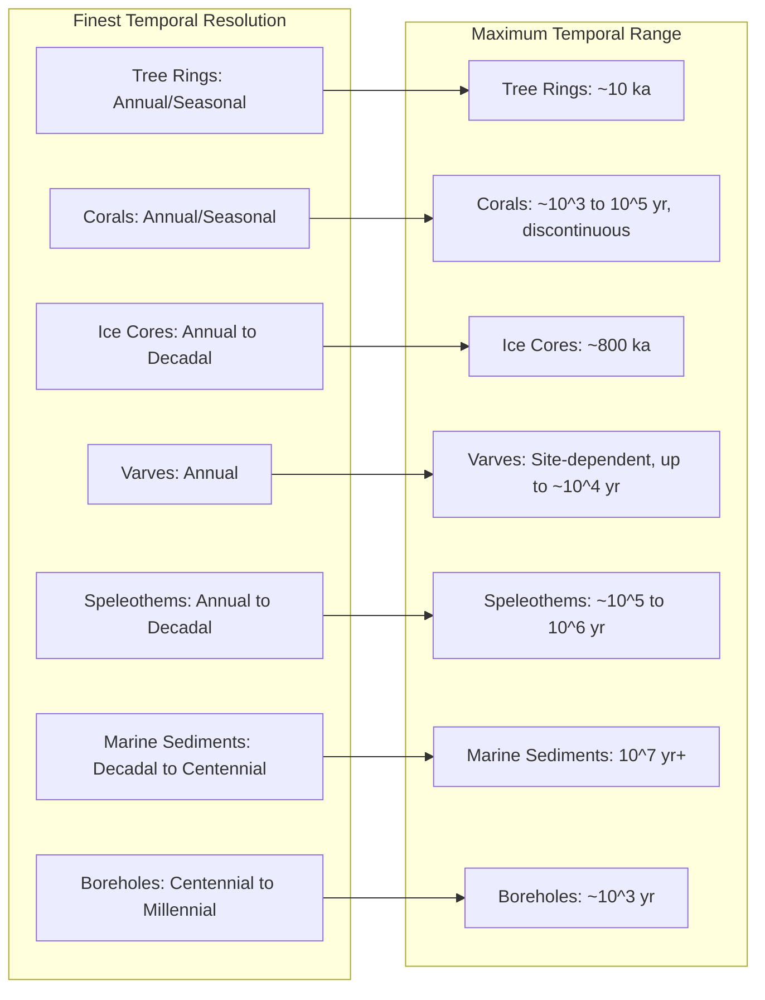

## Paleoclimate Proxies and Reconstruction

### Overview

Paleoclimatology reconstructs climate conditions prior to the instrumental record (which spans roughly the last ~150–170 years) by measuring **proxies**: physical, chemical, or biological materials that preserve a signal related to past environmental conditions. Because no direct thermometer or rain gauge existed millions — or even hundreds — of years ago, proxies serve as indirect, calibrated substitutes, and reconstruction is the statistical and physical process of converting proxy measurements into quantitative estimates of past climate variables (temperature, precipitation, atmospheric composition, ice volume, ocean circulation).

---

### Fundamental Concepts

**Key Points**

- A **proxy** is any preserved physical characteristic that varies systematically with a climate variable and can be measured today.
- **Calibration** establishes the mathematical relationship between a proxy and the climate variable using overlapping instrumental-era data (the "calibration period").
- **Transfer functions** apply the calibrated relationship to older, pre-instrumental proxy values to estimate past climate.
- Every proxy has a **temporal resolution** (finest time interval it can resolve — e.g., annual, decadal, millennial) and **temporal range** (how far back it extends).
- Proxies must be **dated** independently of the climate signal itself, since circular reasoning (using assumed climate to date a sample, then using that date to infer climate) would invalidate the reconstruction.

The general form of a proxy transfer function is:

$$C_{est} = f(P_{obs}) + \varepsilon$$

where $C_{est}$ is the estimated climate variable, $P_{obs}$ is the observed proxy value, $f$ is the calibrated transfer function (often linear regression, but can be nonlinear or multivariate), and $\varepsilon$ is residual error, which must be propagated into uncertainty estimates for the reconstruction.

---

### Ice Cores

**Mechanism**

Snow accumulates in layers in polar and high-altitude glacial regions; as it compacts into firn and then glacial ice, it traps air bubbles that preserve samples of the ancient atmosphere, along with dust, volcanic ash, and chemical impurities deposited from the atmosphere.

**Key Proxy Signals**

- **Stable isotope ratios** of oxygen ($\delta^{18}O$) and hydrogen ($\delta D$) in the ice itself serve as a temperature proxy, since heavier isotopes preferentially precipitate out of moisture-bearing air masses as they cool during transport to high latitudes (Rayleigh distillation).
- **Trapped gas bubbles** provide direct historical measurements of atmospheric $CO_2$, $CH_4$, and $N_2O$ concentrations.
- **Dust and chemical impurities** (e.g., sulfate spikes) record volcanic eruptions, aridity changes, and atmospheric circulation shifts.

**Delta Notation**

Isotope ratios are reported in delta notation relative to a standard (Vienna Standard Mean Ocean Water, VSMOW, for oxygen/hydrogen):

$$\delta^{18}O = \left( \frac{R_{sample}}{R_{standard}} - 1 \right) \times 1000\ (\text{‰})$$

where $R = {}^{18}O/{}^{16}O$. More negative (depleted) $\delta^{18}O$ values generally correspond to colder conditions at the site of precipitation.

**Notable Records**

The Vostok and EPICA Dome C ice cores from Antarctica extend to roughly 420,000 and 800,000 years respectively, capturing multiple glacial-interglacial cycles. Greenland cores (e.g., GISP2, NGRIP) offer higher temporal resolution due to higher snow accumulation rates but a shorter total record, given thinner and more deformed ice at depth.

**Dating**

Ice cores are dated by counting annual layers (visible via seasonal variations in dust, isotopes, or electrical conductivity) near the surface, and by ice-flow modeling combined with matching known volcanic ash horizons at greater depths, where annual layers become too thin and compressed to resolve individually.

---

### Tree Rings (Dendroclimatology)

**Mechanism**

Trees in seasonal climates produce one growth ring per year; ring width, density, and isotopic composition vary with growing-season conditions (temperature, moisture, sunlight), depending on which factor is locally limiting to growth.

**Key Techniques**

- **Ring width**: wider rings generally indicate favorable growing conditions (more moisture in water-limited sites, warmer temperatures in temperature-limited high-latitude/high-altitude sites).
- **Maximum latewood density (MXD)**: density of the late-growing-season wood, often a stronger summer-temperature proxy than ring width at temperature-limited sites.
- **Cross-dating**: matching characteristic ring-width patterns (e.g., distinctively narrow rings from a known drought year) between overlapping living and dead/subfossil wood samples to build a continuous chronology extending beyond the lifespan of any single tree.
- **Stable isotopes in wood cellulose** ($\delta^{13}C$, $\delta^{18}O$) provide additional signals related to water-use efficiency and source-water isotopic composition.

**Standardization**

Raw ring-width series contain a non-climatic age-related growth trend (rings are naturally wider in a tree's youth); this is removed via detrending (e.g., fitting and dividing by a negative exponential or spline curve) before averaging many trees into a site chronology, isolating the shared climate signal from tree-specific noise.

**Temporal Range and Resolution**

Dendroclimatology provides annual, and in some species seasonal, resolution — the finest resolution of any widely used terrestrial proxy — but is generally limited to the Holocene (the last ~11,700 years), with the longest continuous chronologies (e.g., from bristlecone pine and oak) extending several thousand to just over ten thousand years via cross-dating with subfossil wood.

---

### Corals

**Mechanism**

Reef-building corals secrete an aragonite skeleton in annual (and finer, seasonal) growth bands, analogous to tree rings, incorporating trace elements and isotopes from surrounding seawater as they grow.

**Key Proxy Signals**

- **$\delta^{18}O$**: reflects a combination of sea surface temperature (SST) and seawater salinity/$\delta^{18}O_{seawater}$ (itself related to evaporation-precipitation balance), requiring independent constraints to separate the two influences.
- **Sr/Ca ratio**: strontium substitutes for calcium in the aragonite lattice at a temperature-dependent rate, providing a more temperature-specific proxy less confounded by salinity than $\delta^{18}O$ alone.
- **Band density (via X-radiography)**: reflects annual growth-rate variation linked to temperature and light.

**Relevance**

Corals are particularly valuable for reconstructing tropical Pacific SST variability and El Niño–Southern Oscillation (ENSO) history, since instrumental tropical ocean records are comparatively short and sparse before the satellite era.

---

### Sediment Cores (Marine and Lacustrine)

**Marine Sediments**

Ocean and lake sediments accumulate continuously, incorporating the shells (tests) of microorganisms such as foraminifera, diatoms, and coccolithophores, along with terrigenous dust and organic matter.

**Key Proxy Signals**

- **Foraminiferal $\delta^{18}O$**: reflects a combination of deep-ocean temperature and global ice volume (since evaporation preferentially removes lighter $^{16}O$, leaving ocean water — and thus foram shells — enriched in $^{18}O$ during glacial periods when more $^{16}O$-rich water is locked in ice sheets). This dual sensitivity means benthic (deep-dwelling) foram $\delta^{18}O$ records are often treated primarily as an ice-volume proxy over glacial-interglacial timescales.
- **Mg/Ca ratio in foram shells**: temperature-dependent substitution, used alongside $\delta^{18}O$ to help disentangle the temperature and ice-volume components.
- **Alkenone unsaturation index ($U^{K'}_{37}$)**: a ratio of unsaturated to saturated long-chain organic compounds (alkenones) produced by certain phytoplankton, which varies systematically with the SST at which the organisms grew.
- **Pollen assemblages**: relative abundances of pollen types reflect the surrounding vegetation, which in turn reflects regional temperature and precipitation regimes (used in the "modern analog technique," matching fossil pollen assemblages to modern ones with known climate).
- **Diatom and radiolarian assemblages**: species composition shifts reflect ocean temperature and productivity conditions.

**Dating**

Radiocarbon ($^{14}C$) dating of organic material is standard for sediments within the last ~50,000 years; below that range, orbital tuning (matching sediment cycles to astronomically calculated orbital variations, or Milankovitch cycles) or magnetostratigraphy (matching recorded reversals of Earth's magnetic field to the well-established geomagnetic polarity timescale) extends dating into the millions of years.

**Resolution and Range**

Sediment cores typically offer decadal-to-centennial resolution (coarser than ice cores or tree rings due to bioturbation — mixing of sediment by burrowing organisms — and lower accumulation rates) but extend the reconstruction record furthest back in time, into the tens of millions of years for slowly deposited deep-sea sequences.

---

### Speleothems (Cave Deposits)

**Mechanism**

Stalagmites and stalactites grow from mineral-laden water dripping in caves, precipitating calcite in layers that can preserve annual banding in favorable conditions.

**Key Proxy Signals**

- **$\delta^{18}O$**: primarily reflects the isotopic composition of regional precipitation (itself linked to the amount and source of rainfall, temperature, and monsoon intensity), making speleothems especially valuable for reconstructing monsoon variability in Asia and precipitation history more broadly.
- **$\delta^{13}C$**: reflects overlying soil and vegetation conditions and cave ventilation, offering an indirect ecosystem/moisture indicator.

**Dating**

Speleothems are dated with high precision using uranium-series (U-Th) dating, which exploits the radioactive decay of uranium isotopes incorporated during calcite formation into thorium, giving speleothems some of the most precisely dated long records available, extending to several hundred thousand years.

---

### Other Notable Proxies

- **Boreholes**: temperature profiles measured in deep boreholes preserve a smoothed record of past surface temperature changes diffusing downward through rock/ice, useful for reconstructing multi-century temperature trends but with resolution that degrades sharply with depth (and thus with time before present).
- **Historical documents**: ship logs, harvest records, phenological observations (e.g., cherry blossom bloom dates), and diary entries provide qualitative-to-semiquantitative climate information for the last several centuries, particularly valuable for regions or periods with sparse natural proxies.
- **Varves**: annually laminated lake or glacial-lake sediments, where distinct layers (often a coarse-fine couplet reflecting seasonal deposition) allow direct annual counting, similar in principle to tree rings and ice-core layers.
- **Packrat middens**: preserved plant material collections cemented by crystallized urine in arid regions, used to reconstruct vegetation and climate history in desert environments over millennial timescales.

---

### Multi-Proxy Reconstruction and Statistical Methods

**Why Multi-Proxy Approaches Are Used**

No single proxy is a perfect, noise-free climate recorder — each has its own sensitivities, seasonal biases, dating uncertainties, and non-climatic confounds (e.g., a tree's response to disease or a coral's exposure to non-thermal seawater changes). Combining many proxies, ideally spanning different archive types and independent dating methods, allows a shared climate signal to be statistically distinguished from proxy-specific noise.

**Common Statistical Approaches**

- **Principal Component Analysis (PCA) / Empirical Orthogonal Function (EOF) analysis**: extracts the dominant shared modes of variability across a network of proxy records.
- **Regularized regression / composite-plus-scale methods**: combine proxy networks into a single reconstructed index, calibrated against instrumental data over the overlap period.
- **Bayesian hierarchical models**: explicitly propagate multiple sources of uncertainty (proxy noise, dating error, calibration uncertainty) into a probabilistic reconstruction with formal confidence intervals, increasingly preferred over older regression-only approaches for their more complete uncertainty accounting. [Inference: the relative merit of specific statistical frameworks for any given proxy network is actively debated in the paleoclimate literature and depends on the network's spatial coverage and proxy types, so this should not be read as a universal ranking of methods.]

**A Landmark Example**

Multi-proxy Northern Hemisphere temperature reconstructions (the lineage originating with the 1998–1999 "hockey stick" studies) combined tree rings, ice cores, corals, and other proxies with instrumental data to estimate temperature variability over the past ~1,000 years, and became a focal point of methodological scrutiny (particularly regarding detrending procedures and proxy selection) that subsequently drove substantial improvements in statistical rigor and uncertainty quantification across the field.

---

### Illustration: Paleoclimate Proxy Archives — Temporal Range and Resolution

---

### Illustration: Ice Core Signal Pathway (svg_diagram)

<svg xmlns="http://www.w3.org/2000/svg" viewBox="0 0 640 340">
<rect x="0" y="0" width="640" height="340" fill="#f5f7fa" />
<text x="320" y="24" font-family="Arial" font-size="16" font-weight="bold" text-anchor="middle" fill="#1a2b3c">Ice Core Signal Pathway (svg_diagram)</text>
<rect x="20" y="60" width="130" height="60" rx="8" fill="#bee3f8" stroke="#2b6cb0" stroke-width="1.5" />
<text x="85" y="85" font-family="Arial" font-size="12" text-anchor="middle" fill="#1a2b3c">Ocean Evaporation</text>
<text x="85" y="102" font-family="Arial" font-size="11" text-anchor="middle" fill="#555">source water</text>
<line x1="150" y1="90" x2="200" y2="90" stroke="#333" stroke-width="2" marker-end="url(#arrow)" />
<rect x="200" y="60" width="140" height="60" rx="8" fill="#c6f6d5" stroke="#276749" stroke-width="1.5" />
<text x="270" y="85" font-family="Arial" font-size="12" text-anchor="middle" fill="#1a2b3c">Rayleigh Distillation</text>
<text x="270" y="102" font-family="Arial" font-size="11" text-anchor="middle" fill="#555">poleward transport, cooling</text>
<line x1="340" y1="90" x2="390" y2="90" stroke="#333" stroke-width="2" marker-end="url(#arrow)" />
<rect x="390" y="60" width="140" height="60" rx="8" fill="#fefcbf" stroke="#975a16" stroke-width="1.5" />
<text x="460" y="85" font-family="Arial" font-size="12" text-anchor="middle" fill="#1a2b3c">Snowfall Deposition</text>
<text x="460" y="102" font-family="Arial" font-size="11" text-anchor="middle" fill="#555">isotopically depleted</text>
<line x1="460" y1="120" x2="460" y2="160" stroke="#333" stroke-width="2" marker-end="url(#arrow)" />
<rect x="380" y="160" width="160" height="60" rx="8" fill="#e9d8fd" stroke="#553c9a" stroke-width="1.5" />
<text x="460" y="185" font-family="Arial" font-size="12" text-anchor="middle" fill="#1a2b3c">Firn Compaction</text>
<text x="460" y="202" font-family="Arial" font-size="11" text-anchor="middle" fill="#555">air bubble trapping</text>
<line x1="460" y1="220" x2="460" y2="260" stroke="#333" stroke-width="2" marker-end="url(#arrow)" />
<rect x="360" y="260" width="200" height="60" rx="8" fill="#fed7d7" stroke="#9b2c2c" stroke-width="1.5" />
<text x="460" y="285" font-family="Arial" font-size="12" text-anchor="middle" fill="#1a2b3c">Glacial Ice Archive</text>
<text x="460" y="302" font-family="Arial" font-size="11" text-anchor="middle" fill="#555">δ¹⁸O record + trapped gas record</text>
<line x1="360" y1="290" x2="180" y2="290" stroke="#333" stroke-width="2" marker-end="url(#arrow)" />
<rect x="20" y="260" width="160" height="60" rx="8" fill="#feebc8" stroke="#9c4221" stroke-width="1.5" />
<text x="100" y="285" font-family="Arial" font-size="12" text-anchor="middle" fill="#1a2b3c">Two Parallel Signals</text>
<text x="100" y="302" font-family="Arial" font-size="11" text-anchor="middle" fill="#555">temp. proxy + direct CO2/CH4</text>
</svg>

---

### Worked Example: Estimating Temperature Change from an Ice Core $\delta^{18}O$ Shift

**Example**

Suppose a calibration study establishes a site-specific isotope-temperature slope of $\alpha = 0.67\ \text{‰ per °C}$ (a typical order of magnitude for Antarctic ice cores [Unverified: the precise slope is site- and calibration-method-dependent and must be taken from the specific study for the core in question]), and a core sample shows a shift from $\delta^{18}O = -55\text{‰}$ (recent baseline) to $\delta^{18}O = -58.5\text{‰}$ (glacial-period sample).

1. Compute the isotopic shift: $\Delta\delta^{18}O = -58.5 - (-55) = -3.5\text{‰}$.
2. Apply the calibrated slope to estimate the temperature change:

   $$\Delta T = \frac{\Delta \delta^{18}O}{\alpha} = \frac{-3.5}{0.67} \approx -5.2°C$$
3. Report this as an estimate with propagated uncertainty from both the analytical precision of the isotope measurement and the uncertainty in the calibration slope itself, rather than as a single exact figure.

**Conclusion**: This simplified single-proxy, single-site calculation illustrates the transfer-function logic underlying ice-core paleothermometry, but operational reconstructions cross-validate such single-site estimates against independent proxies (e.g., borehole temperature profiles, gas-isotope-based thermometers within the same core) to constrain the true uncertainty, since a linear slope calibrated against limited modern data carries irreducible extrapolation risk when applied to climate states far outside the calibration range.

---

### Common Analysis Pitfalls

- Applying a modern proxy-climate calibration relationship unchanged to conditions far outside the range under which it was calibrated (non-stationarity of the proxy-climate relationship over time).
- Confusing $\delta^{18}O$ in marine sediments (an ice-volume-dominated signal on glacial timescales) with $\delta^{18}O$ in ice cores (primarily a local temperature signal) — these are physically related but represent different components of the climate system.
- Treating a single proxy record from one site as globally representative, rather than recognizing regional and seasonal biases inherent to any single archive.
- Underestimating chronological uncertainty, particularly in deeper sediment or ice-core sections where layer counting becomes unreliable and age models rely on interpolation between dated tie-points.
- Ignoring bioturbation-driven smoothing in marine sediment records when interpreting apparent lags or leads between proxy signals at sub-centennial timescales.

---

**Related Topics**

- Milankovitch Cycles and Orbital Forcing
- Glacial-Interglacial Cycles and Ice Ages
- Isotope Geochemistry Fundamentals
- Radiometric and U-Th Dating Methods
- Holocene Climate Variability
- El Niño–Southern Oscillation (ENSO) Reconstruction
- Statistical Methods in Climate Reconstruction
- Instrumental Climate Record and Homogenization
- Paleoclimate Model-Data Comparison
- Carbon Cycle Dynamics Through Geologic Time