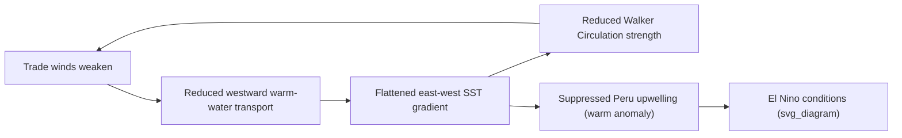

## Natural Climate Variability and Oscillations

### Overview

Natural climate variability refers to fluctuations in Earth's climate system that occur independently of human influence, arising from internal interactions among the atmosphere, ocean, cryosphere, land surface, and biosphere, as well as external forcings such as solar output and volcanic activity. These variations operate across a vast range of timescales — from seasonal to multi-decadal to millennial — and are distinct from, but superimposed upon, anthropogenic climate change.

Climate oscillations are quasi-periodic or recurring patterns of variability, typically characterized by alternating phases (e.g., warm/cool, wet/dry) driven by coupled ocean-atmosphere dynamics. Unlike a strict periodic signal (like Earth's orbit), oscillations are often irregular in period and amplitude, which is why they are termed "quasi-periodic."

### Classification by Timescale

**Key Points**

- **Short-term (interannual, 2–10 years):** ENSO, IOD
- **Decadal to multidecadal (10–70 years):** PDO, AMO, NAO/AO in low-frequency mode
- **Centennial to millennial:** Solar cycles (Maunder Minimum), volcanic forcing clusters, Dansgaard-Oeschger events
- **Orbital (10,000–100,000+ years):** Milankovitch cycles (addressed as a related but separate topic)

This document focuses primarily on interannual-to-multidecadal internal variability, since orbital-scale forcing is conventionally treated as a distinct syllabus item.

### Drivers of Internal Climate Variability

Internal variability arises without any change in external forcing (solar input, greenhouse gas concentration, aerosol loading). It is generated by the chaotic, nonlinear redistribution of heat and momentum within the climate system, primarily through:

1. **Ocean-atmosphere coupling** — Slow ocean heat storage/release interacting with fast atmospheric circulation.
2. **Thermohaline circulation changes** — Variations in deep-water formation altering heat transport (relevant to AMO).
3. **Ocean heat content redistribution** — Subsurface warm/cool water masses migrating across basins (relevant to ENSO, PDO).
4. **Atmospheric teleconnections** — Large-scale pressure pattern shifts that redistribute the atmospheric response to a given SST anomaly across distant regions.

External forcings (solar variability, volcanic aerosols) can modulate or pace some of these oscillations but are not their fundamental cause.

---

### El Niño–Southern Oscillation (ENSO)

ENSO is the dominant mode of interannual climate variability on Earth, originating in the tropical Pacific and producing global teleconnections.

#### Mechanism

ENSO involves a coupled ocean-atmosphere feedback loop known as the **Bjerknes feedback**:

1. Under normal (neutral) conditions, easterly trade winds push warm surface water westward, piling it up near Indonesia (the "warm pool"), while cold water upwells along the South American coast.
2. This creates a steep east-west sea surface temperature (SST) gradient, which reinforces the trade winds via the pressure gradient (the Walker Circulation).
3. A weakening of trade winds reduces westward warm-water transport and upwelling, flattening the SST gradient — this further weakens the trade winds (positive feedback), producing **El Niño**.
4. An anomalous strengthening of trade winds enhances upwelling and the SST gradient, producing **La Niña**.

$$\Delta T_{gradient} \propto -\tau_{wind}$$

where $\tau_{wind}$ is zonal wind stress; the relationship is a simplified representation of the coupled feedback, not a fixed empirical constant.

#### Phases

**Key Points**

- **El Niño (warm phase):** Weakened trade winds, warm SST anomalies in the central/eastern Pacific, suppressed Peruvian upwelling, eastward-shifted Walker Circulation and convection.
- **La Niña (cool phase):** Strengthened trade winds, cool SST anomalies in the central/eastern Pacific, enhanced upwelling, intensified Walker Circulation.
- **ENSO-neutral:** SST anomalies within roughly ±0.5°C of the long-term mean in the Niño 3.4 region.

#### Monitoring Indices

- **Oceanic Niño Index (ONI):** 3-month running mean SST anomaly in the Niño 3.4 region (5°N–5°S, 120°W–170°W); a threshold of ±0.5°C sustained for five overlapping seasons defines an El Niño/La Niña episode.
- **Southern Oscillation Index (SOI):** Standardized sea-level pressure difference between Tahiti and Darwin, Australia; negative SOI corresponds to El Niño.

#### Global Teleconnections

**Example**

- El Niño: Drier conditions in Indonesia/Australia (increased wildfire risk), wetter conditions in the southern United States and coastal Peru, weakened Atlantic hurricane activity due to increased wind shear.
- La Niña: Wetter conditions in Indonesia/Australia, drought risk in the southwestern United States and the Horn of Africa, enhanced Atlantic hurricane activity.

#### Periodicity

ENSO events recur irregularly every 2–7 years and are not strictly periodic. [Inference] The irregularity is generally attributed to the nonlinear, chaotic nature of the coupled feedback system combined with stochastic atmospheric forcing (e.g., westerly wind bursts), though the precise deterministic-vs-stochastic balance remains an active research question.

---

### Pacific Decadal Oscillation (PDO)

The PDO is a long-lived, ENSO-like pattern of Pacific climate variability, but operating on decadal-to-interdecadal timescales (typically 20–30 years per phase) rather than interannual ones.

#### Characteristics

- **Spatial pattern:** During the "warm" (positive) phase, the western Pacific is cool and the eastern/tropical Pacific is warm — a horseshoe-shaped SST anomaly pattern. The "cool" (negative) phase reverses this.
- **Detection:** Defined via the leading empirical orthogonal function (EOF) of monthly SST anomalies in the North Pacific (poleward of 20°N).
- **Distinction from ENSO:** PDO phases persist for 20–30 years, whereas ENSO events last 6–18 months. The PDO is also centered more in the North Pacific, while ENSO is centered in the tropical Pacific.

#### Significance

**Key Points**

- Modulates the frequency and intensity of El Niño/La Niña impacts — El Niño impacts tend to be amplified during a positive PDO phase and dampened during a negative phase (and vice versa for La Niña), based on observational correlation. [Inference] This modulation relationship is statistically observed but the underlying causal mechanism connecting decadal PDO state to interannual ENSO expression is still debated.
- Influences North American drought patterns (e.g., linked to multi-decadal droughts in the western United States).
- Affects Pacific salmon population cycles via SST-driven productivity shifts in coastal ecosystems.

---

### Atlantic Multidecadal Oscillation (AMO)

The AMO is a basin-wide mode of SST variability in the North Atlantic, oscillating between warm and cool phases over roughly 60–80 years.

#### Mechanism

[Inference] The AMO is commonly linked to variations in the **Atlantic Meridional Overturning Circulation (AMOC)**, where enhanced northward heat transport produces a warm phase and weakened transport produces a cool phase; however, the relative contribution of internal ocean dynamics versus external forcing (aerosols) to the observed AMO signal remains a subject of ongoing scientific debate.

#### Impacts

- Modulates Atlantic hurricane activity: warm AMO phases are associated with more frequent and intense Atlantic tropical cyclones.
- Influences Sahel rainfall: a warm AMO phase is associated with increased Sahel precipitation, while a cool phase is linked to Sahel drought conditions (e.g., the 1970s–80s Sahel drought).
- Affects summer climate over North America and Europe, including drought frequency in the central United States.

---

### North Atlantic Oscillation (NAO) and Arctic Oscillation (AO)

#### North Atlantic Oscillation

The NAO is defined by the fluctuating pressure difference between the Icelandic Low and the Azores High, and it is the dominant mode of winter climate variability in the North Atlantic-European sector.

**Key Points**

- **Positive NAO:** Strengthened pressure gradient, stronger westerlies, mild/wet winters in Northern Europe, cold/dry winters in Southern Europe and the Mediterranean, warmer conditions in the eastern United States.
- **Negative NAO:** Weakened pressure gradient, weaker/more meandering westerlies, cold outbreaks in Northern Europe and the eastern United States, wetter conditions in Southern Europe.
- Operates on timescales from weekly to decadal, with no single dominant periodicity, distinguishing it from AMO/PDO.

#### Arctic Oscillation

The AO (also called the Northern Annular Mode) is a hemispheric-scale pattern describing the strength of the polar vortex relative to mid-latitudes; the NAO is often considered the regional Atlantic-sector expression of the AO.

- **Positive AO:** Strong, contained polar vortex, confining cold air to the Arctic.
- **Negative AO:** Weakened, distorted polar vortex, allowing cold Arctic air to spill into mid-latitudes (associated with severe mid-latitude winter cold outbreaks).

---

### Indian Ocean Dipole (IOD)

The IOD (sometimes called the "Indian Niño") is characterized by an SST gradient between the western and eastern tropical Indian Ocean.

- **Positive IOD:** Warmer western Indian Ocean, cooler eastern Indian Ocean (near Sumatra) — associated with increased rainfall in East Africa and drought/wildfire risk in Indonesia and Australia.
- **Negative IOD:** Reversed gradient — associated with wetter conditions in Indonesia/Australia and drier conditions in East Africa.
- The IOD frequently co-occurs and interacts with ENSO, since both are tropical ocean-atmosphere modes, though it can also develop independently.

---

### External Modulators of Natural Variability

While the oscillations above are primarily internally generated, external forcings can modulate their amplitude, phase, or superimpose additional variability:

#### Solar Variability

- The ~11-year sunspot cycle produces total solar irradiance (TSI) variations of approximately 0.1%, a magnitude generally considered too small to be a primary direct driver of surface temperature relative to greenhouse gas forcing over the industrial era. [Inference] Some proposed amplification mechanisms (e.g., ultraviolet-driven stratospheric ozone changes affecting the polar vortex, or Svensmark's cosmic-ray/cloud-nucleation hypothesis) remain scientifically contested and are not part of the mainstream consensus framework.
- Prolonged solar minima (e.g., the **Maunder Minimum**, 1645–1715) coincided with the coldest phase of the **Little Ice Age** in Europe, though the Little Ice Age is now attributed to a combination of factors including volcanic forcing, not solar activity alone.

#### Volcanic Forcing

- Large explosive eruptions inject sulfate aerosols into the stratosphere, reflecting incoming solar radiation and producing short-term (1–3 year) global cooling.
- Example: The 1991 eruption of Mount Pinatubo lowered global average temperatures by approximately 0.5°C for roughly two years.
- Volcanic forcing is episodic rather than oscillatory but can interact with and mask or amplify the phase of internal oscillations like ENSO in the short term.

---

### Distinguishing Natural Variability from Anthropogenic Change

**Key Points**

- **Timescale separation:** Internal oscillations redistribute existing heat within the climate system (ocean ⇌ atmosphere), producing regional warming/cooling without a persistent global energy imbalance. Anthropogenic forcing adds net energy to the system via the enhanced greenhouse effect, producing a sustained global mean trend.
- **Attribution methods:** Climate scientists use detection and attribution techniques — comparing observed patterns against climate model ensembles run with and without anthropogenic forcing — to separate the anthropogenic trend from superimposed natural oscillation "noise."
- **Compound effects:** A given year's global temperature reflects the sum of the long-term anthropogenic trend plus the phase of natural oscillations (e.g., a strong El Niño year, like 2016 or 2023–24, tends to set short-term global temperature records by adding oceanic heat release on top of the background warming trend).

$$T_{observed}(t) = T_{trend}(t) + T_{ENSO}(t) + T_{volcanic}(t) + T_{solar}(t) + \varepsilon(t)$$

where $\varepsilon(t)$ represents unresolved internal variability/noise. [Inference] This additive decomposition is a standard simplification used in climate attribution studies; the real system includes nonlinear interactions between these terms.

### Comparative Summary

| Oscillation | Region | Typical Period | Primary Metric |
| --- | --- | --- | --- |
| ENSO | Tropical Pacific | 2–7 years | ONI (Niño 3.4 SST) |
| PDO | North Pacific | 20–30 years | Leading EOF of North Pacific SST |
| AMO | North Atlantic | 60–80 years | Detrended North Atlantic SST |
| NAO | North Atlantic/Europe | Weeks–decades | Icelandic Low–Azores High pressure difference |
| AO | Northern Hemisphere | Weeks–decades | Polar vortex strength index |
| IOD | Indian Ocean | ~1 year (episodic) | West-East SST gradient |

**Related Topics**

- Milankovitch Cycles and Orbital Forcing
- Paleoclimate Proxies (ice cores, tree rings, coral records)
- Thermohaling Circulation and the AMOC
- Climate Feedback Mechanisms (ice-albedo, water vapor, cloud feedback)
- Detection and Attribution Science in Climate Change
- Teleconnections and Atmospheric Rossby Wave Dynamics
- Radiative Forcing and the Greenhouse Effect
- Paleo-ENSO Reconstruction and Coral Sclerochronology