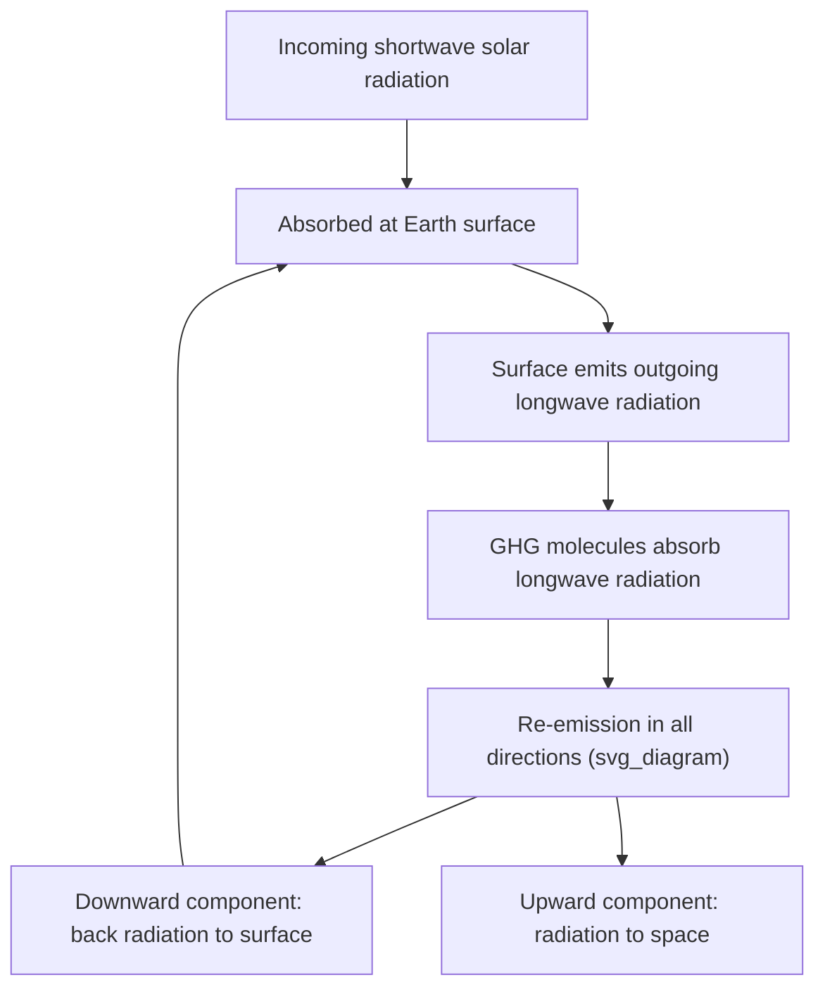

## Greenhouse Gases and Radiative Forcing

### Overview

The greenhouse effect is the process by which certain atmospheric gases absorb and re-emit infrared radiation, warming the lower atmosphere and Earth's surface above the temperature that would result from solar input alone. Radiative forcing is the quantitative framework used to measure the change in energy balance caused by a given atmospheric constituent or other climate driver, expressed in watts per square meter (W/m²). Together, these concepts form the physical basis for understanding both the natural habitability of Earth and anthropogenic climate change.

### The Greenhouse Effect: Physical Mechanism

#### Radiative Energy Balance

Earth's climate system is governed by a balance between incoming shortwave (solar) radiation and outgoing longwave (infrared) radiation. At equilibrium, the planet's effective emission temperature can be approximated using the Stefan-Boltzmann law:

$$T_{eff} = \left( \frac{S(1-\alpha)}{4\sigma} \right)^{1/4}$$

where $S$ is the solar constant (~1361 W/m²), $\alpha$ is Earth's albedo (~0.3), and $\sigma$ is the Stefan-Boltzmann constant ($5.67 \times 10^{-8}$ W/m²K⁴). This calculation yields an effective temperature of approximately 255 K (−18°C), well below Earth's observed global mean surface temperature of approximately 288 K (15°C).

#### Why the Discrepancy Exists

The ~33°C difference between the calculated effective temperature and the observed surface temperature is attributed to the greenhouse effect. Greenhouse gases (GHGs) are largely transparent to incoming shortwave solar radiation but selectively absorb outgoing longwave radiation emitted by Earth's surface, due to their molecular structure allowing vibrational and rotational energy transitions at infrared wavelengths.

**Key Points**

- Absorbed infrared energy is re-radiated by GHG molecules in all directions, including back toward the surface.
- This downward re-emission ("back radiation") adds to the energy the surface receives, raising its equilibrium temperature.
- Symmetric, diatomic molecules like N₂ and O₂ (which together make up ~99% of the atmosphere) lack the vibrational dipole moment changes needed to absorb infrared radiation effectively, and thus are not greenhouse gases.

### Major Greenhouse Gases

#### Water Vapor (H₂O)

- The most abundant and radiatively dominant greenhouse gas by mass and by contribution to the total greenhouse effect.
- Acts primarily as a **feedback** rather than a forcing agent, since atmospheric water vapor concentration is governed by temperature via the Clausius-Clapeyron relation, rather than being directly emitted by human activity in climatologically significant quantities.

$$\frac{de_s}{dT} = \frac{L_v e_s}{R_v T^2}$$

This relation describes how saturation vapor pressure ($e_s$) increases with temperature ($T$), where $L_v$ is the latent heat of vaporization and $R_v$ is the specific gas constant for water vapor — implying that a warmer atmosphere can hold more water vapor, amplifying initial warming (positive feedback).

#### Carbon Dioxide (CO₂)

- The primary anthropogenic driver of current radiative forcing due to its long atmospheric lifetime and the scale of emissions from fossil fuel combustion, cement production, and land-use change.
- **Atmospheric lifetime:** Complex, without a single value — an initial fraction is removed within years to decades by ocean and land uptake, but a significant fraction (~20%) persists in the atmosphere for centuries to millennia due to slow geological removal processes (rock weathering, ocean sediment burial).
- Pre-industrial concentration: ~280 ppm; as of the mid-2020s, atmospheric concentrations exceed 420 ppm. [Unverified] Exact current-year values should be checked against real-time monitoring data (e.g., Mauna Loa Observatory records), as concentrations rise annually.

#### Methane (CH₄)

- Sources include natural wetlands, livestock enteric fermentation, rice cultivation, fossil fuel extraction, and landfills.
- Substantially more potent than CO₂ per molecule as a greenhouse gas, but has a much shorter atmospheric lifetime (~12 years) versus CO₂'s multi-century tail.
- This short lifetime combined with high potency means methane mitigation produces comparatively rapid climate benefits relative to CO₂ mitigation.

#### Nitrous Oxide (N₂O)

- Sources include agricultural fertilizer use, industrial processes, and combustion.
- Atmospheric lifetime of roughly 114 years.
- Also contributes to stratospheric ozone depletion in addition to its radiative forcing role.

#### Fluorinated Gases (HFCs, PFCs, SF₆, NF₃)

- Synthetic industrial gases (refrigerants, electrical insulators, semiconductor manufacturing byproducts) with no significant natural sources.
- Extremely high per-molecule radiative efficiency and, in some cases (e.g., SF₆), atmospheric lifetimes exceeding 1,000 years.
- Present in relatively low atmospheric concentrations, so their total contribution to radiative forcing is smaller than CO₂ or CH₄ despite high per-molecule potency.

#### Ozone (O₃)

- **Stratospheric ozone** primarily absorbs incoming ultraviolet radiation and has an indirect, complex relationship with surface climate.
- **Tropospheric ozone** acts as a greenhouse gas and is a secondary pollutant formed from precursor emissions (NOx, volatile organic compounds) rather than being directly emitted.

### Quantifying Potency: Global Warming Potential (GWP)

To compare the climate impact of different gases, scientists use **Global Warming Potential (GWP)**, which measures the cumulative radiative forcing of a gas relative to CO₂ over a specified time horizon (commonly 20 or 100 years).

$$GWP_{x} = \frac{\int_0^{TH} RF_x(t) \, dt}{\int_0^{TH} RF_{CO_2}(t) \, dt}$$

where $RF_x(t)$ is the time-dependent radiative forcing of gas $x$, and $TH$ is the chosen time horizon.

**Example**

| Gas | GWP (100-year horizon) | Atmospheric Lifetime |
| --- | --- | --- |
| CO₂ | 1 (reference) | Variable (centuries to millennia) |
| CH₄ | ~28–34 | ~12 years |
| N₂O | ~265–298 | ~114 years |
| SF₆ | ~23,500 | ~3,200 years |

[Inference] GWP values are periodically revised across IPCC assessment reports as atmospheric chemistry models improve; the figures above reflect commonly cited AR5/AR6-era ranges and should be cross-checked against the latest IPCC report for precise figures, since methodological updates can shift them.

### Radiative Forcing Framework

#### Definition

Radiative forcing (RF) is defined as the change in net (down minus up) irradiance (shortwave plus longwave, in W/m²) at the tropopause or top of the atmosphere due to a change in an external driver of climate, typically evaluated after allowing stratospheric temperatures to adjust to radiative equilibrium while holding surface and tropospheric conditions fixed.

- **Positive forcing:** Net energy accumulation in the Earth system, producing a warming tendency.
- **Negative forcing:** Net energy loss, producing a cooling tendency.

#### The CO₂ Radiative Forcing Formula

For CO₂, radiative forcing exhibits a logarithmic (not linear) relationship with concentration, because the primary CO₂ absorption bands are already largely saturated at current concentrations — additional CO₂ molecules increasingly interact with the weaker edges of the absorption spectrum:

$$\Delta F = \alpha \ln\left(\frac{C}{C_0}\right)$$

where $\Delta F$ is the change in radiative forcing (W/m²), $C$ is the current concentration, $C_0$ is the reference (pre-industrial) concentration, and $\alpha$ is an empirically derived constant (commonly cited as approximately 5.35 for CO₂). [Inference] This coefficient is a simplified parameterization derived from more complex radiative transfer models and can vary slightly depending on the specific model and background atmospheric state used in its derivation.

This logarithmic relationship implies that each successive doubling of CO₂ concentration produces approximately the same increment of radiative forcing — a concept central to defining **equilibrium climate sensitivity**.

#### Anthropogenic vs. Natural Forcings

**Key Points**

- **Anthropogenic forcings:** Well-mixed greenhouse gases (CO₂, CH₄, N₂O, halocarbons), tropospheric ozone, aerosols (both direct scattering/absorption and indirect cloud-mediated effects), land-use albedo changes.
- **Natural forcings:** Solar irradiance variation, volcanic aerosol injections.
- Since the mid-20th century, assessment reports from bodies such as the IPCC attribute the dominant share of positive radiative forcing to well-mixed anthropogenic greenhouse gases, substantially offset in part by the net negative (cooling) forcing from anthropogenic aerosols.

#### Aerosols: A Complicating Factor

Aerosols exert a net negative (cooling) radiative forcing through two mechanisms, partially masking greenhouse gas warming:

1. **Direct effect:** Aerosol particles (e.g., sulfates) scatter incoming solar radiation back to space.
2. **Indirect (cloud-albedo) effect:** Aerosols act as cloud condensation nuclei, altering cloud droplet size distribution, cloud reflectivity, and lifetime.

[Inference] The magnitude of the aerosol indirect effect carries substantially larger scientific uncertainty than well-mixed greenhouse gas forcing, representing one of the largest sources of uncertainty in overall net anthropogenic radiative forcing estimates and, by extension, in constraining climate sensitivity.

### From Forcing to Temperature Response: Climate Sensitivity

Radiative forcing alone does not directly equal temperature change; the relationship is mediated by climate feedbacks and system heat capacity (primarily ocean thermal inertia).

$$\Delta T = \lambda \, \Delta F$$

where $\lambda$ is the climate sensitivity parameter (K per W/m²), incorporating the net effect of feedbacks (water vapor, lapse rate, ice-albedo, and cloud feedbacks).

**Equilibrium Climate Sensitivity (ECS)** is defined as the eventual global mean surface temperature increase resulting from a sustained doubling of atmospheric CO₂ concentration, after the climate system reaches a new equilibrium. Current assessments generally place the likely range of ECS between approximately 2.5°C and 4°C, though this remains an area of active research with model-dependent variation. [Unverified] Specific numerical bounds should be verified against the most recent IPCC assessment report, as this range has been refined across successive assessment cycles.

### Measurement and Monitoring

**Key Points**

- **In-situ concentration monitoring:** Continuous atmospheric sampling stations (e.g., Mauna Loa Observatory, operating since 1958) produce the Keeling Curve, the longest continuous direct record of atmospheric CO₂.
- **Satellite-based monitoring:** Instruments measuring radiative flux at the top of the atmosphere (e.g., CERES — Clouds and the Earth's Radiant Energy System) directly observe changes in Earth's energy budget.
- **Ice core proxies:** Air bubbles trapped in ice cores provide direct paleoatmospheric GHG concentration records extending back hundreds of thousands of years, used to establish pre-industrial baselines and natural variability ranges.

### Summary Comparison Table

| Gas | Primary Sources | Relative Abundance | Key Characteristic |
| --- | --- | --- | --- |
| H₂O | Evaporation/transpiration | Highest (variable) | Feedback, not forcing |
| CO₂ | Fossil fuels, deforestation | Second highest | Long-lived, logarithmic forcing |
| CH₄ | Agriculture, fossil fuels, wetlands | Lower concentration, high potency | Short-lived, high GWP |
| N₂O | Fertilizers, industry | Trace | Long-lived, ozone-depleting |
| Halocarbons | Industrial/refrigerants | Trace | Very high GWP, synthetic |

**Related Topics**

- Climate Feedback Mechanisms (ice-albedo, water vapor, lapse rate, cloud feedbacks)
- The Carbon Cycle and Carbon Sinks
- Equilibrium vs. Transient Climate Sensitivity
- Aerosol-Cloud Interactions and Indirect Radiative Effects
- Paleoclimate Proxy Records (ice cores, ocean sediments)
- IPCC Assessment Report Methodology
- Stratospheric Ozone Depletion and the Montreal Protocol
- Carbon Capture, Utilization, and Storage (CCUS)