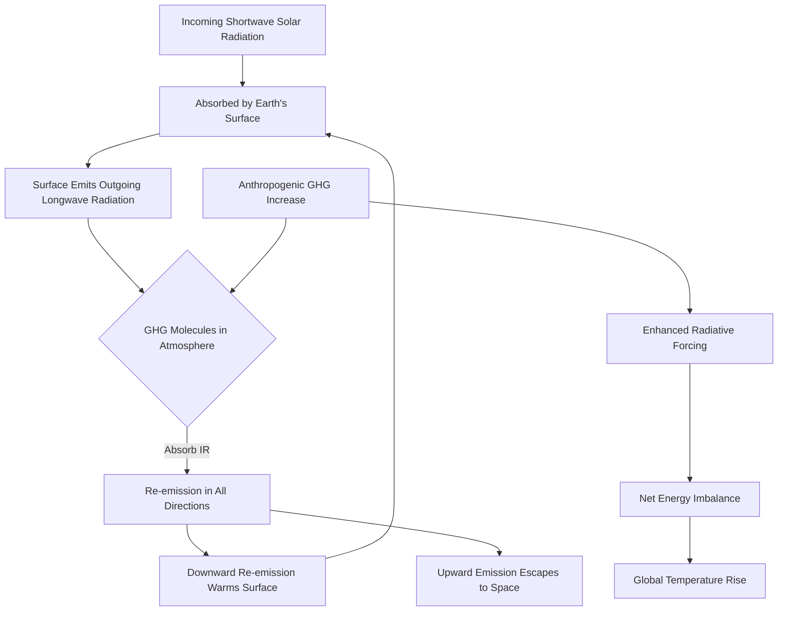
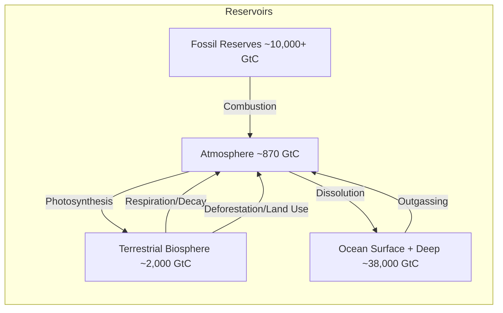
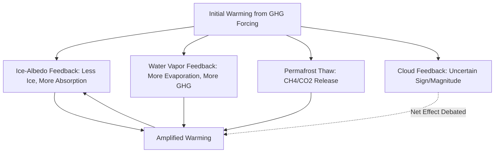

## Anthropogenic Climate Change

### Definition and Scope

Anthropogenic climate change refers to long-term shifts in global and regional climate patterns caused primarily by human activities, particularly the emission of greenhouse gases (GHGs) from industrial, agricultural, and land-use practices since the onset of the Industrial Revolution (circa 1750–1850). This is distinguished from natural climate variability driven by orbital cycles, solar output fluctuations, and volcanic activity.

**Key Points**

- The term encompasses both the physical mechanism (enhanced greenhouse effect) and the observed consequences (warming, precipitation shifts, sea-level rise, extreme weather)
- The Intergovernmental Panel on Climate Change (IPCC) concluded in its Sixth Assessment Report (AR6, 2021) that it is unequivocal that human influence has warmed the atmosphere, ocean, and land
- Global mean surface temperature has risen approximately $1.1$–$1.2°C$ above the 1850–1900 pre-industrial baseline as of the early 2020s

---

### The Greenhouse Effect: Physical Mechanism

The natural greenhouse effect is essential for a habitable Earth; anthropogenic forcing amplifies it beyond equilibrium.

#### Radiative Balance Fundamentals

Earth's climate system approaches energy balance when incoming shortwave solar radiation equals outgoing longwave radiation. The Stefan-Boltzmann relationship governs blackbody emission:

$$E = \sigma T^4$$

where $E$ is radiant emittance, $\sigma$ is the Stefan-Boltzmann constant ($5.67 \times 10^{-8} \, W/m^2K^4$), and $T$ is absolute temperature.

Greenhouse gases absorb and re-emit outgoing longwave (infrared) radiation, trapping energy within the lower atmosphere. This differs fundamentally from shortwave-transparent, longwave-opaque behavior:

#### Radiative Forcing

Radiative forcing (RF) quantifies the change in net energy flux (W/m²) at the tropopause due to a perturbation, such as increased GHG concentration. Positive RF causes warming. The approximate logarithmic relationship for CO₂ forcing is:

$$\Delta F = \alpha \ln\left(\frac{C}{C_0}\right)$$

where $\Delta F$ is the change in forcing, $C$ is current CO₂ concentration, $C_0$ is the reference (pre-industrial) concentration, and $\alpha \approx 5.35$ (empirically derived constant).

**[Unverified]** The precise value of $\alpha$ varies slightly (typically cited between $5.35$ and $5.5$) depending on the radiative transfer model and background atmospheric conditions used in derivation.

---

### Primary Anthropogenic Greenhouse Gases

| Gas | Pre-Industrial Concentration | Approx. 2024 Concentration | Global Warming Potential (100-yr) | Primary Sources |
| --- | --- | --- | --- | --- |
| Carbon Dioxide (CO₂) | ~280 ppm | ~420 ppm | 1 (reference) | Fossil fuel combustion, deforestation, cement production |
| Methane (CH₄) | ~700 ppb | ~1,920 ppb | ~27–30 | Livestock, rice paddies, natural gas leakage, landfills |
| Nitrous Oxide (N₂O) | ~270 ppb | ~336 ppb | ~273 | Nitrogen fertilizers, industrial processes, combustion |
| Fluorinated Gases (HFCs, PFCs, SF₆) | ~0 | Trace (ppt) | Up to tens of thousands | Refrigerants, industrial manufacturing, electrical insulation |

**Key Points**

- Global Warming Potential (GWP) expresses the relative heat-trapping capacity of a gas over a specified time horizon (commonly 100 years) relative to CO₂
- CH₄ has a shorter atmospheric lifetime (~12 years) but a much higher near-term radiative efficiency than CO₂
- CO₂ remains the dominant driver of long-term forcing due to its high emission volume and atmospheric persistence (a fraction remains for centuries to millennia)

---

### Carbon Cycle Disruption

The natural carbon cycle exchanges carbon among the atmosphere, oceans, terrestrial biosphere, and lithosphere. Anthropogenic activity introduces a net flux imbalance by extracting geologically sequestered carbon (fossil fuels) and rapidly returning it to the active atmospheric-oceanic pool.

#### Carbon Reservoirs and Fluxes (Simplified)

**[Inference]** Approximately half of anthropogenic CO₂ emissions since the Industrial Revolution have been absorbed by ocean and terrestrial sinks, while the remainder has accumulated in the atmosphere; this partitioning fraction fluctuates year to year with sink saturation dynamics and is subject to ongoing scientific refinement.

#### Ocean Acidification (Related Consequence)

Dissolved atmospheric CO₂ reacts with seawater:

$$CO_2 + H_2O \rightleftharpoons H_2CO_3 \rightleftharpoons H^+ + HCO_3^-$$

Increased $H^+$ ion concentration lowers ocean pH, a process termed ocean acidification, which is chemically coupled to but distinct from atmospheric warming.

---

### Primary Anthropogenic Drivers

#### 1. Fossil Fuel Combustion

Coal, petroleum, and natural gas combustion for electricity, transportation, and industry constitute the largest single source of anthropogenic CO₂ emissions globally.

**Example**

Combustion of coal (primarily carbon) follows the stoichiometric reaction:

$$C + O_2 \rightarrow CO_2$$

Complete combustion of one mole of carbon (12 g) yields one mole of CO₂ (44 g), meaning fossil fuel combustion produces roughly 3.67 times the mass of CO₂ relative to the carbon content burned.

#### 2. Land-Use Change and Deforestation

Conversion of forests to agricultural or urban land reduces carbon sequestration capacity and releases stored biomass carbon. Tropical deforestation is a particularly significant contributor due to high biomass density.

#### 3. Agriculture

- Enteric fermentation in ruminant livestock produces CH₄
- Flooded rice cultivation creates anaerobic conditions favoring methanogenesis
- Synthetic nitrogen fertilizer application drives microbial N₂O production via nitrification/denitrification pathways

#### 4. Industrial Processes

Cement production releases CO₂ both from fuel combustion and from the calcination reaction:

$$CaCO_3 \rightarrow CaO + CO_2$$

#### 5. Aerosols and Short-Lived Climate Forcers

Anthropogenic aerosols (sulfates, black carbon) exert complex, often opposing effects: sulfate aerosols generally produce net cooling (negative forcing) via reflection of solar radiation and cloud condensation nuclei effects, while black carbon absorbs radiation and produces net warming.

---

### Observed and Attributed Consequences

#### Temperature and Cryosphere

- Global mean surface temperature increase of approximately $1.1$–$1.2°C$ since pre-industrial baseline
- Accelerated glacial retreat and ice sheet mass loss (Greenland, West Antarctica)
- Arctic sea ice extent decline, with Arctic amplification causing warming rates roughly 2–4 times the global average

**[Inference]** The precise Arctic amplification multiplier cited in literature varies (commonly "2x to 4x" the global mean) depending on the study period, dataset, and whether surface air temperature or other metrics are used.

#### Sea Level Rise

Driven by two primary mechanisms:

1. Thermal expansion of seawater (steric component)
2. Meltwater input from land-based ice (glaciers, ice sheets)

$$\Delta SL = \Delta SL_{thermal} + \Delta SL_{ice melt} + \Delta SL_{land water storage}$$

#### Precipitation and Hydrological Cycle

Warmer air holds more water vapor per the Clausius-Clapeyron relationship (approximately 7% increase in atmospheric water-holding capacity per 1°C of warming), intensifying both heavy precipitation events and evaporative drying in already-dry regions.

#### Extreme Weather Attribution

The field of extreme event attribution uses statistical and modeling techniques to estimate the degree to which anthropogenic forcing altered the probability or intensity of specific events (e.g., heatwaves, droughts, heavy rainfall episodes).

**Behavioral disclaimer:** Attribution results are model- and methodology-dependent; individual event studies may show varying confidence levels, and attribution statements typically express probabilistic changes in likelihood rather than deterministic causation for any single event.

---

### Climate Sensitivity and Feedback Mechanisms

#### Equilibrium Climate Sensitivity (ECS)

ECS represents the equilibrium global temperature increase resulting from a doubling of atmospheric CO₂ concentration relative to pre-industrial levels. IPCC AR6 assessed a likely ECS range of $2.5°C$ to $4.0°C$, with a best estimate around $3°C$.

#### Feedback Loops

- **Positive (amplifying) feedbacks**: ice-albedo feedback, water vapor feedback, permafrost carbon release
- **Negative (dampening) feedbacks**: increased longwave radiation to space with warming (Planck feedback, the primary stabilizing mechanism)
- **Cloud feedback**: remains the largest source of uncertainty in climate sensitivity estimates, as cloud type, altitude, and optical properties respond to warming in complex, sometimes offsetting ways

---

### Detection and Attribution Science

Distinguishing anthropogenic signal from natural variability relies on:

1. **Climate models (GCMs/ESMs)**: General Circulation Models and Earth System Models simulate climate response under varying forcing scenarios (natural-only vs. natural+anthropogenic)
2. **Fingerprint analysis**: Comparing observed spatial and temporal patterns of change against model-predicted patterns of specific forcings
3. **Paleoclimate proxy records**: Ice cores, tree rings, and sediment cores establish historical baseline variability against which recent changes are compared

**Example**

Ice core records from Antarctica (e.g., Vostok, EPICA Dome C) provide atmospheric CO₂ concentration reconstructions spanning approximately 800,000 years, demonstrating that current CO₂ levels (~420 ppm) substantially exceed the natural glacial-interglacial range (~180–300 ppm) observed over that period.

---

### Emissions Scenarios and Modeling Frameworks

#### Representative Concentration Pathways (RCPs) and Shared Socioeconomic Pathways (SSPs)

Climate projections rely on scenario frameworks representing different future emissions trajectories:

| Framework | Description |
| --- | --- |
| RCP2.6 / SSP1-2.6 | Low-emissions, aggressive mitigation pathway |
| RCP4.5 / SSP2-4.5 | Intermediate stabilization pathway |
| RCP6.0 / SSP4-6.0 | Higher emissions, delayed mitigation |
| RCP8.5 / SSP5-8.5 | High-emissions, limited mitigation ("business as usual" upper bound) |

**[Inference]** RCP8.5 is increasingly characterized in recent literature as a lower-likelihood, worst-case reference scenario rather than a central "business as usual" projection, reflecting updated assessments of energy transition trends; usage and interpretation of this scenario continue to evolve across the research community.

---

### Diagram: Anthropogenic Forcing Pathway (svg_diagram)

<svg xmlns="http://www.w3.org/2000/svg" viewBox="0 0 800 420" font-family="sans-serif">
<text x="400" y="25" font-size="16" font-weight="bold" text-anchor="middle">Anthropogenic Climate Change: Causal Pathway (svg_diagram)</text>
<rect x="20" y="60" width="160" height="60" rx="8" fill="#e8f0fe" stroke="#3b5bdb" stroke-width="1.5" />
<text x="100" y="85" font-size="12" text-anchor="middle" font-weight="bold">Human Activities</text>
<text x="100" y="102" font-size="10" text-anchor="middle">Fossil fuels, land use,</text>
<text x="100" y="114" font-size="10" text-anchor="middle">agriculture, industry</text>
<rect x="230" y="60" width="160" height="60" rx="8" fill="#fff4e6" stroke="#e8590c" stroke-width="1.5" />
<text x="310" y="85" font-size="12" text-anchor="middle" font-weight="bold">GHG Emissions</text>
<text x="310" y="102" font-size="10" text-anchor="middle">CO2, CH4, N2O,</text>
<text x="310" y="114" font-size="10" text-anchor="middle">fluorinated gases</text>
<rect x="440" y="60" width="160" height="60" rx="8" fill="#fff0f6" stroke="#c2255c" stroke-width="1.5" />
<text x="520" y="85" font-size="12" text-anchor="middle" font-weight="bold">Radiative Forcing</text>
<text x="520" y="102" font-size="10" text-anchor="middle">Enhanced greenhouse</text>
<text x="520" y="114" font-size="10" text-anchor="middle">effect, energy imbalance</text>
<rect x="620" y="60" width="160" height="60" rx="8" fill="#e6fcf5" stroke="#0ca678" stroke-width="1.5" />
<text x="700" y="85" font-size="12" text-anchor="middle" font-weight="bold">Global Warming</text>
<text x="700" y="102" font-size="10" text-anchor="middle">Surface + ocean</text>
<text x="700" y="114" font-size="10" text-anchor="middle">temperature rise</text>
<line x1="180" y1="90" x2="228" y2="90" stroke="#495057" stroke-width="2" marker-end="url(#arrow)" />
<line x1="390" y1="90" x2="438" y2="90" stroke="#495057" stroke-width="2" marker-end="url(#arrow)" />
<line x1="600" y1="90" x2="618" y2="90" stroke="#495057" stroke-width="2" marker-end="url(#arrow)" />
<rect x="120" y="180" width="160" height="55" rx="8" fill="#f3f0ff" stroke="#7048e8" stroke-width="1.5" />
<text x="200" y="203" font-size="12" text-anchor="middle" font-weight="bold">Feedback Loops</text>
<text x="200" y="219" font-size="10" text-anchor="middle">Ice-albedo, water vapor,</text>
<text x="200" y="230" font-size="9" text-anchor="middle">permafrost, cloud</text>
<rect x="340" y="180" width="160" height="55" rx="8" fill="#eafaf1" stroke="#0ca678" stroke-width="1.5" />
<text x="420" y="203" font-size="12" text-anchor="middle" font-weight="bold">Cryosphere/Hydrosphere</text>
<text x="420" y="219" font-size="10" text-anchor="middle">Ice melt, sea level rise,</text>
<text x="420" y="230" font-size="9" text-anchor="middle">precipitation shifts</text>
<rect x="560" y="180" width="180" height="55" rx="8" fill="#fff5f5" stroke="#e03131" stroke-width="1.5" />
<text x="650" y="203" font-size="12" text-anchor="middle" font-weight="bold">Extreme Weather</text>
<text x="650" y="219" font-size="10" text-anchor="middle">Heatwaves, droughts,</text>
<text x="650" y="230" font-size="9" text-anchor="middle">intensified storms</text>
<line x1="700" y1="120" x2="700" y2="150" stroke="#495057" stroke-width="2" />
<line x1="700" y1="150" x2="200" y2="150" stroke="#495057" stroke-width="2" />
<line x1="200" y1="150" x2="200" y2="178" stroke="#495057" stroke-width="2" marker-end="url(#arrow)" />
<line x1="420" y1="150" x2="420" y2="178" stroke="#495057" stroke-width="2" marker-end="url(#arrow)" />
<line x1="650" y1="150" x2="650" y2="178" stroke="#495057" stroke-width="2" marker-end="url(#arrow)" />
<line x1="280" y1="207" x2="700" y2="207" stroke="#7048e8" stroke-width="1.5" stroke-dasharray="4,3" marker-end="url(#arrow-purple)" />
<text x="480" y="250" font-size="9" fill="#7048e8" text-anchor="middle">Amplifying feedback returns to warming</text>
<rect x="280" y="300" width="240" height="80" rx="8" fill="#f8f9fa" stroke="#495057" stroke-width="1.5" />
<text x="400" y="322" font-size="12" text-anchor="middle" font-weight="bold">Societal &amp; Ecological Impacts</text>
<text x="400" y="340" font-size="10" text-anchor="middle">Agricultural disruption, water</text>
<text x="400" y="354" font-size="10" text-anchor="middle">stress, biodiversity loss,</text>
<text x="400" y="368" font-size="10" text-anchor="middle">displacement, economic cost</text>
<line x1="200" y1="235" x2="330" y2="298" stroke="#495057" stroke-width="1.5" marker-end="url(#arrow)" />
<line x1="420" y1="235" x2="420" y2="298" stroke="#495057" stroke-width="1.5" marker-end="url(#arrow)" />
<line x1="650" y1="235" x2="480" y2="298" stroke="#495057" stroke-width="1.5" marker-end="url(#arrow)" />
</svg>

---

### Mitigation and Response Frameworks (Brief Overview)

While mitigation policy is a distinct topical area, core scientific response categories include:

- **Mitigation**: Reducing GHG emissions and enhancing carbon sinks (renewable energy transition, energy efficiency, afforestation, carbon capture and storage)
- **Adaptation**: Adjusting human and natural systems to reduce vulnerability to realized or expected climate impacts
- **Geoengineering** (speculative/experimental category): Solar radiation management and carbon dioxide removal technologies

**[Speculation]** Large-scale solar radiation management approaches (e.g., stratospheric aerosol injection) remain largely theoretical and experimental at global scale, with significant unresolved questions regarding termination shock risk, regional precipitation side effects, and governance frameworks.

---

### International Policy Context

- **UNFCCC** (1992): United Nations Framework Convention on Climate Change, the foundational international treaty
- **Kyoto Protocol** (1997): Established binding emissions reduction targets for developed nations
- **Paris Agreement** (2015): Set the goal of limiting global warming to well below $2°C$, pursuing efforts toward $1.5°C$, through nationally determined contributions (NDCs)

---

### Common Misconceptions Addressed

| Misconception | Scientific Clarification |
| --- | --- |
| "Climate has always changed naturally, so current change is natural too" | Natural forcings (solar, volcanic, orbital) cannot account for the observed rate and magnitude of post-1950 warming; attribution studies isolate the anthropogenic GHG signal |
| "CO₂ is a trace gas, so it cannot have significant effect" | Radiative effect depends on absorption band properties and atmospheric residence time, not concentration alone; trace gases can exert disproportionate radiative influence |
| "Scientific consensus is fabricated or exaggerated" | Multiple independent lines of evidence (temperature records, ice cores, satellite data, ocean heat content) from independent research institutions converge on consistent conclusions |

---

**Related Topics**

- Milankovitch Cycles and Natural Climate Forcing
- Paleoclimatology and Proxy Reconstruction Methods
- General Circulation Models (GCMs) and Climate Modeling Techniques
- The Carbon Cycle and Biogeochemical Cycling
- Ocean-Atmosphere Interactions (ENSO, Thermohaline Circulation)
- Climate Change Mitigation Technologies (Carbon Capture, Renewable Energy Systems)
- Climate Adaptation Strategies and Vulnerability Assessment
- Extreme Event Attribution Science
- International Climate Policy and the Paris Agreement Mechanisms
- Tipping Points and Irreversibility in the Climate System