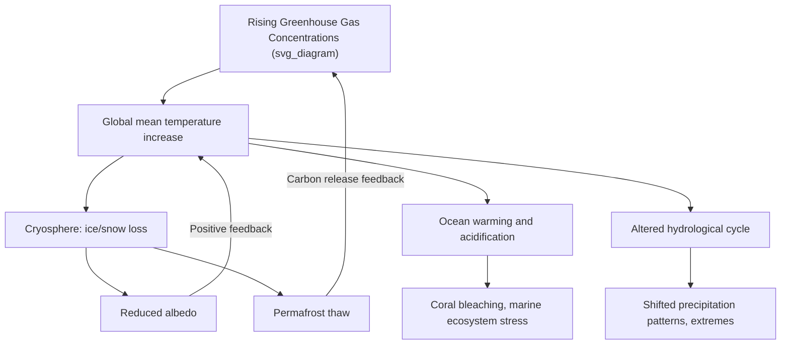

## Climate Change Impacts and Mitigation

### Overview

Climate change impacts encompass the observed and projected effects of a warming climate system on physical, biological, and human systems, spanning oceans, cryosphere, ecosystems, agriculture, human health, and infrastructure. Mitigation refers to the set of strategies aimed at reducing the magnitude of future climate change by limiting greenhouse gas emissions and enhancing carbon removal. Together, impacts assessment and mitigation strategy form the applied, policy-relevant counterpart to the physical science of climate change.

### Physical System Impacts

#### Cryosphere

**Key Points**

- Glacier retreat is occurring broadly across mountain ranges globally, reducing long-term freshwater storage for downstream communities dependent on glacial meltwater, particularly during dry seasons.
- Arctic sea ice decline reduces surface albedo (replacing highly reflective ice/snow with darker open ocean), reinforcing further warming through the **ice-albedo feedback** — a positive feedback loop.
- Permafrost thaw risks releasing previously frozen organic carbon as CO₂ and methane through microbial decomposition, representing a potential positive feedback to atmospheric greenhouse gas concentrations. [Inference] The magnitude and timing of permafrost carbon feedback remains an area of active research uncertainty, since it depends on complex, spatially heterogeneous thaw processes and microbial response rates that are difficult to represent comprehensively in Earth System Models.

#### Oceans

- **Thermal expansion and ice melt** drive sea level rise, threatening coastal infrastructure, freshwater aquifers (via saltwater intrusion), and low-lying island nations.
- **Ocean acidification**, driven by oceanic CO₂ uptake, reduces carbonate ion availability, impairing shell and skeleton formation in corals, mollusks, and some plankton species foundational to marine food webs.
- **Ocean deoxygenation** — warmer water holds less dissolved oxygen, and increased surface warming can also enhance ocean stratification, reducing vertical mixing that normally replenishes deep-water oxygen levels, together expanding low-oxygen "dead zones."
- **Marine heatwaves** — discrete periods of anomalously high ocean temperature, linked to coral bleaching events and disruption of marine species distributions.

#### Hydrological Cycle

- A warmer atmosphere holds more water vapor (Clausius-Clapeyron relation), physically linked to increased intensity of heavy precipitation events in many regions.
- Simultaneously, altered atmospheric circulation patterns and increased evaporative demand contribute to more intense and prolonged droughts in other regions — producing a general pattern often summarized as **"wet regions getting wetter, dry regions getting drier,"** though with significant regional variation and exceptions. [Inference] This generalization holds at broad regional/global scales in many assessments but does not reliably predict outcomes for any specific local area, where topography, land use, and local circulation patterns can substantially modify the broader signal.
- Snowpack reduction and shifts toward earlier spring snowmelt in mountain regions alter the seasonal timing of freshwater availability for downstream agriculture and municipal supply.

### Ecosystem and Biodiversity Impacts

**Key Points**

- **Range shifts** — many species are shifting their geographic ranges poleward or to higher elevations in response to changing temperature zones, tracking their historical climatic niche.
- **Phenological mismatch** — shifts in the timing of seasonal biological events (flowering, migration, breeding) can desynchronize interdependent species relationships (e.g., pollinator emergence timing relative to plant flowering).
- **Coral bleaching** — sustained ocean temperature anomalies cause corals to expel their symbiotic algae (zooxanthellae), leading to whitening and, if prolonged, mortality; increased frequency of marine heatwaves has been linked to more frequent mass bleaching events globally.
- **Ecosystem-scale disturbance regime changes** — altered wildfire frequency/intensity and insect pest range expansion (e.g., bark beetle outbreaks linked to milder winters) affect forest ecosystem structure and carbon storage capacity.

### Human System Impacts

#### Agriculture and Food Security

- Crop yield impacts vary substantially by crop type, region, and baseline climate — some higher-latitude regions may see near-term yield benefits from warming and CO₂ fertilization effects, while many tropical and already-warm agricultural regions face yield reductions from heat stress and altered precipitation.
- Increased frequency of compound extreme events (simultaneous heat and drought) poses particular risk to agricultural stability.
- [Inference] The CO₂ fertilization effect on crop yields is generally considered a real but limited and crop-dependent phenomenon in the scientific literature, often outweighed at higher warming levels by heat stress, water availability constraints, and reduced nutritional density in some staple crops.

#### Human Health

- Direct heat-related morbidity and mortality risk increases with more frequent and intense heatwaves, particularly affecting vulnerable populations (elderly, outdoor workers, those without access to cooling).
- Shifting climatic suitability zones affect the geographic range of disease vectors (e.g., mosquito-borne diseases such as malaria and dengue), potentially expanding transmission zones into previously unsuitable regions.
- Air quality interactions — climate change can influence the frequency and severity of wildfire smoke events and ground-level ozone formation (a temperature-dependent photochemical process), each with direct respiratory and cardiovascular health implications.

#### Infrastructure and Economic Systems

- Coastal infrastructure faces increased flood risk from the combination of sea level rise and storm surge, particularly during high-intensity tropical cyclone events.
- Increased extreme heat exposure affects the design assumptions and structural performance of infrastructure originally engineered for historical, cooler climate baselines.
- Water resource infrastructure planning is complicated by altered precipitation patterns and increased hydrological extremes (both flood and drought risk) relative to historical design baselines.

### Mitigation Strategies

#### Energy System Transformation

**Key Points**

- **Renewable energy deployment** — wind, solar, hydroelectric, and geothermal power generation displace fossil fuel combustion in electricity generation, the sector representing one of the largest shares of global greenhouse gas emissions.
- **Electrification of end uses** — transitioning transportation, heating, and industrial processes from direct fossil fuel combustion to electricity, which can then be decarbonized at the generation source.
- **Energy efficiency improvements** — reducing overall energy demand per unit of economic output or service delivered, lowering the total emissions reduction burden on the supply side.
- **Grid-scale energy storage** — addresses the intermittency of variable renewable generation (solar, wind), enabling higher renewable penetration without compromising grid reliability.

#### Carbon Removal and Sequestration

- **Afforestation and reforestation** — enhance terrestrial carbon sink capacity through biological carbon uptake in growing forest biomass.
- **Soil carbon sequestration** — agricultural practices (reduced tillage, cover cropping) that increase soil organic carbon storage.
- **Direct Air Capture (DAC)** — engineered systems that chemically extract CO₂ directly from ambient air for subsequent geological storage or utilization.
- **Bioenergy with Carbon Capture and Storage (BECCS)** — combines biomass energy generation with capture and geological storage of the resulting combustion CO₂, theoretically producing net-negative emissions since the biomass feedstock had previously absorbed atmospheric CO₂ during growth.
- **Enhanced weathering** — accelerating natural silicate rock weathering processes (which naturally sequester CO₂ over geological timescales) through mechanical grinding and spreading of reactive minerals. [Inference] Enhanced weathering and several other novel carbon dioxide removal approaches remain at relatively early stages of deployment and cost validation compared to more established approaches like afforestation, and their long-term scalability and verification methodologies are still active areas of research and standard-setting.

#### Land Use and Agricultural Mitigation

- Reducing deforestation and forest degradation preserves existing carbon sink capacity while avoiding the emissions associated with land clearing.
- Improved livestock and manure management practices can reduce methane emissions from the agricultural sector.
- Reduced fertilizer overapplication, combined with precision agriculture techniques, can lower nitrous oxide emissions while maintaining crop yields.

### Adaptation Strategies

Distinct from mitigation (which addresses the cause), adaptation addresses the consequences of climate change already underway or considered locked in due to past emissions.

**Example**

- **Coastal protection** — sea walls, managed retreat from high-risk zones, restoration of natural buffers like mangroves and wetlands that provide storm surge attenuation.
- **Agricultural adaptation** — development and adoption of drought- and heat-tolerant crop varieties, shifting planting calendars, improved irrigation efficiency.
- **Urban heat mitigation** — expanded urban tree canopy, reflective/"cool" roofing materials, and heat early-warning systems to reduce heat-related health risk.
- **Water resource management** — expanded storage and conveyance flexibility to manage increased hydrological variability between flood and drought extremes.

### The Mitigation-Adaptation-Loss and Damage Framework

**Key Points**

- **Mitigation** reduces the magnitude of future climate change by limiting the forcing itself.
- **Adaptation** reduces vulnerability and manages unavoidable impacts of climate change that is already occurring or committed due to past emissions and thermal inertia in the climate system.
- **Loss and damage** refers to residual climate impacts that exceed the limits of feasible adaptation, an increasingly prominent concept in international climate policy negotiations (e.g., the Loss and Damage Fund established under the UNFCCC framework).
- These three approaches are complementary rather than substitutes: greater near-term mitigation reduces the future adaptation and loss-and-damage burden, while insufficient mitigation increases reliance on the latter two.

### Policy and Economic Instruments

- **Carbon pricing mechanisms** — carbon taxes (a direct price per ton of emitted CO₂-equivalent) and cap-and-trade/emissions trading systems (a market-based mechanism setting a total emissions cap with tradable allowances) both aim to internalize the economic cost of greenhouse gas emissions.
- **Renewable portfolio standards and subsidies** — regulatory or fiscal mechanisms mandating or incentivizing a minimum share of renewable energy in electricity generation.
- **International frameworks** — the Paris Agreement's Nationally Determined Contributions (NDCs) structure represents a bottom-up, voluntary commitment framework rather than a binding top-down emissions allocation, distinguishing it from the earlier Kyoto Protocol structure.

### Summary Comparison: Mitigation vs. Adaptation

| Dimension | Mitigation | Adaptation |
| --- | --- | --- |
| Target | Root cause (emissions/concentrations) | Consequences/vulnerability |
| Effectiveness scope | Global benefit regardless of location of action | Primarily local/regional benefit |
| Timescale of benefit | Long-term (decades, due to climate system inertia) | Can provide more immediate risk reduction |
| Example | Renewable energy deployment | Sea wall construction |

**Related Topics**

- Radiative Forcing and Greenhouse Gas Sources
- Carbon Budgets and Net-Zero Emissions Pathways
- Sea Level Rise Projections and Coastal Vulnerability
- Extreme Event Attribution Science
- Climate Justice and Loss and Damage Policy
- Carbon Capture, Utilization, and Storage (CCUS)
- International Climate Policy (UNFCCC, Paris Agreement)
- Ecosystem-Based Adaptation and Nature-Based Solutions