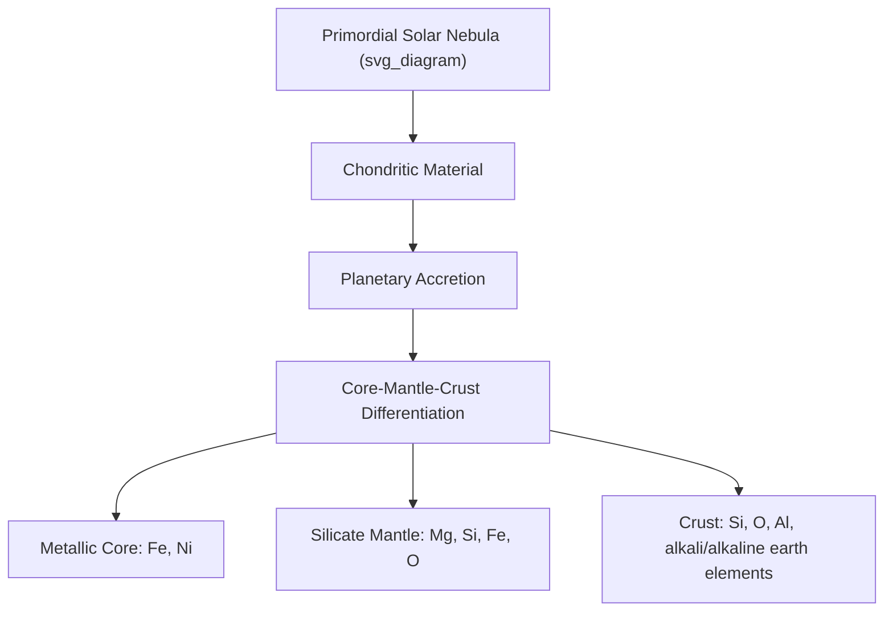

## Elemental Composition of the Earth

### Overview

The elemental composition of Earth describes the abundance and distribution of chemical elements across the planet's major reservoirs — core, mantle, crust, hydrosphere, and atmosphere. This composition is not uniform: differentiation processes during and after planetary accretion have segregated elements based on their chemical affinities, resulting in a layered structure with distinct chemical signatures at each depth. Understanding this composition is foundational to geochemistry, mineralogy, and the study of biogeochemical cycling.

### Bulk Earth Composition

#### Cosmochemical Starting Point

Earth's bulk composition is inferred largely by comparison to **chondritic meteorites**, which are considered representative of the undifferentiated material from the primordial solar nebula from which the solar system's rocky bodies accreted.

**Key Points**

- **CI chondrites** (a specific chondrite subtype) closely match the solar photosphere's elemental abundances (excluding highly volatile elements like hydrogen and helium), and are used as the primary reference standard for "solar system abundance."
- Earth is depleted in volatile elements (e.g., relative to chondritic abundance) compared to more volatile-rich primitive meteorites, consistent with formation in a warmer region of the protoplanetary disk closer to the Sun.
- Earth is enriched in refractory elements (those with high condensation temperatures) relative to volatile elements, a pattern also consistent with inner solar system formation conditions.

#### Bulk Silicate Earth (BSE)

The **Bulk Silicate Earth** model represents the composition of the mantle plus crust combined (i.e., the entire planet excluding the metallic core), used as a geochemical reference composition for mantle-derived rocks.

By mass, the whole Earth (core + mantle + crust) is dominated by four elements: iron, oxygen, silicon, and magnesium, which together constitute the substantial majority of total planetary mass. [Unverified] Precise percentage figures vary somewhat between different bulk Earth composition models depending on the core mass fraction and light-element assumptions used; specific published values should be checked against a current authoritative geochemistry reference.

### Core Composition

#### Primary Constituents

The core is composed predominantly of iron and nickel, inferred from:

1. **Cosmochemical abundance** — iron and nickel are among the most abundant metal-forming elements in chondritic material.
2. **Seismological density constraints** — the observed density of Earth's core (derived from seismic wave velocity and density profiles) is consistent with an iron-nickel alloy.
3. **Iron meteorite analogs** — differentiated iron meteorites, believed to be fragments of the metallic cores of shattered planetesimals, provide a natural sample of iron-nickel core-like material.

#### Light Elements

Seismological data indicates the core's density is slightly lower than that of pure iron-nickel alloy at core pressures and temperatures, requiring the presence of lighter alloying elements — the **"light element problem"** in core geochemistry.

**Key Points**

- Candidate light elements include sulfur, oxygen, silicon, carbon, and hydrogen, in varying proportions depending on the specific compositional model.
- [Inference] The precise identity and proportion of light elements in the core remains actively debated, since direct sampling of the core is not possible and constraints rely on indirect seismological, high-pressure experimental, and cosmochemical modeling approaches that do not yet converge on a single consensus solution.
- The outer core is liquid, while the inner core is solid, a distinction attributed to the temperature-pressure relationship intersecting the iron-alloy melting curve at the inner-outer core boundary depth.

### Mantle Composition

#### Major Element Chemistry

The mantle is dominated by silicate minerals rich in magnesium and iron, broadly described by the mineralogical model composition **pyrolite**, a theoretical rock composition designed to represent the primitive upper mantle prior to partial melting and crust extraction.

**Key Points**

- **Major oxides** in mantle rocks, by mass, are dominated by SiO₂, MgO, and FeO, along with smaller but petrologically significant contributions from Al₂O₃ and CaO.
- The upper mantle mineralogy is dominated by **olivine** ((Mg,Fe)₂SiO₄) and **pyroxene** ((Mg,Fe)SiO₃-type minerals), transitioning to denser high-pressure mineral polymorphs (e.g., ringwoodite, bridgmanite) with increasing depth due to phase transitions.
- **Bridgmanite** ((Mg,Fe)SiO₃ in a perovskite structure) is the most abundant mineral in the lower mantle and, by extension, is considered the most abundant mineral in the bulk Earth by volume.

#### Compatible vs. Incompatible Elements

Mantle geochemistry distinguishes elements by their behavior during partial melting, a concept central to understanding crust-mantle differentiation:

- **Compatible elements** preferentially remain in the solid mantle mineral residue during partial melting (e.g., nickel, chromium, magnesium — elements that fit well into mantle mineral crystal structures).
- **Incompatible elements** preferentially partition into the melt phase during partial melting, due to ionic radius or charge mismatches that prevent efficient incorporation into common mantle minerals (e.g., potassium, uranium, thorium, rare earth elements).

$$D = \frac{C_{solid}}{C_{melt}}$$

The partition coefficient $D$ quantifies this behavior: $D > 1$ indicates compatible behavior (element concentrates in solid), while $D < 1$ indicates incompatible behavior (element concentrates in melt).

This differential partitioning explains why incompatible elements have become progressively concentrated in the crust over geological time, since repeated partial melting events (producing magma that rises to form crust) preferentially extract incompatible elements from the mantle, leaving the residual mantle relatively depleted in these elements.

### Crustal Composition

#### Continental vs. Oceanic Crust

**Key Points**

- **Continental crust** is compositionally more evolved (enriched in incompatible elements and silica) and less dense, broadly andesitic to granodioritic in average composition, and considerably thicker and older on average than oceanic crust.
- **Oceanic crust** is basaltic in composition, denser than continental crust, and continuously formed and recycled through seafloor spreading and subduction, making it geologically much younger on average.
- The continental crust's felsic, low-density character is the primary reason continents stand topographically higher than ocean basins and are not readily subducted, contributing to their long-term geological preservation.

#### Major Elements in the Crust

By mass, Earth's continental crust is dominated by oxygen and silicon, together constituting the substantial majority of crustal mass when combined with aluminum, iron, calcium, sodium, potassium, and magnesium — collectively, these eight elements account for the overwhelming majority of the crust's total elemental abundance. [Unverified] Specific percentage breakdowns vary slightly between crustal composition studies (e.g., Clarke, Rudnick and Gao, or other commonly cited compilations) and should be verified against a specific authoritative source for precise figures.

#### Trace Elements and Rare Earth Elements (REEs)

- **Rare Earth Elements** (the lanthanide series, plus scandium and yttrium) are geochemically incompatible and become concentrated in specific crustal environments through magmatic and hydrothermal processes, despite the group name being a historical misnomer (most REEs are not actually rare in absolute crustal abundance, but are rarely found in concentrated, economically extractable deposits).
- REE distribution patterns, when normalized to a chondritic reference standard, are widely used as a geochemical fingerprinting tool to trace the petrogenetic history of igneous rocks.

### The Hydrosphere and Atmosphere

#### Hydrosphere

- Dominated by water (H₂O), with dissolved constituents in seawater dominated by chloride and sodium ions, alongside significant contributions from sulfate, magnesium, calcium, and potassium ions.
- Ocean salinity composition has remained relatively stable over geological timescales, reflecting a long-term steady-state balance between riverine input of dissolved ions and removal processes (evaporite formation, biological uptake, hydrothermal exchange).

#### Atmosphere

- Currently dominated by nitrogen (N₂) and oxygen (O₂), together constituting the overwhelming majority of atmospheric volume, with argon as the next most abundant constituent and trace greenhouse gases (CO₂, CH₄, etc.) present in much smaller but climatically significant concentrations.
- Present-day atmospheric oxygen abundance is a product of billions of years of biological photosynthetic activity (the **Great Oxidation Event** and subsequent oxygenation), representing a profound departure from the reducing, oxygen-poor composition of Earth's earliest atmosphere.

### Geochemical Classification Systems

#### Goldschmidt Classification

Victor Goldschmidt's classification system groups elements according to their preferential partitioning behavior during planetary differentiation, based on their geochemical affinities:

| Class | Description | Example Elements |
| --- | --- | --- |
| Siderophile | "Iron-loving" — partition into metallic phases | Fe, Ni, Co, Pt-group elements |
| Chalcophile | "Sulfur-loving" — partition into sulfide phases | Cu, Pb, Zn, Ag |
| Lithophile | "Rock-loving" — partition into silicate/oxide phases | Si, Al, Ca, Na, K, REEs |
| Atmophile | Remain in gaseous/volatile phase | N, noble gases, H (as H₂O vapor) |

**Example**

This classification directly explains observed element distribution: siderophile elements like platinum-group metals are strongly depleted in the mantle and crust relative to chondritic abundance, having preferentially partitioned into the metallic core during core formation — a process sometimes termed the "iron catastrophe" or core-mantle differentiation event early in Earth's history.

### Summary Table: Reservoir Composition Overview

| Reservoir | Dominant Elements (by mass/volume) | Primary Mineralogical/Chemical Form |
| --- | --- | --- |
| Core | Fe, Ni (+ light elements) | Metallic alloy |
| Mantle | O, Mg, Si, Fe | Silicate minerals (olivine, pyroxene, bridgmanite) |
| Continental Crust | O, Si, Al, Fe, Ca, Na, K, Mg | Silicate rocks (granodioritic average) |
| Oceanic Crust | O, Si, Mg, Fe, Ca, Al | Basaltic silicate rocks |
| Hydrosphere | H, O (as H₂O); Cl, Na (dissolved) | Liquid water with dissolved ions |
| Atmosphere | N, O | Diatomic gases |

**Related Topics**

- Planetary Differentiation and Core Formation
- Mineral Physics and High-Pressure Mantle Phases
- The Rock Cycle and Igneous Petrogenesis
- Isotope Geochemistry and Radiometric Dating
- Biogeochemical Cycles (Carbon, Nitrogen, Sulfur)
- Ocean Chemistry and Seawater Composition
- The Great Oxidation Event and Atmospheric Evolution
- Cosmochemistry and Meteorite Classification