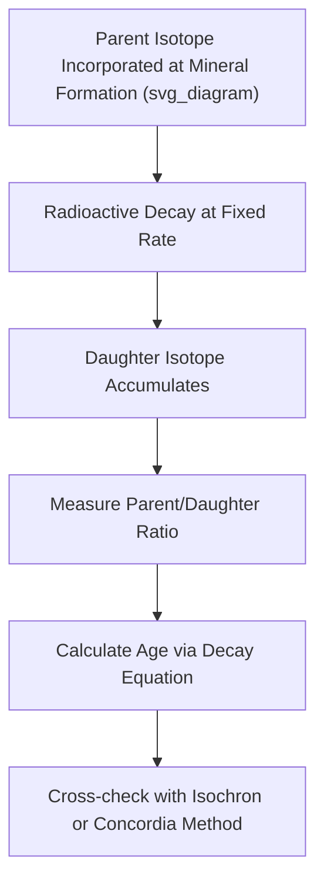

## Isotope Geochemistry and Tracers

### Overview

Isotope geochemistry is the study of the natural abundance and variation of isotopes — atoms of the same element with differing neutron numbers — within Earth materials, and how these variations record geological, hydrological, biological, and climatic processes. Isotopic systems fall into two fundamentally distinct categories with different underlying physics: **radiogenic isotope systems**, used primarily for geochronology (age dating) and tracing material sources, and **stable isotope systems**, used primarily for tracing physical, chemical, and biological processes through mass-dependent or mass-independent fractionation.

### Fundamental Concepts

#### Isotopes Defined

Isotopes of a given element share the same number of protons (defining atomic number and chemical identity) but differ in neutron number (and thus atomic mass). This difference in mass, while not altering an element's basic chemical bonding behavior, produces subtle but measurable differences in reaction rates, phase transition behavior, and nuclear stability between isotopes of the same element.

**Key Points**

- **Stable isotopes** do not undergo radioactive decay and persist indefinitely; their relative abundances are altered only by physical, chemical, or biological fractionation processes.
- **Radioactive (radiogenic) isotopes** spontaneously decay into daughter isotopes at a statistically fixed, exponential rate characterized by a specific half-life, independent of external physical or chemical conditions (temperature, pressure).

### Radiogenic Isotope Systems

#### The Decay Equation

Radioactive decay follows first-order kinetics, described by:

$$N(t) = N_0 e^{-\lambda t}$$

where $N(t)$ is the number of parent atoms remaining at time $t$, $N_0$ is the initial number of parent atoms, and $\lambda$ is the decay constant (related to half-life $t_{1/2}$ by $\lambda = \ln(2)/t_{1/2}$).

For geochronology applications, this is more commonly expressed in terms of accumulated daughter isotopes:

$$D = D_0 + N(e^{\lambda t} - 1)$$

where $D$ is the measured daughter isotope abundance, $D_0$ is the initial daughter isotope abundance present at formation, and $N$ is the currently measured parent isotope abundance.

#### Common Geochronometers

**Key Points**

- **Uranium-Lead (U-Pb) system:** Two parallel decay chains (²³⁸U → ²⁰⁶Pb, half-life ~4.47 billion years; ²³⁵U → ²⁰⁷Pb, half-life ~704 million years) applied primarily to the mineral zircon, which incorporates uranium but excludes lead during crystallization, making it an exceptionally reliable geochronometer; the use of two independent decay chains within the same mineral allows internal consistency checks (concordia-discordia diagrams).
- **Potassium-Argon (K-Ar) and Argon-Argon (⁴⁰Ar/³⁹Ar) systems:** Based on the decay of ⁴⁰K to ⁴⁰Ar (half-life ~1.25 billion years); widely applied to volcanic rocks, particularly effective for dating relatively young geological events due to argon's tendency to escape from molten rock, resetting the "clock" at crystallization.
- **Rubidium-Strontium (Rb-Sr) system:** Based on the decay of ⁸⁷Rb to ⁸⁷Sr (half-life ~48.8 billion years); commonly applied via the **isochron method**, plotting multiple co-genetic mineral samples to simultaneously solve for both age and initial isotopic ratio.
- **Samarium-Neodymium (Sm-Nd) system:** Based on the decay of ¹⁴⁷Sm to ¹⁴³Nd (half-life ~106 billion years); particularly valuable because samarium and neodymium are both rare earth elements with similar chemical behavior, making the system relatively resistant to disturbance by later metamorphic or weathering events compared to more mobile element systems.
- **Carbon-14 (¹⁴C) dating:** Based on the decay of cosmogenically produced ¹⁴C (half-life ~5,730 years) in organic material; useful only for materials younger than roughly 50,000 years due to the short half-life relative to older geochronometers, making it the standard tool for archaeological and late Quaternary geological dating rather than deep-time geology.

#### The Isochron Method

The isochron method addresses the practical problem that a mineral or rock rarely starts with zero initial daughter isotope. By analyzing multiple cogenetic samples (formed simultaneously from the same source, but with different parent/daughter element ratios), a linear regression of daughter/stable-reference-isotope ratio against parent/stable-reference-isotope ratio yields both the age (from the slope) and the initial daughter isotope ratio (from the y-intercept), without needing to assume $D_0 = 0$.

#### Sources of Uncertainty and Disturbance

**Key Points**

- **Closure temperature** — the temperature below which a mineral becomes a closed system, retaining daughter isotopes rather than losing them through diffusion; different mineral-isotope systems have different closure temperatures, allowing multi-system dating to reconstruct a rock's full thermal history (thermochronology).
- **Metamorphic resetting** — subsequent heating events can partially or fully reset a geochronometer, requiring careful interpretation of whether a measured age reflects original crystallization or a later thermal event.
- [Inference] Discordant U-Pb ages (where the two decay chains yield different apparent ages) are generally interpreted as evidence of lead loss or a later disturbance event, though the specific geological interpretation of a given discordia pattern requires careful, case-specific analysis rather than a single universal rule.

### Stable Isotope Systems

#### Fractionation Principles

Stable isotope variations arise from **fractionation** — the preferential partitioning of lighter versus heavier isotopes between different phases or during different reaction pathways, occurring predominantly through two mechanisms:

1. **Equilibrium fractionation** — arises from small differences in bond strength and vibrational energy between isotopes of different mass, producing a temperature-dependent equilibrium distribution between coexisting phases.
2. **Kinetic fractionation** — arises from differing reaction rates or diffusion rates between light and heavy isotopes during irreversible, unidirectional processes (e.g., evaporation, biological uptake), where lighter isotopes typically react or diffuse marginally faster.

#### Delta Notation

Stable isotope ratios are conventionally reported as **delta values**, expressing the deviation of a sample's isotope ratio from that of a defined international reference standard, in parts per thousand (per mil, ‰):

$$\delta = \left( \frac{R_{sample} - R_{standard}}{R_{standard}} \right) \times 1000$$

where $R$ represents the ratio of heavy to light isotope (e.g., ¹⁸O/¹⁶O, ¹³C/¹²C, ²H/¹H).

**Example**

A water sample with $\delta^{18}O = -10\text{‰}$ relative to the Vienna Standard Mean Ocean Water (VSMOW) reference indicates the sample is depleted in ¹⁸O relative to the standard by 10 parts per thousand — a signature consistent with, for example, precipitation formed at higher latitude or elevation, where progressive rainout preferentially removes the heavier isotope first.

#### Key Stable Isotope Systems and Applications

**Key Points**

- **Oxygen isotopes (δ¹⁸O):** Widely used in paleoclimatology via ice cores and marine sediment records (foraminifera shells), since δ¹⁸O in precipitation and ocean water reflects temperature-dependent fractionation during evaporation/condensation cycles and global ice volume changes.
- **Hydrogen isotopes (δD or δ²H):** Commonly measured alongside δ¹⁸O in the water cycle; the co-variation of δD and δ¹⁸O in global precipitation defines the **Global Meteoric Water Line**, a reference relationship used to identify evaporation or mixing processes that cause samples to deviate from it.
- **Carbon isotopes (δ¹³C):** Used to distinguish carbon sources and biological processes, since photosynthesis preferentially incorporates the lighter ¹²C isotope, leaving organic carbon isotopically lighter than inorganic carbon reservoirs; this distinction underlies the use of carbon isotopes in tracing fossil fuel-derived CO₂ (which is highly depleted in ¹³C due to its biological origin) in atmospheric attribution studies.
- **Nitrogen isotopes (δ¹⁵N):** Used to trace nitrogen sources and trophic level relationships in ecosystems, since δ¹⁵N tends to become progressively enriched at each successive trophic level in a food web.
- **Sulfur isotopes (δ³⁴S):** Used to trace sulfur cycling and, in ancient rocks, to identify evidence of microbial sulfate reduction processes and, in the Archean rock record specifically, mass-independent sulfur isotope fractionation signatures linked to atmospheric photochemistry prior to the rise of atmospheric oxygen.

#### Paleoclimate Applications: Ice Core and Marine Records

- In ice cores, δ¹⁸O (and δD) of the ice itself serves as a temperature proxy, since colder conditions produce progressively more depleted (more negative) δ¹⁸O values in precipitation through the **Rayleigh distillation** process affecting air masses as they move poleward and lose moisture.
- In marine sediment cores, δ¹⁸O measured in foraminifera shell calcite reflects a combination of ocean temperature and global ice volume (since ice sheets preferentially sequester the lighter ¹⁶O isotope, leaving ocean water isotopically heavier during glacial periods) — this combined signal underlies the marine oxygen isotope stratigraphy used to define glacial-interglacial cycles (Marine Isotope Stages).

### Isotopes as Provenance and Process Tracers

**Example**

Beyond dating and paleoclimate, isotope ratios serve as fingerprints for tracing material sources and pathways across Earth science disciplines:

- **Strontium isotopes (⁸⁷Sr/⁸⁶Sr)** in ocean water and biological tissue (e.g., tooth enamel, shells) are used to trace geographic provenance and migration patterns, since bedrock geology of different regions imparts distinct strontium isotope signatures into local water and food sources.
- **Neodymium isotopes (εNd)** are used to trace ocean water mass circulation and mixing, since different ocean basins acquire distinct Nd isotope signatures from weathering of regionally distinct continental crust.
- **Noble gas isotopes** (e.g., ³He/⁴He ratios) are used to trace mantle-derived versus crustal-derived fluid and volcanic gas sources, since primordial mantle helium retains a distinctly different isotope signature from radiogenic crustal helium production.

### Radiogenic Isotopes as Petrogenetic Tracers

Beyond dating, radiogenic isotope ratios (e.g., ⁸⁷Sr/⁸⁶Sr, ¹⁴³Nd/¹⁴⁴Nd, Pb isotope ratios) at the time of rock formation serve as tracers of the geochemical source reservoir from which a rock's magma was derived, since different mantle and crustal reservoirs have evolved distinct isotopic signatures over geological time due to their differing parent/daughter element ratios.

[Inference] This tracing application relies on the assumption that the isotopic signature of the source reservoir is faithfully inherited by the resulting magma without significant later contamination or exchange — an assumption that requires careful petrological and field-context evaluation on a case-by-case basis, since crustal contamination during magma ascent can alter the original source signature.

### Summary Comparison: Radiogenic vs. Stable Isotope Systems

| Feature | Radiogenic Isotopes | Stable Isotopes |
| --- | --- | --- |
| Underlying process | Radioactive decay (nuclear) | Fractionation (chemical/physical) |
| Primary application | Geochronology, source tracing | Process tracing, paleoclimate, provenance |
| Key measurement | Parent/daughter isotope ratio | Delta value relative to standard |
| Example system | U-Pb, K-Ar, Rb-Sr, Sm-Nd | δ¹⁸O, δD, δ¹³C, δ¹⁵N, δ³⁴S |

**Related Topics**

- Radiometric Dating Methods and Geochronology
- Paleoclimate Proxy Records (Ice Cores, Marine Sediments)
- The Carbon Cycle and Isotopic Carbon Tracing
- Mantle Geochemistry and Reservoir Evolution
- Biogeochemical Nitrogen and Sulfur Cycling
- Mass Spectrometry Techniques in Geochemistry
- Provenance Studies and Archaeological Geochemistry
- The Rock Cycle and Igneous Petrogenesis