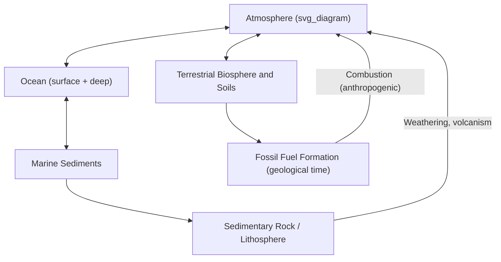
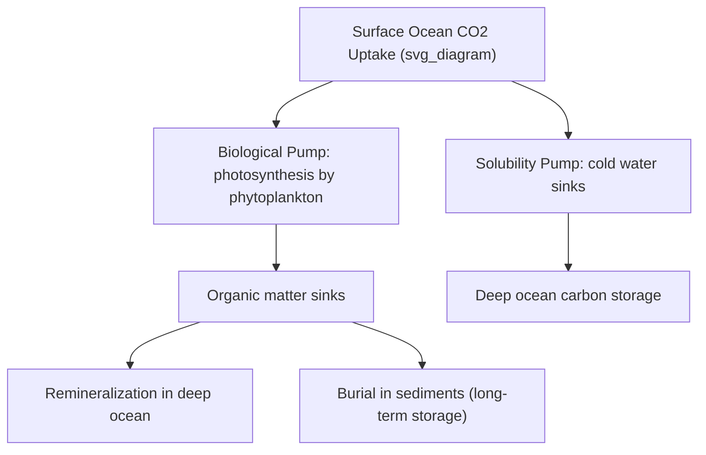

## The Carbon Cycle

### Overview

The carbon cycle describes the movement of carbon among Earth's major reservoirs — the atmosphere, oceans, terrestrial biosphere, soils, and lithosphere — through a combination of biological, chemical, physical, and geological processes. It operates across dramatically different timescales, from the rapid biological exchange of CO₂ between plants and the atmosphere (seasonal to annual) to the slow tectonic recycling of carbonate rocks over geological time (millions of years). Understanding the carbon cycle is central to interpreting both natural climate variability and anthropogenic climate change.

### Carbon Reservoirs

**Key Points**

- **Atmosphere:** The smallest major active reservoir by mass, but the most rapidly exchanging and climatically significant, since atmospheric CO₂ concentration directly governs radiative forcing.
- **Ocean:** The largest actively cycling carbon reservoir, holding dissolved inorganic carbon (as bicarbonate and carbonate ions), dissolved organic carbon, and living marine biomass; the ocean's capacity to absorb atmospheric CO₂ makes it a critical buffer against atmospheric concentration increases.
- **Terrestrial biosphere:** Living vegetation and soil organic matter; forests represent a substantial standing carbon stock, with soils typically holding more carbon than the vegetation growing on them.
- **Lithosphere (sedimentary rocks and fossil fuels):** By far the largest total carbon reservoir, holding carbon in carbonate rocks (limestone, dolomite) and organic-rich sedimentary deposits (coal, oil, natural gas, kerogen-bearing shales) accumulated over geological time; this reservoir exchanges carbon with the surface system extremely slowly under natural conditions.

### The Fast (Biological) Carbon Cycle

#### Photosynthesis and Respiration

The fast carbon cycle operates on timescales of days to centuries, driven primarily by biological processes:

$$6\text{CO}_2 + 6\text{H}_2\text{O} + \text{light energy} \rightarrow \text{C}_6\text{H}_{12}\text{O}_6 + 6\text{O}_2$$

Photosynthesis converts atmospheric CO₂ into organic carbon compounds using light energy, while the reverse process, **respiration**, oxidizes organic carbon back to CO₂ to release stored chemical energy for metabolic use:

$$\text{C}_6\text{H}_{12}\text{O}_6 + 6\text{O}_2 \rightarrow 6\text{CO}_2 + 6\text{H}_2\text{O} + \text{energy}$$

**Key Points**

- **Gross Primary Production (GPP)** — the total rate of carbon fixation by photosynthesis across an ecosystem.
- **Net Primary Production (NPP)** — GPP minus the carbon respired by the plants themselves (autotrophic respiration), representing the actual biomass accumulation rate available to the rest of the food web.
- **Net Ecosystem Production (NEP)** — NPP minus heterotrophic respiration (decomposition by microbes, fungi, and other organisms), representing the net carbon flux for the entire ecosystem, which can be a net source or sink depending on conditions.

#### Seasonal Signal

The competing balance of photosynthesis and respiration produces a distinct seasonal oscillation in atmospheric CO₂ concentration, most pronounced in the Northern Hemisphere due to its greater proportion of land area and vegetation: atmospheric CO₂ declines during the Northern Hemisphere growing season (increased photosynthetic uptake) and rises during autumn and winter (respiration and decomposition dominate), superimposed on the long-term anthropogenic upward trend visible in continuous monitoring records such as the Keeling Curve.

### The Slow (Geological) Carbon Cycle

#### Silicate Weathering

The geological carbon cycle operates on timescales of thousands to millions of years, regulating atmospheric CO₂ over Earth's deep history through the weathering of silicate rocks:

$$\text{CaSiO}_3 + \text{CO}_2 \rightarrow \text{CaCO}_3 + \text{SiO}_2$$

This simplified reaction (the **Urey reaction**) illustrates how atmospheric CO₂ dissolved in rainwater reacts with silicate minerals during chemical weathering, ultimately converting atmospheric carbon into stable carbonate minerals following transport of dissolved ions to the ocean and subsequent biological or inorganic precipitation.

**Key Points**

- Silicate weathering acts as a long-term negative feedback on climate: warmer temperatures and increased precipitation accelerate weathering rates, drawing down atmospheric CO₂ and cooling climate over geological timescales, while cooler/drier conditions slow weathering, allowing volcanic CO₂ input to accumulate and warm climate.
- This feedback operates far too slowly (typically hundreds of thousands of years to fully respond) to meaningfully counteract the current rate of anthropogenic CO₂ emissions on human-relevant timescales.

#### Volcanic and Metamorphic Outgassing

- Volcanic activity releases CO₂ that has been subducted into the mantle as carbonate-bearing sediment or is derived from mantle degassing of primordial carbon, representing the primary natural input flux to the slow carbon cycle.
- Over geological time, the balance between volcanic CO₂ outgassing and silicate weathering CO₂ drawdown is understood to be a primary control on long-term (multi-million-year) atmospheric CO₂ concentration and climate state.

#### Carbonate Rock Formation and the Carbonate-Silicate Cycle

Marine organisms (corals, mollusks, some plankton) precipitate calcium carbonate (CaCO₃) shells and skeletons from dissolved bicarbonate in seawater, which accumulate as carbonate sediments and, over geological time, lithify into limestone — the primary long-term storage mechanism for carbon removed from the ocean-atmosphere system via the slow carbon cycle. Subduction of carbonate-bearing oceanic sediment eventually returns this carbon to the mantle, completing the geological cycle over tens to hundreds of millions of years.

### Ocean Carbon Chemistry

#### The Carbonate System

Dissolved inorganic carbon in seawater exists in equilibrium among three primary species, governed by seawater pH:

$$\text{CO}_2(aq) + \text{H}_2\text{O} \rightleftharpoons \text{H}_2\text{CO}_3 \rightleftharpoons \text{H}^+ + \text{HCO}_3^- \rightleftharpoons 2\text{H}^+ + \text{CO}_3^{2-}$$

**Key Points**

- At typical modern ocean pH, dissolved inorganic carbon is overwhelmingly dominated by bicarbonate ion (HCO₃⁻), with smaller contributions from carbonate ion (CO₃²⁻) and dissolved CO₂ gas.
- This equilibrium system buffers seawater pH, but continued oceanic CO₂ uptake shifts the equilibrium toward increased hydrogen ion concentration (lower pH) and reduced carbonate ion availability — the chemical basis of **ocean acidification**.

#### Ocean Carbon Pumps

- **Solubility pump** — CO₂ dissolves more readily in cold water; cold, CO₂-rich surface water sinks at high latitudes (as part of thermohaline circulation), transporting dissolved carbon to the deep ocean.
- **Biological pump** — phytoplankton fix CO₂ into organic carbon at the surface via photosynthesis; a fraction of this organic matter sinks as it dies or is excreted, exporting carbon to the deep ocean where it is remineralized (respired back to dissolved inorganic carbon) or, in a small fraction of cases, buried in sediments.
- **Carbonate counter-pump** — calcifying organisms produce CaCO₃ shells, which, upon sinking and dissolution or burial, affect the surface-to-deep alkalinity and carbon distribution, partially counteracting the biological pump's net effect on surface CO₂ drawdown.

### Anthropogenic Perturbation of the Carbon Cycle

#### The Modern Carbon Budget

Human activities have introduced a substantial new flux into the carbon cycle by extracting and combusting fossil carbon that had been sequestered in the lithosphere over geological time, effectively short-circuiting the slow geological cycle on a timescale of decades rather than millions of years.

**Key Points**

- Anthropogenic CO₂ emissions are partitioned among three primary fates: accumulation in the atmosphere, uptake by the ocean, and uptake by the terrestrial biosphere (land carbon sink).
- The ocean and terrestrial biosphere together currently absorb a substantial share of annual anthropogenic emissions, acting as natural carbon sinks that partially buffer the rate of atmospheric CO₂ increase. [Unverified] The precise current-year partitioning percentages between atmosphere, ocean, and land sinks should be checked against the latest Global Carbon Project annual budget report, as these fractions fluctuate year to year based on climate variability (e.g., ENSO phase) and are subject to ongoing refinement.
- [Inference] The long-term stability of natural land and ocean carbon sinks under continued warming is an area of active scientific concern, since processes such as reduced ocean solubility at higher temperatures and potential terrestrial ecosystem stress (drought, wildfire) could reduce sink efficiency, though the magnitude and timing of any such reduction remains uncertain.

#### Carbon Cycle Feedbacks to Climate Change

- **Permafrost carbon feedback** — thawing permafrost releases previously frozen organic carbon as CO₂ and methane, a potential positive feedback to atmospheric greenhouse gas concentrations.
- **Ocean solubility feedback** — CO₂ solubility in seawater decreases with increasing temperature, meaning a warmer ocean has a somewhat reduced capacity to absorb additional atmospheric CO₂, a negative feedback on ocean carbon uptake capacity.
- **Terrestrial ecosystem feedbacks** — CO₂ fertilization can enhance plant growth and carbon uptake (a negative feedback on atmospheric CO₂), but this can be offset or reversed by heat stress, drought, and increased wildfire frequency under sufficient warming (a potential positive feedback).

### Measurement and Monitoring Techniques

**Key Points**

- **Direct atmospheric monitoring** — continuous CO₂ concentration measurement at background monitoring stations (e.g., Mauna Loa Observatory), producing the foundational Keeling Curve dataset.
- **Eddy covariance flux towers** — measure real-time CO₂, water vapor, and energy exchange between an ecosystem and the atmosphere, used to quantify net ecosystem carbon exchange at the local-to-regional scale.
- **Satellite remote sensing** — dedicated missions (e.g., OCO-2) measure column-averaged atmospheric CO₂ concentration from space, enabling global-scale mapping of source and sink regions.
- **Isotopic tracing** — carbon-13 depletion in atmospheric CO₂ serves as a fingerprint for fossil fuel-derived carbon, since fossil fuels (derived from ancient photosynthetic organic matter) carry a distinct isotopic signature relative to the broader inorganic carbon reservoir.

### Summary: Fast vs. Slow Carbon Cycle

| Feature | Fast (Biological) Cycle | Slow (Geological) Cycle |
| --- | --- | --- |
| Primary processes | Photosynthesis, respiration, ocean-atmosphere exchange | Silicate weathering, volcanism, carbonate rock formation |
| Timescale | Days to centuries | Thousands to millions of years |
| Dominant reservoirs | Atmosphere, biosphere, surface ocean | Sedimentary rocks, deep ocean, mantle |
| Relevance to current climate change | Directly relevant (annual-to-decadal CO2 flux) | Governs deep-time climate; too slow to buffer current emissions |

**Related Topics**

- Radiative Forcing and Greenhouse Gases
- Ocean Acidification and Marine Carbonate Chemistry
- Anthropogenic Climate Change and Emissions Accounting
- Isotope Geochemistry and Carbon Tracers
- Paleoclimate Records and Past Carbon Cycle Perturbations
- Silicate Weathering and Long-Term Climate Regulation
- Carbon Capture, Utilization, and Storage (CCUS)
- Biogeochemical Nitrogen and Sulfur Cycles