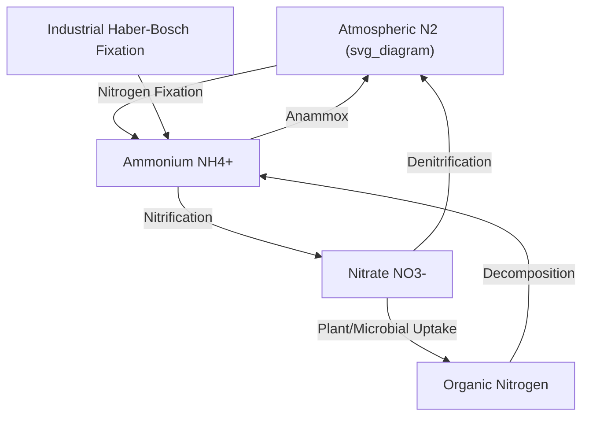
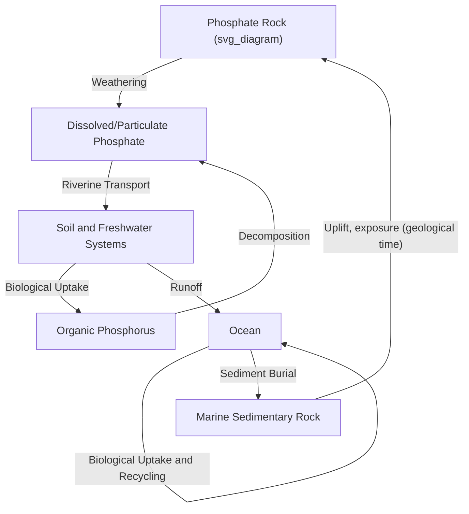

## The Nitrogen and Phosphorus Cycles

### Overview

The nitrogen and phosphorus cycles describe the movement of two essential biolimiting elements through Earth's atmosphere, hydrosphere, lithosphere, and biosphere. Both elements are fundamental building blocks of biological macromolecules (nucleic acids, proteins, ATP) and frequently act as limiting nutrients constraining primary productivity in terrestrial and marine ecosystems. Despite this shared biological importance, the two cycles differ fundamentally in structure: nitrogen has an enormous atmospheric reservoir and is cycled primarily through microbially-mediated redox transformations, while phosphorus has no significant atmospheric phase and cycles primarily through weathering, sedimentation, and biological uptake.

### The Nitrogen Cycle

#### Nitrogen Reservoirs

**Key Points**

- The atmosphere is overwhelmingly the dominant nitrogen reservoir, existing almost entirely as unreactive diatomic nitrogen gas (N₂), held together by an exceptionally strong triple covalent bond that renders it biologically inaccessible to the vast majority of organisms without specialized enzymatic conversion.
- Biologically available ("fixed" or "reactive") nitrogen exists in much smaller quantities within soils, organisms, and water, in forms such as ammonium (NH₄⁺), nitrate (NO₃⁻), and organic nitrogen compounds.
- Sedimentary rocks contain a substantial long-term nitrogen reservoir, though this pool exchanges with the surface system extremely slowly relative to biologically mediated nitrogen fluxes.

#### Nitrogen Fixation

**Nitrogen fixation** is the conversion of inert atmospheric N₂ into biologically usable forms, requiring substantial energy input to break the N≡N triple bond:

$$\text{N}_2 + 8\text{H}^+ + 8e^- + 16\text{ATP} \rightarrow 2\text{NH}_3 + \text{H}_2 + 16\text{ADP} + 16\text{P}_i$$

This reaction, catalyzed by the enzyme **nitrogenase**, illustrates the substantial ATP energy cost of biological nitrogen fixation.

**Key Points**

- **Biological nitrogen fixation** — performed by specialized prokaryotes (free-living soil bacteria such as *Azotobacter*, and symbiotic bacteria such as *Rhizobium* species living in root nodules of leguminous plants), historically the dominant natural nitrogen fixation pathway.
- **Lightning fixation** — high-energy lightning discharges can break the N₂ triple bond, producing nitrogen oxides that dissolve in precipitation as a natural (though quantitatively minor relative to biological fixation) nitrogen input pathway.
- **Industrial (Haber-Bosch) fixation** — the industrial synthesis of ammonia from atmospheric N₂ and hydrogen, primarily for synthetic fertilizer production, has become a dominant term in the global nitrogen budget, now rivaling or exceeding natural biological fixation in total global magnitude. [Inference] The precise current relative magnitude of Haber-Bosch versus natural biological fixation varies across published global nitrogen budget estimates and should be checked against current authoritative sources, though the general conclusion that anthropogenic fixation has become comparable to or larger than natural fixation is well established in the biogeochemistry literature.

#### Nitrification

Nitrification is a two-step aerobic microbial oxidation process converting ammonium to nitrate:

$$\text{NH}_4^+ + 1.5\text{O}_2 \rightarrow \text{NO}_2^- + \text{H}_2\text{O} + 2\text{H}^+ \quad \text{(by ammonia-oxidizing bacteria/archaea)}$$

$$\text{NO}_2^- + 0.5\text{O}_2 \rightarrow \text{NO}_3^- \quad \text{(by nitrite-oxidizing bacteria)}$$

Nitrate is highly soluble and mobile in soil water, making it both readily available for plant uptake and prone to leaching into groundwater and surface water systems.

#### Denitrification and Anammox

**Key Points**

- **Denitrification** — anaerobic microbial reduction of nitrate back to gaseous nitrogen forms (progressing through nitrite, nitric oxide, and nitrous oxide to ultimately N₂), occurring under low-oxygen conditions and representing the primary pathway returning fixed nitrogen to the atmospheric N₂ pool, thereby closing the nitrogen cycle.
- **Anammox (anaerobic ammonium oxidation)** — a distinct microbial pathway directly combining ammonium and nitrite to produce N₂ gas without passing through nitrate, recognized as a globally significant nitrogen loss pathway particularly in marine oxygen minimum zones.
- Nitrous oxide (N₂O), an intermediate product of both nitrification and denitrification, is a potent greenhouse gas and a significant contributor to stratospheric ozone depletion, linking the nitrogen cycle directly to both climate and atmospheric chemistry.

#### Anthropogenic Perturbation of the Nitrogen Cycle

- Synthetic fertilizer production and application via the Haber-Bosch process has roughly doubled the rate of biologically available nitrogen entering the terrestrial biosphere relative to pre-industrial natural fixation rates. [Unverified] Specific quantitative multiples should be verified against current nitrogen budget literature, as ongoing agricultural and industrial trends continue to shift this balance.
- Excess reactive nitrogen entering waterways from agricultural runoff drives **eutrophication** — excessive nutrient enrichment stimulating algal blooms, which upon decomposition consume dissolved oxygen and can produce hypoxic "dead zones" in coastal and freshwater ecosystems.
- Combustion-derived nitrogen oxides (NOx) contribute to acid rain formation, ground-level ozone (smog) formation, and atmospheric particulate matter, each with direct air quality and ecosystem health implications.

### The Phosphorus Cycle

#### Fundamental Distinction from Nitrogen

Unlike nitrogen, phosphorus has no significant stable gaseous phase under normal atmospheric conditions, meaning the phosphorus cycle lacks a major atmospheric reservoir or exchange pathway. This makes the phosphorus cycle fundamentally a **sedimentary cycle**, operating primarily through rock weathering, terrestrial transport, and marine sedimentation, and consequently cycling on much longer characteristic timescales than the atmospherically-buffered nitrogen cycle.

#### Phosphorus Reservoirs and Weathering

**Key Points**

- The primary long-term phosphorus reservoir is phosphate-bearing rock (chiefly the mineral apatite), released into the bioavailable pool exclusively through slow chemical and physical weathering processes.
- Weathered phosphate (primarily as orthophosphate ions, PO₄³⁻) is transported by rivers to soils and, ultimately, the ocean, where it becomes available for biological uptake by primary producers.
- Because weathering is the sole natural source of "new" phosphorus to the biosphere, and this process is exceptionally slow, phosphorus availability frequently acts as the ultimate limiting nutrient constraining long-term ecosystem productivity, particularly in terrestrial ecosystems on old, heavily weathered soils and in the open ocean.

#### Biological Uptake and Cycling

- Phosphorus is assimilated by plants and microorganisms as inorganic phosphate and incorporated into essential biomolecules, including nucleic acids (DNA, RNA), phospholipids (cell membranes), and ATP (the primary cellular energy currency).
- Upon death and decomposition, organic phosphorus is returned to the bioavailable inorganic pool through microbial mineralization, supporting local biological recycling before any phosphorus is lost to long-term sedimentary burial.
- In aquatic systems, phosphorus can be efficiently recycled between the water column and organisms over short timescales, but a fraction is continuously lost to sediment burial, requiring ongoing weathering input to sustain long-term productivity.

#### Marine Phosphorus Burial

- A portion of organic and inorganic phosphorus reaching the ocean is buried in marine sediments, eventually forming phosphate-rich sedimentary rock deposits (phosphorites) over geological timescales.
- This burial represents the primary long-term removal pathway of phosphorus from the actively cycling biosphere-hydrosphere system, eventually returning phosphorus to the lithospheric reservoir from which it originated, completing an exceptionally slow geological-scale cycle.

#### Anthropogenic Perturbation of the Phosphorus Cycle

**Key Points**

- Mining of phosphate rock deposits for fertilizer production has dramatically accelerated the natural weathering-release flux of phosphorus into the active biosphere, analogous to how fossil fuel combustion accelerates the carbon cycle.
- Phosphate rock is a finite, geographically concentrated, non-renewable resource, raising long-term concerns regarding global food security given agriculture's dependence on phosphate fertilizers. [Inference] Specific projections regarding the timeline to phosphate rock resource depletion or scarcity vary considerably across studies depending on assumed reserve estimates, extraction technology, and future demand scenarios, and remain a debated topic rather than a settled figure.
- Excess phosphorus runoff from agricultural and urban sources is a primary driver of eutrophication in freshwater lake systems, often acting as the limiting nutrient whose reduction is targeted in freshwater eutrophication management strategies (in contrast to marine systems, where nitrogen more frequently serves as the primary limiting nutrient).

### Comparative Synthesis: Nitrogen vs. Phosphorus Cycling

| Feature | Nitrogen Cycle | Phosphorus Cycle |
| --- | --- | --- |
| Major reservoir | Atmosphere (N₂ gas) | Sedimentary rock (no gas phase) |
| Primary cycling agents | Microbial redox transformations | Weathering and sedimentation |
| Characteristic timescale | Relatively fast (microbial processes: hours to years) | Slow (geological weathering: thousands to millions of years) |
| Dominant anthropogenic input | Haber-Bosch industrial fixation | Phosphate rock mining |
| Typical limiting role | Often limiting in marine/coastal systems | Often limiting in terrestrial and freshwater systems |

### Nutrient Limitation and Ecosystem Productivity

**Example**

The concept of a **limiting nutrient** — the resource in shortest supply relative to biological demand, which therefore constrains total productivity — helps explain regional patterns in ecosystem response to nutrient pollution: coastal marine eutrophication events are frequently linked primarily to excess nitrogen input (e.g., Gulf of Mexico hypoxic zone, linked to Mississippi River nitrogen loading from agricultural runoff), while inland freshwater lake eutrophication is more frequently linked primarily to excess phosphorus input, reflecting the differing baseline limiting nutrient status typical of marine versus freshwater systems. [Inference] This general marine-nitrogen versus freshwater-phosphorus limitation pattern is a widely cited heuristic in biogeochemistry and ecology, though specific systems can deviate from this pattern, and some systems experience co-limitation by both nutrients simultaneously.

**Related Topics**

- Eutrophication and Aquatic Dead Zones
- The Carbon Cycle and Biogeochemical Coupling
- Soil Chemistry and Nutrient Weathering
- Agricultural Fertilizer Use and Environmental Policy
- Microbial Ecology and Biogeochemical Catalysis
- Ocean Productivity and Nutrient Limitation
- Greenhouse Gases and Radiative Forcing (N₂O)
- Sedimentary Rock Formation and the Rock Cycle